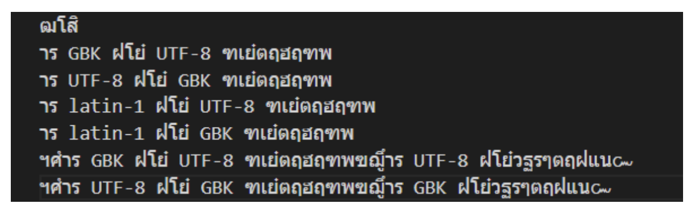
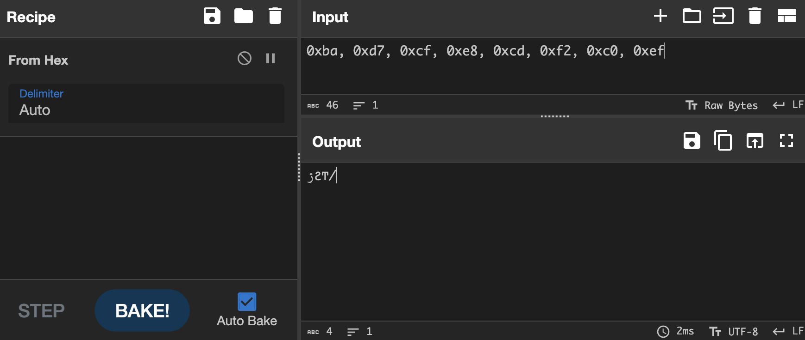

# Misc Lab 1 批改反馈

这里集中反馈一下 misc lab 1 批改过程中遇到的一些共性问题。

## Task 1

### 乱码复现

我在课上和实验手册里面都强调过 CyberChef 对于 UTF-8 解码错误的处理不太“常规”，所以复现乱码建议使用 vscode 的编码功能。有些同学还是只使用了 CyberChef 来完成全部六种乱码的复现，导致很多都不是预期情况，也没有看到锟斤拷的乱码（问题里都说了“实验之后你应该了解了它到底是怎么产生的“，既然没看到那为什么不反思一下是不是方法用错了呢）。

还有一部分同学只使用了 python 来完成复现，但可能没有搞清楚解码错误的处理方式，默认情况对于解码错误 python 会抛出异常，所以经过搜索有些同学可能会添加 `errors="ignore"` 参数，但实际上这个也不太“常规”，相当于将错误部分直接全都忽略了。这里建议用 `errors="replace"` 这样解码错误就会被替换为 �，具体可以看以下代码（以及[官方文档的相应位置](https://docs.python.org/3/library/stdtypes.html#bytes.decode)）：

```python
In [1]: s = "使用 python 进行编解码乱码实验"

In [2]: s.encode("GBK").decode("UTF-8") # errors="strict"
---------------------------------------------------------------------------
UnicodeDecodeError                        Traceback (most recent call last)
<ipython-input-2-0ab5cf145483> in <module>
----> 1 s.encode("GBK").decode("UTF-8")

UnicodeDecodeError: 'utf-8' codec can't decode byte 0xd3 in position 2: invalid continuation byte

In [3]: s.encode("GBK").decode("UTF-8", errors="replace")
Out[3]: 'ʹ�� python ���б��������ʵ��'

In [4]: s.encode("GBK").decode("UTF-8", errors="ignore")
Out[4]: 'ʹ python бʵ'
```

接下来是关于 latin-1 编码的问题，好多同学在 vscode 里进行实验，搜索编码时搜 latin 得到了 "Latin/Thai ISO 8859-11" 这个编码，就用了它，得到了类似以下的结果：



这个这么多泰文应该明显不是 latin-1 编码吧，为什么那么多同学都没有觉得有问题？我上课也讲过了 latin-1 是根据标准 ISO 8859-1 来的，所以有的时候它也叫 ISO 8859-1 编码。在 vscode 里搜不到 latin-1 那就搜 ISO 8859-1 试试呗。这个 "Latin/Thai ISO 8859-11" 是标准的 -11 号啊，名字里也体现了，这是 ASCII 针对泰文的扩展，不是 latin-1。

### Bonus

关于回答 CyberChef 如何处理 UTF-8 解码错误的问题。大部分同学都通过一些例子测试/分析出来了它是会根据首字节的开头来纠正后续字节的开头。这种分析是没有什么大问题的，但是否缺少了那么一点“依据”？这些我都只给了 8 分的 bonus，只有一位同学去翻看了 CyberChef 以及调用的其他库的源码，找到了这种解码方式的代码，我给了 10 分。这种通过代码来分析的方式才是最把握的。

CyberChef 源码是开源的，在 [gchq/CyberChef](https://github.com/gchq/CyberChef/)。通过翻看代码/搜索，可以知道字符编码相关的 table 等存在 src/core/lib/ChrEnc.mjs 中，继续搜索 ChrEnc 可以知道 EncodeText/DecodeText 以及 statusBar/Input/Output 部分代码都引用了这里。再看一下 src/core/operations/DecodeText.mjs 中代码，主题操作都在 run 方法中，其返回的结果调用的是 `cptable.utils.decode(format, new Uint8Array(input))`。通过验证我们也可以确定解码用的就是这个 cptable：



```js
❯ node
Welcome to Node.js v18.9.0.
Type ".help" for more information.
> byteArray = new Uint8Array([0xba, 0xd7, 0xcf, 0xe8, 0xcd, 0xf2, 0xc0, 0xef])
Uint8Array(8) [
  186, 215, 207,
  232, 205, 242,
  192, 239
]
> var cptable = require('codepage');
undefined
> cptable.utils.decode(65001, byteArray)
'ڗϨͲ/'
```

而这个包 codepage 也是开源的，源码在 [SheetJS/js-codepage](https://github.com/SheetJS/js-codepage/)。再通过读源码/搜索 UTF-8 或 65001 以及 decode，可以找到解码相关代码在 cputils.js 文件中，第 425 行开始就是针对 UTF-8 的解码，代码如下：

```js
case "utf8":
  if(len >= 3 && data[0] == 0xEF) if(data[1] == 0xBB && data[2] == 0xBF) i = 3;
  for(; i < len; i+=j) {
    j = 1;
    if(data[i] < 128) w = data[i];
    else if(data[i] < 224) { w=(data[i]&31)*64+(data[i+1]&63); j=2; }
    else if(data[i] < 240) { w=((data[i]&15)<<12)+(data[i+1]&63)*64+(data[i+2]&63); j=3; }
    else { w=(data[i]&7)*262144+((data[i+1]&63)<<12)+(data[i+2]&63)*64+(data[i+3]&63); j=4; }
    if(w < 65536) { out[k++] = String.fromCharCode(w); }
    else {
      w -= 65536; ww = 0xD800 + ((w>>10)&1023); w = 0xDC00 + (w&1023);
      out[k++] = String.fromCharCode(ww); out[k++] = String.fromCharCode(w);
    }
  }
  break;
```

这样就非常清晰了，开头的 if 是判断并忽略 BOM 的，接下来的 for 循环就是解码的过程，可以看到它判断首字节的大小，然后读取后续字节的时候会完全忽略掉开头的部分。这样得到的答案是最完整最可靠的。

## Challenge 1

这道题目能做出来的基本上问题都不大，只是有些同学仍然用了很多人力，还有优化空间。具体做法这里就不放出来了。

以及看到很多同学在 python 中求乘法逆元还在自己写扩展欧几里得算法，这挺没必要的。有很多包提供了求乘法逆元的轮子，更熟悉 python 一点的同学可能也会了解 python 内置的 pow 函数就可以用来求乘法逆元，`pow(a, -1, n)` 的结果就是 a 在模 n 意义下的乘法逆元。

## Challenge 2

### Task 1

这题出出来的目的就是为了告诉大家在学了很多技巧之后也不要忘记最基本的东西。学习了如何通过照片内容找位置、估计高度、估计时间，也不要忘记先去用 exiftool 去看一下图片的 EXIF 信息。这题的海拔高度和拍摄时间都保留在 EXIF 里面了，直接读就行。但是 GPS 的高度确实可能不那么准，但也就先以这个为主吧。

### Task 2

这道题目通过背景中的一些带有特征的景物识图就可以大致找到位置，通过地图上的一些推断就能基本上找到经纬度，容差 0.006，觉得自己位置大致正确但是验证不通过的也可以通过一些简单的枚举来找到范围内的经纬度。

这里特别说一句，有一位同学在做题的过程中尝试从出题人角度入手，把 yyy 盒了个遍，扒出了一堆隐私信息，找到其家乡，得到了厦门的位置（在过程中甚至用了社工库，需要了解一下，查询社工库也是违法行为）。我上课反复强调了做 CTF 题目不要跃出题目去盒出题人本人信息，不要将讲到的技术用在现实世界中，出现开盒某个账号的需求也肯定都是出题人捏造出来的一个虚拟人物的账号，一切不会和出题人本人产生联系。我对其进行了额外的扣分，希望大家引以为戒。