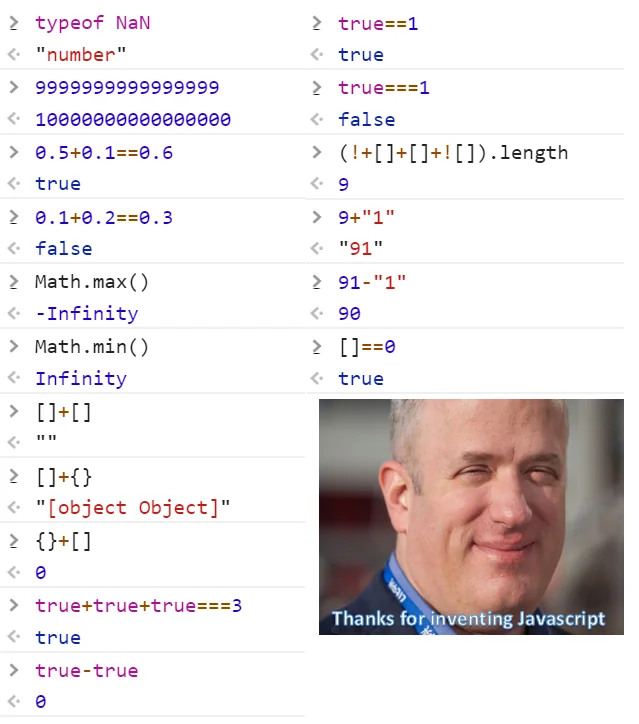
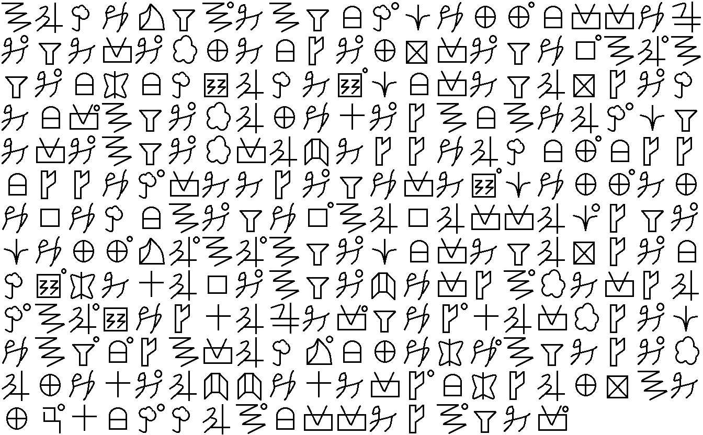

# Lab 0：基础知识及技能

本课程的 Lab 0 由两部分组成:

- [Prerequisite](#prerequisite) 部分以及
- [Misc](#misc), [Reverse](#reverse), [Pwn](#pwn), [Web](#web), [Crypto](#crypto) 部分**五选一**

> 鼓励多选，探索自己感兴趣的方向！

完成的报告请命名为 `lab0_姓名_学号.pdf`，以邮件附件的形式提交到 <team-aaa@zju.edu.cn>；并于邮件中提供个人的联系方式～（详见[主页](../index.md)）

!!! warning "前排提示"
    本课程与其他大家一直在上的学校课程有很大不同。CTF 是一个非常灵活多变又非常**注重实践**的比赛，所以我们会更偏向于引导大家独立探索、自主学习，而非将所有需要的知识统统灌输给大家。

    因此本 Lab 0 乃至后续的所有实验中都会有很多需要同学们自己去上网查资料，自己学习一些新知识的地方。而且在做 Lab 遇到问题时也需要大家先自行排查问题原因，搜索解决方案。如果你真的解决不了想在群里提问或者私戳助教，也请先阅读[提问的智慧](https://github.com/ryanhanwu/How-To-Ask-Questions-The-Smart-Way/blob/main/README-zh_CN.md)和[别像弱智一样提问](https://github.com/tangx/Stop-Ask-Questions-The-Stupid-Ways/blob/master/README.md)两篇文章。

    如果你实在受不了自学这种方式，只想要通过接受我们在课堂上的输出来学习 CTF，抑或你只想以最低成本拿下短学期学分，那么这门课或许并不适合你，你应当考虑放弃选修本课程。而反之，如果你对此有所觉悟，就可以享受本课程的高自由度：我们希望课程的基调是“轻快”的。

    请相信自己！老师主动参与指导的自学计划，比起那些冒充授课型实则让学生被迫自学的课程，效果要好得多。

!!! note "关于 Lab 0"
    并不是所有的知识都适合在课堂以**口述**的方式呈现。包括 Lab 0 在内的各阅读资料与作业是对授课内容的**有效补充**。

    你可以将 Lab 0 视为“新手礼包”，感受“CTF 之禅”。尽管草草地应付一通理论上也不会太阻碍后续追赶上进度，但聪明的你一定明白怎样最大化学习中付出与收获的性价比。

!!! note "关于网络环境"
    本课程的实验材料以及文档都通过 GitHub 仓库进行发布，所以请确保你可以正常访问 GitHub。

    如果你无法正常访问 GitHub，请考虑学习使用代理，这也是在 CTF 乃至计算机领域学习中必不可少的技能之一。

Lab 过程中遇到的无法解决的问题或者其他任何与课程相关的问题都欢迎加入课程交流群进行讨论，QQ 群号 704994583。

## Prerequisite

### Challenge 1

**Linux 环境的搭建与简单使用**

参考难度：★★

后续课程的许多内容都需要 Linux 环境支持，本 challenge 需要大家提前准备好一个自己习惯的 Linux 环境，并熟悉基本的 shell 命令。

???+ note "环境推荐"
    === "Windows"
        推荐使用 WSL，相关安装教程请自行上网搜索。

        也可以使用 VMWare Workstation 或者 VirtualBox 等虚拟机软件安装 Linux 系统。

    === "macOS"
        如果你非常熟悉 macOS 环境且你的 Mac 是 intel 处理器的话，大部分情况下也可以直接从 macOS 环境上手（但完成 reverse / pwn 的题目大概率还是需要 Linux 环境）。也可以使用 Parallels Desktop / VMWare Fusion 等虚拟机软件安装 Linux 系统。

        如果你的 Mac 是 M 系列处理器的话，也即是 arm64 架构。在大部分情况下这应当是没有问题的，但总有些时候你会需要一个 x86 Linux 的环境。最方便的方法是使用 Docker（关于 Docker 安装见[官网](https://docs.docker.com/desktop/install/mac-install/)）。macOS 下的 Docker 可以通过 qemu 来模拟运行不同架构的容器，比如运行一个 x86_64 架构的 ubuntu:latest 容器你可以运行：

        ```bash
        docker run -it -d --platform linux/amd64 --name ubuntu_amd64 ubuntu:latest
        # -d 后台运行，--platform 指定目标架构，--name 指定容器名 ubuntu:latest 指定镜像
        docker exec -it ubuntu_amd64 /bin/bash
        # 进入容器的 bash 终端
        ```

        更多关于 Docker 的使用方法，比如其他参数、目录挂载、网络配置等可以自行上网学习。若有不知如何描述的问题，也可以在群里提问，我们有使用 M1 芯片经验丰富的助教可以帮助（。

    === "Linux"
        显然，你已经有了（

    关于 Linux 发行版，我们推荐 Debian 12 / Ubuntu 24.04 LTS / Kali Linux 2024.1 等。

> 当然，如果你已经拥有了熟悉的 Linux 环境，请放心大胆使用。

具备 Linux 环境后，请观看并学习[「实用技能拾遗」朋辈辅学课程](https://slides.tonycrane.cc/PracticalSkillsTutorial/)中的 lec1 即「Shell 基础及 CLI 工具推荐」课程学习 Linux 基础知识，并完成以下任务：

- 在实验报告中给出**任意 4 个** shell 命令的用法介绍以及在 Linux 环境下的实操截图；
- 以下两个任选其一完成：
    - 在本机中通过 ssh 远程连接到你的 Linux 环境（使用 Linux 宿主机可跳过本任务）；
    - 完成 [SadServers](https://sadservers.com/) 上的题目 ["Saint John": what is writing to this log file?](https://sadservers.com/scenario/saint-john) 给出解答以及通过截图。

!!! tip "Hint"
    - Linux 环境的准备可以参考[前年的课程作业](https://github.com/team-s2/ctf_summer_courses/blob/2022/homework/trivial/01_linux_hw.pdf)


### Challenge 2

**基础的 Python 编程**

参考难度：★

后续的课程中不乏通过编程来节省人力成本解决特定问题。掌握脚本语言 Python 会让这些事半功倍。

> 当然，即使你没有学习过 Python 也无需慌张；你可以通过如[菜鸟教程](https://www.runoob.com/python3/python3-tutorial.html)和各类慕课进行简单的学习。你无需成为一个 Python master，基本的代码阅读能力以及编程能力足以使你通过此课。

???+ note "关于 Python 环境安装的建议"
    建议使用 Python 3.12.x 版本。

    如果你确定你的 Linux 环境只用来完成本次课程，你可以直接通过 `apt` 来安装 Python。

    否则推荐直接安装 [miniconda](https://docs.anaconda.com/free/miniconda/) / [mamba](https://mamba.readthedocs.io/en/latest/installation/mamba-installation.html) / [anaconda](https://www.anaconda.com/download/success) 等工具进行 Python 环境的安装、管理和切换。

请完成如下任务，并在实验报告中给出你的代码：

1. 请阅读和执行如下 Python 程序，在实验报告中并解释其功能:

    ```python
    #!/usr/bin/python3

    data = input("give me your string: ")
    print("length of string:", len(data))

    data_old = data
    data_new = ""
    for d in data:
        if d in 'abcdefghijklmnopqrstuvwxyz':
            data_new += chr(ord(d) - 32)
        elif d in 'ABCDEFGHIJKLMNOPQRSTUVWXYZ':
            data_new += chr(ord(d) + 32)
        else:
            data_new += d

    print("now your string:", data_new)
    ```

2. 请通过 Python 编程解决[校巴](https://zjusec.com)上 [calculator](https://zjusec.com/challenges/27) 这道编程题（需要内网访问），在实验报告中给出完整代码、成功解决的截图以及正确的 flag。

!!! tip "Hint"
    - 如果不知道从哪开始可以查看我们提供的[部分代码](https://github.com/team-s2/ctf_summer_courses/blob/master/src/intro/lab0/client.py)，已经完成了题目的连接以及数据的接收（直接使用 socket 进行连接）
        - 或者推荐自学使用 [pwntools](https://docs.pwntools.com/en/latest/) 这个 CTF 中非常常用的 Python 包进行更方便的交互
    - `eval` 函数可以用于计算

### Challenge 3（选做）

二进制相关的课题方向（Pwn 以及 Reverse）都需要 x86 汇编的知识，如果对该两方向有兴趣的话，可选完成这个 [asm tour 汇编题目](https://github.com/team-s2/ctf_summer_courses/blob/master/src/intro/lab0/asm_tour_1.asm)，在实验报告中给出你的解题过程。

> 如果完全没有接触过汇编语言，也无需担心，可以学习 hint 提到的资料。对指令、寄存器、调用规定等知识做个基本了解。

!!! tip "Hint"
    - 小白老师的[汇编课程资料](http://cc.zju.edu.cn/bhh/)
    - [TonyCrane 的 8086 的汇编笔记](https://note.tonycrane.cc/cs/pl/asm/)

## Web

如果你很喜欢收集没用的“豆知识”，那么Web就需要你这样的人才。

豆知识：“豆知识”的词义也是一个豆知识。

### 前置科技

在网络的语境下，我们自然地有了客户端/服务端，或称为前端/后端的划分。这种架构使得开发和维护更加模块化和高效。当然，也产生了不同的语言、框架为其服务。例如前端的JavaScript，后端的Java, PHP等。

哦对了，这有一些 ~~小众宝藏~~ 插件/工具需要安装，你可以把它塞进Chrome或者桌面:

- 插件：
    - [Hackbar](https://chrome.google.com/webstore/detail/ginpbkfigcoaokgflihfhhmglmbchinc)
    - [Cookie-Editor](https://chromewebstore.google.com/detail/cookie-editor/hlkenndednhfkekhgcdicdfddnkalmdm)
    - [SwitchOmega](https://chrome.google.com/webstore/detail/padekgcemlokbadohgkifijomclgjgif)
- 工具：
    - BurpSuite, 社区版就够用
    - PHPStudy
    - sqlmap, 可选

??? abstract "PHP 入门"
    PHP 是一门古早的服务器端脚本语言，以其易于上手而闻名，也因此保卫了无数安全人员的饭碗。而如今PHP虽然正逐渐入土，但仍有外贸等领域的网站还在大量使用，CTF竞赛中也仍有大量PHP的题目。

    PHP 简单入门：你可以通过[PHP教程 - runoob](https://www.runoob.com/php/php-tutorial.html)学习基础的语法，只需要看懂即可。

    PHP环境：请记住Web题很依赖在本地搭建环境复现，这样一来你就可以魔改源码并观察具体发生了什么。简单起见，可以使用[PHP Study](https://m.xp.cn/)

??? abstract "MySQL 入门"
    几乎所有的网站都需要数据库储存各种信息，而MySQL便是其中的佼佼者。

    PostgreSQL, MySQL 与 SQLite 等不同数据库之间语法都是高度相似的，因此大家可以触类旁通。

    MySQL语法学习：你可以通过[MySQL教程 - runoob](https://www.runoob.com/mysql/mysql-tutorial.html)学习基础的语法，**能看懂即可，但最好会写一些简单的语句**。

??? abstract "JavaScript 入门"
    统治前端的语言，近几年也逐渐开始在后端崭露头角。

    豆知识：JS 是10天搓出来的，所以……
    

    同样的，我们希望你能自学一部分内容。编程语言之间是互通的，相信大家能快速上手。
    不过，JavaScript 奇妙的**“原型(prototype)”**系统可能需要特别加以学习哦。

??? question "学习用的思考题"
    Web题以多变著称，常有稀奇古怪的花活。因此，最好广泛涉猎，博采众长。

    也许从以下的思考题出发能带你快速了解互联网各层的运作逻辑 & 基本概念，也能为你在本课程乃至日后专业课的学习带来莫大的帮助。
    毕竟大部分这个领域的术语也许都有点故弄玄虚，实际的概念并没有那么复杂。

    以下问题建议每个都粗略的了解一点，感兴趣的可以深挖：

    - 经典互联网大厂面试题：在浏览器中输入网址到最后看到网页，这个过程中发生了什么？
    可以了解以下的概念，拼凑出你的答案：
        - TCP/IP与四层协议模型
        - DNS
        - HTTP 与 HTTPS
        - SSL 层
        - TLS 协议
        - 页面渲染：HTML, CSS, JS
        - Cookie与Session
    - 打开浏览器的开发者工具，访问百度并查看网络请求。尝试回答：这里的每一个header分别是什么含义？例如，`Connection: Keep-Alive`是什么意思？
    - 一个著名的用了都说好的下载器`IDM`可以加速你的网络下载速度，是什么原理？又是如何实现的？
        - 提示：如果网站不支持断点续传就没法加速了
    - SQL注入攻击是什么？为什么现在此类攻击几乎销声匿迹？尝试搜索资料，了解各种ORM框架是如何保护数据库的。
    - 前端不涉及业务逻辑代码却仍可能有安全问题？！了解XSS攻击，并对比SQL注入攻击，找出共同点。
    - 侧信道攻击是什么？有哪些系统、数据库函数可以被“Timing侧信道”利用？

    可以用于参考/快速入门的资源：[「实用技能拾遗」朋辈辅学课程](https://slides.tonycrane.cc/PracticalSkillsTutorial/)中的 lec6 即「网络/网站基础知识概述」课程。

### Challenge 1

参考难度：★★

请访问网址 [http://pumpk1n.com/lab0.php](http://pumpk1n.com/lab0.php)
这个神奇的页面藏着一个 flag，请尝试找到它，并在实验报告中记录你的过程。

!!! tip "Hint"
    - 浏览器中的开发者工具

### Challenge 2

参考难度：★★

这里选取一个比较经典的题：[Hack World](https://buuoj.cn/challenges#[CISCN2019%20%E5%8D%8E%E5%8C%97%E8%B5%9B%E5%8C%BA%20Day2%20Web1]Hack%20World)

顺带一提，BUUCTF是一个很不错的练习场！推荐大家感兴趣看看上面各个方向的题。 ~~绝对不是因为老师不想在自己服务器上搭环境~~

!!! tip "Hint"
    - 每次都能“偷”一个数字出来的话，怎么才能把完整的flag逐步“偷”出来？

## Pwn

参考难度：★★

1. 请阅读附件中的 C 代码 [program.c](https://github.com/team-s2/ctf_summer_courses/raw/master/src/intro/lab0/program.c)，尝试找到代码中所有的***BUG***，并在实验报告中给出描述；
2. 附件中的 [program.elf](https://github.com/team-s2/ctf_summer_courses/raw/master/src/intro/lab0/program.elf) 是上述源代码 Linux 平台上编译的可执行 ELF 程序，请在 Linux 环境下执行该程序，并在与其交互的过程中触发找到的漏洞，这些漏洞可以使得程序崩溃么？
3. 请修复 `program.c` 中发现的漏洞，将新的代码命名为 `nobug_program.c` 并提交；
4. （可选）参考网上[资料](https://www.cnblogs.com/zhuyp1015/p/3901191.html)，学习 valgrind 使用，并使用其去验证 2 过程中的漏洞触发，提交过程截图。

## Reverse

参考难度：★★

[题目下载链接](https://github.com/team-s2/ctf_summer_courses/raw/master/src/intro/lab0/crackme)

1. 尝试通过反汇编/反编译工具逆向该可执行 ELF 程序，并成功通过输入获得 `Access Granted` 的提示。请在报告中给出逆向步骤；
2. （可选）思考逆向该 crackme 的过程中，有无什么可能的取巧、自动的方式；
3. （注意）对逆向方向感兴趣的同学请了解如下基础知识：
    - [ELF 可执行文件的格式、加载、链接执行](https://ctf-wiki.org/executable/elf/structure/basic-info/)

## Misc

Miscellaneous, 其中的知识点与技能可在CTF竞赛的各类题目中活用，称之为基石也不为过。

学习Misc就能掌握许多泛CS的技能，对日后快人一步、高人一等地完成各类课内课外的任务大有裨益。

### Challenge 1

参考难度：★

这里有一串被编码过的神秘的字符串，请找出有意义的原字符串（格式为 `AAA{...}`）：

```text
8Q%uH7oV9C7o!2f7oD*B9M/>U2Gu:s:JP%n6W>j@8PrYk9/]^B:0'e_6SgJh7n-*Q5rM>=:Gkm:7oN)U:I/,P;`$6b:Gk[5=]%gm7mT%14Ztqk
```

请在实验报告中给出你具体的解密**过程**。

!!! tip "Hint"
    - 你可能会需要 [CyberChef](https://lab.tonycrane.cc/CyberChef/)（~~而且这里有一个功能可以秒杀这个题目~~）
    - 你可能需要了解一些关于 **Base 系列**编码的特征

### Challenge 2

参考难度：★★★

下面这张图是 AAA 的 logo。真的……只是一个 logo 吗？其实这张图片中隐藏了一个 flag（格式 `AAA{...}`），请你找出来。


请在实验报告中给出你的解题过程，包括你最终得到的 flag 内容。

!!! tip "Hint"
    - flag 被分为了两个部分
    - 如果你找不到第一部分，~~仔细观察图片~~，这使用了一种最基础的图片隐写技术 LSB 隐写，请自行搜索学习如何破解
    - 如果你找不到第二部分，请仔细查看**文件内容**

## Crypto

### Challenge 1

参考难度：★★★

真宵：成步堂君，刚刚狩魔冥检察官给你的纸条上写了什么啊？

成步堂：好像是糸锯警官在追踪一个美国嫌犯时抢过来的，不过上面只画了些奇怪的符号……



真宵：这是什么东西呀？

成步堂：我也不是很清楚……

矢张（突然出现）：这个感觉和英国大侦探福尔摩斯破过的某起案件很像啊……

成步堂：矢张！你怎么突然冒出来了……对了，你说的案件是？

矢张：哦我想起来了，叫“跳舞的小人”。那个案件也出现了非常奇怪的符号。

真宵：跳舞的小人？

成步堂：我好像也有点印象，不如我们就试试看破解这张纸条吧。

成步堂：我记得破解暗号的关键是……字母出现的频率。

真宵：字母出现的频率？

成步堂：比如理论上字母 E 出现的概率是最高的，然后 T 和 A 之类的字符出现的概率也很高。

真宵：哇成步堂君好厉害。

矢张：当然，还有个最重要的东西。

真宵：哎？是什么？

矢张：就是……英语词典啦！

成步堂：好吧，事不宜迟，我们一起来破解暗号吧。

要求：破解纸条上的信息，给出最后的破解结果，对于本问题，可以不用写破解的过程，毕竟福尔摩斯曾经说过，“将中间的推理步骤统统去掉，能够达到惊人的效果”，不过还是很希望能够看到同学们是如何逐步破解问题，得到最后的结果的，这也是密码学题目，或者说 CTF 题目的真正乐趣所在。

!!! note "Book Time"
    It is not really difficult to construct a series of inferences, each dependent upon its predecessor and each simple in itself. If, after doing so, one simply knocks out all the central inferences and presents one’s audience with the starting-point and the conclusion, one may produce a startling, though possibly a meretricious, effect.

!!! tip "Hint"
    - 不妨读一下**福尔摩斯探案集《跳舞的小人》**，说不定对你有帮助呢？
    - 现如今计算机如此发达，有许多基于词频分析或者字母频率分析的软件或者网站帮助你 ~~一键秒杀~~ 解决问题，不如去广阔的互联网之海里搜寻一下吧！
    - 如果嫌自己一个个看符号太麻烦，不如写一些脚本帮助自己进行自动化读取吧！比如 Python 的 PIL 库或者 OpenCV 库（推荐对 Python 较为熟悉的同学使用）

### Challenge 2

参考难度：★

现如今的加密算法多数都是基于数学运算实现的，而 RSA 算法作为经久不衰的加密算法，其数学原理非常简单，不过破解的难度却非常大，网上关于 RSA 的资料非常多，请自行查阅资料，了解各个参数的意义，并编写代码（不限制语言）解出明文 c 对应的密文 m 的结果。

```python
p = 0x848cc7edca3d2feef44961881e358cbe924df5bc0f1e7178089ad6dc23fa1eec7b0f1a8c6932b870dd53faf35b22f35c8a7a0d130f69e53a91d0330c0af2c5ab
q = 0xa0ac7bcd3b1e826fdbd1ee907e592c163dea4a1a94eb03fd4d3ce58c2362100ec20d96ad858f1a21e8c38e1978d27cd3ab833ee344d8618065c003d8ffd0b1cb
n = p * q
e = 0x10001
m = int(input()) # the message before encryption
c = pow(m, e, n)
assert c == 0x39f68bd43d1433e4fcbbe8fc0063661c97639324d63e67dedb6f4ed4501268571f128858b2f97ee7ce0407f24320a922787adf4d0233514934bbd7e81e4b4d07b423949c85ae3cc172ea5bcded917b5f67f18c2c6cd1b2dd98d7db941697ececdfc90507893579081f7e3d5ddeb9145a715abc20c4a938d32131013966bea539
```

其中 m 是一个具有意义的字符串，你可以安装 Python 的 pycryptodome 库并进行如下操作：

```python
from Crypto.Util.number import long_to_bytes

print(long_to_bytes(m))
```

如果不想安装此库，也可以直接使用 Python 的内置方法实现 int 转 bytes:

```python
print(int.to_bytes(m, (m.bit_length() + 7) // 8, 'big'))
```
