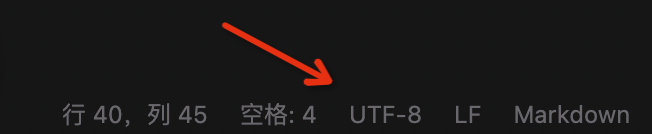
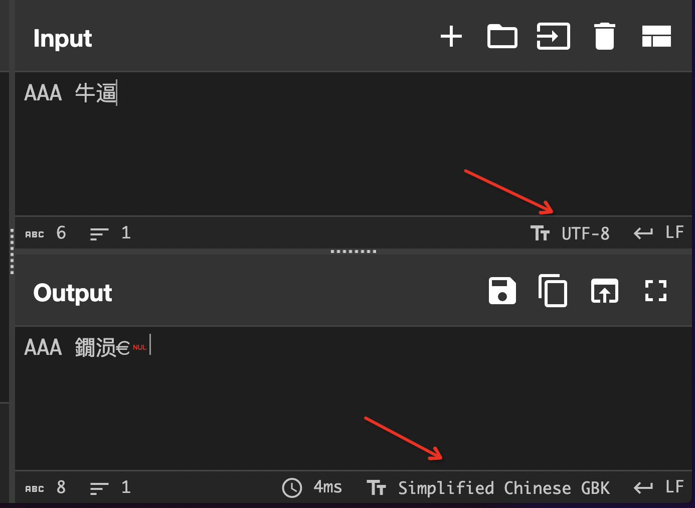

# Misc Lab 1：编解码及 OSINT

本节 Lab 由以下两部分组成：

- [Task 1: 乱码情形探究](#task-1)（60 分）
- 两道题目二选一完成（40 分，多做为 bonus）
    - [Challenge 1: 类维吉尼亚密码破解](#challenge-1)
    - [Challenge 2: OSINT 图片信息搜集实战](#challenge-2)

具体实验报告需要写的内容会在下面具体题目里面描述。对于题目有任何问题都可以在群里/私戳 TonyCrane 提问。

本次 lab 的 ddl 在发布两周以后即 7 月 21 日晚 23:59，请注意安排时间。

## Task 1
### Background
我们课上介绍了字符编码的意义，并且较为详细的讲解了 ASCII、Latin-1、Unicode 以及系列编码的原理。在这个任务中，你将需要自行查阅资料了解 GB 2312、GBK、GB 18030 等国标码的编码方式。之后进一步探索了解各种情况乱码产生的原因，思考恢复乱码的可能性。

#### GB 系列编码
这部分留给大家自行查阅资料了解。你需要知道的是 GB 2312、GBK、GB 18030 规定了三个不同大小的字符集，以及针对每个字符的编码。且 GB 18030 兼容 GBK 兼容 GB 2312 兼容 ASCII。更多细节可以自行查阅标准文件、介绍博客等。

#### 乱码原因
课上我们讲过了，通过一种字符编码来解读另一种字符编码的字节流，就会导致解读出来的字符并非预期，从而产生所谓“乱码”。这里我们将探究一下具体的原因。

常见情况下有以下几种情形：

1. 用 GBK 解码 UTF-8 编码的文本
2. 用 UTF-8 解码 GBK 编码的文本
3. 用 latin-1 解码 UTF-8 编码的文本
4. 用 latin-1 解码 GBK 编码的文本
5. 先用 GBK 解码 UTF-8 编码的文本，再用 UTF-8 解码前面的结果
6. 先用 UTF-8 解码 GBK 编码的文本，再用 GBK 解码前面的结果

注意要想造成乱码，一定说明字符编码之间存在不兼容部分，因此这几种编码互相兼容的 ASCII 编码一定不会出现乱码，而中文文本则会出现乱码。

下面我会介绍几种研究乱码的方式，供大家参考。

##### vscode
创建一个文本文件，使用 vscode 打开，在右下角你会看到文件的编码方式（一般情况下默认为 UTF-8），说明此时文件存储的二进制为 UTF-8 编码的字节流。这时你可以点击这个位置，选择“通过编码重新打开（Reopen with Encoding）”，选择 GBK 编码，这样你所看见的就是将原有文件字节流通过 GBK 编码解析出来的字符（即前面说到的第 1 种情况），不出意外它应该是乱码。



或许你也会发现还有一个选项为“通过编码保存（Save with Encoding）”，它的作用就是将你现在看到的字符通过制定的编码方式重新编码为字节流，然后保存回文件中。比如继续上一步，我们看到了乱码，然后选择通过编码保存，选择 GBK，看起来没有任何事情发生。接下来再选择通过编码重新打开，选择 UTF-8，你或许会觉得此时恢复了正常，但有一些位置的字符变成了奇怪的符号，这种情况就是前面说到的第 5 中情况。

同理，你可以通过同样的方式研究其他四种乱码。

##### 观察十六进制
前面我们只看到了解码的结果，而没有看到文件存储字节流的内容。将字节流和解码得到的字符关联起来可以更好的理解乱码产生的原因。因此我们可以在 vscode 的基础上再使用十六进制编辑器来查看文件流的内容，进行比对。

##### CyberChef
我们课上提到了，CyberChef 的 Input 和 Output 窗格很清晰地增加了字符编码的选项，因此可以很方便地进行编码的转换。



但是 CyberChef 也存在一个问题，这个问题和处理 UTF-8 错误编码有关，关于 UTF-8 错误编码的更多信息后面马上就会说到。这是一个 bonus，如果你能够理解为什么 CyberChef 和 vscode 针对第二种情况的乱码结果不一样，你将得到 bonus。

##### python
利用 python 也可以进行编码的转换，这里是一些例子：

```python
In [1]: "测试".encode("UTF-8").decode("GBK") # 第一种情况的乱码
Out[1]: '娴嬭瘯'

In [2]: "测试".encode("UTF-8")  # 用 UTF-8 编码编码 “测试”
Out[2]: b'\xe6\xb5\x8b\xe8\xaf\x95'

In [3]: "娴嬭瘯".encode("GBK")  # 用 GBK 编码编码 “娴嬭瘯”
Out[3]: b'\xe6\xb5\x8b\xe8\xaf\x95'

In [4]: bin(0xe6), bin(0xb5), bin(0x8b) # 将十六进制转换为二进制
Out[4]: ('0b11100110', '0b10110101', '0b10001011')

In [5]: hex(0b0110_110101_001011)   # 手动解码 UTF-8 得到 Unicode 码位
Out[5]: '0x6d4b'

In [6]: "\u6d4b"    # 将 Unicode 码位转换为字符
Out[6]: '测'
```

#### UTF-8 解码错误
我们课上讲到了 Latin-1 编码可以解码任意字节流，但 UTF-8 不能，它的编码情况只有以下四种：

- **0**xxxxxxx
- **110**xxxxx **10**xxxxxx
- **1110**xxxx **10**xxxxxx **10**xxxxxx
- **11110**xxx **10**xxxxxx **10**xxxxxx **10**xxxxxx

所以如果一个字符开头就出现了 **10**xxxxxx 这样的字节，UTF-8 就不知道该怎么解码了。其他情况也会引起 UTF-8 解码错误。

Python 处理这种错误的默认方法是直接抛出 UnicodeDecodeError，大部分情况下是不方便的，所以一般情况的处理方式是针对错误的字节流进行替换，比如将错误的字节流替换为 U+FFFD（即 �），这也是一些古怪乱码的来源之一。

前面提到了 CyberChef 并没有采用这种处理方式，它将错误的字节也解码为了其他奇怪的字符，请你研究其中的原理，这是一个 bonus。

### Task
那么总结一下你需要做的事情：

1. 通过你喜欢的方式复现前面提到的六种乱码情况（每种 5 分，共 30 分）
2. 回答以下问题：
    - 在自行研究了 GB 系列编码后，请阐述 GB 系列是如何实现三个版本兼容的（10 分）
    - 针对六种乱码情况，哪些是你觉得可以恢复的，哪些是不可以恢复的（10 分）
        - 这里我们默认解码之后同时用这种编码方式重新编码，并保存字节流到文件
    - 一个老生常谈的乱码“锟斤拷”，实验之后你应该了解了它到底是怎么产生的，请解释为什么会产生这个乱码，以及为什么是这三个特定的汉字（10 分）
3. bonus：通过探究，解释清楚 CyberChef 是怎么处理 UTF-8 解码错误的（10 分）

## Challenge 1
### Background
我们课上介绍了维吉尼亚（Vigenere）密码，记明文为 $\mathbf{P}$、密文为 $\mathbf{C}$、密钥为 $\mathbf{k}$，其加解密方式为：

- 加密：$\mathbf{C}_i = (\mathbf{P}_i + \mathbf{k}_i) \bmod 26$
- 解密：$\mathbf{P}_i = (\mathbf{C}_i - \mathbf{k}_i) \bmod 26$

这里我们将其进行扩展，将字符集从 26 个字母扩展到 97 个字符，并将加法密码改为乘法密码，即：

- 加密：$\mathbf{C}_i = (\mathbf{P}_i \times \mathbf{k}_i) \bmod 97$
- 解密：$\mathbf{P}_i = (\mathbf{C}_i \times \mathbf{k}_i^{-1}) \bmod 97$
    - 注意这里 $\mathbf{k}_i^{-1}$ 是 $\mathbf{k}_i$ 在模 $97$ 意义下的逆元，而非直接求倒数

维吉尼亚密码的破解方法我们在课上也有介绍过，基本分为几步：

1. 爆破猜测密钥长度
    - 课上的做法是寻找多次重复的密文，这里有些复杂，可以选择另一种方式
    - 针对每种可能的密钥长度 $k$，计算密文中第 $i$ 位和第 $i+k$ 位的字符重合了几次
        - 选取整体重合次数最多的 $k$ 即为最可能的密钥长度
2. 逐位爆破密钥
    - 确定了密钥长度为 $k$ 后，密文中 $i, i+k, i+2k, \cdots$ 位的字符都是用同一个字母加密的，构成一组乘法加密
    - 乘法加密不会改变字符的统计分布，可以通过 26 个字母的频率分布来猜测该位密钥（a 和 A 算作同一个字母，非字母的都忽略）
3. 解密
    - 有了猜测的密钥后，就可以对密文进行解密了

而我们扩展后的维吉尼亚密码的破解方法也类似，通过你喜欢的语言实现即可。（推荐 python，以及有了自动化方式就不要肝手推啦）

### Task
我们选取了一份 TOEFL 阅读文章，随机生成了 15-30 个字符长度的密钥，并对其进行了加密，现将密文提供给你，为了明确加密方法以及简单熟悉 python 使用，我们还提供了加密代码，请你实现对于密文的破解（flag 夹在了明文中间）。

附件：[encrypt.py](https://raw.githubusercontent.com/team-s2/summer_course_2023/master/src/intro/misc-lab1/vigenere/encrypt.py)、[cipher.txt](https://raw.githubusercontent.com/team-s2/summer_course_2023/master/src/intro/misc-lab1/vigenere/cipher.txt)。

这道题目也是校巴中的一道题目，附件也是完全一致的（除了一些代码格式更改），原题链接为 https://zjusec.com/challenges/31。

请实现对给定密文的破解，拿到其中的 flag，提交到校巴题目中进行验证。实验报告中需要包含你的解题思路、完整解题代码以及 flag。

如果无法完整完成解密，也请将你的尝试写在报告中，我们会根据完成情况给部分分。

## Challenge 2
选做此题目需要同时完成以下两个任务。

### Task 1: TonyCrane's easy OSINT
这是 TonyCrane 在日本拍的一张照片（请下载图片后做题）：


请你回答以下两个问题：

1. 拍摄这张图片时所在位置的高度为多少？（以海平面为基准，尽可能精确）
2. 拍摄这张图片的时间是什么时候？（尽可能精确）

将你的答案以及解题思路写在实验报告中。同样，没有完全做出来也可以写出你的思考，我们也会考虑给出部分分。

### Task 2: yyy's real OSINT
这是 yyy 用手机拍的一张照片（请下载图片后做题）：


请回答以下两个问题：

- 拍摄位置的经纬度
- 拍摄的月份，以及是在当日几点钟拍的

请通过 http://nc.tonycrane.cc:65111/ 进行回答并验证（请不要进行任何形式的爆破答案），显示 flag 即为回答正确。将你的结果、回答截屏以及解题思路写在实验报告中。同样，没有完全做出来也可以写出你的思考，我们也会考虑给出部分分。