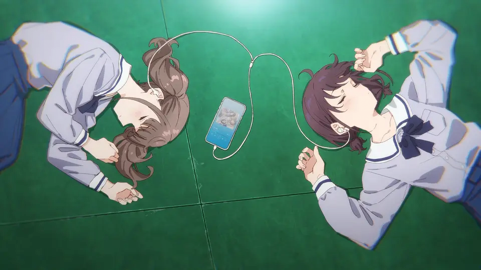

# Misc Lab 2：隐写与其他 misc

本节 Lab 分为必做和选做部分：

- 必做部分（每题 10 分，共 30 分）
    - [Challenge 1: songmingti](#challenge-1-10)
    - [Challenge 2: miaomiaomiao](#challenge-2-10)
    - [Challenge 3: easy LSB](#challenge-3-10)
- 选做部分，自由选择，最多计 85 分：
    - [Challenge A: Palette Stego](#challenge-a-palette-stego-25)（25 分）
    - [Challenge B: Spectrogram](#challenge-b-spectrogram-30)（30 分）
    - [Challenge C: RURU](#challenge-c-ruru-30)（30 分）
    - [Challenge D: Power Trajectory Diagram](#challenge-d-power-trajectory-diagram-30)（30 分）
    - [Challenge E: pysandbox](#challenge-e-pysandbox-30)（30 分）
    - [Challenge F: PPC](#challenge-f-ppc-30)（30 分）

（最终的分数分配可能会根据大家的提交情况有所调整）

具体实验报告需要写的内容会在下面具体题目里面描述。对于题目有任何问题都可以在群里/私戳 45gfg9 提问。

本次 lab 的 ddl 在发布两周以后即 7 月 23 日晚 23:59，请注意安排时间。

本次 lab 的安排是 30 分简单的图片隐写题目。选做部分是一些在真实 CTF 比赛中完全可能出现的难度的题目，但在给了 hint 之后难度应该已经大大减小。在做题过程中遇到任何问题，都请及时联系，对于共性问题会考虑继续放出 hint。私聊提问时请务必说明你目前的进度及已经尝试的方法等。

### Background

我们上课讲了很多种图片隐写的方式，总结起来，遇到简单图片隐写的题目，主要有以下尝试步骤一把梭：

- 使用 exiftool 检查图片元信息，看看有没有看起来会有用的信息
- 使用十六进制编辑器打开，观察文件中有无附带信息、图片基本格式是否正确
- 使用 binwalk 检查文件末尾是否叠加了多余的文件
- 使用 stegsolve 打开图片/或者使用 CyberChef
    - 观察各个通道的 bit plane
    - 使用 Extract LSB 尝试提取数据格式的 LSB（或者使用 zsteg 猜测）
- 考虑能否查找原图，如果找到了尝试进行比较
- 考虑是否是使用工具进行的图片隐写，多尝试一些常见的工具
- ...

相信有了这些步骤，基础部分的三道题都是砍瓜切菜了。

## Challenge 1 (10%)

第一道题目是校巴上的 songmingti，链接：[zjusec.com/challenges/28](https://zjusec.com/challenges/28)。

请完成题目，在校巴提交 flag，并在实验报告中写出你的解题思路和具体过程。

## Challenge 2 (10%)

第二道题目是校巴上的 miaomiaomiao，链接：[zjusec.com/challenges/29](https://zjusec.com/challenges/29)。

请完成题目，在校巴提交 flag，并在实验报告中写出你的解题思路和具体过程。

## Challenge 3 (10%)

- `[lab2] Easy LSB` 题目位于[比赛平台](https://ctf.zjusec.com/games/3/challenges)上

这是一道 LSB 隐写的题目（完全是吗？），但和 lab 0 的方式有那么一点不一样，相信你一定也可以轻松解出 flag。



同样可以在比赛平台上获取与上图相同的附件。

请完成题目，在比赛平台提交 flag，并在实验报告中写出你的解题思路和具体过程。

## Challenge A: Palette Stego (25%)

- `[lab2] Palette Stego` 题目位于[比赛平台](https://ctf.zjusec.com/games/3/challenges)上

### Background

我们课上讲了 PNG 格式有四个标准 chunk：IHDR、PLTE、IDAT、IEND，并且详细讲了其中三个，只有 PLTE 没有具体介绍。

实际上这个块的用途是，PNG 有一种颜色模式是调色板模式，这种情况下会使用 PLTE 块存储调色板，具体格式请大家自行了解，然后在 IDAT 中将记录的像素值从原来的每个像素三个字节 RGB 改为一个字节调色板索引。更详细的内容请大家自行搜索相关文章、博客了解。（如果懒得搜的话我这里提供一个标准：[Portable Network Graphics (PNG) Specification (Third Edition)](https://www.w3.org/TR/png-3/)）

EZStego 隐写是一个针对 GIF 或者使用调色板模式的 PNG 的一种隐写方式。类似 JPEG，它利用人眼对于亮度更敏感的特性，将调色板的颜色按照亮度排序，这样相邻的两个颜色在使用时交换索引视觉差别也不大，用这个方式就可以进行隐写。你可以搜索 “EZStego 隐写” 关键词了解更详细的隐写方法（注意不是 zsteg，那是一个命令行工具）。

### Challenge

下图就是题目，它使用 EZStego 隐写隐藏了 flag：


同样可以在比赛平台上获取与上图相同的附件。

请学习 PLTE chunk 的格式、EZStego 隐写的原理和具体步骤。你需要：

- 完成题目，在比赛平台提交 flag，并在实验报告中写出你的解题思路和具体过程 (10%)
- 给出你的解题代码 (15%)

也就是说，你需要自己编写代码来解出这道题目。使用隐写工具解题只能得到 10% 分数。

如果无法解出题目，也请将你的尝试写在报告中（你已经学到的相关知识也可以写进去），我们会根据你的进度给部分分。

### Hint

以下是一些针对使用 Python 处理这道题时可能会有用的 hint：

- 题目图片的 mode 已经不是 "RGB" 了，而是 "P"
- 你可以通过 `#!py img = Image.open(...)` 打开题目图片
- 调色板内容可以通过 `img.palette` 访问（具体结构请自行探索）
- 我针对像素的处理是一行一行进行的
    - 需要注意 PIL 中图片结构是先列后行，即 (x, y) 表示第 x 列第 y 行
    - 处理时注意循环顺序

## Challenge B: Spectrogram (30%)

### Challenge

这道题目是一个音频隐写的题目，我通过一个 Python 程序将两段歌曲转换为了频谱动图，相信你一定可以从动图中就复原出原曲的大致样子。


附件位于 [GitHub 仓库的 `src/topic/misc-lab2` 路径下](https://github.com/team-s2/ctf_summer_courses/tree/master/src/topic/misc-lab2)。

请参考生成频谱图的代码，尝试恢复原音频。你需要回答出至少一首歌曲的歌名，并将你的解题思路和具体过程写在实验报告中，将你恢复出的两段音频和编写的脚本通过压缩包的形式同时上传。

如果无法完整完成复原，也请将你的尝试写在报告中，我们会根据完成情况给部分分。

### Hint

这道题目其实考点更偏向于 Python 的使用（笑），你可能需要：

- 掌握 NumPy 矩阵数据的处理方式
    - 不熟悉的话建议配合文档/教程通过实践来学习
- 搜索并简单阅读 librosa 这个库的文档
- 如果你被脚本中嵌套的矩阵处理搞糊涂了，不妨自己用另一个音频文件跑一下 `generate.py`，你可以在中途输出任何你想要了解的中间结果

## Challenge C: RURU (30%)

### Challenge

我们在上课讲了 ZIP 伪加密的原理，即将本地文件记录和中央目录记录中的 flags 域的加密位设为 1，这样可以“欺骗”解压软件让它认为这个压缩包是加密的，而实际上内容并没有加密。

RURU 是 ZJUCTF 2023 的一道题目。请完成题目，在比赛平台上提交 flag，并在实验报告中写出你的解题思路和具体过程。

如果无法解出题目，也请将你的尝试写在报告中，我们会根据你的进度给部分分。

## Challenge D: Power Trajectory Diagram (30%)

- `[lab2] Power Trajectory Diagram` 题目位于[比赛平台](https://ctf.zjusec.com/games/3/challenges)上

### Challenge

这是 CISCN 2024 的一道题目。某个黑客在攻击一台物理设备时，记录了该设备的功率变化。你需要通过这些数据还原出黑客成功攻击设备时的 flag。

请完成题目，在比赛平台上提交 flag，并在实验报告中写出你的解题思路和具体过程。

如果无法解出题目，也请将你的尝试写在报告中，我们会根据你的进度给部分分。

### Hint

你可能需要：

- 学习用 Python 进行数据的可视化
    - 通常使用 matplotlib 库：`#!py from matplotlib import pyplot as plt`
    - 你可以通过 `plt.plot(...)` 来绘制折线图
    - 图片太多？试试用 `plt.savefig(...)` 保存图片之后一起查看

## Challenge E: pysandbox (30%)

### Challenge

pysandbox 是校巴上的一系列 Python 沙箱逃逸题目，共 16 道。本题需要你完成：

- [pysandbox6](https://zjusec.com/challenges/69) (15%)
- [pysandbox10](https://zjusec.com/challenges/70) (15%)

请完成题目，在校巴提交 flag，并在实验报告中写出你的解题思路和具体过程。

### Hint

虽然题目给的 Python 环境较老（Python 2.7），但大体上的逃逸思路是通用的。你可能需要了解的东西：

- Python 的一些特性，比如 `eval`、`exec`、`__import__` 等
- Python 的一些“魔法方法”的使用

同时，虽然校巴只要求 pysandbox6 和 pysandbox10，但你可以尝试从 pysandbox1 开始做起，这样会逐步了解 Python 沙箱的限制和逃逸方法。

可以阅读的资料：[Python 沙箱逃逸 - GZTime's Blog](https://blog.gzti.me/posts/2021/83a30666/?highlight=沙箱)

## Challenge F: PPC (30%)

### Challenge

良好的编程能力是一名安全工程师必备的技能之一，在真实 CTF 比赛中也可能出现 PPC 类题目。本题需要你完成以下两部分：

#### maze1 (15%)

- 校巴上的 [maze1](https://www.zjusec.com/challenges/99)

请完成题目，在校巴提交 flag，并在实验报告中写出你的解题思路和具体过程。

#### Quine (15%)

Quine 是一个自描述程序，即输出自己的源代码。这是一个经典的编程题目。

本题要求你用 C 或 C++ 编写一个 Quine 程序，并在实验报告中写出你的思路并提交你的源代码。

一个真实的 Quine 程序一定不涉及任何形式的文件读写，即不可以读取自己的源代码。也就是说，下面的行为是不允许的（不是 Quine）：

```c
int main(void) {
  FILE *p = fopen(__FILE__, "r");
  char c;
  while ((c = fgetc(p)) != EOF) {
      putchar(c);
  }
  fclose(p);
}
```

### Hint

在 Linux 上，你可以使用以下命令来检测你的 Quine 的正确性。假设你的 Quine 程序保存在 `quine.c` 中：

```bash
gcc -o quine quine.c  # 或者 g++ -o quine quine.cpp
./quine > quine2.c
diff quine.c quine2.c
```

最后一行的 `diff` 应当不反馈任何内容，即两个文件完全相同。
