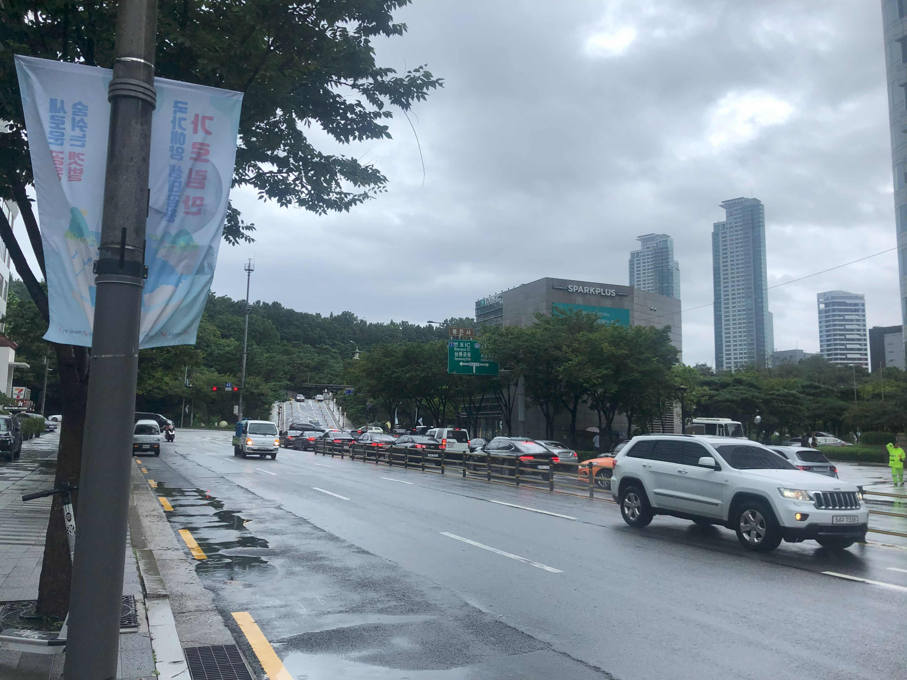

# Misc Lab 3：OSINT & AI

本节 Lab 分为必做和 Bonus 部分：

- 必做部分（每题 10 分，共 30 分）
    - [Homework 1: 图寻](#homework-1-20)（20 分）
    - [Homework 2: insanity](#homework-2-25)（25 分）
    - [Homework 3: 对抗攻击](#homework-3-35)（35 分）
    - [Homework 4: 提示词注入实践](#homework-4-20)（20 分）
- Bonus 部分，最多可以使本 lab 溢出到 115 分：
    - [Bonus 1: 上影节](#bonus-1-20)（20 分）
    - [Bonus 2: 小红书跟踪参数分析](#bonus-2-20)（20 分）

对于题目有任何问题都可以在群里提问或者私戳助教，本次 lab 的 ddl 在发布两周半以后即 7 月 31 日晚 23:59，请注意安排时间

## Homework 1 (20%)



这是 45gfg9 在韩国拍的一张照片，请回答以下两个问题：

1. 拍摄这张图片时所在位置
2. 图片中的绿色路牌被遮挡住的右半边的内容是？

请将你的答案以及解题思路写在实验报告中，会根据过程给分

## Bonus 1 (20%)


1. 请写出箭头所指海报上的所有文字
2. 请推测下一场电影的名称

需要写出详细的推理过程，如果推理中用到网络资料请给出网站链接，没有过程不得分，第2小问视推理的严谨程度给分

## Homework 2 (25%)

搜集网络用户信息也是 OSINT 的一种形式，CTF 赛题中通常会构造一个虚拟的网络身份，并留下各种信息

请完成 Midnight Sun CTF 2024 - insanity，本题是 Hacking For Soju 团队为了纪念 Sophia "quend" d'Antoine 所出的一道 OSINT 题目

```text
HFS has never made an OSINT challenge, but for this, we will make an exception. Sophia "quend" d'Antoine is legendary in the industry, community, sub-culture and in this game of CTF. Her reach and influence go back to the very first wargame and CTF communities on the internet and all the way to the high end of the industry.

She was beloved. She is beloved.

On her way, she always respected the lore and legend of those who came before her, and those who would follow after.

So for those of you who are not aware, it is time to learn some about her legend, we will keep it light because there is too much to cover.

Find the following:

The name of her company.
The name of the first Project Zero bug she was cited on (the colloquial name).
Her twitter username.
The name of the influencial CTF team she was pivotal in (not us).
The award ceremony she ran.
The conference she attended in 2014 and never stopped going to.
The abbreviation of the city she lived in and loved.
Each answer should be 1 word, lowercase and you should concatonate them in order separated by an underscore. If the answer seems like it may be 2 or more words, then pick the first word or join them into a single word.

For example: midnight{rip_sophia_dantoine_you_absolute_legend}

If you are moved, or in any way want to support her memory, please consider making a donation in her name. Feel free to share with us on discord or twitter.

RPI (sic) quend (1993 - 2024), you will be missed.
```

写出你的解题过程，哪怕答案不对也没有关系，只要能展现你的搜索过程即可，最终会根据解题的完整程度和严谨程度进行评分

## Bonus 2 (20%)

分析小红书的跟踪参数，推理出跟踪参数的加密或编码逻辑，并编写反查脚本

写出详细的推理过程，视推理的严谨和准确程度给分

!!! warning "声明"
    完成该题的过程中请尽量避免在未经允许的情况下随意查询同学、网友的账号，且不要随意将编写的解密脚本用于解密他人的分享链接

## Homework 3 (35%)

课上简要介绍了针对人工智能的对抗攻击方式，请根据上课所学完成部署在 [ZJUCTF](https://ctf.zjusec.com/games/5/challenges) 平台上的 `[misc lec2] ResNet H@cker`，并给出具体解题过程和脚本

## Homework 4 (20%)

课上简单讲述了针对大语言模型的提示词攻击，本项作业需要同学们对当前主流的大语言模型或者基于大语言模型的应用进行提示词注入的尝试

- 如 ChatGPT，DeepSeek，Gemini，Kimi 等
- 可以进行目标劫持，提示词泄露，越狱等多个形式的攻击实践
- 不一定要成功，许多主流大语言模型的提示词注入难度已经非常大了
- 尽量展现自己的注入思路，注入过程

完整展现你的实践过程，最终会根据完成的认真程度进行打分
