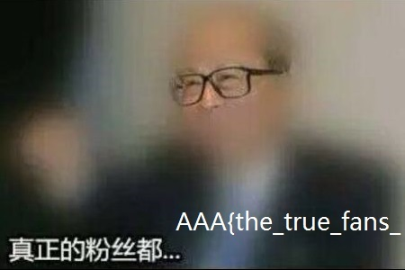
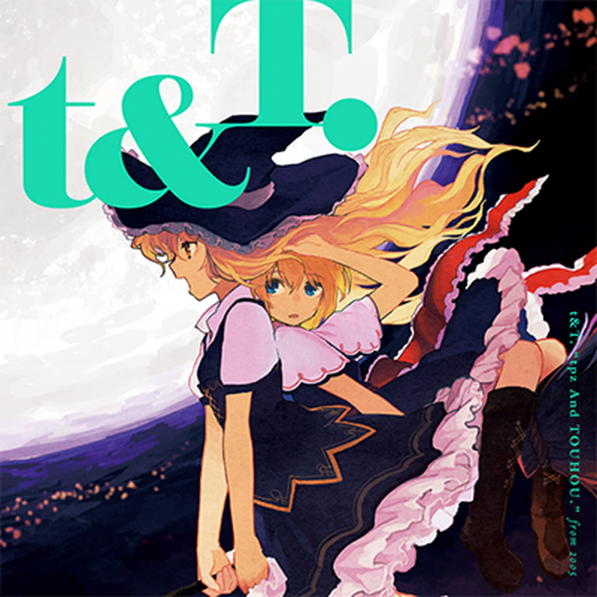
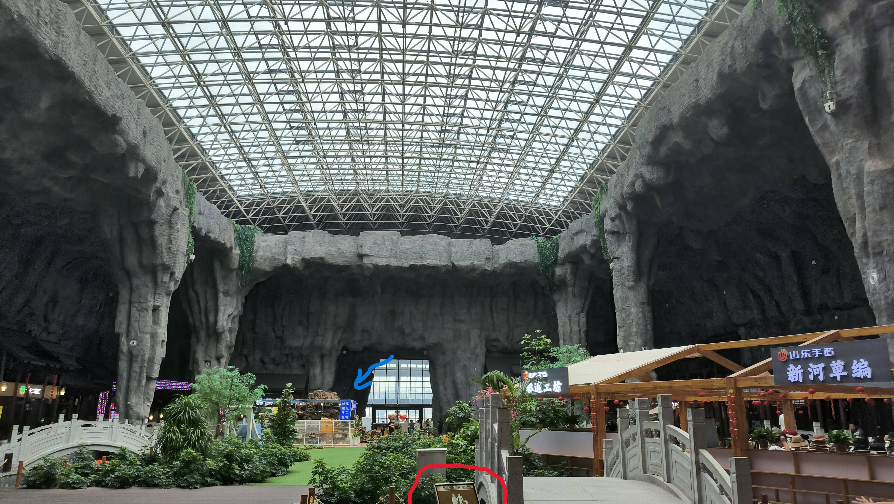
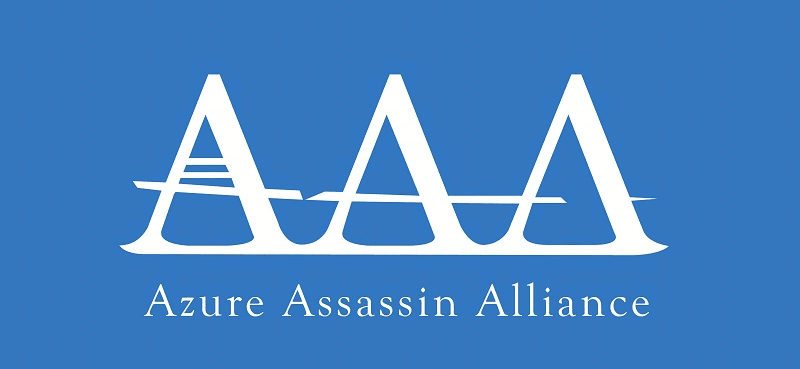
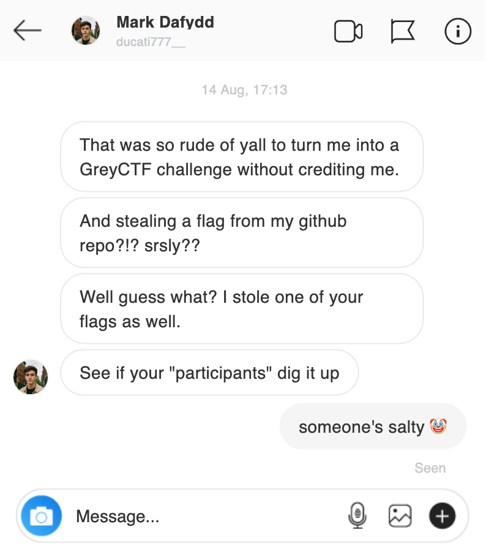

# Misc Lab 3：文件 / 图像 / OSINT

## 必做部分 50%

### Challenge 1: songmingti 10%

真正的CTF选手，就算我什么都不说，也能找出flag来。

> 感觉后面还有东西呢

### Challenge 2: Little "Sister" Bitch 15%

t+pazolite - Little "Sister" Bitch

> 首字母很重要啊！
>
> 虽然确实也是用那个原理隐写进去的，但是实现上稍微不太一样，不过也能用那个工具做就是了
>
> 如果对于得到的东西没啥头绪，可以再翻翻 [去年的课件](https://courses.zjusec.com/2025/slides/misc-lec2/)

### Challenge 3: 似乎是什么景区 25%

H2g 旅游时拍摄的一张照片。似乎是什么景区……吗？

请找出：

1. 照片远端有一家挂着蓝色照片的店铺（在图中用蓝色箭头标出）。它的店名是什么？
2. 照片近端有一座拱桥，桥头有一个棕色牌子（在图中用红圈标出）。牌子上面写了什么文字？

你可以在题目环境中提交形如 `flag{第一题答案_第二题答案}` 的答案以进行验证。

请在报告中给出**答案**以及**详细的推理过程**。

> 首先尝试把拍摄地点找出来吧

## 选做部分 最高65%

很遗憾，某种意义上教考分离也是 misc 不得不品的一环。下面题目的知识点并没有在课上详细讲解，但是会提供足够的引导。请你尝试自学进行解答。

**你可以选择任意多的题目进行尝试。对于没有成功得到最终答案的题目，我们也会根据你的进度以及展现的努力成果给出部分分数。**

### Challenge A: Palette Stego 30%

> 我们课上讲了 PNG 格式有四个标准 chunk：IHDR、PLTE、IDAT、IEND，并且详细讲了其中三个，只有 **PLTE** 没有具体介绍。
>
> 实际上这个块的用途是，PNG 有一种颜色模式是调色板模式，这种情况下会使用 PLTE 块存储调色板，具体格式请大家自行了解，然后在 IDAT 中将记录的像素值从原来的每个像素三个字节 RGB 改为一个字节调色板索引。更详细的内容请大家自行搜索相关文章、博客了解。（如果懒得搜的话我这里提供一个标准：[Portable Network Graphics (PNG) Specification (Third Edition)](https://www.w3.org/TR/png-3/)）
>
> **EZStego** 隐写是一个针对 GIF 或者使用调色板模式的 PNG 的一种隐写方式。类似 JPEG，它利用人眼对于亮度更敏感的特性，将调色板的颜色按照亮度排序，这样相邻的两个颜色在使用时交换索引视觉差别也不大，用这个方式就可以进行隐写。你可以搜索 “EZStego 隐写” 关键词了解更详细的隐写方法（注意不是 zsteg，那是一个命令行工具）。

下图就是题目，它使用 EZStego 隐写隐藏了 flag：

请学习 PLTE chunk 的格式、EZStego 隐写的原理和具体步骤。你需要：

- 完成题目，在比赛平台提交 flag，并在实验报告中写出你的解题思路和具体过程 (10%)
- 给出你的解题代码 (15%)

也就是说，你需要自己编写代码来解出这道题目。使用隐写工具解题只能得到 10% 分数。

### Challenge B: Time & Power 30%

这是 SJTUCTF 2025 的一道题目~~的一部分~~。某个黑客在攻击一台物理设备时，记录了该设备的功率变化。你需要通过这些数据还原出黑客成功攻击设备时的 flag。

请完成题目，在比赛平台上提交 flag，并在实验报告中写出你的解题思路和具体过程。

> 你可能需要：
>
> - 了解本题的背景：**[侧信道攻击](https://zh.wikipedia.org/zh-hans/%E6%97%81%E8%B7%AF%E6%94%BB%E5%87%BB) / [能量分析](https://zh.wikipedia.org/wiki/%E8%83%BD%E9%87%8F%E5%88%86%E6%9E%90)**
> - 学习用 Python 进行数据的可视化
>   - 通常使用 **matplotlib** 库：`from matplotlib import pyplot as plt`
>   - 你可以通过 `plt.plot(...)` 来绘制折线图
>   - 图片太多？试试用 `plt.savefig(...)` 保存图片之后一起查看
> - 这道题与 CISCN 2024 的一道题目`Power Trajectory Diagram`相近
>

### Challenge C: RURU 30%

我们在上课提到了 ZIP 伪加密的原理，即将本地文件记录和中央目录记录中的 flags 域的加密位设为 1，这样可以“欺骗”解压软件让它认为这个压缩包是加密的，而实际上内容并没有加密。

RURU 是 ZJUCTF 2023 的一道题目。请完成题目，在比赛平台上提交 flag，并在实验报告中写出你的解题思路和具体过程。

> 你需要了解 **zip 伪加密** / **密码爆破**的相关知识。
>

### Challenge D: Someone's Salty 30%

有人似乎对 GreyCTF Quals 的一道题非常不满，还向参赛者发起了挑战：

请沿着他留下的公开信息找到被藏起来的 flag，并在报告中记录完整的调查过程。你的报告至少需要说明：

- 你搜索了哪些关键词或用户名？
- 你如何确认找到的账号与截图中的人有关？
- 你如何从一个平台转向下一个平台？
- flag 最终出现在哪个原始页面？

本题的 flag 格式为 `grey{...}`，调查途中可能会遇到其他形似 flag 的字符串，请注意区分。

> 一些提示：
>
> - 人们常常会在不同网站复用同一个用户名。
>
> - 有些社交网络并不只运行在一个网站上，而是由许多使用不同域名的实例相互连接。完整账号通常同时包含用户名和实例域名，例如  `@用户名@实例域名`

### Challenge E: Feedback 5%

对本次课程有什么意见或建议？欢迎来反馈一下呀 ~

> 请畅所欲言，AIGC 除外
