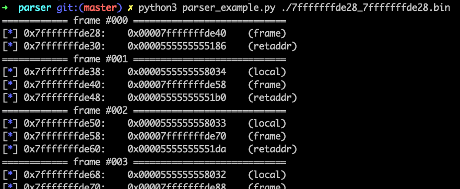

# Pwn Lab 2：BOF and ROP

本节 Lab 由以下内容组成：

1. 理解栈结构并编写一个 stack parser (10 points)
2. 探究栈溢出 + shellcode 结合的题目 (30 points)
3. 课上演示过的 ROP 基础题  (30 points)
4. 校巴上的 ROP 的基础题  (30 points)
5. bonus: 漏洞不辣么明显的一个 BOF 题 (20 points)

相信完成这些题目后会加深你对栈、栈溢出以及 ROP 理解

## Challenge 1

如课堂上所述，这里要求大家编写一个 stack parser 对给定的栈数据进行解析，打印出数据中的栈帧，要求

- [题目附件](https://github.com/team-s2/summer_course_2023/tree/master/src/topic/pwn-lab2/parser)
- 编程语言任选，选自己熟悉的即可
- 打印结果标注栈帧编号，如下图有输出额外的 `frame #XXX` 信息
- 打印结果标注栈帧中的内容，如下图中额外输出的 `(LOCAL)` 表示临时变量、`(FRAME POINTER)` 表示存储的帧指针、`(RET ADDR)` 表示存储的返回地址

其中给定的栈数据命名细节是 `X_Y.bin`，其中 `X` 是当前帧完成布置后的 `rsp` 值，`Y` 是当前帧完成布置后的 `rbp` 的值，数据文件即是从 `X` 处对应的地址开始转储的

> 交上来后我们会用额外的测试用例跑一下的，所以不要只做简单的 print，要真正的做 parse 哦

> 可以通过栈上的值猜测这是个什么函数么？

## Challenge 2

这里有一道比课堂上讲解的 `ret2sc` 稍微复杂一点的 `ret2sc_revenge`，请完成对其的漏洞分析以及利用

- [题目附件](https://github.com/team-s2/summer_course_2023/tree/master/src/topic/pwn-lab2/ret2sc_revenge)
- 题目部署在校网 IP: `10.214.160.13`, Port: `11020`

请在报告中附上漏洞分析以及做法，给出成功拿到 flag 的截图，并将攻击代码以附件形式上传

## Challenge 3

课上演示过一遍 `ropbaby` 的做法和思路，请复现并实现打远程，拿 flag

- [题目附件](https://github.com/team-s2/summer_course_2023/tree/master/src/topic/pwn-lab2/ropbaby)
- 题目部署在校网 IP: `10.214.160.13`, Port: `11021`

> 要求 ROP 通过 system 或者 execve 这两之一的 libc 函数完成弹 shell

请在报告中附上漏洞分析以及做法，给出成功拿到 flag 的截图，并将攻击代码以附件形式上传

## Challenge 4

校巴上有一道 32 位简单的栈溢出 + ROP 哦，还不快加油秒掉

- [题目信息](https://zjusec.com/challenges/1)

请在报告中附上漏洞分析以及做法，给出成功拿到 flag 的截图，并将攻击代码以附件形式上传

## Bonus

来挑战雷神在之前的 Hackergame 热身时候出的赛题吧 \雷神/\雷神/

- [题目信息](https://zjusec.com/challenges/107)