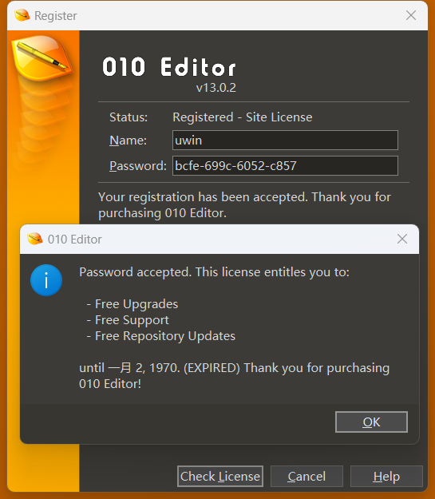

# Rev Lab 2: CrackMe & Malware

本节 Lab 由以下两部分组成，整体超出100分的部分将作为 bonus：

- [Task 1: 课堂例题++](#task-1)（110分）
    - CrackMe 部分 (60分)
    - Malware 部分 (50分)
- [Task 2: 简单的勒索软件](#task-2)（40分）

## Task 1

### Part 1 (60 points)

课上我们讲解了如何把 010 Editor 变为 Freeware，并和大家一起分析了校验序列号的核心函数 `sub_14036E740` 中 0x9C 这个分支的情况, 附件 `keygen.py`（[下载链接](https://raw.githubusercontent.com/team-s2/summer_course_2023/master/src/topic/rev-lab2/keygen.py)）为对应的 python 注册机代码。请回顾课上讲解的内容，参考给出的注册机代码，尝试编写 0xAC 分支的注册机（不限编程语言），并提交 Writeup，要求包含：

1. 分析 010 Editor 的流程及 patch 的过程和原理 （10 points）
2. 如何定位到校验序列号的核心函数以及我们期望这个函数返回什么 （10 points）
3. 分析校验序列号算法的流程，阐述输入的 Name 与 Password 是如何被校验的 （20 points）
4. 你最终编写的 0xAC 分支注册机代码以及在 010 Editor 中成功注册的截图 （20 points）

**Tips**：

1. 编写注册机的思路并不同于解 CTF 题目，答案并不是唯一的，你只需要找到满足条件的一种输入即可
2. 0x9C 分支的情况注册成功后 010 Editor 运行截图如下：



### Part 2 (50 points)

[题目下载链接](https://raw.githubusercontent.com/team-s2/summer_course_2023/master/src/topic/rev-lab2/Evil_Panda.zip)

课上我们分析了使用 Go 语言编写的低配版“熊猫烧香”，请回顾课上讲解的内容，回答以下问题：

1. 在程序启动后，它使用了什么方法来隐藏自己？ (10 points)
2. 该软件是如何实现持久化的？（10 points）
3. 程序对哪些目标文件有恶意行为，分别做了什么操作？（15 points）
4. 如果我的系统不幸被该软件感染，应该如何恢复？请编写一个恢复程序，对编程语言不做要求 （15 points）

**Tips**:

1. 为了减少大家在逆向过程中的工作量，这里给出部分程序源码：

```go
func walkDisk(root string) error {
    homeDir, err := os.UserHomeDir()
    checkError(err)
    skipPath := homeDir + `\AppData\Local\Microsoft\Windows`
    
    // Try to be nice XD
    if root == `C:` {
        root = homeDir
    }
    stack := []string{root}

    for len(stack) > 0 {
        dir := stack[len(stack) - 1]
        stack = stack[:len(stack) - 1]

        entries, err := os.ReadDir(dir)
        if err != nil {
            continue
        }

        for _, entry := range entries {
            if entry.IsDir() {
                subDir := dir + `\` + entry.Name()
                if strings.HasPrefix(subDir, skipPath) {
                    continue
                }
                stack = append(stack, subDir)
            } else {
                path := dir + `\` + entry.Name()
                if err := infectSignleFile(path); err != nil {
                    continue
                }
            }
        }
    }

    return nil
}
```

2. 我们在课上讲解了 Go 语言在 1.17 版本后更新了调用约定（Calling Convention），通过编写简单的示例程序并使用编译选项 `-gcflags "-N -l"` 关闭优化即可在 IDA 中观察函数的参数及返回值是通过哪些寄存器传递的。在分析时，也不要忘记结合动态调试，同时确保调试环境在虚拟机中。

## Task 2

[题目下载链接](https://raw.githubusercontent.com/team-s2/summer_course_2023/master/src/topic/rev-lab2/baby_ransomware.zip)

非常友好的一个程序，甚至感觉不到丝毫威胁，完成该题目并提交：

1. flag 内容及 Writeup (40 points)

### Hint

1. 该题目的年代较为久远，如果无法运行（如提示缺少 dll）也无需担心，静态分析就足以解出这道题目
2. 你可能需要了解一下什么是壳，这个程序用到了什么壳进行保护，以及是否有对应的脱壳工具
3. 也许需要一点巧思，了解一下 Windows 可执行程序文件格式（PE 格式）中有没有**特殊**的部分
