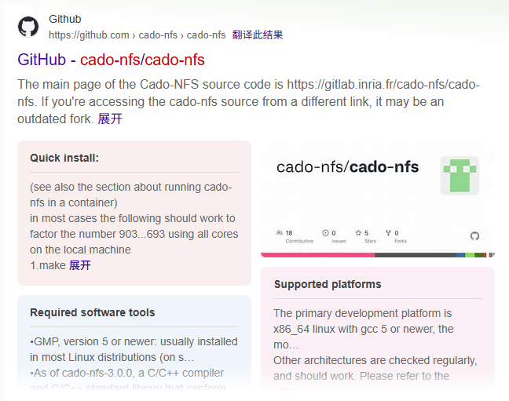

<style>
@import url('https://cdn.jsdelivr.net/npm/lxgw-wenkai-webfont@1.1.0/style.css');

  html * {
    font-family: 'LXGW WenKai', sans-serif !important;
}
    .button-container {
    display: flex;
    align-items: center;
    justify-content: center;
    gap: 20px;
    position: relative;
    width: 100%; 
}


        .button {
            display: flex;
            align-items: center;
            justify-content: center;  
            text-decoration: none;
            border: 1px solid #ddd;
            padding: 0; 
            border-radius: 50%;  
            width: 85px; 
            height: 85px; 
            transition: transform 0.3s ease, border-color 0.3s ease;  
            cursor: pointer;
            overflow: hidden;
        }

        .button img {
            width: 100%;  
            height: 100%;  
            object-fit: cover;  
            border-radius: 50%;  
        }

        .button:hover {
            transform: scale(1.1);
            border-color: rgba(0, 123, 255, 0.2);
            box-shadow: 0 2px 10px rgba(0, 123, 255, 0.2); 
        }

        .button-container .button-text {
            position: absolute; 
            top: 50%;
            left: 100%;  
            transform: translateY(-50%); 
            opacity: 0;  
            visibility: hidden;  
            transition: opacity 0.3s ease, visibility 0.3s ease;
            white-space: nowrap; 
            font-size: 20px;
        }
    </style>

<!-- .slide: data-background="crypto-lec2/background.webp" -->

<br>
<br>
<br>
<center><h5 style="font-size: 55px; text-align: center;">crypto 专题1：公钥密码专题</h5></center>
<br>
<br>
<center><h1 style="font-size: 30px; text-align: center;">2025.7.12</h1></center>
<br>
<center><div class="button-container" >
    <button class="button" onclick="toggleContent()" title = "Click to see more about me">
          
    </button>
    <span>肖盼 @DengFeng / 等风</span>
</div></center>

<!-- s -->
<!-- .slide: data-background="crypto-lec1/background.webp" -->

# 专题内容
<div class="fragment" style="margin-top: 40px">

- Introduction to PublicKey Cryptography

</div>
<div class="fragment" style="margin-top: 40px">
<div class="fragment" style="margin-top: 40px">

- Number Theory in PKC
  - Inverse
  - Fermat's Little Theorem
  - Chinese Reminder Theorem

</div>
<div class="fragment" style="margin-top: 40px">
<div class="fragment" style="margin-top: 40px">

- RSA
  - RSA algorithm
  - Attacks on RSA

</div>
<div class="fragment" style="margin-top: 40px">
<div class="fragment" style="margin-top: 40px">

- DLP
  - Discrete Log Problem
  - Attacks on DLP

</div>
<div class="fragment" style="margin-top: 40px">
<!-- s -->
<!-- .slide: data-background="crypto-lec2/background.webp" -->

<div class="middle center">
<div style="width: 100%">

# Part.1 Introduction to PublicKey Cryptography

</div>
</div>

<!-- v -->
<!-- .slide: data-background="crypto-lec2/background.webp" -->

# Warmup
<p style="text-align: center; font-size: 30px; margin-top: 30px;">31 * 29 = ?</p>
<div class="fragment" style="margin-top: 30px">
<br>
<p style="text-align: center; font-size: 30px; margin-top: 30px;">323 = a * b, a = ?, b = ?</p>
<br>
<div class="fragment" style="margin-top: 30px">
<p style="text-align: center; font-size: 30px; margin-top: 30px; color: red; font-weight: bold;">31 * 29 = 899</p>
</div>
<br>
<div class="fragment" style="margin-top: 30px">
<p style="text-align: center; font-size: 30px; margin-top: 30px; color: red; font-weight: bold;">323 = 17 * 19</p>
</div>

<!-- v -->
<!-- .slide: data-background="crypto-lec2/background.webp" -->

# 看起来你已经学会了，现在来试试这个吧！

<p style="text-align: center; font-size: 16px; margin-top: 30px;">72912889069765945023770184295619215460421040513161535547312857520896198932502<br>37691902409024612831982672911619899983651730763897636728012000232233026058721<br>
*<br>
100203029715515307225299522863702937695433672466687199955710004001842798439126<br>10965454261314618534473359333460851668496205141709946962263505555242091342529<br>
= ?</p>
<div class="fragment" style="margin-top: 30px">
<p style="text-align: center; font-size: 16px; margin-top: 30px;">142556102575035085477748246808999483926436270541177713899343434018657372204506<br>924905252937572425131894834504229087527535159245325996003516577911791448007529<br>187293534982637701525598745313200403375181239114245177794633463296165257608966<br>009980836909014622657587331298219690532669391812971952303217554146259202243<br>
= a ∗ b, a = ?, b = ?</p>
<div class="fragment" style="margin-top: 30px">
<p style="text-align: center; font-size: 16px; margin-top: 30px; color: red; font-weight: bold;">72912889069765945023770184295619215460421040513161535547312857520896198932502<br>37691902409024612831982672911619899983651730763897636728012000232233026058721<br>
*<br>
100203029715515307225299522863702937695433672466687199955710004001842798439126<br>10965454261314618534473359333460851668496205141709946962263505555242091342529<br>
=<br>
73060923901018282358670131561696910846162035752220736756525862773280224230810<br>25299878963109420224101652626314527438068812811931031967898210944202786255672<br>94839218412485343697983354106232673842082684710330769835624336998454631445335<br>38823811037916034120391708747373483179075179186263933978692753283008478645409
</p>
</div>
<div class="fragment" style="margin-top: 30px">
<p style="text-align: center; font-size: 16px; margin-top: 30px; color: red; font-weight: bold;">无法求解</p>
</div>

<!-- v -->
<!-- .slide: data-background="crypto-lec2/background.webp" -->

# Trapdoor
<div class="fragment" style="margin-top: 40px">

- Trapdoor? Backdoor?
- Trapdoor——陷门，Backdoor——后门

</div>
<div class="fragment" style="margin-top: 40px">
<div class="fragment" style="margin-top: 40px">

- 密码学中的Trapdoor和backdoor有一定相似之处但不同
- Trapdoor:
  - 定义映射$f: X -> Y$
  - 单向性：
    - 已知$x$, 计算$y=f(x)$容易；
    - 已知$y=f(x)$，计算$x$难；
  - 存在陷门：
    - 已知$x$, 计算$y=f(x)$容易；
    - 已知$y=f(x)$，计算$x$难；
    - 已知秘密信息$t$和$y=f(x)$，计算$x$容易；

</div>
<div class="fragment" style="margin-top: 40px">

<!-- v -->
<!-- .slide: data-background="crypto-lec2/background.webp" -->

# Trapdoor
<div class="fragment" style="margin-top: 40px">

- 陷门是一个抽象的概念，在现代密码学中一般具体为**困难问题**

</div>
<div class="fragment" style="margin-top: 40px">
<div class="fragment" style="margin-top: 40px">

- 什么是困难问题？
  - 做不出来的数学题（✗）
  - **在目前没有能在多项式复杂度的时间内解决的问题**（✓）

</div>
<div class="fragment" style="margin-top: 40px">
<div class="fragment" style="margin-top: 40px">

- 常见的困难问题
  - 大整数分解困难问题
    - 已知$n=p*q$，$p、q$为大素数，求$p、q$
  - 离散对数困难问题
    - 已知 $y=g^x \ bmod \ p$，$g、p$为公开的参数且$p$为大素数，求$x$
  - 格中难题
    - 最短向量问题（SVP）、最近向量问题（CVP） 

</div>
<div class="fragment" style="margin-top: 40px">

<!-- v -->
<!-- .slide: data-background="crypto-lec2/background.webp" -->

# Definition of PKC
<div class="fragment" style="margin-top: 40px">

- 对称密码体制
  - 通信双方同时持有密钥，加密密钥和解密密钥一致（或者加解密密钥能够相互推出
  - 只有拥有密钥的人才可以进行加密和解密
- 公钥密码体制（非对称密码体制）
  - 在公开的信道里，每个人拥有一对密钥，称为公钥和私钥，公钥用于加密，私钥用于解密，将公钥公开，保存私钥
  - 任何人都可以加密消息发给私钥持有者，但只有私钥持有者才可以解密

</div>
<div class="fragment" style="margin-top: 40px">
<div class="fragment" style="margin-top: 40px">

- 思考：有$n$个人想要在不安全的信道下完成两两通信，如果使用对称密码体制和公钥密码体制，分别需要多少对密钥？

</div>
<div class="fragment" style="margin-top: 40px">
<div class="fragment" style="margin-top: 40px">

- 对称密码体制 vs 公钥密码体制
  - 两两一对密钥，密钥数为${n*(n-1)\over 2}$ vs 每个人一对公私钥，密钥数为$n$

</div>
<div class="fragment" style="margin-top: 40px">

<!-- v -->
<!-- .slide: data-background="crypto-lec2/background.webp" -->

# Construction of PKC

如何构造公钥密码算法？
<div class="fragment" style="margin-top: 40px">

- 使用陷门构造公钥密码算法
  - 定义域$X$ -> 明文空间，值域$Y$ -> 密文空间
  - 映射$f$ -> 加密， $f$所需的参数 -> 公钥
  - 陷门$t$ -> 私钥

</div>
<div class="fragment" style="margin-top: 40px">

如何构造公钥签名算法？（签名算法保证只有签名者能对消息签名，其他任何人都可以验签）

<div class="fragment" style="margin-top: 40px">

- 使用陷门构造公钥签名算法
  - 定义域$X$ -> 签名空间，值域$Y$ -> 明文空间
  - 映射$f$ -> 验签， $f$所需的参数 -> 验签密钥
  - 陷门$t$ -> 签名密钥

</div>
<div class="fragment" style="margin-top: 40px">

<!-- s -->
<!-- .slide: data-background="crypto-lec2/background.webp" -->

<div class="middle center">
<div style="width: 100%">

# Part.2 Number Theory in PKC

</div>
</div>

<!-- v -->
<!-- .slide: data-background="crypto-lec2/background.webp" -->

# Modulo Operations
- 模运算的性质
<div class="fragment" style="margin-top: 40px">

  - $m | (a-b) \iff a \equiv b \bmod m$
  - $a \equiv b \bmod m, c \equiv d \bmod m \rightarrow a \pm c \equiv b \pm d \bmod m$
  - $a \equiv b \bmod m, c \equiv d \bmod m \rightarrow a * c \equiv b * d \bmod m$
  - $a \equiv b \bmod m \rightarrow a * c \equiv b * c \bmod m$
  - $a * c \equiv b * c \bmod m, gcd(c, m) = 1 \rightarrow a \equiv b \bmod m$
  - $a \equiv b \bmod m, n \in \mathbb{N} \rightarrow a^n \equiv b^n \bmod m$

</div>
<div class="fragment" style="margin-top: 40px">

<!-- v -->
<!-- .slide: data-background="crypto-lec2/background.webp" -->

# Inverse
<div class="fragment" style="margin-top: 40px">

- 逆元
  - 若$a*b \equiv 1 \bmod p$，则称$a$和$b$在模$p$下互为逆元
  - $a$在模$p$下存在逆元$\iff gcd(a, p) = 1$

</div>
<div class="fragment" style="margin-top: 40px">

<div class="fragment" style="margin-top: 40px">

- 裴蜀定理
  - 设$a,b$为不全为零的整数，对于任意整数$x,y$满足$gcd(a,b)|(ax+by)$，并且存在整数$x',y'$满足$ax'+by'=gcd(a.b)$
  - 若$gcd(a,b)=1$，则存在$x,y$满足$ax+by=1$，此时$ax \equiv 1 \bmod b$，即$x$为$a$模$b$的逆元
  - 裴蜀定理可以证明$a$在模$p$下存在逆元的充要条件是$gcd(a,p)=1$
  - 求逆元可以用扩展**欧几里得算法**

</div>
<div class="fragment" style="margin-top: 40px">

<!-- v -->
<!-- .slide: data-background="crypto-lec2/background.webp" -->

# Fermat's Little Theorem
小学奥数题
<div class="fragment" style="margin-top: 40px">

- 今天是星期一，$3^{1999}$天之后是星期几？
  - 问题等价于求$3^{1999}$模$7$的余数是多少，即求$3^{1999} \bmod 7$
  - 注意到$3^6 \equiv 1 \bmod 7$，因此$3^{1999} \bmod 7 \equiv 3^{3*666+1} \bmod 7 \equiv (3^6)^{333}*3 \bmod 7 \equiv 3$
  - 因此$3^{1999}$天后是**星期四**

</div>
<div class="fragment" style="margin-top: 40px">

<div class="fragment" style="margin-top: 40px">

- 上述问题关键在于观察到$3^6 \equiv 1 \bmod 7$，不过这真是巧合吗？
  - 直觉：在进行若干次乘法后结果必定循环——结果的空间是有限的，最多只有$7$种结果，在$3^i \equiv 3^j \bmod 7$时，后续计算必定循环
  - 数学性质：费马小定理
    - 假设$gcd(a, p) = 1$，$p$为素数，则$a^{p-1} \equiv 1 \bmod p$

</div>
<div class="fragment" style="margin-top: 40px">

<!-- v -->
<!-- .slide: data-background="crypto-lec2/background.webp" -->

# Euler's Theorem

费马小定理的推广——欧拉定理

- 费马小定理只对于$p$是素数的情况下才成立，欧拉定理将其推广到了任意正整数
- 欧拉函数
  - 欧拉函数$\phi(n)$定义为小于等于$n$且与$n$互素的正整数的个数，其计算公式为$\phi(n)=n*\prod_{p|n}(1-{1\over p})$（可用**容斥原理**证明）
  - 欧拉函数具有积性：若$gcd(a,b)=1$，则$\phi(ab)=\phi(a)*\phi(b)$
  - $\phi(n)=\begin{cases} 1, & n=1  \\\\  n-1, & n为素数 \\\\ p^k-p^{k-1}, & n = p^k且p为素数 \end{cases}$
  - 结合积性和上面的公式可计算任意数的欧拉函数（先分解成素数幂再计算上面的公式）

<!-- v -->
<!-- .slide: data-background="crypto-lec2/background.webp" -->

# Chinese Reminder Theorem

<p style="text-align: center; font-size: 20px; margin-top: 30px;">今有物不知其数，三三数之剩二，五五数之剩三，七七数之剩二，问物几何？            ——《孙子算经》</p>
<p style="text-align: center; font-size: 20px; margin-top: 30px;">翻译：有一个数除三余二，除五余三，除七余二，问这个数是多少？</p>

<div class="fragment" style="margin-top: 40px">

- 问题公式化为：  $$\begin{cases}x \equiv 2 \bmod 3 \\\\ x \equiv 3 \bmod 5 \\\\ x \equiv 2 \bmod 7 \end{cases} \rightarrow x = ?$$

</div>
<div class="fragment" style="margin-top: 40px">
<div class="fragment" style="margin-top: 40px">

- 因此得名孙子定理或者中国剩余定理

</div>
<div class="fragment" style="margin-top: 40px">

<!-- v -->
<!-- .slide: data-background="crypto-lec2/background.webp" -->

# Chinese Reminder Theorem

Chinese Reminder Theorem:
- 设$m_1,m_2,...,m_r$两两互素，则以下同余方程组：   $$\begin{cases}x \equiv a_1 \bmod m_1 \\\\ x \equiv a_2 \bmod m_2 \\\\ \vdots \\\\ x \equiv a_r \bmod m_r \end{cases}$$ 在模$M=\prod_{i=1}^r m_i$下有唯一解$x=\sum_{i=1}^r a_i \cdot M_i \cdot (M_i^{-1} \bmod m_i) \bmod M$，其中$M_i={M\over m_i}$

<!-- v -->
<!-- .slide: data-background="crypto-lec2/background.webp" -->

# Chinese Reminder Theorem

推导：
考虑如下构造： $$\begin{cases}x_i \equiv 0 \bmod m_1 \\\\ x_i \equiv 0 \bmod m_2 \\\\ \vdots \\\\ x_i \equiv 1 \bmod m_i \\\\ \vdots \\\\ x_i \equiv 0 \bmod m_r \end{cases}$$
令$x=\sum_{i=1}^r x_i \cdot a_i \bmod M$即可
<br>
易知$x=M_i \cdot (M_i^{-1} \bmod m_i)$

<!-- s -->
<!-- .slide: data-background="crypto-lec2/background.webp" -->

<div class="middle center">
<div style="width: 100%">

# Part.3 RSA

</div>
</div>

<!-- v -->
<!-- .slide: data-background="crypto-lec2/background.webp" -->

# RSA算法回顾
<div class="fragment" style="margin-top: 40px">

- 密钥生成：
  - 选择两个大素数 $p$ 和 $q$
  - 计算 $n = p * q$
  - 计算 $\phi(n) = (p-1) * (q-1)$
  - 选择公钥 $e$，使得 $1 < e < \phi(n)$ 且 $gcd(e, \phi(n)) = 1$
  - 计算私钥 $d$，使得 $d \equiv e^{-1} \bmod \phi(n)$
- 公钥 $(n, e)$ 和私钥 $(n, d)$
- 加密：$c \equiv m^e \bmod n$
- 解密：$m \equiv c^d \bmod n$
- 正确性：
  - $(m^e)^d \bmod n \equiv m^{e*d} \bmod n \equiv m^{1 + k * \phi(n)} \bmod n \equiv m \bmod n$

</div>
<div class="fragment" style="margin-top: 40px">

<!-- v -->
<!-- .slide: data-background="crypto-lec2/background.webp" -->

# RSA相关攻击
- 公钥密码相关分析需要关注**困难问题**，困难问题几乎是不可解的，因此要么是参数不安全，要么是有额外的信息

<div class="fragment" style="margin-top: 40px">

- RSA常见攻击
  - 分解攻击
  - 共模攻击
  - 小公钥指数攻击
  - 小私钥指数攻击
  - $dp$、$dq$泄露攻击
  - 相关消息攻击
  - 数论变换
  - 高/低位泄露攻击

</div>
<div class="fragment" style="margin-top: 40px">

<!-- v -->
<!-- .slide: data-background="crypto-lec2/background.webp" -->

# 分解攻击

RSA的困难性在于大整数分解问题，如果模数$n$的分解能够得知，那么RSA便可轻易破解

<div class="fragment" style="margin-top: 40px">

- 分解方法
  - factordb在线查询（一般只用于查询已知分解的$n$）
  - 工具分解（yafu等，小于128bits的$n$都可以快速分解）
  - 费马分解
  - Pollard p-1分解
  - William p+1分解
  - Pollard rho分解

</div>
<div class="fragment" style="margin-top: 40px">

<!-- v -->
<!-- .slide: data-background="crypto-lec2/background.webp" -->

# 分解攻击

费马分解

<div class="fragment" style="margin-top: 40px">

- 假设$n=p*q$，且$p$和$q$非常接近
  - $|p-q|$很小
  - 枚举$|p-q|$，利用等式$(p+q)^2-(p-q)^2=4pq=4n$，对$4n+(p-q)^2$进行开根（整数开根可用gmpy2库的iroot函数）
  - 开根成功即说明$|p-q|$正确
  - 得到$p+q$和$pq$后构造方程$x^2-(p+q)*x+pq=0$（韦达定理）
  - 求解方程的两个根得到$p、q$

</div>
<div class="fragment" style="margin-top: 40px">

<!-- v -->
<!-- .slide: data-background="crypto-lec2/background.webp" -->

# 分解攻击

Pollard p-1分解

<div class="fragment" style="margin-top: 40px">

- 假设$n=p*q$，其中$p-1$是光滑的，即$p-1$是一堆小素数的乘积
  - 假设$p-1=\prod_{i=1}^k p_i$且$max(p_i) \leq B$
  - 枚举小于等于$B$的所有素数，并计算他们的乘积记为$x$
  - 显然有$p-1|x$，根据费马小定理有$a^x \equiv 1 \bmod p$
  - 因此随机选取$a$计算$a^x-1=kp$
  - 计算$gcd(a^x-1,n)$即可分解$n$

</div>
<div class="fragment" style="margin-top: 40px">

<!-- v -->
<!-- .slide: data-background="crypto-lec2/background.webp" -->

# 小公钥指数攻击

在RSA系统中，使用的公钥指数$e$很小（如3、5），同时消息$m$也较小，产生的一系列攻击称为小公钥指数攻击
<div class="fragment" style="margin-top: 40px">

- 假设$m^e \equiv c \bmod n$且$e$很小,$m$也较小
  - 若$m^e < n$，则加密过程没取模，$则m^e = c$，直接对$c$开$e$次方根即可
  - 若$m^e = c+kn$且$k$较小，则可以枚举$k$并尝试对$c+kn$开$e$次方根

</div>
<div class="fragment" style="margin-top: 40px">
<div class="fragment" style="margin-top: 40px">

```python
from Crypto.Util.number import *
from gmpy2 import *
p, q = getPrime(512), getPrime(512)
n = p * q
m = bytes_to_long(b'this_is_a_sample_flag')
e = 3
c = pow(m, e, n)
print(f"n = {n}")
print(f"e = {e}")
print(f"c = {c}")
print(long_to_bytes(iroot(c, 3)[0]))
```

</div>
<div class="fragment" style="margin-top: 40px">
<!-- v -->
<!-- .slide: data-background="crypto-lec2/background.webp" -->

# 小公钥指数攻击

在小公钥指数攻击中，如果提供了相同明文和公钥指数$e$但模数$n$不同的多个密文，产生的攻击称为广播攻击
<div class="fragment" style="margin-top: 40px">

- 假设有 $$\begin{cases} m^e \equiv c_1 \bmod n_1 \\\\ m^e \equiv c_2 \bmod n_2 \\\\ \vdots \\\\ m^e \equiv c_k \bmod n_k \end{cases}$$
  - 可使用CRT计算得到$m^e \equiv C \bmod N$，其中$N=\prod_{i=1}^k n_i$
  - 此时相当于小公钥指数攻击中的$n$变大了，因此更容易受到攻击
  - 即使$m$不小，只要提供$e$组式子，CRT之后$m^e$大概率小于$N$

</div>
<div class="fragment" style="margin-top: 40px">
<!-- v -->
<!-- .slide: data-background="crypto-lec2/background.webp" -->

# 小私钥指数攻击

在RSA系统中，使用的私钥指数$d$较小，产生的攻击称为小私钥指数攻击
<div class="fragment" style="margin-top: 40px">

- 小私钥指数攻击
  - Wiener攻击，私钥指数$d$满足$d < \frac{1}{3} n^{\frac{1}{4}}$
  - Boneh Durfee攻击，私钥指数$d$满足$d < n^{0.292}$
- 连分数
  - 连分数是一种特殊的分数表示
  - 对于任何有理数$a$，我们都可将其写成如下形式： $$a=a_0+\frac{1}{a_1+\frac{1}{a_2+\frac{1}{...+\frac{1}{a_n}}}}$$
  - 记$[a_0,a_1,...,a_n]$为$a$的连分数表示

</div>
<div class="fragment" style="margin-top: 40px">
<!-- v -->
<!-- .slide: data-background="crypto-lec2/background.webp" -->

# Wiener Attack

维纳攻击
<div class="fragment" style="margin-top: 40px">

- Legendre's Lemma
  - 若$|x-\frac{a}{b}| < \frac{1}{2b^2}$且$gcd(a, b)=1$，则$\frac{a}{b}$必为$x$的一个收敛分数（收敛分数指的是连分数的前几项）
- 攻击方法
  - $ed-k\phi(n)=1$
  - $|\frac{e}{\phi(n)}-\frac{k}{d}=\frac{1}{d\phi(n)}|$
  - 由于$\phi(n)$和$n$非常相近，因此近似可用$n$替代$\phi(n)$
  - 上式可表示为$|\frac{e}{n}-\frac{k}{d}=\frac{1}{d\phi(n)}|$
  - Wiener利用Legendre引理证明了$\frac{k}{d}$为$\frac{e}{n}$的一个收敛分数，即可通过求$\frac{e}{n}$的连分数得到$k、d$

</div>
<div class="fragment" style="margin-top: 40px">
<!-- v -->
<!-- .slide: data-background="crypto-lec2/background.webp" -->

# Boneh Durfee Attack

Boneh Durfee攻击
<div class="fragment" style="margin-top: 40px">

- Wiener攻击能够适用于$d < \frac{1}{3} n^{\frac{1}{4}}$
- Boneh Durfee攻击提供了一个更好的界$d < n^{0.292}$
- 攻击方法
  - $ed-k\phi(n)=1$
  - $ed-k(p-1)(q-1)=1$
  - $ed-k(n+1-p-q)=1 \rightarrow -k(n+1-p-q) \equiv 1 \bmod e$
  - 令$A=n+1,s=p+q$，上式等价于$k(s-A) \equiv 1 \bmod e$
  - 再使用Coppersmith方法求上述方程的小值根求出$k、s$
- Coppersmith方法是密码学中常用的攻击方法，主要可用于求方程的小值根（后续专题会专门介绍）

</div>
<div class="fragment" style="margin-top: 40px">
<!-- v -->
<!-- .slide: data-background="crypto-lec2/background.webp" -->

# 共模攻击

在RSA系统中，使用了同一个模数$n$和不同的公钥指数$e$进行加密，导致可以直接使用扩展欧几里得算法求出明文的攻击称为共模攻击
<div class="fragment" style="margin-top: 40px">

- 假设$m^{e_1} \equiv c_1 \bmod n, m^{e_2} \equiv c_2 \bmod n$
  - 若$e_1$和$e_2$互素，则对$e_1$和$e_2$使用扩展欧几里得算法计算出$s_1、s_2$满足$e_1s_1+e_2s_2=1$
    - 计算$c_1^{s_1} * c_2^{s_2} \equiv m^{e_1 * s_1+e_2 * s_2} \equiv 1 \bmod n$
  - 若$e_1$和$e_2$不互素，则对$e_1$和$e_2$使用扩展欧几里得算法计算出$s_1、s_2$满足$e_1s_1+e_2s_2=gcd(e_1,e_2)$
    - 计算$c_1^{s_1} * c_2^{s_2} \equiv m^{e_1 * s_1+e_2 * s_2} \equiv m^{gcd(e_1,e_2)} \bmod n$
    - 由于通常$gcd(e_1,e_2)$很小，因此可化归为小公钥指数攻击

</div>
<div class="fragment" style="margin-top: 40px">
<!-- v -->
<!-- .slide: data-background="crypto-lec2/background.webp" -->

# $dp、dq$泄露攻击

在RSA中，为了加解密的效率，通常会引入私钥$d$的CRT表示，记$dp = d \bmod p-1, dq = d \bmod q-1$，$dp、dq$泄露或者部分泄露产生的攻击称为$dp、dq$泄露攻击
<div class="fragment" style="margin-top: 40px">

- 假设$ed \equiv 1 \bmod \phi(n)$且$dp = d \bmod p-1, dq = d \bmod q-1$
  - 若$dp$或$dq$泄露（不妨设$dp$泄露），有$ed \equiv 1 \bmod p-1$
  - 即$e * dp \equiv 1 \bmod p-1 \rightarrow e * dp - 1 = k(p-1)$
  - 由于$dp$和$p$差不多大，因此$k$和$e$差不多大，而$e$通常不大（如65537），因此可以枚举$k$
  - $dp$已知，枚举$k$得到$p$即可分解

</div>
<div class="fragment" style="margin-top: 40px">
<!-- v -->
<!-- .slide: data-background="crypto-lec2/background.webp" -->

# 相关消息攻击

在RSA系统中，如果加密的多条消息具有线性相关性，产生的攻击称为相关消息攻击
<div class="fragment" style="margin-top: 40px">

- 假设$m^e \equiv c_1 \bmod n,(m+t)^e \equiv c_2 \bmod n$且$t$已知
  - 定义模$n$下的多项式$f_1 = x^e - c_1, f_2 = (x+t)^e - c_2$
  - 易知$m$为$f_1$和$f_2$的根
  - 即$f_1$和$f_2$有公因式$x-m$
  - 因此可以对上述两个多项式求最大公因式$gcd(f_1,f_2)=x-m$即可得到$m$

</div>
<div class="fragment" style="margin-top: 40px">

<!-- v -->
<!-- .slide: data-background="crypto-lec2/background.webp" -->

# 相关消息攻击
Attack Script
<div class="fragment" style="margin-top: 40px">

```python
def related_message_attack(c1, c2, diff, e, n):
    PRx.<x> = PolynomialRing(Zmod(n))
    g1 = x^e - c1
    g2 = (x+diff)^e - c2

    def gcd(g1, g2):
        while g2:
            g1, g2 = g2, g1 % g2
        return g1.monic()

    return -gcd(g1, g2)[0]
```

</div>
<div class="fragment" style="margin-top: 40px">

<div class="fragment" style="margin-top: 40px">

上面的代码适用于$e$比较小的情况，对于多项式次数较高的情况，可使用Half-GCD算法

</div>
<div class="fragment" style="margin-top: 40px">

<!-- v -->
<!-- .slide: data-background="crypto-lec2/background.webp" -->

# 数论变换

在CTF的RSA题目中，有时候会给出信息的一些关系，需要利用信息进行变换求解
<div class="fragment" style="margin-top: 40px">

- 假如$m^e \equiv c \bmod n$，同时已知$hint = (a*p + b)^q \bmod n$且$a,b,hint$已知
  - 对$hint = (a*p + b)^q \bmod n$模$p$分析（$p|n$因此模$n$成立模$p$自然也成立）
  - $hint \equiv b^q \bmod p \rightarrow hint^p \equiv b^{pq} \bmod p$（两边作$p$次方）
  - $hint^p \equiv hint \equiv b^n \bmod p$（费马小定理）
  - 计算$gcd(hint-b^n, n)$即可分解$n$

</div>
<div class="fragment" style="margin-top: 40px">
<!-- v -->
<!-- .slide: data-background="crypto-lec2/background.webp" -->

# 高/低位泄露攻击

在RSA系统中，如果明文、私钥中的某一部分（高/低位）泄露，产生的攻击称为高/低位泄露攻击
<div class="fragment" style="margin-top: 40px">

- Coppersmith引理：
  - 对于模$N$下度数为$d$的首一多项式$f$，若$n$是$N$的因子且满足$n \geq N^{\beta}, 0 < \beta \leq 1$，则可以在多项式时间内求出模$n$意义下满足$|x_0| < N^{\frac{\beta^2}{d}}$的根
  - 对于$n=N$的情况，可求出模$N$下满足$|x_0| < N^{\frac{1}{d}}$的根
  - 在RSA中，$p \approx N^{\frac{1}{2}}$，可求出模$p$下满足$|x_0| < N^{\frac{1}{4d}}$的根

</div>
<div class="fragment" style="margin-top: 40px">
<!-- v -->
<!-- .slide: data-background="crypto-lec2/background.webp" -->

# 高/低位泄露攻击

明文高位泄露
<div class="fragment" style="margin-top: 40px">

- 假如$m^e \equiv c \bmod n$且已知$m$的高位$m_0$满足$m=m_0 * 2^h + m_1$
  - 构造多项式$f=(m_0 * 2^h + x)^e - c \bmod n$
  - 若满足Coppersmith引理，即$|m_1| < n^{\frac{1}{e}}$，即可通过Coppersmith方法求出小值根$m_1$
  - 低位泄露也是类似的方法，不过此时构造的多项式不是首一多项式，可通过乘逆元的方法化为首一多项式

</div>
<div class="fragment" style="margin-top: 40px">
<!-- v -->
<!-- .slide: data-background="crypto-lec2/background.webp" -->
# 高/低位泄露攻击

Attack Script

<div class="fragment" style="margin-top: 40px">

```python
from Crypto.Util.number import *
from random import randint

p, q = getPrime(512), getPrime(512)
n, e = p * q, 3
m = randint(0, n)
c = pow(m ,e, n)
m_high = m >> 300

P.<x> = PolynomialRing(Zmod(n))
f = (m_high * 2^300 + x)^e - c
mm = f.small_roots(X = 2^300, beta = 0.4, epsilon = 0.01)[0] + m_high * 2^300
assert mm == m
```

</div>
<div class="fragment" style="margin-top: 40px">
<!-- v -->
<!-- .slide: data-background="crypto-lec2/background.webp" -->

# 高/低位泄露攻击

$p、q$高位泄露
<div class="fragment" style="margin-top: 40px">

- 假如$n=p * q$且已知$p$的高位$p_0$满足$p=p_0 * 2^h + p_1$
  - 构造多项式$f=(p_0 * 2^h + x) \bmod p$
  - 若满足Coppersmith引理，即$|p_1| < n^{\frac{1}{4}}$，即可通过Coppersmith方法求出小值根$p_1$

</div>
<div class="fragment" style="margin-top: 40px">
<div class="fragment" style="margin-top: 40px">

```python
from Crypto.Util.number import *

p, q = getPrime(512), getPrime(512)
n = p * q
p_high = p >> 100
P.<x> = PolynomialRing(Zmod(n))
f = x + p_high*2^100
pp = ZZ(f.small_roots(X = 2^100, beta = 0.4)[0] + p_high*2^100)
assert pp == p
```

</div>
<div class="fragment" style="margin-top: 40px">
<!-- s -->
<!-- .slide: data-background="crypto-lec2/background.webp" -->

<div class="middle center">
<div style="width: 100%">

# Part.4 DLP

</div>
</div>

<!-- v -->
<!-- .slide: data-background="crypto-lec2/background.webp" -->

# DLP简介
<div class="fragment" style="margin-top: 40px">

DLP，即离散对数问题（Discrete Log Problem），问题描述为给定$g^x \equiv y \bmod p$中的$g,y,p$，其中$p$为大素数，求解$x$
- 离散对数问题是困难问题，目前没有多项式复杂度时间的解决算法
- 离散对数困难问题被用于构造公钥密码学的开篇协议——Diffie-Hellman密钥交换协议
- Diffie-Hellman密钥交换协议
  - 参与方$A、B$，公开参数$g,p$
  - $A、B$分别生成随机数$x_A、x_B$
  - $A、B$分别计算$y_A \equiv g^{x_A} \bmod p,y_B \equiv g^{x_B} \bmod p$并发给对方
  - $A、B$确定协商密钥为$y_B^{x_A} \equiv y_A^{x_B} \equiv g^{x_A * x_B} \bmod p$

</div>
<div class="fragment" style="margin-top: 40px">
<!-- v -->
<!-- .slide: data-background="crypto-lec2/background.webp" -->

# DLP攻击方法

<div class="fragment" style="margin-top: 40px">

- DLP的求解方法
  - 工具求解（cado-nfs）
  - 大步小步算法（BSGS算法）
  - Pohlig-Hellman算法

</div>
<div class="fragment" style="margin-top: 40px">

<div class="fragment" style="margin-top: 0px">



</div>
<!-- v -->
<!-- .slide: data-background="crypto-lec2/background.webp" -->

# BSGS算法

<div class="fragment" style="margin-top: 40px">

- 大步小步算法(Baby-Step-Giant-Step Algorithm)
  - 对于$g^x \equiv y \bmod p$，其中$0 < x \leq m$的DLP问题，BSGS算法可在$O(\sqrt{m})$的时间复杂度和$O(\sqrt{m})$的空间复杂度内求解
  - 算法流程：
    - 设$x = \sqrt{m} * x_0 + x_1$，代入得$g^{\sqrt{m} * x_0 + x_1} \equiv y \bmod p$
    - 上式等价于$g^{\sqrt{m} * x_0} \equiv y * g^{-x_1} \bmod p$
    - 因此我们可以对于所有的$0 \leq x_0 \leq \sqrt{m}$预计算$g^{\sqrt{m} * x_0} \bmod p$并存起来，这需要$O(\sqrt{m})$的计算和$O(\sqrt{m})$的存储
    - 对于所有的$0 \leq x_1 < \sqrt{m}$计算$y * g^{-x_1} \bmod p$并和上面存起来的进行比较，如果有一项相等则根据对应的$x_0、x_1$计算出$x$

</div>
<div class="fragment" style="margin-top: 40px">

<!-- v -->
<!-- .slide: data-background="crypto-lec2/background.webp" -->

# Pohlig-Hellman算法

<div class="fragment" style="margin-top: 40px">

Pohlig Hellman算法常用于DLP的求解，其要求$p-1$是光滑的，即$p-1=p_1^{\alpha_1} * p_2^{\alpha_2} * ... * p_k^{\alpha_k}$且$p_i$都很小
- Pohlig Hellman算法流程：
  - 假如$g^x \equiv y \bmod p$，对于$p_i$设$x = \sum_{j=0}^{\alpha_i - 1} x_j * p_i^j \bmod p_i^{\alpha_i}$
  - $g^x \equiv y \bmod p \rightarrow g^{\frac{p-1}{p_i^t} * x} \equiv b^{\frac{p-1}{p_i^t}} \bmod p$
  - 令$A = g^{\frac{p-1}{p_i^t}},B = b^{\frac{p-1}{p_i^t}}$，即$A^x \equiv B \bmod p$
  - 由于$A^{p_i^t} \equiv 1 \bmod p$，因此$A^{\sum_{j=0}^{t-1} x_j * p_i^j} \equiv B \bmod p$
  - 从$t=1$开始枚举$x_j$，最终得到$x \bmod p_i^{\alpha_i}$的值
  - 计算得到所有的$x \bmod p_i^{\alpha_i}$的值并计算这些值的CRT即可得到$x \bmod p-1$的值

</div>
<div class="fragment" style="margin-top: 40px">

<!-- v -->
<!-- .slide: data-background="crypto-lec2/background.webp" -->

# ECDLP

在椭圆曲线加法群中也存在离散对数困难问题，被称为椭圆曲线离散对数困难问题（EllipticCurve Discrete Log Problem）
- 椭圆曲线中运算不再是数的运算，而是椭圆曲线加法群的运算
- 假设椭圆曲线点加法为"+"，并扩展数乘运算，点$P$是椭圆曲线上一点
- 给定$kP = Q$中的$P、Q$，求解$k$
- ECDLP的解法和DLP的解法大体一致，都有BSGS算法和Pohlig Hellman算法
- 有兴趣的同学可以自行学习

<!-- s -->
<!-- .slide: data-background="crypto-lec2/background.webp" -->

<br>
<br>
<br>

<center><h5 style="font-size: 55px; text-align: center;">谢谢大家~ 辛苦啦!</h5></center>

<br>

<strong><center><h5 style="font-size: 40px; text-align: center;">Questions?</h5></center></strong>

<br>

<center>
    <span>肖盼 @DengFeng / 等风</span>
</center>

<br>

<strong><center>
    <span style="font-size: 25px;">Hack For Fun!</span>
</center></strong>
<center>
    <span style="font-size: 22px;">QQ: 1440416491</span>
</center>