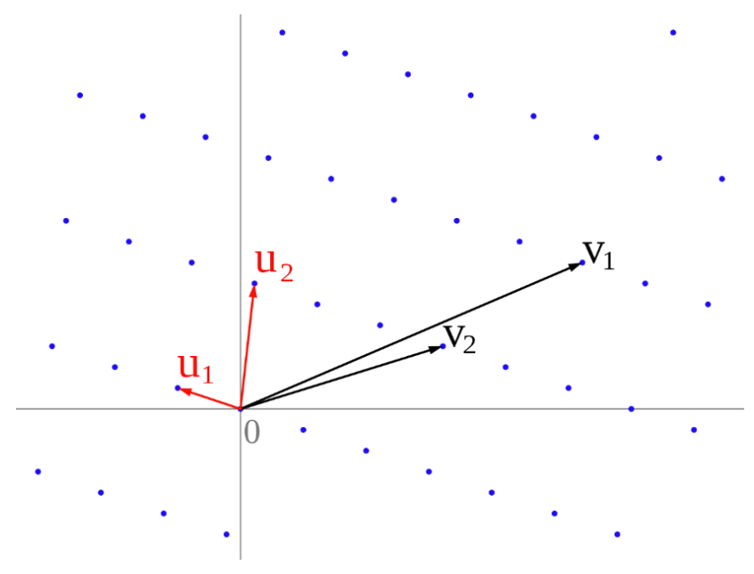
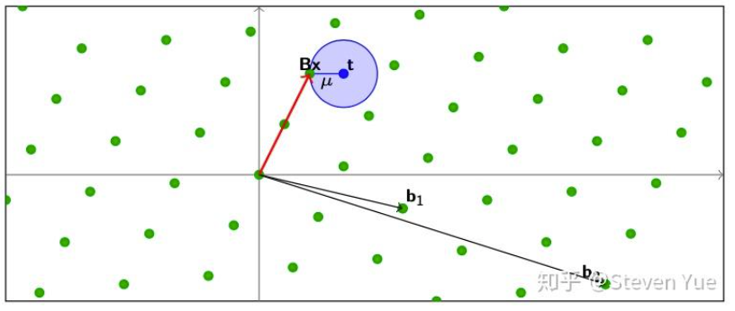
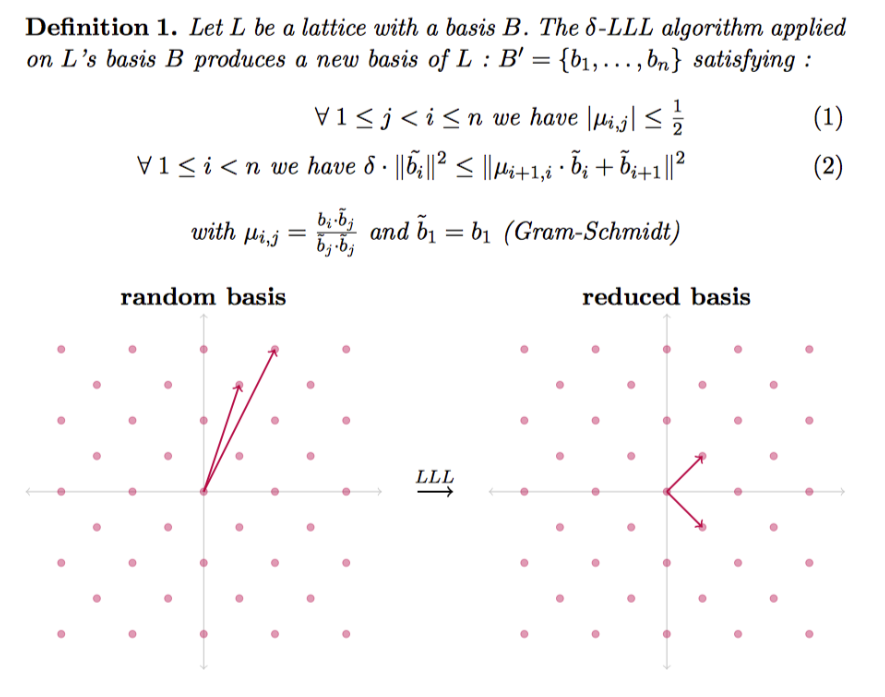

<!-- .slide: data-background="crypto-lec3/background.webp" -->

 
 
 

<h5 style="font-size: 55px; text-align: center;">crypto 专题2：格密码专题</h5>

 
 

<h1 style="font-size: 30px; text-align: center;">2025.7.12</h1>

 

    <button class="button" onclick="toggleContent()" title = "Click to see more about me">
          
    </button>
    肖盼 @DengFeng / 等风

<!-- s -->
<!-- .slide: data-background="crypto-lec3/background.webp" -->

# 专题内容

- Introduction to Lattice Cryptography

- Theorems in Lattice Cryptography and LLL Algorithm
  - Hermite Theorem and Gaussian Heuristic
  - LLL Algorithm

- Schemes based on Lattice
  - NTRU
  - Learning with Errors
  - Knapsack Problem

- Coppersmith Method
  - Howgrave-Graham Lemma
  - Coppersmith Attack

<!-- s -->
<!-- .slide: data-background="crypto-lec3/background.webp" -->

# Part.1 Introduction to Lattice Cryptography

<!-- v -->
<!-- .slide: data-background="crypto-lec3/background.webp" -->

# 后量子密码

后量子密码（Post-Quantum-Cryptography）是一类能够抵抗量子计算机攻击的密码学算法

随着量子计算的发展，传统公钥密码（如RSA、ECC等）可能在未来被量子计算机破解，如shor算法可在多项式时间内破解RSA和ECC

- 常见的后量子密码算法
  - NTRU
  - Kyber
  - Dilithium

<!-- v -->
<!-- .slide: data-background="crypto-lec3/background.webp" -->

# 后量子密码

在专题一中我们提到过，公钥密码学都是基于困难问题构造的

格密码基于的都是格中困难问题

- 格中困难问题
  - 最短向量问题（SVP）
  - 最近向量问题（CVP）
  - 错误学习问题（LWE）

格密码之所以用于抗量子密码算法的设计，是因为格中困难问题是抗量子的

也就是说，即使理想的量子计算机被研制出来，也没有多项式时间的量子算法能够攻破格中困难问题

<!-- v -->
<!-- .slide: data-background="crypto-lec3/background.webp" -->

# 格

在介绍格之前，我们先来回顾一下线性代数中的概念：向量空间

- 假设有向量空间$V$
  - 若$a, b \in V$，则$a+b \in V$
  - 若$a \in V, k \in R$，则$ka \in V$
  - 若$a, b \in V, x, y \in \mathbb{R}$，则$ax+by \in V$

上面的第三个性质可以很容易从前两个性质推出，它说明了向量空间中任意向量之间的线性组合仍在向量空间中

格其实就是系数为整数的向量空间

- 格的定义
  - $m$维整数向量空间$V$中的$n$个线性无关的向量$\vec{v_i}$的所有整系数的线性组合
  - 格的空间实际上是一堆离散的点

<!-- v -->
<!-- .slide: data-background="crypto-lec3/background.webp" -->

# 格

$L(V) = \{ \sum_{i=1}^n k_i\cdot\vec{v_i}: k_i \in \mathbb{Z} \}$

  

<!-- v -->
<!-- .slide: data-background="crypto-lec3/background.webp" -->

# 格基
根据上面的介绍，我们知道了格其实是整数向量空间上若干个向量的整系数线性组合张成的空间
- 和向量空间一致，格中也存在基向量，称为格基，格中任意一点都可以表示为基向量的线性组合
- 格空间可以选择不同的基向量，并由这些基向量线性组合张成
- 判断一个点是否在格上，只需判断能否通过基向量的线性组合得到该点
- 格基有多种选择，通过给定格基将其约化到更短的、更近似正交的格基的过程称为格基规约
$$\begin{cases}\vec{w_1} = k_{11}\vec{v_1}+k_{12}\vec{v_2}+...+k_{1n}\vec{v_n} \\\\ \vec{w_2} = k_{21}\vec{v_1}+k_{22}\vec{v_2}+...+k_{2n}\vec{v_n}  \\\\ \vec{w_m} = k_{m1}\vec{v_1}+k_{m2}\vec{v_2}+...+k_{mn}\vec{v_n} \end{cases}$$

<!-- v -->
<!-- .slide: data-background="crypto-lec3/background.webp" -->

# 格中难题

最短向量问题（Shortest Vector Problem）
- 给定一组格基$\vec{v_1},\vec{v_2},...,\vec{v_n}$，求格中的最短向量
- 形式化为求$\vec{w}=k_1\vec{v_1}+k_2\vec{v_2}+...+k_n\vec{v_n}$
满足$||\vec{w}||$最小，即$w$离原点的距离最短

  

<!-- v -->
<!-- .slide: data-background="crypto-lec3/background.webp" -->

# 格中难题

最近向量问题（Closest Vector Problem）
- 给定一组格基$\vec{v_1},\vec{v_2},...,\vec{v_n}$和空间上任意一点$\vec{t}$，求格中离该点最近的格点
- 形式化为求$\vec{w}=k_1\vec{v_1}+k_2\vec{v_2}+...+k_n\vec{v_n}$
满足$||\vec{w}-\vec{t}||$最小，即$\vec{w}$离$\vec{t}$的距离最短
- CVP问题可化归为SVP问题

  

<!-- v -->
<!-- .slide: data-background="crypto-lec3/background.webp" -->

# 格中难题

错误学习问题（Learning with Errors）

$$\begin{cases}b_1 = a_{11}x_1+a_{12}x_2+...+a_{1n}x_n \\\\ b_2 = a_{21}x_1+a_{22}x_2+...+a_{2n}x_n  \\\\ b_m = a_{m1}x_1+a_{m2}x_2+...+a_{mn}x_n\end{cases}$$

解线性方程组即可

<!-- v -->
<!-- .slide: data-background="crypto-lec3/background.webp" -->

# 格中难题

错误学习问题（Learning with Errors）

$$\begin{cases}b_1 = a_{11}x_1+a_{12}x_2+...+a_{1n}x_n+e_1 \\\\ b_2 = a_{21}x_1+a_{22}x_2+...+a_{2n}x_n+e_2  \\\\ b_m = a_{m1}x_1+a_{m2}x_2+...+a_{mn}x_n+e_m\end{cases}$$

LWE问题
<!-- s -->
<!-- .slide: data-background="crypto-lec3/background.webp" -->

# Part.2 Theorems in Lattice Cryptography and LLL Algorithm

<!-- v -->
<!-- .slide: data-background="crypto-lec3/background.webp" -->

# Hermite Theorem and Gaussian Heuristic

在讲完格的最短向量问题后，一个自然的问题是：格中最短向量到底有多短？
- Hermite Theorem给出了最短向量的一个上界：
  - 对于一个$n$维的格$L$，里面都包含了一个非零向量$\vec{v}$满足 $$||\vec{v}||\leq\sqrt{n}det(L)^{1/n}$$
  - $n$代表格的维度即基向量的数量，通常格的维度与基向量的维度一致，这样构造出来的矩阵就是个方阵，从而能够计算格的行列式
- Gaussian Heuristic
  - 高斯启发式和Hermite定理类似，都是对格中的最短向量的上界进行约束：$$||\vec{v}||\leq\sqrt{\frac{n}{2\pi e}}det(L)^{1/n}$$

<!-- v -->
<!-- .slide: data-background="crypto-lec3/background.webp" -->

# LLL Algorithm

上面我们提到，对于给定格基，我们可以通过格基规约找到格中更短的、更近似正交的格基

在线性代数中，常用的算法为Gram-Schmidt正交化

在格密码中，采用类似的方法，称为LLL算法，它能够找到格中近似的最短向量

  

<!-- s -->
<!-- .slide: data-background="crypto-lec3/background.webp" -->

# Part.3 Schemes based on Lattice

<!-- v -->
<!-- .slide: data-background="crypto-lec3/background.webp" -->

# NTRU

- 密钥生成
  - 随机选取素数$p,g$和随机数$f$满足$g<f<p,gcd(f,g)=1$
  - 计算$h \equiv g * f^{-1} \bmod p$
  - 将$(h,p)$作为公钥，$(f,g)$作为私钥
- 加密
  - 选取随机数$r$，使得$rg+mf < p$
  - 输出$c \equiv rh+m \bmod p$
- 解密
  - $c * f \equiv rh * f+ m * f \equiv r * g + m * f \bmod p$
  - 由于$rg+mf < p$，因此$c * f \bmod p = r * g + m * f$
  - 将上面的结果模$g$再乘$f^{-1}$即可得到$m$

<!-- v -->
<!-- .slide: data-background="crypto-lec3/background.webp" -->

# NTRU

我们现在对NTRU算法进行分析：
- $h \equiv g * f^{-1} \bmod p$
- $h * f \equiv g \bmod p$
- $h * f + k * p = g$
用矩阵写出来就是：
$$
(f,k)\cdot \begin{bmatrix}1&h \\\\ 0&p\end{bmatrix} = (f,g)
$$
令格基为
$$
L = \begin{bmatrix}1&h \\\\ 0&p\end{bmatrix}
$$
可知点$(f,g)$在格$L$上，如果$(f,g)$都较小并小于Hermite定理的上界，那么其大概率是格的最短向量，因此可用LLL算法求出$(f,g)$

<!-- v -->
<!-- .slide: data-background="crypto-lec3/background.webp" -->

# Learning with Errors

LWE问题常用来构造同态加密，形如

$$\begin{cases}b_1 = a_{11}x_1+a_{12}x_2+...+a_{1n}x_n+e_1 \\\\ b_2 = a_{21}x_1+a_{22}x_2+...+a_{2n}x_n+e_2  \\\\ b_n = a_{n1}x_1+a_{n2}x_2+...+a_{nn}x_n+e_n\end{cases}$$

其中，上面的error $e$都是较小的数

<!-- v -->
<!-- .slide: data-background="crypto-lec3/background.webp" -->

# Learning with Errors

我们现在对LWE进行分析：
- LWE写成矩阵的形式为$\vec{b} = \vec{x} * A + \vec{e}$
- 变形一下
$$
(\vec{x}, -1) \cdot \begin{bmatrix} A & O \\\\ \vec{b} & 1 \end{bmatrix} = (\vec{e}, 1)
$$
- 令格基为
$$
L = \begin{bmatrix}A & O \\\\ \vec{b}&1\end{bmatrix}
$$
- 可知点$(\vec{e},1)$在格中，并且由于$e$很小，其大概率就是格中的最短向量
- 因此对格$L$使用LLL算法就可以得到$\vec{e}$了，然后消除噪声$e$的影响就可以恢复$\vec{x}$了

<!-- v -->
<!-- .slide: data-background="crypto-lec3/background.webp" -->

# Knapsack Problem

- 算法中的背包问题是一个非常经典的动态规划问题
- 密码学中的背包问题曾用于构造加密算法，但后面被抛弃
- 密码学中的背包问题形如：
  - 给定$a_1,a_2,...,a_n$，从中随意选取一些值并求和得到$S$，试求哪些值被选取了？
  - 公式化描述为已知$\sum_{i=1}^n a_i * s_i = S$，其中$a_i$均已知且$s_i$为0或1，求所有的$s_i$

$$
L = \begin{bmatrix}1 & 0 & ... & 0 & a_1 \\\\ 0 & 1 & ... & 0 & a_2 \\\\ ... & ... & ... & ... & ... \\\\ 0 & 0 & ... & 1 & a_n \\\\ 0 & 0 & ... & 0 & S\end{bmatrix}
$$

<!-- v -->
<!-- .slide: data-background="crypto-lec3/background.webp" -->

# Knapsack Problem

我们现在对背包问题进行分析：

- 背包问题写成矩阵形式为$(s_1, s_2, ..., s_n, -1) \cdot L = (s_1, s_2, ..., s_n, 0)$
- 即$(s_1, s_2,..., s_n, 0)$在格$L$上，并且该向量很短，因此大概率是格中的最短向量，因此对格$L$使用LLL算法即可求出$s$
$$
L = \begin{bmatrix}1 & 0 & ... & 0 & a_1 \\\\ 0 & 1 & ... & 0 & a_2 \\\\ ... & ... & ... & ... & ... \\\\ 0 & 0 & ... & 1 & a_n \\\\ 0 & 0 & ... & 0 & S\end{bmatrix}
$$

<!-- v -->
<!-- .slide: data-background="crypto-lec3/background.webp" -->

# Hidden Number Problem

隐藏数问题（Hidden Number Problem）也叫HNP问题

假设有一些等式：
$$
\begin{cases}k_1 \equiv a_1 + x \cdot b_1 \bmod p \\\\ k_2 \equiv a_2 + x \cdot b_2 \bmod p \\\\ ... \\\\ k_t \equiv a_t + x \cdot b_t \bmod p \end{cases}
$$
其中$a_i,b_i,p$已知，$k_i$的位数略小于$p$，那么在有足够多方程的条件下，我们可以将$x$恢复

<!-- v -->
<!-- .slide: data-background="crypto-lec3/background.webp" -->

# Hidden Number Problem

将上面的式子写成整数的形式：
$$
\begin{cases}k_1 - l_1 \cdot p =  a_1 \cdot x + b_1 \\\\ k_2 - l_2 \cdot p =  a_2 \cdot x + b_2 \\\\ ... \\\\ k_t - l_t \cdot p =  a_t \cdot x + b_t \end{cases} \ \ 
L = \begin{bmatrix}p & 0 & ... & 0 & 0 \\\\ 0 & p & ... & 0 & 0 \\\\ ... & ... & ... & ... & ... \\\\ a_1 & a_2 & ... & C_1 & 0 \\\\ b_1 & b_2 & ... & 0 & C_2\end{bmatrix}
$$

有
$$
(l_1,l_2,...,l_t,x,1) \cdot L = (k_1,k_2,...,k_t,C_1 \cdot x, C_2) 
$$

<!-- v -->
<!-- .slide: data-background="crypto-lec3/background.webp" -->

# Hidden Number Problem

- 在上面的式子中$C_1,C_2$是可调节的参数，可知$(k_1,k_2,...,k_t,C_1 \cdot x, C_2)$在格$L$中，并且如果它足够短，可通过对格$L$使用LLL算法求出
- $C_1,C_2$如何调整？
  - 常数的调整是格归约中常用的技巧，很多时候使用LLL算法约不出来的原因不是格造的不对，而是常数的设置不对，我们通常称之为平衡系数
  - 一般而言，平衡系数需要使目标向量落在Hermite定理的上界之内，并且最好使得目标向量的每一项长度都差不多，这样更有利于寻找到目标向量，在上面表示$C_1 \cdot x$和$C_2$须保持和$k_i$的大小相近
  - LLL规约出来的结果可能是目标向量的取负，这时只需再取负一次即可

<!-- v -->
<!-- .slide: data-background="crypto-lec3/background.webp" -->

# Summary

我们现在对格攻击进行总结：
- 由于格攻击都是使用LLL算法尝试求最短向量（或近似最短向量），因此需要关注一些小量并围绕小量构造方程
- 在推导出一些已知式子后，我们需要把小量放在等式的右边，把已知量放在格中用于LLL规约，同时调节平衡系数使得能够规约出来
- LLL算法的规约能力比较有限，通常如果约出来的结果不够小的话，我们会采用BKZ算法进行格基规约，这是一种能够将格基约的更小的算法，但代价是运行时间更长

<!-- s -->
<!-- .slide: data-background="crypto-lec3/background.webp" -->

# Part.4 Coppersmith Method

<!-- v -->
<!-- .slide: data-background="crypto-lec3/background.webp" -->

# Coppersmith Method

在公钥密码学中，我们提到Coppersmith方法可以用来求多项式的小值根：

- Coppersmith引理：
  - 对于模$N$下度数为$d$的首一多项式$f$，若$n$是$N$的因子且满足$n \geq N^{\beta}, 0 < \beta \leq 1$，则可以在多项式时间内求出模$n$意义下满足$|x_0| < N^{\frac{\beta^2}{d}}$的根
  - 对于$n=N$的情况，可求出模$N$下满足$|x_0| < N^{\frac{1}{d}}$的根
  - 在RSA中，$p \approx N^{\frac{1}{2}}$，可求出模$p$下满足$|x_0| < N^{\frac{1}{4d}}$的根

<!-- v -->
<!-- .slide: data-background="crypto-lec3/background.webp" -->

# Coppersmith Method

实际上，Coppersmith方法正是格归约的应用，它能求多项式的小值根正对应着格基规约中求小量的特性

由于篇幅问题，这里我们只介绍单变元的Coppersmith方法（单变元Coppersmith在sagemath中已经集成实现），多变元的Coppersmith方法类似，大家可以自行了解（sagemath中无实现，但现在也不需要手搓，Github最近有一个开源实现[cuso](https://github.com/keeganryan/cuso)）

- Coppersmith方法
  - 假设我们有定义在模$M$下的度数为$d$的整系数首一多项式$F(x)=x^d+a_{d-1}x^{d-1}+...+a_1x+a_0$（如果不是首一多项式可通过乘最高次项系数模$M$的逆变为首一多项式）
  - 假设我们知道$x_0$是$F(x)$的根，即满足$F(x_0) \equiv 0 \bmod M$并且$|x_0|<M^{\frac{1}{d}}$，该如何求解这样的$x$？

<!-- v -->
<!-- .slide: data-background="crypto-lec3/background.webp" -->

# Howgrave-Graham Lemma

定义$X$为$|x_0|$取值的上界，将$F(x)$表示为一个行向量$b_F = (a_0,a_1X,...,a_dX^d)$

- Howgrave-Graham Lemma
  - 假设$F(x_0) \equiv 0 \bmod M$，那么当$||b_F||<\frac{M}{\sqrt{d+1}}$时，有$F(x_0) = 0$
  - 证明：$|F(x_0)| = |\sum_{i=0}^d a_ix_0^i| \leq \sum_{i=0}^d |a_i||x_0|^i \leq \sum_{i=0}^d |a_i|X^i$
  - 根据柯西不等式有$\sum_{i=1}^nx_i \leq \sqrt{n\sum_{i=1}^nx_i^2} = \sqrt{n}||(x_1,x_2,...,x_n)||$，在这里即$\sum_{i=0}^d |a_i|X^i \leq \sqrt{d+1}||b_F|| \leq \frac{\sqrt{d+1}M}{d+1} = M$
  - 因此$-M < F(x_0) < M$，而$F(x_0) \equiv 0 \bmod M$，所以$F(x_0) = 0$

<!-- v -->
<!-- .slide: data-background="crypto-lec3/background.webp" -->

# Coppersmith Attack

- Coppersmith方法的本质就是通过格基规约找到一个小系数多项式使其满足Howgrave-Graham引理，然后就可以直接在整数下进行求根了
- 然而一般的多项式是不具备这个性质的，那么我们该如何找到满足Howgrave-Graham引理的多项式呢？
- 我们考虑如下$d-1$个多项式：$G_i(x)=Mx^i,0 \leq i < d$，这些多项式都满足$G_i(x_0) \equiv 0 \bmod M$，而$F(x)$也满足$F(x_0) \equiv 0 \bmod M$，因此这些多项式的任意线性组合都满足这个性质
- 我们需要在这些多项式的线性组合里面找到满足Howgrave-Graham引理的多项式，即找到$F'$满足$b_{F'} \leq \frac{M}{\sqrt{d+1}}$

<!-- v -->
<!-- .slide: data-background="crypto-lec3/background.webp" -->

# Coppersmith Attack

- 因此我们构造格：
$$
L = \begin{bmatrix}M & 0 & ... & 0 & 0 \\\\ 0 & MX & ... & 0 & 0 \\\\ ...& ... & ... & ... & ... \\\\ 0 & 0 & ... & MX^{d-1} & 0 \\\\ a_0 &  a_1X & ... & a_{d-1}X^{d-1} & a_dX^d\end{bmatrix}
$$
对其使用LLL算法后得到的结果$F'$满足$F'(x_0) \equiv 0 \bmod M$且$b_{F'}$较小

<!-- v -->
<!-- .slide: data-background="crypto-lec3/background.webp" -->

# Coppersmith Attack

- 上面构造的格的行列式为$det(L)=M^X^{d(d+1)/2}$
- 根据LLL算法的性质，对$L$使用LLL算法后，得到的第一个行向量$b_0$满足$||b_0|| \leq 2^{\frac{n-1}{4}det(L)^{1/n}}$，因此$||b_0|| \leq 2^{\frac{d}{4}}M^{\frac{d}{d+1}}X^{\frac{d}{2}}$
- 为了满足Howgrave-Graham引理，要求$2^{\frac{d}{4}}M^{\frac{d}{d+1}}X^{\frac{d}{2}} < \frac{M}{\sqrt{d+1}}$，整理可得$2^{\frac{d}{4}}\sqrt{d+1}X^{\frac{d}{2}} < M^{\frac{1}{d+1}}$
- 若$d=2,X \approx M^{1/3}$，若$d=3, X \approx M^{1/6}$
- 这是个初步的范围，与Coppersmith定理的$X<M^{1/d}$还有一段距离

<!-- v -->
<!-- .slide: data-background="crypto-lec3/background.webp" -->

# Coppersmith Attack

上面推导的界离真正的Coppersmith定理还差了一段距离

为了增大$X$的界，有两种方法可以使用
- 1.扩大格的维度$n$
- 2.增大模数$M$

对于第一种方案，我们可以添加"**x-shift**"多项式，即在格中插入$xF(x),x^2F(x),...,x^kF(x)$，显然这些多项式在模$M$下也有根$x_0$

对于第二种方案，我们可以使用$M$的幂来增大模数，如$F(x)^k \equiv 0 \bmod M^k$自然也是成立的

将上述两种策略根据参数进行调整使用后，就得到了单变元Coppersmith方法

<!-- s -->
<!-- .slide: data-background="crypto-lec3/background.webp" -->

 
 
 

<h5 style="font-size: 55px; text-align: center;">谢谢大家~ 辛苦啦!</h5>

 

<strong>
<h5 style="font-size: 40px; text-align: center;">Questions?</h5>
</strong>

 

    肖盼 @DengFeng / 等风

 

<strong>

    Hack For Fun!

</strong>

    QQ: 1440416491

