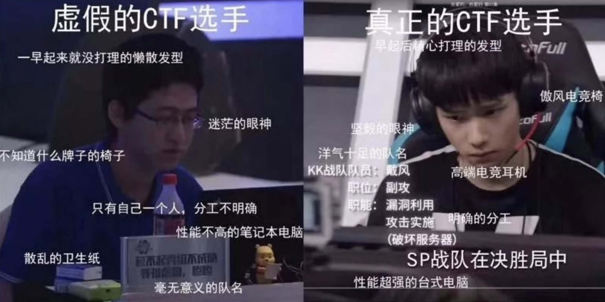
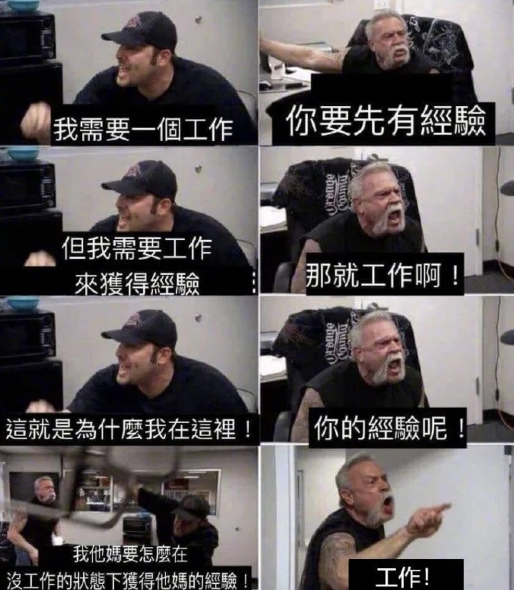
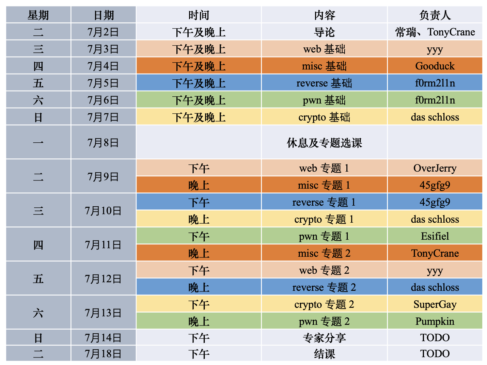
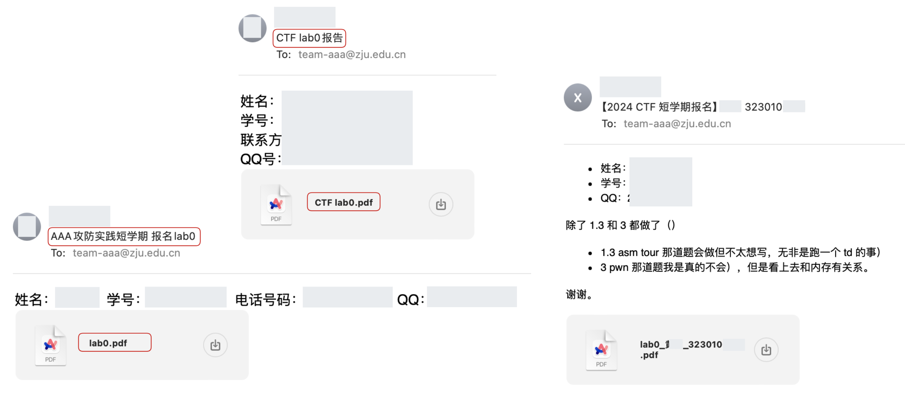
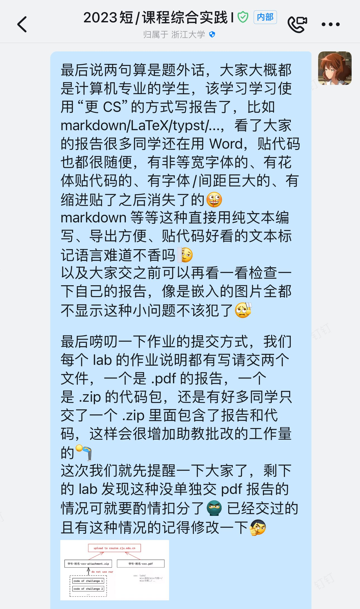
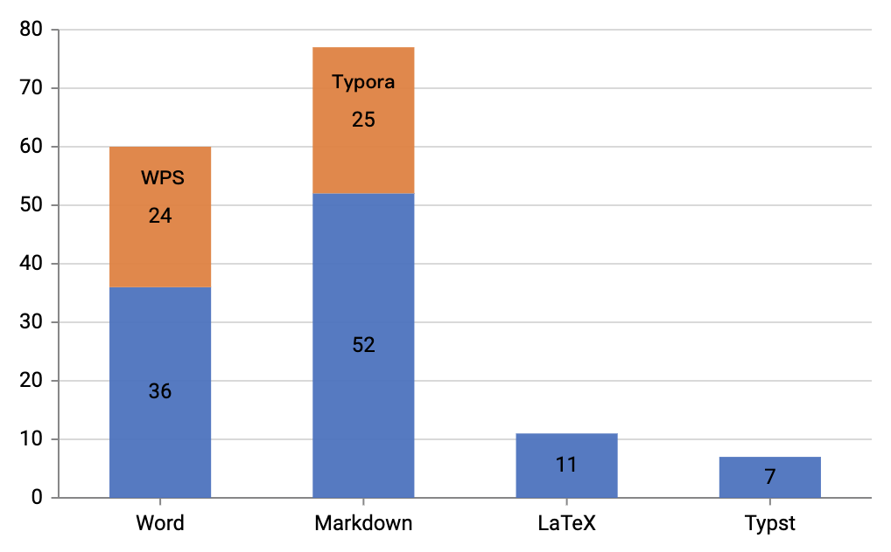

<!-- .slide: data-background="lec0/cover.png" -->

<!--v-->
<!-- .slide: data-background="lec0/background.png" -->

## About me

王鹤翔（TonyCrane）

- 2021 级本科生，图灵班信息安全专业
    - 师从常瑞老师
- 2021 年加入 AAA 战队，2023 年末起任 AAA 队长
- 主页：<https://tonycrane.cc>
- 笔记网站：<https://note.tonycrane.cc>
- 助教课程：
    - 程序设计与算法基础
    - 计算机系统 II / III
    - 计算机组成与设计
    - 软安 / OS / PPL（下学期）

<!--v-->
<!-- .slide: data-background="lec0/background.png" -->

## Outline

- 聊聊 CTF 与 AAA
- 关于这门课
    - 课程安排与评分
    - Lab 0 简单讲解
    - 关于实验环境
    - 你需要了解的基础

<!--s-->
<!-- .slide: data-background="lec0/background.png" -->

# Part.1 关于 CTF

<!--v-->

## 什么是 CTF？

<!--v-->

## 什么是 CTF？

> Security CTFs, or Capture-The-Flag competitions are awesome to learn hacking. They can be very challenging and teach you a lot of new skills.  
> &emsp;&emsp;&emsp;&emsp;&emsp;&emsp;&emsp;&emsp;&emsp;&emsp;&emsp;&emsp;&emsp;&emsp;&emsp;&emsp;&emsp;&emsp;&emsp;&emsp;&emsp;&emsp;&emsp;&emsp;&emsp;&emsp;&emsp;&emsp;&emsp;&emsp;&emsp;&emsp;—— @LiveOverflow

<iframe id="ytplayer" type="text/html" width="640" height="360"
  src="https://www.youtube.com/embed/8ev9ZX9J45A"
  frameborder="0"></iframe>

<!--v-->
<!-- .slide: data-background="lec0/background.png" -->

## 什么是 CTF？

**C**apture **T**he **F**lag，通过获取题目内藏的 flag 来证明拥有破解并利用漏洞的能力。

- 真实漏洞利用场景的复现
    - 构建 real world 环境，分析在野攻击威胁
- Game of Hackers
    - Hacker 们锻炼技术、分享技巧和工具的游戏
- 高自闭性竞技项目
    - Jeopardy Style + AWD Style
    - 做得出就是做得出，做不出就是做不出
    - 非预期，搭便车，突破惯性思维……

<!--v-->
<!-- .slide: data-background="lec0/background.png" -->

## 一些著名的 CTF 比赛

- 国际：
    - **DEFCON CTF**：DEFCON 会议开创，CTF 届的“世界杯”
    - **Codegate CTF**：韩国的知名国际赛事
    - **SECCON CTF**：日本网络安全协会 SECCON 会议中的国际 CTF
    - **Google CTF**：Google 主办
    - **Plaid CTF**：美国 CMU 的 PPP 战队主办
    - **0CTF/TCTF**：上海交大 0ops 战队和腾讯安全联合主办
- 国内：
    - **XCTF 联赛**：战队举办分站赛，根据积分进行决赛（也算国际）
    - **强网杯**：中央网信办、河南省政府指导，和信工大等联合主办
    - **全国大学生信息安全竞赛**：“国赛”
    - 字节 CTF、百度 CTF、阿里云 CTF、……

<!--v-->

## CTF 比赛现状

<!--v-->
<!-- .slide: data-background="lec0/background.png" -->

## CTF 比赛类型与赛题方向

- AWD（Attack With Defense）形式比赛
    - 维护、加固自己服务器上的服务，同时攻击对方服务器上的服务
- **Jeopardy 解题形式比赛**：最常见的线上赛制
    - 一般时长 8h / 24h / 48h 不等
    - 赛题类型：
        - reverse：二进制程序逆向
        - pwn：二进制程序漏洞利用
        - web：网络安全漏洞利用
        - crypto：密码学算法分析破解等
        - misc：杂项，其他任何类型的题目都可以丢到这里（x

<!--v-->
<!-- .slide: data-background="lec0/background.png" -->

## CTF 比赛类型与赛题方向 (cont.)

- misc：兼容并包、广泛收罗、脑洞绞尽
- crypto：优雅，实在太优雅了
- reverse：安全问题之基，“努力的天才”
- pwn：
    - 我常称研究二进制的人为气宗，因其根基是在逆向工程上的熟练程度和对漏洞利用思想的领悟，在掌握这两门法宝之后，任何二进制类的问题都有一定办法可以搞定 ——岳不群
- web：
    - 我常称 Web 类问题为剑宗，因为 Web 类问题非常繁多，恰如一招一式无穷无尽的剑法，有很多很多的小技巧 ——风清扬

Playing CTF is just solving puzzles, everything you want can be CTF challenges.

<!--v-->
<!-- .slide: data-background="background.png" -->

## 为什么要打 CTF？

- 安全领域工作经验
- 为了后续的专业课程不那么 painful
- 保研加分：国赛创新实践赛（CTF）、作品赛可以根据成绩有加分
- 锤炼实战技术
    - 课堂的内容可能太书面太枯燥，通过实战不仅可以实践知识，还能加深理解
- 认识并实战最前沿的安全热点

<!--v-->
<!-- .slide: data-background="lec0/background.png" -->

## 如何学习 CTF？

- 理论知识？
    - 本课程
    - CTF wiki: https://ctf-wiki.org/
    - 《从0到1：CTFer 成长之路》、《CTF 竞赛权威指南：pwn 篇》……
- 做题、打比赛！
    - https://zjusec.com/ 校内训练题目平台
    - ZJUCTF 校赛：https://ctf.zjusec.com/
    - Hackergame：https://hack.lug.ustc.edu.cn/
    - BUUCTF 平台：https://buuoj.cn/
    - 攻防世界：https://adworld.xctf.org.cn/
    - ……
- 多问！AAA 的学长都可以问

<!--s-->
<!-- .slide: data-background="lec0/background.png" -->

# Part.2 关于 AAA

<!--v-->
<!-- .slide: data-background="lec0/background.png" -->

## AAA 战队介绍

> AAA 战队是由浙江大学信息安全爱好者自发组织，浙江大学计算机学院支持建立，由白洪欢、周亚金、常瑞三位老师指导的团队。队伍中每一位成员都对信息安全有无与伦比的热爱，因此对CTF比赛总是充满了激情。

- Azure Assassin Alliance 天青刺客联盟
- 不是社团，不是学生组织，只是一个爱好者的自发组织
- 已有十余年历史，且与任何社团、学生组织无关
    - 优势：自由、活跃、凝聚力强
- 我们的历史：[明星战队专访 | AAA战队的成长四部曲](https://mp.weixin.qq.com/s/EZzYc61vtKINuB63Bn0CoA)
- 更多详见公众号：ZJUSecurity

<!--v-->
<!-- .slide: data-background="lec0/background.png" -->

## AAA 战队历史

- 专访 2014 年度中国最强高校黑客团队（2014）
    - [51CTO 专访](https://www.51cto.com/article/449711.html)
- 揭秘浙大“黑客战队”：战个痛快（2017）
    - [新浪新闻 - 钱江晚报](https://k.sina.cn/article_1700720163_655eee23027002lcn.html)
- 拿下过世界顶级黑客大赛冠军 揭秘浙大“黑客战队”（2017）
    - [浙江新闻](https://zjnews.zjol.com.cn/zjnews/hznews/201707/t20170706_4502369.shtml)
- 这是一个“小众游戏”，却是网络安全青年逐梦竞技场（2021）
    - [显微故事](https://www.163.com/dy/article/GL4T9V2U0531KXYL.html)
- 明星战队专访| AAA战队的成长四部曲（2022）
    - [XCTF 专访](https://mp.weixin.qq.com/s/EZzYc61vtKINuB63Bn0CoA)

<!--v-->
<!-- .slide: data-background="lec0/background.png" -->

## 战队代表战绩

- DEFCON CTF 28 世界冠军（A\*0\*E 联合战队）
- DEFCON CTF 29 世界冠军（Katzebin 联合战队）
- Codegate CTF 2023 预赛世界第一，决赛亚军
- SECCON CTF 2022 国际季军，2023 国际亚军
- TCTF/0CTF RisingStar 新星赛决赛冠军
- 2022 XCTF 国际联赛积分第一，总决赛亚军
- 2022 “数字中国”创新大赛虎符网络安全赛道决赛季军
- 2022 首届微步杯 MRCTF 全国公开赛冠军
- 2021 强网杯决赛季军以及最佳高校战队荣誉
- 2021 “安全范儿”ByteCTF大赛决赛全国季军
- 2020 XNUCA 全国高校网安联赛冠军

<!--v-->
<!-- .slide: data-background="lec0/background.png" -->

## 战队现状

老老老老……老年化严重

- 互联网寒气影响
- 传统漏洞安全方向的**卷 + 落寞**
- 本科阶段的**卷 + 忙**
- 社会整体趋势

However，不要太担心，重在参与

- Keep playing then you can **join the team**
- then play more you can **become the main force**

<!--v-->
<!-- .slide: data-background="lec0/background.png" -->

## 如何加入 AAA

持续招新，但也有纳新季统一招新。几个入队方法：

- 在校巴上取得较好成绩
    - 总榜/新生榜中排名靠前
    - AK（全部解决）某一方向的赛题（rev/pwn/web/crypto/misc）
    - 做出某些难度极高的题目
- 在短学期课程中表现优异也会纳入考虑范围哦
- 纳新季系列比赛（ZJUCTF/Hackergame）中取得优异成绩
- 有其他特长（前端、美工、开发、宣传）请大胆联系，我们非常需要！

往届纳新季推文：

- 2023-2024 季度：[纳新 | 黑客梦想、即刻起航](https://mp.weixin.qq.com/s/oYkiUUospJuSZ5Q6Vr6YAw) QQ 群：555451112
- 2022-2023 季度：[纳新季 | 听说你想成为AAAer？](https://mp.weixin.qq.com/s/lT3bbtQR7N7cAq8Bzc_OPw)

<!--s-->
<!-- .slide: data-background="lec0/background.png" -->

# Part.3 关于这门课

<!--v-->
<!-- .slide: data-background="lec0/background.png" -->

## 课程时间安排

- 下午 14:00 - 17:00
- 晚上 18:30 - 21:30
- 第一周的晚课是留给做作业的
- 讲完内容就会提前下课

<!--v-->
<!-- .slide: data-background="lec0/background.png" -->

## 课程作业与评分

- 考勤（5%）
    - 允许线上上课，但需要提前说明，不影响成绩
    - 没有提前说明 / 请假，缺勤会扣一定分数
- 基础周（55%）
    - Lab 0 全部完成（5%）
    - 五个方向每个方向 Lab 1，每个占 10%
- 专题周（40%）
    - 五个方向选两个方向学习专题，每个方向两个 Lab，每个占 10%
- 少量 bonus：考勤 / 基础周 / 专题周 三个部分独立，不互相溢出
- 鼓励选择多个专题，但最终选择分数较高的两个专题计分
    - 基础周后的休息时间进行选专题，届时可能会有更新

<!--v-->
<!-- .slide: data-background="lec0/background.png" -->

## 关于旁听政策

https://courses.zjusec.com/#_3

- 智云课堂直播 / 回放，鼓励线下听课
- 右侧二维码课程钉钉群，通知会在群内发布
- 可以自愿上交实验：
    - 邮件发送至：<team-aaa@zju.edu.cn>
    - 标题：【2024 CTF 短学期实验报告】*姓名* *学号* *实验名称*
    - 内容：个人信息+实验感想
    - 附件：PDF 格式的实验报告+代码压缩包（如有需要）

<!--v-->
<!-- .slide: data-background="lec0/background.png" -->

## 关于课程实验环境

自给自足，无提供的虚拟机环境

- 授人以鱼不如授人以渔
- Lab 0 中让大家配置了 Linux 环境
    - 更方便进行环境的管理
    - 一个干干净净的用来做实验写代码的环境
- 有需要使用的工具会推荐给大家 Install on needed
    - 从**官方渠道**自行搜索下载
    - 有安装上/使用上的困难在尝试搜索解决无果后可以向助教求助
- Google is your best teacher

<!--v-->
<!-- .slide: data-background="lec0/background.png" -->

## Suppose 课程结束后

- 概括来说
    - 安全意识提高（自我保护，编写更安全的代码）
    - 自学能力的提升（x
    - 通过入门 CTF 为后续课程打开不一样的视角
- 细节来说
    - 学会 CTF 各方向上基础题目的求解
    - 在所选的专题方向上进一步学习完成拔高
    - 完成作业，出席课程，取得一个好绩点

<!--s-->
<!-- .slide: data-background="lec0/background.png" -->

# Part.4 Lab 0 简单讲解

<!--v-->
<!-- .slide: data-background="lec0/background.png" -->

## Lab 0 概览

https://courses.zjusec.com/intro/lab0/

- Prerequisite：Linux / Python / x86 汇编
- Web：~~手速~~ token 访问 / SQL 注入
- Pwn：肉眼找 bugs
- Reverse：反汇编，从 0 到 1 的 ELF 体验
- Misc：编解码 / 图片隐写 ~~神奇妙妙工具~~
- Crypto：古典密码 ~~人力爆破~~ / RSA 原理

<!--v-->
<!-- .slide: data-background="lec0/background.png" -->

## Prerequisite & Web & Pwn

- Prerequisite 不多说
    - calculator 建议用 pwntools 交互（套用 socket 建立连接）
    - 8086 汇编一条一条指令分析即可
- Web：
    - challenge 1：view-source 或 curl 查看源码
    - challenge 2：SQL 布尔盲注
        - 过滤了空格 UNION 引号星号等，但可用括号和 tab
- Pwn：整数下溢 / 内存泄漏 / 堆上缓冲区溢出读 / ……

<!--v-->
<!-- .slide: data-background="lec0/background.png" -->

## Reverse & Misc & Crypto

- Reverse：IDA Pro / Ghidra 反汇编一把梭
- Misc：CyberChef “Magic” 功能自动分析
    - Base 系列编码套娃
    - LSB 隐写 + 文件末尾隐藏数据流
- Crypto：
    - challenge 1：自动化匹配图形，字母频率匹配
        - [quipquip.com](https://www.quipqiup.com/) 词频分析
    - challenge 2：RSA 原理，公钥加密私钥解密
        - $d = e^{-1} \mod \phi(n)$
        - $m = c^d \mod n$

<!--s-->
<!-- .slide: data-background="lec0/background.png" -->

# Part.5 其他的唠叨

<!--v-->
<!-- .slide: data-background="lec0/background.png" -->

## 在一切开始之前……

作为 CSer 的基本素养

- [PracticalSkillsTutorial/2023-fall-ckc/lec0/#/4](https://slides.tonycrane.cc/PracticalSkillsTutorial/2023-fall-ckc/lec0/#/4)
    - 实用技能拾遗第零讲，课程回放：[BV1t34y1g7YU](https://www.bilibili.com/video/BV1t34y1g7YU/)
- 好好了解你的电脑，管理你的环境（包括网络环境）
- 学会自学：RTFM / STFW / RTFSC
- 学会提问：[提问的智慧](https://github.com/ryanhanwu/How-To-Ask-Questions-The-Smart-Way/blob/main/README-zh_CN.md)、[别像弱智一样提问](https://github.com/tangx/Stop-Ask-Questions-The-Stupid-Ways/blob/master/README.md)
- 遵守基本的规矩……

<!--v-->

## 基本的规矩 —— 遵守规范

以 Lab 0 报名邮件为例：

- "【2024 CTF 短学期报名】*姓名* *学号*"、`lab0_姓名_学号.pdf`
- 160 份提交中
    - 有 **34** 份邮件标题命名不正确（很严重，很可能导致收不到邮件）
    - 有 **49** 份附件实验报告命名不正确（增加统计工作量）

<!--v-->

## 基本的规矩 —— 作业提交

- 提交两份文件：
    - *学号*-*姓名*-*实验名称*.pdf
    - *学号*-*姓名*-*实验名称*-attachment.zip
- 学在浙大**可以**一次提交多份文件
- 学在浙大可以直接预览 pdf 但不能提取 zip

<!--v-->

## 基本的规矩 —— 清晰的实验报告

- 报告工程？
- 学在浙大浏览 docx 很不稳定，至少导出 pdf
- 不推荐使用 Word / WPS 等
    - 对于 CS 来讲贴代码等很不方便
    - 当然你能做好也没问题
- markdown / LaTeX / Typst
- 记得导出后检查一下有没有缺失信息

<!--v-->
<!-- .slide: data-background="lec0/background.png" -->

## 前置知识学习资料

你至少需要学会：

- Linux shell 基础：[实用技能拾遗 lec1](https://slides.tonycrane.cc/PracticalSkillsTutorial/2023-fall-ckc/lec1/)
- 简单 Python 基础：[官方 Tutorial](https://docs.python.org/3/tutorial/index.html)、[菜鸟教程](https://www.runoob.com/python/python-tutorial.html)

掌握了更好：

- x86 汇编基础：[TonyCrane 汇编笔记](https://note.tonycrane.cc/cs/pl/asm/)
- 网络网站基础知识：[实用技能拾遗 lec6](https://slides.tonycrane.cc/PracticalSkillsTutorial/2023-fall-ckc/lec6/)
- 关于排版：[lec3](https://slides.tonycrane.cc/PracticalSkillsTutorial/2023-fall-ckc/lec3/)、[lec4](https://slides.tonycrane.cc/PracticalSkillsTutorial/2023-fall-ckc/lec4/lec4.pdf)、[降压宝典](https://hypotensor.tonycrane.cc/)

<!--s-->
<!-- .slide: data-background="lec0/ending.png" -->