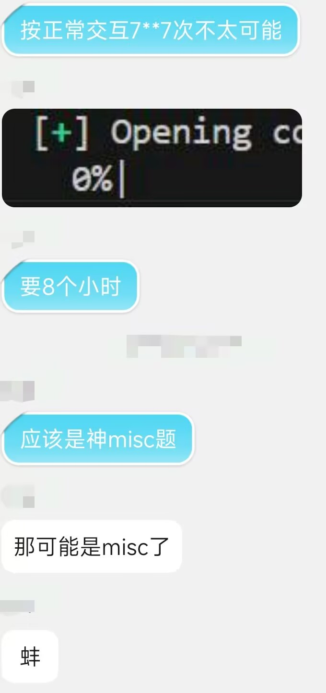
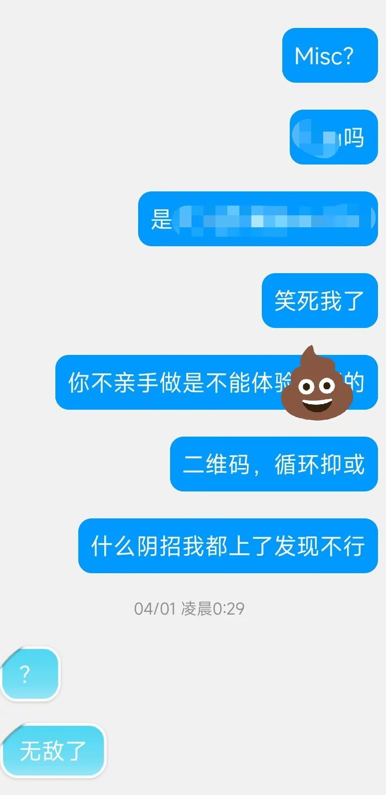
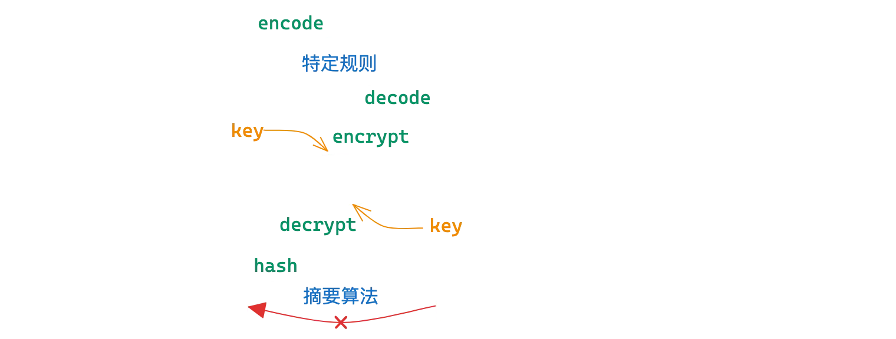
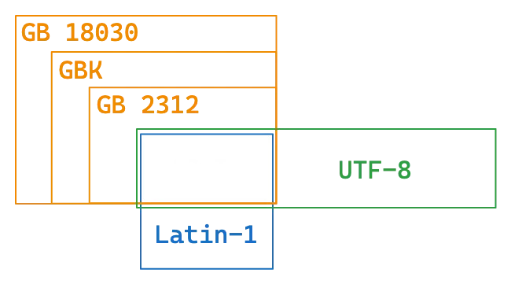
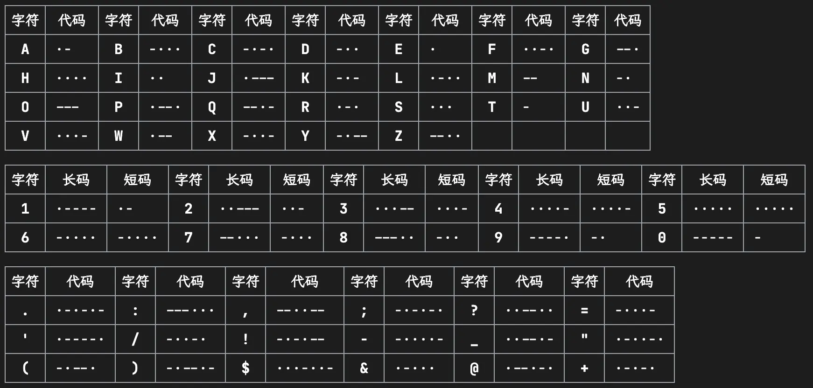
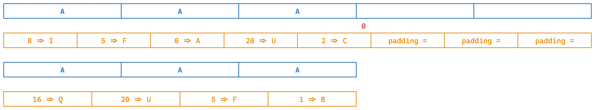

<style>
@import url('https://cdn.jsdelivr.net/npm/lxgw-wenkai-webfont@1.1.0/style.css');

  html * {
    font-family: 'LXGW WenKai', sans-serif !important;
}
    .button-container {
    display: flex;
    align-items: center;
    justify-content: center;
    gap: 20px;
    position: relative;
    width: 100%; 
}


        .button {
            display: flex;
            align-items: center;
            justify-content: center;  
            text-decoration: none;
            border: 1px solid #ddd;
            padding: 0; 
            border-radius: 50%;  
            width: 85px; 
            height: 85px; 
            transition: transform 0.3s ease, border-color 0.3s ease;  
            cursor: pointer;
            overflow: hidden;
        }

        .button img {
            width: 100%;  
            height: 100%;  
            object-fit: cover;  
            border-radius: 50%;  
        }

        .button:hover {
            transform: scale(1.1);
            border-color: rgba(0, 123, 255, 0.2);
            box-shadow: 0 2px 10px rgba(0, 123, 255, 0.2); 
        }

        .button-container .button-text {
            position: absolute; 
            top: 50%;
            left: 100%;  
            transform: translateY(-50%); 
            opacity: 0;  
            visibility: hidden;  
            transition: opacity 0.3s ease, visibility 0.3s ease;
            white-space: nowrap; 
            font-size: 20px;
        }
    </style>

<!-- .slide: data-background="" -->

<br>
<br>
<br>

<center><h5 style="font-size: 55px; text-align: center;">misc 基础：简介 / 编解码 / 流量取证</h5></center>

<br>
<br>


<center><h1 style="font-size: 30px; text-align: center;">2025.7.3</h1></center>

<br>

 


<center><div class="button-container" >
    <button class="button" onclick="toggleContent()" title = "Click to see more about me">
          
    </button>
    <span>吴俊铭 @Dremig / Dr3m19</span>
</div></center>

<!-- s -->

<div class="middle center">
<div style="width: 100%">

# Part.1 什么是 misc？

</div>
</div>

<!-- v -->

## 先来看看我的聊天记录里面查查misc有什么

<div style="display: flex; justify-content: space-around;">
  
  
  
</div>


<!-- v -->

## 所以，到底什么是misc？

- Miscellaneous 杂的，多种多样的
-  =  -  -  -  -  


<div class="fragment" style="margin-top: 40px">

<p style="margin-bottom: 30px;">一般来说misc包括：</p>

- ~~签到题、签退问卷题~~
- ~~套娃题、谜语题~~

</div>

<div class="fragment" style="margin-top: 35px">

- <span style="display: flex; justify-content: space-between;"><span><ruby>隐写<rp>（</rp><rt>Steganography</rt><rp>）</rp></ruby>、<ruby>取证<rp>（</rp><rt>forensics</rt><rp>）</rp></ruby>、<ruby>OSINT 信息搜集<rp>（</rp><rt>Open Source Intelligence</rt><rp>）</rp></ruby>、<ruby>PPC 编程类<rp>（</rp><rt>Professionally Program Coder</rt><rp>）</rp></ruby></span><span>——&hairsp;&hairsp;传统 misc 题&emsp;</span></span>
- <span style="display: flex; justify-content: space-between;"><span>游戏类题目（大概也算 PPC）、工具运用类题目</span><span></span></span>
- <span style="display: flex; justify-content: space-between;"><span>编解码、古典密码</span><span>——&hairsp;&hairsp;不那么 crypto 的 crypto&emsp;</span></span>
- <span style="display: flex; justify-content: space-between;"><span>网络解谜、网站代码审计</span><span>——&hairsp;&hairsp;不那么 web 的 web&emsp;</span></span>
- <span style="display: flex; justify-content: space-between;"><span>代码审计、沙箱逃逸</span><span>——&hairsp;&hairsp;不那么 binary 的 binary&emsp;</span></span>
- <span style="display: flex; justify-content: space-between;"><span>Blockchain、IoT、AI</span><span>——&hairsp;&hairsp;新兴类别题目&emsp;</span></span>

</div>

<!-- v -->

## 来看一些好玩的misc题吧！

- <a href="https://github.com/USTC-Hackergame/hackergame2023-writeups/blob/master/official/奶奶的睡前%20flag%20故事/README.md"><span style="display: flex; justify-content: space-between;"><span>hackergame2023: 奶奶的睡前 flag 故事</span><span>——&hairsp;&hairsp;图片隐写、信息搜集&emsp;</span></span></a>
- <span style="display: flex; justify-content: space-between;"><span>DEF CON CTF Qual 2025: 🐱💻🌐</span><span>——&hairsp;&hairsp;信息搜集、代码混淆&emsp;</span></span></a>
- <span style="display: flex; justify-content: space-between;"><span>ACTF2025: QQQRcode(managed by <strong>結束バンド</strong>)</span><span>——&hairsp;&hairsp;编解码、编程类&emsp;</span></span></a>
- <a href="https://ctf.zjusec.com/games/4/challenges"><span style="display: flex; justify-content: space-between;"><span>ZJUCTF2024: Minec(re)tf</span><span>——&hairsp;&hairsp;游戏<del>、逆向工程</del>&emsp;</span></span></a>
- <span style="display: flex; justify-content: space-between;"><span>OpenHarmonyCTF Quals 2025: 智械：双重牢笼</span><span>——&hairsp;&hairsp;AI</del>&emsp;</span></span></a>
- <span style="display: flex; justify-content: space-between;"><span>SCTF2023: Genshin Impact</span><span>——&hairsp;&hairsp;流量取证、编解码、信息搜集&emsp;</span></span>
- <a href="https://ctf.zjusec.com/games/5/challenges"><span style="display: flex; justify-content: space-between;"><span>0CTF: numbers</span><span>——&hairsp;&hairsp;信息搜集、工具使用&emsp;</span></span></a>
- ...

<!-- v -->

## 如何学习 misc？

透过前面的那些例子你或许也可以看出来……？

- ~~需要提前了解很多东西？~~ 需要勇于尝试学习新东西！
    - “貌似人人都是 misc 手”
    - 很多时候题目对于选手来说都是全新领域，需要快速入门/快速上手新工具
- 需要活跃的思维（脑洞），以及跟出题人对上脑电波的运气
    - “貌似人人都不是 misc 手”
- 需要一定的编程能力
    - 至少熟练掌握 `Python` 或其他一门语言
      - 为什么推荐使用 `Python`：简洁、优雅而不失功能性
    - 防止用代码实现成为放宽思路的绊脚石
- 需要多做题多积累经验，尝试出出题站在出题人的角度
    - misc 朋友日常中经常：“诶，这个好像可以出成题目”
      - ~~当时`QQQRcode`是我们寝室夜谈时随便乱聊天聊出来的~~

<!-- s -->


<div class="middle center">
<div style="width: 100%">

# Part.2 Lab0 Review~

</div>
</div>

<!-- v -->

## Challenge 1

这里有一串被编码过的神秘的字符串，请找出有意义的原字符串（格式为 AAA{...}）

```text
;cR!f<`MjL9eg<R<bl5:;D9go<,6#?<CUXo<)lXK;cPZ";D9h.=);&:<bu;I9l*Er<A8VO<GYQ"<blqZ<%p0t<bbf5<GY,q;cH@l9kl@B:f0A=
```
Hint:
+ 你可能会需要<a href="https://lab.tonycrane.cc/CyberChef/"><span><span class="heti-spacing"></span>CyberChef</span></a>（<del>而且这里有一个功能可以秒杀这个题目</del>）
+ 你可能需要了解一些关于<strong><span>Base<span class="heti-spacing"></span></span>系列</strong>编码的特征


<!-- v -->

## Challenge 2

下面这张图是 AAA 的 logo。真的……只是一个 logo 吗？其实这张图片中隐藏了一个 flag（格式 AAA{...}），请你找出来。

<div style="display: flex; justify-content: space-around;">


</div>

Hint：
+ flag 被分为了两个部分
+ 如果你找不到第一部分，~~仔细观察图片~~，这使用了一种最基础的图片隐写技术 LSB 隐写，请自行搜索学习如何破解
+ 如果你找不到第二部分，请仔细查看文件内容


<!-- s -->

<div class="middle center">
<div style="width: 100%">

# Part.3 编解码基础

</div>
</div>


<!-- v -->

## 编解码 / 加解密 / 哈希

明确：
- 一切信息在计算机看来都是 0 和 1
    - 编解码/加解密/哈希也都是在 01 串之间进行的变换
- 为什么你看见的输入输出是字符？
    - 计算机通过字符编码规则将 01 串转换为了可见字符

三种常见的 01 串转换方式：

<div style="text-align: center; margin-top: -20px;">

</div>

一个非常常用的编解码工具：[CyberChef](https://gchq.github.io/CyberChef/) /[（TonyCrane ver.）](https://lab.tonycrane.cc/CyberChef)

<!-- v -->

## 为什么乱码会出现？- 字符编码

- 字符编码：人类理解的字符 <=> 计算机理解的 01 串 之间的映射
- 为什么会出现乱码：用一种字符编码规则解读另一种字符编码的 01 串

常见的字符编码：

- ASCII：一共 128 个项，即每个字符可以用一个 7 位的 01 串表示（或一字节）
    - 00-1F：控制字符；20-7E：可见字符；7F：控制字符（DEL）
- Latin-1（ISO-8859-1）：扩展了 ASCII，一共 256 个项
    - 80-9F：控制字符；A0-FF：可见字符
    - 特点：任何字节流都可以用其解码
- 利用 Unicode 字符集的一系列编码
    - UTF-8 / UTF-16 / UTF-32 / UCS
- 中国国标字符集系列编码
    - GB 2312 / GBK / GB 18030-2022

<!-- v -->

## Unicode 字符集与 UTF 编码

参见：https://note.tonycrane.cc/cs/unicode/

- 以平面划分，17 个平面，每个平面 65536 个码位（2 字节）
    - 通过码位可以表示为 U+0000 ~ U+10FFFF
    - 可容纳 111w+ 个字符，现有 14w+ 个字符（超过一半为 CJK 字符）
- UCS（Universal Character Set）：
    - UCS-2：直接用 2 字节表示码位；UCS-4：直接用 4 字节表示码位
- UTF（Unicode Transformation Format）：
    - UTF-8：变长编码（1~4），兼容 ASCII
        - **0**xxxxxxx
        - **110**xxxxx **10**xxxxxx
        - **1110**xxxx **10**xxxxxx **10**xxxxxx
        - **11110**xxx **10**xxxxxx **10**xxxxxx **10**xxxxxx
    - UTF-16：变长编码（2/4），不兼容 ASCII

<!-- v -->

## 乱码的原因



几个字符集不兼容的部分互相编解码，常见的：

- 用 GBK 解码 UTF-8 编码的文本
- 用 UTF-8 解码 GBK 编码的文本
- 用 latin-1 解码 UTF-8 编码的文本
- 用 latin-1 解码 GBK 编码的文本
- 先用 GBK 解码 UTF-8 编码的文本，再用 UTF-8 解码前面的结果
- 先用 UTF-8 解码 GBK 编码的文本，再用 GBK 解码前面的结果

这里我们请同学们自行研究，lab 中会用到（后续详细发布），几种推荐的方式：

- CyberChef，通过 Input 和 Output 窗口的字符集设置
    - 需要注意，CyberChef 的 UTF-8 不会将错误解码替换为 �（非预期）
- vscode 右下角的编码方案（重新打开/用编码保存）
- 必要的时候可以使用 python 来进行编解码/进制转换等


<!-- v -->

## 摩尔斯电码

前面说到的字符编码：01 串 <=> 字符；接下来看另一种：字符 <=> 字符

- 摩尔斯电码（Morse Code）：利用点划（“滴”的时间长短）来表示字符
    - 点 ·：1 单位；划 -：3 单位
    - 点划之间间隔：1 单位；字符之间间隔：3 单位；单词之间间隔：7 单位
- 字符集：A-Z、0-9、标点符号（.:,;?='/!-_"()$&@+）、~~一些电码专用表示~~
- 表示中文：电码表（一个汉字对应四个数字），数字使用短码发送

<div style="text-align: center; margin-top: 5px;">

</div>

<!-- v -->

## Base系列

接下来是 01 串 <=> 01 串，但这里介绍的 `Base` 系列的结果都可以转为可见字符

- Base16：即 16 进制表示字节流，长度翻倍
- Base32：按照 5 bit 一组（每个 0-31），按照字符表（A-Z 2-7）映射
    - 结果长度必须是 5 的倍数，不足的用 = 不齐（明显特征）
- Base64：按照 6 bit 一组，按照字符表映射（最常用）
    - 标准字符表：A-Z a-z 0-9 +/
    - 另有多种常用字符表，如 URL 安全字符表：A-Za-z0-9-_
    - 结果长度必须是 4 的倍数，不足的用 = 不齐（1~2 个，明显特征）

<div style="text-align: center; margin-top: 30px;">

</div>

<!-- v -->

## Base 编码家族（续）

Base-n 系列的本质：字节流 -> 整数 -> n 进制 -> 系数查表

所以除去前面规则的 16/32/64 进制，还有一些其他的 Base 编码：

- 分组：
    - Base85：4 字节整数 -> 85 进制 -> 5 个系数
        - 常用字符表：0-9 A-Z a-z !#$%&()*+-;<=>?@^_`{|}~
        - 标准字符表：!-u（ASCII 编码中 0x21-0x75）
- 作为大整数转换进制：
    - Base62：0-9 A-Z a-z（比 Base64 少了 +/）
    - Base58：0-9 A-Z a-z 去除 0OIl
    - Base56：比 Base58 少了 1 和 o
    - Base36：0-9 A-Z（比 Base62 少了 a-z）


<!-- v -->

## More?

- 其他常用编码
    - UUencode、XXencode
    - QR Code 二维码：[note.tonycrane.cc/ctf/misc/qrcode](https://note.tonycrane.cc/ctf/misc/qrcode/)
    - Bar Code 条形码
- 一些其他好玩的类编码
    - 北约音标字母 [Wikipedia](https://zh.wikipedia.org/zh/%E5%8C%97%E7%BA%A6%E9%9F%B3%E6%A0%87%E5%AD%97%E6%AF%8D) 
    - 地点三词编码 What3Words：https://what3words.com/ 常用于osint
    - <del>让我们永远怀念：[与熊论道](https://tieba.baidu.com/p/9600757754)——&hairsp;&hairsp;佛曰熊说编码加密&emsp;</del>
- 常用的工具
    - CyberChef：https://gchq.github.io/CyberChef/
    - Base 系列爆破：https://github.com/mufeedvh/basecrack/
    - DenCode：https://dencode.com/
    - Ciphey：https://github.com/Ciphey/Ciphey


<!-- s -->

<div class="middle center">
<div style="width: 100%">

# Part.4 流量取证

</div>
</div>


<!-- v -->

## 流量取证基础

- 网络流量（-> 回顾**就在昨天的** web 基础）
    - 应用层（HTTP/FTP/...）-> 表示层 -> 会话层（SSL/TLS/...）
    - -> 传输层（TCP/UDP）-> 网络层（IP/ICMP/...）
    - -> 数据链路层 -> 物理层
- 最终传输的仍然是二进制数据
    - 捕获这些数据，就可以分析得到正在进行的通信内容
- 流量取证一般就是拿到这些数据包（cap、pcap、pcapng 格式）进行分析
    - 如有损坏的话修复数据包（少见，pcapfix 可以修复）
    - 分析、提取得到正在通信的内容（可能包含有效信息）
    - 分析一些特定的、不太常见的协议（比如一些自定义协议）
    - 分析、解密一些加密的协议（比如 VMess 等）

<!-- v -->

## 流量取证常用工具

- tcpdump 抓 TCP 包（Linux 命令行）
- 🌟 [Wireshark](https://www.wireshark.org/)：直接抓包，得到物理层的全部数据并解析（开源）
    - 自带命令行工具 tshark
- [termshark](https://github.com/gcla/termshark)：类似 Wireshark 的开源命令行工具
- [pyshark](https://github.com/KimiNewt/pyshark/)：tshark 的 Python 封装，可以用 Python 脚本分析
- [scapy](https://scapy.net/)：Python 库，也可以用来分析流量包


<!-- v -->

## Wireshark 基本用法

- 浏览主界面的所有数据包，大致了解都由什么协议组成
- 追踪流（追踪 TCP 流/追踪 HTTP 流）
    - 得到某次通信的全部数据包，并进行解析
    - 另存为，保存流数据
    - 可以转换不同的显示形式（ASCII、HEX、Raw）
- 文件 > 导出，提取某些数据包的流内容
- 统计部分
    - 协议层次：统计各层协议的数据包数量
    - 流量图：统计各个端口的流量，可视化显示
    - HTTP：分组计数、请求统计

<!-- v -->

## Wireshark 过滤器

- 过滤协议：直接输入 tcp/udp/http 等
- 过滤 ip：ip.addr == xx.xx.xx.xx 或 ip.src ip.dst
- 过滤端口：tcp.port == 80 或 tcp.srcport tcp.dstport
- 包长度过滤：frame.len ip.len tcp.len ……
- http 过滤
    - http.request.method == GET
    - http.request.uri == "/index.php"
    - http contains "flag"（相当于搜索功能）
- 直观感受一下
    - 本次 lab 中的题目：OpenHarmony CTF 2025 软总线流量分析取证1

<!-- v -->

## HTTP 协议流量分析

- 分析统计信息
    - 查看所有的 HTTP 请求 URL
    - 分析 HTTP 往返的情况，流量整体信息
- 具体分析某些请求：利用过滤器
- 分析某一数据包具体内容
    - 跟踪流，跟踪 TCP 解析 TCP，跟踪 HTTP 可以自动解压 gzip 等
    - 分析请求头、响应头、请求体、响应体等
- 具体题目示例
    - 本次 lab 中的题目：SQL 盲注流量分析


<!-- v -->

## UDP 协议流量分析

- UDP 协议是无连接的，不需要像 TCP 一样三次握手
- 和 TCP/HTTP 一样直接追踪分析就可以
- 常见的基于 UDP 的协议：DNS
- 具体题目示例
    - 本次 lab 中的题目：dnscap


<!-- v -->


## 其他协议

- ICMP 协议：ping
    - 某时也会带有一些信息，可以进行进一步分析
- OICQ 协议：QQ 使用，是加密的，但是可以看到双方 QQ 号等
- WIFI 协议（IEEE 802.11）
    - 可以使用 **Linux aircrack** 套件爆破密码
    - 有了密码后可以在 **Wireshark** 中设置并解密流量
- USB 协议
    - 安装了 USBcap 之后可以在 Wireshark 中捕获 USB 流量
    - 有工具可以解析流量，绘制鼠标轨迹，得到按键信息等
- 其他加密协议
    - VMess，需要读文档/源码，实现解密
    - 例题：[强网杯 2022 Quals 谍影重重](https://note.tonycrane.cc/writeups/qwb2022/)

<!-- s -->

<div class="middle center">
<div style="width: 100%">

# Part.5 misc 基础 Lab 简介


</div>
</div>

<!-- v -->

- Task 1 二选一，多做无 bonus
- Challenge 1&2 需全部完成 
- 选做 Bonus，视完成程度加至多15分 Bonus 分数
- 该 Lab 的总分不会超过115分

1. [基础] Task 1: 乱码情形探究（40 分，二选一）
    - 具体研究课上提到的六种乱码情况，探究原因
    - 乱码分析实战——完成 ZJUCTF2023 NATO26
2. [二选一] Challenge 1: GB 系列编码实战（30 分）
    - 自行搜索学习 GB 系列编码，了解区位码、机内码的概念
    - 简单的实践 —— 参考 AliyunCTF2024
3. [全做]Challenge 2: 流量取证实战（30分）
    - **完整**完成课上演示过的，`软总线流量分析取证1` 题目，并记录过程和你对这道题目的理解
4. Bonus Challenge: crack_zju_wlan（15分）
5. **Maybe** Bonus: your suggestion for this Lab（**Maybe** 5分 max）

<!-- v -->


## 一些建议

+ 对于不懂的地方，采用以下策略来搞懂：
    - 优先级最高的：查阅网上资料，并与我所讲的内容进行结合
    - 一些不那么直观的问题：询问大模型 —— DeepSeek r1 、 grok3 ... 
    - 循环重复以上过程，直到陷入瓶颈、困境
    - 大胆向我提问，不过拒绝聊天式的问问题，参考[提问的智慧](https://github.com/ryanhanwu/How-To-Ask-Questions-The-Smart-Way/blob/main/README-zh_CN.md)
      - 想要聊天我很愿意，但是低效地问问题只会浪费你我的时间
    - [Maybe]我也解决不了的问题，向我推荐的其他人提问
+ 对于"记录过程"(其实就是所谓的"写writeup")，我们推荐：
    + 记录核心代码(如果有注释那最好，没有其实也没关系，但最好有对代码的解释)，if any
    + 记录关键步骤，比如哪条流量中找到了关键信息，同时记录二者，if any
    + 记录结果，以及提交 flag 成功的截图，if success
    + 在以上都尽量全面的前提下，尽量精简到让人一眼就看得到关键步骤


<!-- s -->

<br>
<br>
<br>

<center><h5 style="font-size: 55px; text-align: center;">谢谢大家~ 辛苦啦!</h5></center>

<br>

<strong><center><h5 style="font-size: 40px; text-align: center;">Questions?</h5></center></strong>

<br>

<center>
    <span>吴俊铭 @Dremig / Dr3m19</span>
</center>

<br>

<strong><center>
    <span style="font-size: 25px;">What to contact with me?</span>
</center></strong>
<center>
    <span style="font-size: 22px;">QQ: 1466140007</span>
</center>

<center>
    <span style="font-size: 22px;">mail: wjm1s@zju.edu.cn</span>
</center>


