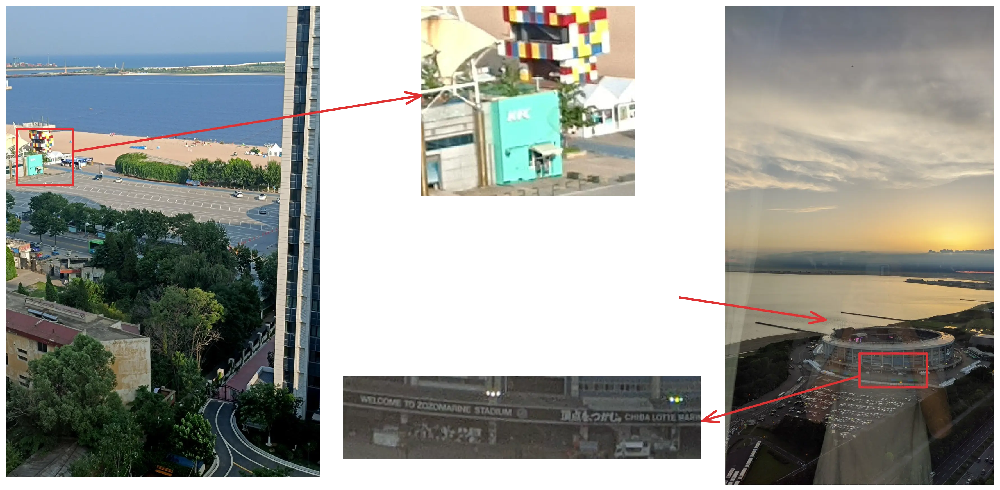
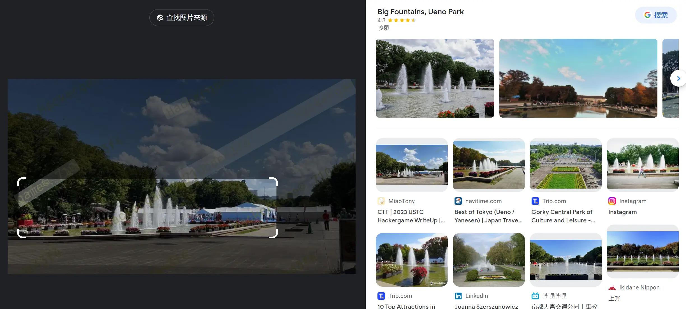
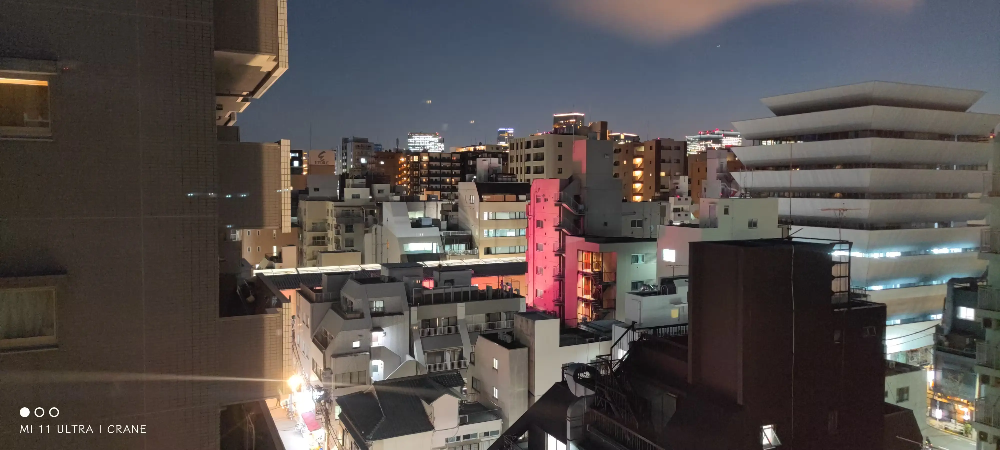
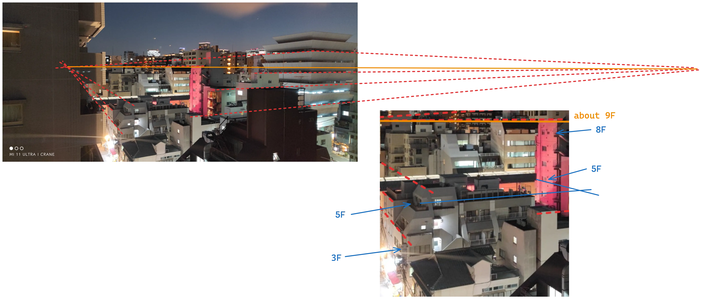

<!-- .slide: data-background="misc-lec1/cover.webp" -->
<!--s-->
<!-- .slide: data-background="misc-lec1/background.webp" -->

# Part.1 什么是 misc？

<!--v-->
<!-- .slide: data-background="misc-lec1/background.webp" -->

## 什么是 misc？

- miscellaneous **杂**项
-  =  -  -  -  -  

一般来讲 misc 包括的题型：

- ~~签到题、签退问卷题~~
- ~~套娃题、谜语题~~

- <ruby>隐写<rp>（</rp><rt>Steganography</rt><rp>）</rp></ruby>、<ruby>取证<rp>（</rp><rt>forensics</rt><rp>）</rp></ruby>、<ruby>OSINT 信息搜集<rp>（</rp><rt>Open Source Intelligence</rt><rp>）</rp></ruby>、<ruby>PPC 编程类<rp>（</rp><rt>Professionally Program Coder</rt><rp>）</rp></ruby>——&hairsp;&hairsp;传统 misc 题&emsp;
- 游戏类题目（大概也算 PPC）、工具运用类题目
- 编解码、古典密码——&hairsp;&hairsp;不那么 crypto 的 crypto&emsp;
- 网络解谜、网站代码审计——&hairsp;&hairsp;不那么 web 的 web&emsp;
- 代码审计、沙箱逃逸——&hairsp;&hairsp;不那么 binary 的 binary&emsp;
- Blockchain、IoT、AI——&hairsp;&hairsp;新兴类别题目&emsp;

<!--v-->
<!-- .slide: data-background="misc-lec1/background.webp" -->

## 来看一些好玩的 misc 题吧！

- SCTF2023: Genshin Impact——&hairsp;&hairsp;流量取证、编解码、信息搜集&emsp;
- ZJUCTF2022: いじOSINT——&hairsp;&hairsp;OSINT&emsp;
- TPCTF2023: nanoUniverse——&hairsp;&hairsp;游戏、PPC&emsp;
- RCTF2024: s1ayth3sp1re——&hairsp;&hairsp;逆向、代码审计&emsp;
- hackergame2023: 奶奶的睡前 flag 故事——&hairsp;&hairsp;图片隐写、信息搜集&emsp;
- SECCON2023: readme 2023——&hairsp;&hairsp;代码审计、脑洞&emsp;
- KALMARCTF2024: Futuristic Secret Storage——&hairsp;&hairsp;代码审计、脑洞&emsp;
- ZJUCTF2023: 23w40a_or_ctf——&hairsp;&hairsp;游戏&emsp;

<!--v-->
<!-- .slide: data-background="misc-lec1/background.webp" -->

## 如何学习 misc？

透过前面的那些例子你或许也可以看出来……？

- ~~需要提前了解很多东西？~~ 需要勇于尝试学习新东西！
    - “貌似人人都是 misc 手”
    - 很多时候题目对于选手来说都是全新领域，需要快速入门/快速上手新工具
- 需要活跃的思维（脑洞），以及跟出题人对上脑电波的运气
    - “貌似人人都不是 misc 手”
- 需要一定的编程能力
    - 至少熟练掌握 python 或其他一门语言
    - 防止用代码实现成为放宽思路的绊脚石
- 需要多做题多积累经验，尝试出出题站在出题人的角度
    - misc 朋友日常中经常：“诶，这个好像可以出成题目”

<!--s-->
<!-- .slide: data-background="misc-lec1/background.webp" -->

# Part.2 基础编解码知识

<!--v-->
<!-- .slide: data-background="misc-lec1/background.webp" -->
## 编解码？加解密？哈希？

首先一定要明确一点：

- 一切信息在计算机看来都是 0 和 1
    - 编解码/加解密/哈希都是在 01 串之间进行的变换
- 为什么你看见的输入输出是字符？
    - 计算机通过字符编码规则将 01 串转换为了可见字符

三种常见的 01 串转换方式：

一个非常常用的编解码工具：[CyberChef](https://gchq.github.io/CyberChef/) /[（TonyCrane ver.）](https://lab.tonycrane.cc/CyberChef)

<!--v-->
<!-- .slide: data-background="misc-lec1/background.webp" -->
## 为什么乱码会出现？- 字符编码

- 字符编码：人类理解的字符 <=> 计算机理解的 01 串 之间的映射
- 为什么会出现乱码：用一种字符编码规则解读另一种字符编码的 01 串

常见的字符编码：

- ASCII：一共 128 个项，即每个字符可以用一个 7 位的 01 串表示（或一字节）
    - 00-1F：控制字符；20-7E：可见字符；7F：控制字符（DEL）
- Latin-1（ISO-8859-1）：扩展了 ASCII，一共 256 个项
    - 80-9F：控制字符；A0-FF：可见字符
    - 特点：任何字节流都可以用其解码
- 利用 Unicode 字符集的一系列编码
    - UTF-8 / UTF-16 / UTF-32 / UCS
- 中国国标字符集系列编码
    - GB 2312 / GBK / GB 18030-2022

<!--v-->
<!-- .slide: data-background="misc-lec1/background.webp" -->
## Unicode 字符集与 UTF 编码

参见：https://note.tonycrane.cc/cs/unicode/

- 以平面划分，17 个平面，每个平面 65536 个码位（2 字节）
    - 通过码位可以表示为 U+0000 ~ U+10FFFF
    - 可容纳 111w+ 个字符，现有 14w+ 个字符（超过一半为 CJK 字符）
- UCS（Universal Character Set）：
    - UCS-2：直接用 2 字节表示码位；UCS-4：直接用 4 字节表示码位
- UTF（Unicode Transformation Format）：
    - UTF-8：变长编码（1~4），兼容 ASCII
        - **0**xxxxxxx
        - **110**xxxxx **10**xxxxxx
        - **1110**xxxx **10**xxxxxx **10**xxxxxx
        - **11110**xxx **10**xxxxxx **10**xxxxxx **10**xxxxxx
    - UTF-16：变长编码（2/4），不兼容 ASCII

<!--v-->
<!-- .slide: data-background="misc-lec1/background.webp" -->
## 怎么就乱码了？

几个字符集不兼容的部分互相编解码，常见的：

- 用 GBK 解码 UTF-8 编码的文本
- 用 UTF-8 解码 GBK 编码的文本
- 用 latin-1 解码 UTF-8 编码的文本
- 用 latin-1 解码 GBK 编码的文本
- 先用 GBK 解码 UTF-8 编码的文本，再用 UTF-8 解码前面的结果
- 先用 UTF-8 解码 GBK 编码的文本，再用 GBK 解码前面的结果

这里我们请同学们自行研究，lab 中会用到（后续详细发布），几种推荐的方式：

- CyberChef，通过 Input 和 Output 窗口的字符集设置
    - 需要注意，CyberChef 的 UTF-8 不会将错误解码替换为 �（非预期）
- vscode 右下角的编码方案（重新打开/用编码保存）
- 必要的时候可以使用 python 来进行编解码/进制转换等

<!--v-->
<!-- .slide: data-background="misc-lec1/background.webp" -->
## 摩尔斯电码

前面说到的字符编码：01 串 <=> 字符；接下来看另一种：字符 <=> 字符

- 摩尔斯电码（Morse Code）：利用点划（“滴”的时间长短）来表示字符
    - 点 ·：1 单位；划 -：3 单位
    - 点划之间间隔：1 单位；字符之间间隔：3 单位；单词之间间隔：7 单位
- 字符集：A-Z、0-9、标点符号（.:,;?='/!-_"()$&@+）、~~一些电码专用表示~~
- 表示中文：电码表（一个汉字对应四个数字），数字使用短码发送

<!--v-->
<!-- .slide: data-background="misc-lec1/background.webp" -->
## Base 编码家族

接下来是 01 串 <=> 01 串，但这里介绍的 Base 家族的结果都可以转为可见字符

- Base16：即 16 进制表示字节流，长度翻倍
- Base32：按照 5 bit 一组（每个 0-31），按照字符表（A-Z2-7）映射
    - 结果长度必须是 5 的倍数，不足的用 = 不齐（明显特征）
- Base64：按照 6 bit 一组，按照字符表映射（最常用）
    - 标准字符表：A-Za-z0-9+/
    - 另有多种常用字符表，如 URL 安全字符表：A-Za-z0-9-_
    - 结果长度必须是 4 的倍数，不足的用 = 不齐（1~2 个，明显特征）

<!--v-->
<!-- .slide: data-background="misc-lec1/background.webp" -->
## Base 编码家族（续）

Base-n 系列的本质：字节流 -> 整数 -> n 进制 -> 系数查表

所以除去前面规则的 16/32/64 进制，还有一些其他的 Base 编码：

- 分组：
    - Base85：4 字节整数 -> 85 进制 -> 5 个系数
        - 常用字符表：0-9A-Za-z!#$%&()*+-;<=>?@^_`{|}~
        - 标准字符表：!-u（ASCII 编码中 0x21-0x75）
- 作为大整数转换进制：
    - Base62：0-9A-Za-z（比 Base64 少了 +/）
    - Base58：0-9A-Za-z 去除 0OIl
    - Base56：比 Base58 少了 1 和 o
    - Base36：0-9A-Z（比 Base62 少了 a-z）

<!--v-->
<!-- .slide: data-background="misc-lec1/background.webp" -->
## more?

- 其他常用编码
    - UUencode、XXencode
    - QR Code 二维码：[note.tonycrane.cc/ctf/misc/qrcode](https://note.tonycrane.cc/ctf/misc/qrcode/)
    - 条形码
    - 盲文编码
- 一些其他好玩的类编码
    - 北约音标字母 [Wikipedia](https://zh.wikipedia.org/zh/%E5%8C%97%E7%BA%A6%E9%9F%B3%E6%A0%87%E5%AD%97%E6%AF%8D)
    - 地点三词编码 What3Words：https://what3words.com/
- 常用的工具
    - CyberChef：https://gchq.github.io/CyberChef/
    - Base 系列爆破：https://github.com/mufeedvh/basecrack/
    - DenCode：https://dencode.com/
    - Ciphey：https://github.com/Ciphey/Ciphey

<!--s-->
<!-- .slide: data-background="misc-lec1/background.webp" -->

# Part.3 OSINT 基础

<!--v-->
<!-- .slide: data-background="misc-lec1/background.webp" -->

## 什么是 OSINT & 声明

- **O**pen **S**ource **INT**elligence：开源网络情报
    - 通过完全公开的信息进行合理的推理，获取情报
- 一般在 misc 题目中出现即泛指信息搜集，有几种情况：
    - 构造了一个全新的虚拟身份，搜集得到出题人准备好的信息
    - 根据图片、文档等附件泄漏的信息进行推理（**主要**）
        - 包括根据图片内容推理找到拍摄位置、当时环境等信息

⚠️ 声明 ⚠️

- 后续内容仅供 CTF 范围内学习交流，实操于现实世界时请注意法律法规
- 对于擅自在现实世界（非 CTF 题目构造的虚拟情形）中复现的行为，由此产生的一切后果由行为人自行承担，本课程、作者以及 AAA 团队概不负责

<!--v-->
<!-- .slide: data-background="misc-lec1/background.webp" -->

## 信息搜集/查询基础

- 一系列数字信息搜集工具：
    - https://github.com/ffffffff0x/Digital-Privacy
- 用户名批量查询：
    - sherlock: https://github.com/sherlock-project/sherlock
    - namechk: https://namechk.com/
- 高级搜索方式
    - filetype:...
    - site:...
    - inurl:... intitle:... intext:...
- Wayback Machine [web.archive.org](http://web.archive.org/)
    - 查找网页的历史快照（以及可以创建快照）
    - 有时可以找到出题人特意保存快照后删除的内容

<!--v-->
<!-- .slide: data-background="misc-lec1/background.webp" -->

## 文件信息泄露

❗️在数据结构课之前需要掌握的技能——避免泄漏个人信息

- 各种文档的元信息（metadata）可能包括作者、修改时间等信息
    - 图片的 EXIF 信息，可通过 exiftool 查看
    - 一般以 xml 形式存储，可以直接通过二进制抹除，或者通过操作系统
- 工程文件夹泄漏信息
    - Visual Studio 的各种配置文件，.vs 文件夹中信息
    - .vscode 文件夹中的配置文件
    - .git 文件夹，泄漏全部修改历史、提交信息、提交者等
- 文件夹路径信息泄漏
    - .DS_Store 文件，macOS 下的文件夹布局信息
    - 前面各种工程配置文件等也会泄漏（比如 vs 的 pdb 调试信息）
    - markdown 文件图片路径（本地路径/图床用户/自建图床网站）

<!--v-->
<!-- .slide: data-background="misc-lec1/background.webp" -->

## 照片信息分析 - 图片搜索

搜一下是不是有人公开 post 的/已有的图片素材

一些常用的搜索引擎：

- 百度识图搜索：中文互联网图片搜索结果
- Google 图片搜索：用来搜索外国范围的图片
- Bing 图片搜索：和 Google 差不多，都可以参考
- Yandex 图片搜索：
    - 搜索相似图片
    - 搜索风景时更常用
- TinEye：搜索完全相同的图片（找来源）

<!--v-->
<!-- .slide: data-background="misc-lec1/background.webp" -->

## 照片信息分析 - 地点线索搜集

注意图片中的文字、牌匾、标志性建筑等，可用来作为关键词搜索

- 来自 2021、2022 hackergame 的「旅行照片」

- 找到大概位置后可用百度全景地图/谷歌全景地图进行确认/查找附近线索

<!--v-->
<!-- .slide: data-background="misc-lec1/background.webp" -->

## 照片信息分析 - 地点线索搜集

如果图片中关键信息较少，可以优先考虑使用搜索引擎识图

- 2023 hackergame 的「旅行照片」中的一张照片，使用 Google 识图搜索

- 搜索确认得到地名后，即可进一步搜索相关信息

<!--v-->
<!-- .slide: data-background="misc-lec1/background.webp" -->

## 照片信息分析 - 环境信息分析

常见的：拍摄者高度分析

- 例：SECCON 时在酒店里拍的照片

根据几何学透视来进行简单分析⬇️

<!--v-->
<!-- .slide: data-background="misc-lec1/background.webp" -->

## 照片信息分析 - 环境信息分析（续）

- 确保图中垂直线互相平行
    - 否则进行一些拉伸
- 找到两个**灭点**
- 连线为视平线
- 根据参考建筑找视平线楼层即可

<!--v-->
<!-- .slide: data-background="misc-lec1/background.webp" -->

## 照片信息分析 - 环境信息分析（续）

其他环境信息的分析：

- 太阳角度、阴影长度等太阳相关
    - 时间 <=> 位置互相估计
    - [suncalc.org](https://www.suncalc.org/)
    - [sunearthtools.com](https://www.sunearthtools.com/cn/index.php)
- 天气信息、云层信息等
- 飞机航班信息
    - 估计方向，位置，时间等
    - [flightaware.com](https://flightaware.com/)
    - [flightradar24.com](https://www.flightradar24.com/)
    - [adsbexchange.com](https://www.adsbexchange.com/)
- 风景信息 -> Yandex 搜索

<!--s-->
<!-- .slide: data-background="misc-lec1/background.webp" -->

## misc 基础 Lab 简介

- Task 1 二选一，多做无 bonus
- Challenge 1&2 二选一，多做有 bonus，最多 15 分

1. [基础] Task 1: 乱码情形探究（40 分，二选一）
    - 具体研究课上提到的六种乱码情况，探究原因
    - 乱码分析实战——完成 ZJUCTF2023 NATO26
2. [二选一] Challenge 1: GB 系列编码实战（60 分 /+15 分）
    - 自行搜索学习 GB 系列编码，了解区位码、机内码的概念
    - 简单的实践——参考 AliyunCTF2024
3. [二选一] Challenge 2: OSINT 图片信息搜集实战（60 分 /+15 分）
    - 两张 AAA 队员的“旅行照片”
    - 从拍摄的照片中获取信息，并回答相关问题

<!--s-->
<!-- .slide: data-background="misc-lec1/ending.webp" -->
