<style>
@import url('https://cdn.jsdelivr.net/npm/lxgw-wenkai-webfont@1.1.0/style.css');

html * {
  font-family: 'LXGW WenKai', sans-serif !important;
}
</style>

<br>
<br>
<br>
<br>

<center><h5 style="font-size: 55px; text-align: center;">Misc Basic: 编解码与流量取证</h5></center>

<br>

<div style="display: flex; align-items: center; justify-content: center; gap: 18px;">
  
  <h1 style="font-size: 30px; text-align: center; margin: 0;">Dremig / 吴俊铭</h1>
</div>

<br>


<!-- s -->

## About me

<div class="fragment" style="display: flex; align-items: flex-start; justify-content: space-between; gap: 36px; margin-top: 16px; padding-right: 64px;">
  <ul style="flex: 1 1 auto; margin-top: 10px; font-size: 30px; line-height: 1.55;">
    <li>吴俊铭 / <a href="https://github.com/Dremig" target="_blank">Dremig</a></li>
    <li><del>How to read my ID: /ˈdreɪmɪg/</del></li>
    <li>Computer Science @Turing</li>
    <li>CTFer@<a href="https://ctftime.org/team/194222">AAA</a>
      <ul>
        <li>Web & <del>Misc</del>Forensics & AI</li>
      </ul>
    </li>
    <li>wujunming.dr3m19 @ByteDance</li>
    <li><del>Member@<a href="https://ctftime.org/team/406719">結束バンド</a></del></li>
    <li>contact with me by:</li>
    <ul>
      <li>email: dr3m19@icloud.com</li>
      <li>QQ: 1466140007</li>
    </ul>
    <li>...</li>
  </ul>

  <div style="flex: 0 0 330px; padding: 18px 20px 22px; background: #ffffff; border: 1px solid #e5e7eb; border-radius: 8px; box-shadow: 0 14px 34px rgba(15, 23, 42, 0.13); color: #20242c;">
    
    <p style="margin: 0 0 2px; font-size: 33px; line-height: 1.15; font-weight: 700;">Junming Wu</p>
    <p style="margin: 0 0 24px; font-size: 25px; line-height: 1.2; color: #5b6472;">Dremig · he/him</p>
    <p style="margin: 0; font-size: 21px; line-height: 1.45;">AI &amp; Sec at ZJU | Curr <strong>@bytedance</strong> | CTFer <strong>@team-s2</strong></p>
  </div>
</div>


<!-- s -->

<div class="middle center">
<div style="width: 100%">

# Part.1 What is misc？

</div>
</div>

<!-- v -->

<div class="chaos-board">
  <div class="fragment chaos-main" style="display: flex; align-items: flex-start; justify-content: space-between; gap: 42px; padding-right: 64px;">
    <div style="flex: 1 1 auto; display: flex; flex-direction: column; gap: 42px; font-size: 30px; white-space: nowrap;">
      <p style="margin: 0; line-height: 1.35;">别人：渗透、SRC、CVE、堆风水、密码学</p>
      <p style="margin: 0; line-height: 1.35;">我：猜谜</p>
      <p style="margin: 0; line-height: 1.35;">就很...你们懂吧</p>
    </div>
    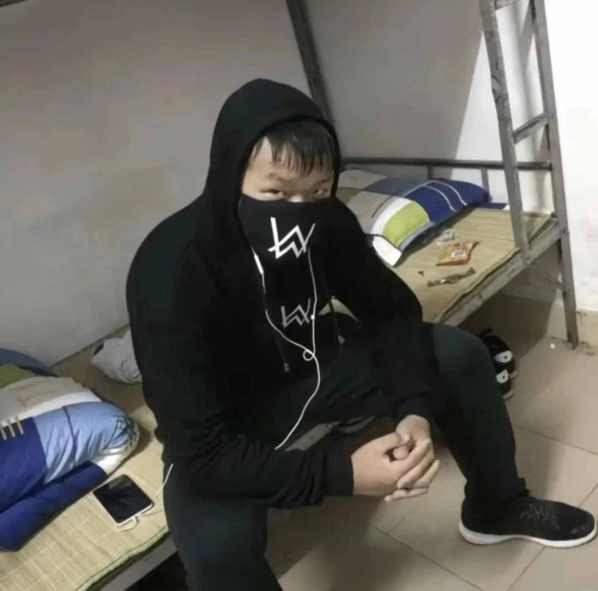
  </div>
  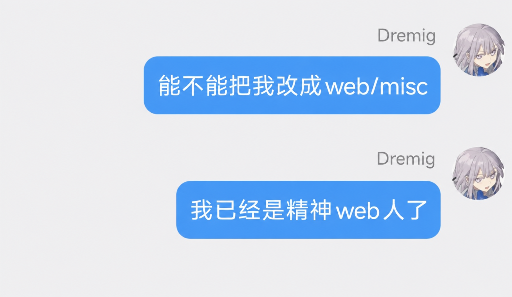
  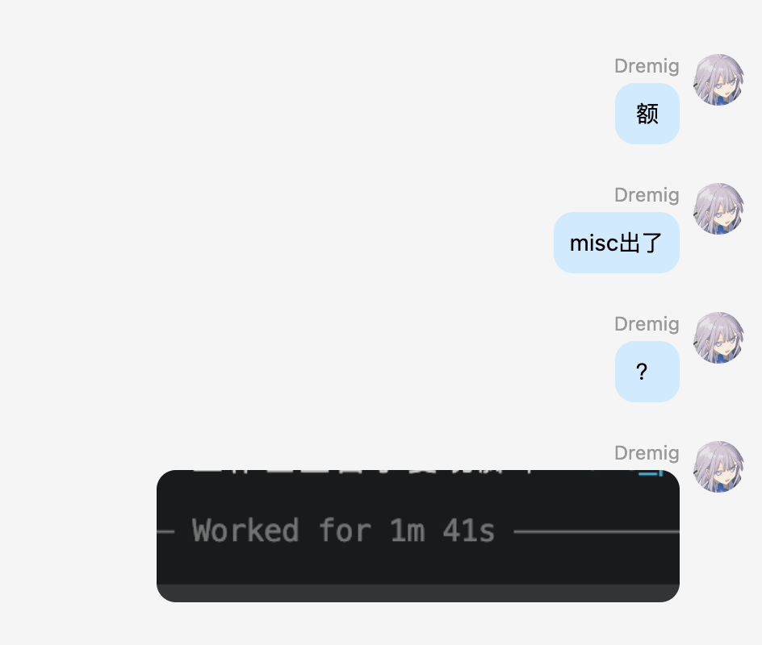
  <div class="fragment chaos-triptych" data-sfx="slap" style="--x: 300px; --y: 105px; --r: -3deg; --z: 8; --strip-w: 185px;">
    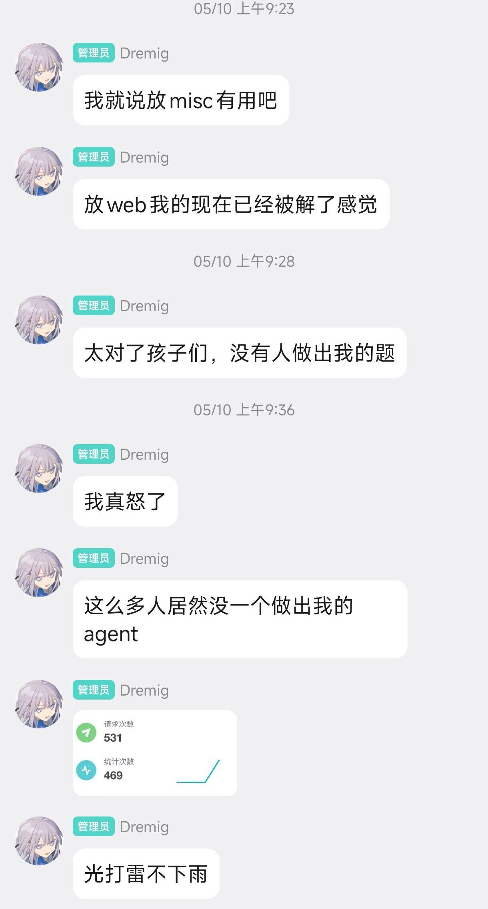
    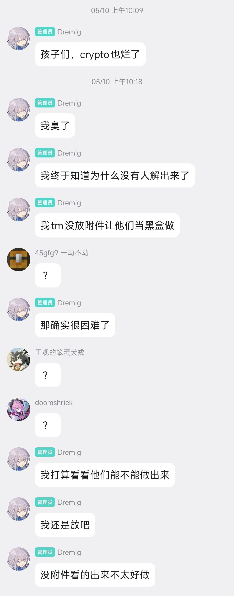
    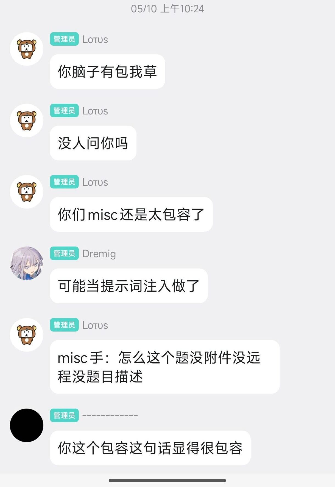
  </div>
</div>

<!-- v -->

- Miscellaneous 杂的，多种多样的
-  =  -  -  -  -  

<div class="fragment" style="margin-top: 40px">

<p style="margin-bottom: 30px;">一般来说misc包括：</p>

- ~~签到题、签退问卷题~~
- ~~套娃题、谜语题~~

</div>

<div class="fragment" style="margin-top: 35px">

- <span style="display: flex; justify-content: space-between;"><span><ruby>隐写<rp>（</rp><rt>Steganography</rt><rp>）</rp></ruby>、<ruby>取证<rp>（</rp><rt>forensics</rt><rp>）</rp></ruby>、<ruby>OSINT 信息搜集<rp>（</rp><rt>Open Source Intelligence</rt><rp>）</rp></ruby>、<ruby>PPC 编程类<rp>（</rp><rt>Professionally Program Coder</rt><rp>）</rp></ruby></span><span>——&hairsp;&hairsp;传统 misc 题&emsp;</span></span>
- <span style="display: flex; justify-content: space-between;"><span>工具运用类题目</span><span></span></span>
- <span style="display: flex; justify-content: space-between;"><span>编解码、古典密码、Crypto Tricks...</span><span>——&hairsp;&hairsp;不那么 crypto 的 crypto&emsp;</span></span>
- <span style="display: flex; justify-content: space-between;"><span>网络解谜、Web端代码审计、供应链安全...</span><span>——&hairsp;&hairsp;不那么 web 的 web&emsp;</span></span>
- <span style="display: flex; justify-content: space-between;"><span>沙箱逃逸、恶意软件分析...</span><span>——&hairsp;&hairsp;不那么 binary 的 binary&emsp;</span></span>
- <span style="display: flex; justify-content: space-between;"><span>游戏类、协议逆向、客户端安全...</span><span>——&hairsp;&hairsp;不那么 reverse 的 reverse&emsp;</span></span>
- <span style="display: flex; justify-content: space-between;"><span>Blockchain、IoT、AI...</span><span>——&hairsp;&hairsp;也可以算作是一个单独的领域的题目&emsp;</span></span>

</div>

<!-- v -->

## 一些misc题目的示例

- <a href="https://github.com/USTC-Hackergame/hackergame2023-writeups/blob/master/official/奶奶的睡前%20flag%20故事/README.md"><span style="display: flex; justify-content: space-between;"><span>hackergame2023: 奶奶的睡前 flag 故事</span><span>——&hairsp;&hairsp;图片隐写、信息搜集&emsp;</span></span></a>
- <a href="http://ctf.zjusec.net/games/7/challenges#354-Infected-Wires"><span style="display: flex; justify-content: space-between;"><span>BlackHat mea CTF 2025 Final: Infected Wires</span><span>——&hairsp;&hairsp;信息搜集、流量取证&emsp;</span></span></a>
- <a href="https://ctf.zjusec.net/games/6/challenges#288-%E5%88%AB%E7%AC%91%EF%BC%8C%E4%BD%A0%E6%9D%A5%E4%BD%A0%E4%B9%9F%E8%BF%87%E4%B8%8D%E4%BA%86%E7%AC%AC%E4%BA%8C%E5%85%B3"><span style="display: flex; justify-content: space-between;"><span>ZJUCTF 2025: 别笑，你来你也过不了第二关</span><span>——&hairsp;&hairsp;PPC、pysandbox沙箱逃逸&emsp;</span></span></a>
- <a href="https://ctf.zjusec.net/games/6/challenges#309-JGS"><span style="display: flex; justify-content: space-between;"><span>ZJUCTF 2025: JGS</span><span>——&hairsp;&hairsp;PPC、游戏类&emsp;</span></span></a>
- <a href="https://ctf.zjusec.net/games/6/challenges#278-ZJUWLAN-Insecure"><span style="display: flex; justify-content: space-between;"><span>ZJUCTF 2025: ZJUWLAN-Insecure</span><span>——&hairsp;&hairsp;not so reverse&emsp;</span></span></a>
- <a href="https://ctf.zjusec.net/games/7/challenges#359-%5BLec-1%5D-Warp-Finance"><span style="display: flex; justify-content: space-between;"><span>XCTF 2025 Final: Warp Finance </span><span>——&hairsp;&hairsp;智能合约审计&emsp;</span></span></a>
- <a href="https://ctf.zjusec.net/games/7/challenges#360-%5BLec-1%5D-perpetuals"><span style="display: flex; justify-content: space-between;"><span>强网杯 2025 Final: perpetuals</span><span>——&hairsp;&hairsp;公链安全、sonlana 0/1day&emsp;</span></span></a>
- <span style="display: flex; justify-content: space-between;"><span>Aliyun CTF 2026 Quals: Private PD</span><span>——&hairsp;&hairsp;信息搜集/嗅探、not so web&emsp;</span></span></a>
- <span style="display: flex; justify-content: space-between;"><span>Aliyun CTF 2026 Final: baby agent</span><span>——&hairsp;&hairsp;agent安全、信息搜集&emsp;</span></span></a>


<!-- v -->

## 如何学习 misc？

透过前面的那些例子你或许也可以看出来……？

- ~~需要提前了解很多东西~~ 需要勇于尝试学习新东西
    - 很多时候题目对于选手来说都是全新领域，需要快速入门/快速上手新工具
- 需要活跃的思维（说是脑洞也不为过），以及跟出题人对上脑电波的运气
    - 当然对上电波这件事情本身也对于技术栈的广度有一定要求
- 需要一定的编程能力
    - 至少熟练掌握 `Python` 或其他一门语言
      - 为什么推荐使用 `Python`：简洁、优雅而不失功能性
    - 防止用代码实现成为放宽思路的绊脚石

<div class="fragment" data-sfx="slap" style="position: absolute; inset: 0; z-index: 7; pointer-events: none;">
  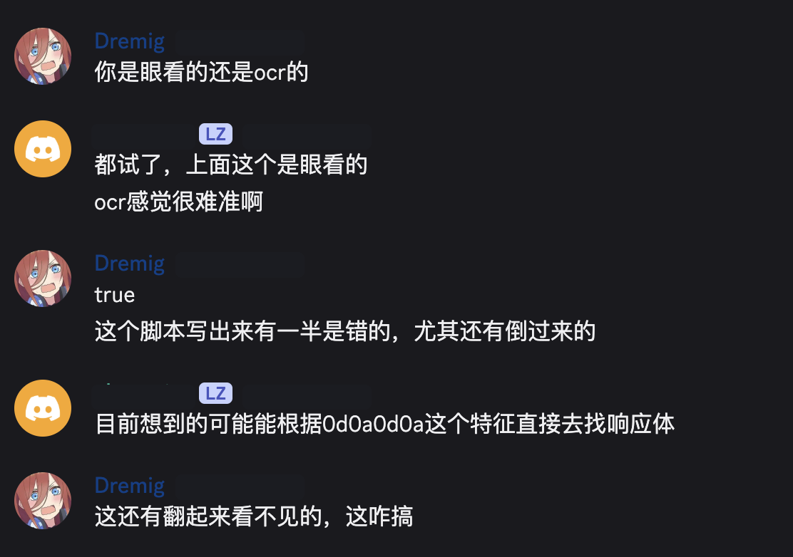
</div>

- 需要多做题多积累经验，尝试站在出题人的角度，自己出一些题
    - misc 题往往是在一些奇思妙想的尝试中孕育而生的
      - ~~当时`QQQRcode`是我们寝室夜谈时随便乱聊天聊出来的~~


<!-- s -->

<div class="middle center">
<div style="width: 100%">

# Part.2 Lab0题目review

</div>
</div>


<!-- v -->


<!-- s -->

<div class="middle center">
<div style="width: 100%">

# Part.3 编解码基础

</div>
</div>


<!-- v -->

## 编解码 / 加解密 / 哈希

明确：
- 一切信息在计算机看来都是 0 和 1
    - 编解码/加解密/哈希也都是在 01 串之间进行的变换
- 为什么你看见的输入输出是字符？
    - 计算机通过字符编码规则将 01 串转换为了可见字符

三种常见的 01 串转换方式：

<div style="text-align: center; margin-top: -20px;">
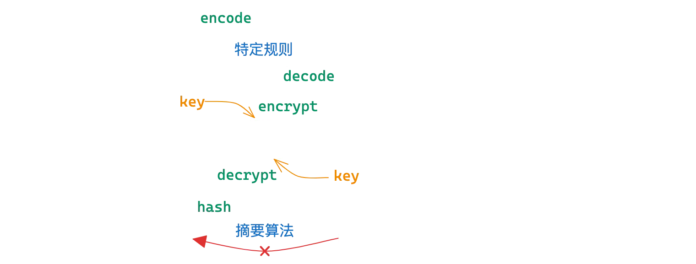
</div>

一个非常常用的编解码工具：[CyberChef](https://gchq.github.io/CyberChef/) /[（TonyCrane ver.）](https://lab.tonycrane.cc/CyberChef)

<!-- v -->

## 为什么乱码会出现？- 字符编码

- 字符编码：人类理解的字符 <=> 计算机理解的 01 串 之间的映射
- 为什么会出现乱码：用一种字符编码规则解读另一种字符编码的 01 串

常见的字符编码：

- <a href="https://www.asciim.cn/">ASCII</a>：一共 128 个项，即每个字符可以用一个 7 位的 01 串表示（或一字节）
    - 00-1F：控制字符；20-7E：可见字符；7F：控制字符（DEL）
- <a href="https://www.ecjson.com/article/152.html">Latin-1（ISO-8859-1）</a>：扩展了 ASCII，一共 256 个项
    - 80-9F：控制字符；A0-FF：可见字符
    - 特点：任何字节流都可以用其解码
- 利用 Unicode 字符集的一系列编码
    - UTF-8 / UTF-16 / UTF-32 / UCS
- 中国国标字符集系列编码
    - GB 2312 / GBK / GB 18030-2022

<!-- v -->

## Unicode 字符集与 UTF 编码

- 以平面划分，17 个平面，每个平面 $2^{16}$=65536 个码位（2 字节）
    - 通过码位可以表示为 U+0000 ~ U+10FFFF
    - 可容纳 111w+ 个字符，现有 14w+ 个字符（超过一半为 CJK 字符）
- UCS（Universal Character Set）：
    - UCS-2：直接用 2 字节表示码位；UCS-4：直接用 4 字节表示码位
- UTF（Unicode Transformation Format）：
    - UTF-8：变长编码（1~4），兼容 ASCII
        - **0**xxxxxxx
        - **110**xxxxx **10**xxxxxx
        - **1110**xxxx **10**xxxxxx **10**xxxxxx
        - **11110**xxx **10**xxxxxx **10**xxxxxx **10**xxxxxx
    - UTF-16：变长编码（2/4），不兼容 ASCII
- [翔哥的笔记](https://note.tonycrane.cc/cs/unicode/)

<!-- v -->

## 摩尔斯电码

<div class="morse-stage">
  <div class="fragment morse-image-exit" data-fragment-index="0">
    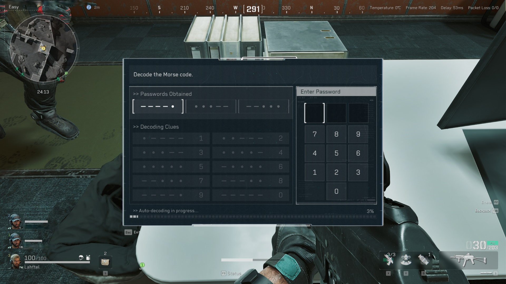
  </div>

  <div class="fragment morse-copy-enter" data-fragment-index="0">
    <p>前面说到的字符编码：01 串 &lt;=&gt; 字符；接下来看另一种：字符 &lt;=&gt; 字符</p>
    <ul>
      <li>摩尔斯电码（Morse Code）：利用点划（“滴”的时间长短）来表示字符
        <ul>
          <li>点 ·：1 单位；划 -：3 单位</li>
          <li>点划之间间隔：1 单位；字符之间间隔：3 单位；单词之间间隔：7 单位</li>
        </ul>
      </li>
      <li>字符集：A-Z、0-9、标点符号（.:,;?='/!-_&quot;()$&amp;@+）、<del>一些电码专用表示</del></li>
      <li>表示中文：电码表（一个汉字对应四个数字），数字使用短码发送</li>
    </ul>
    <div class="morse-chart">
      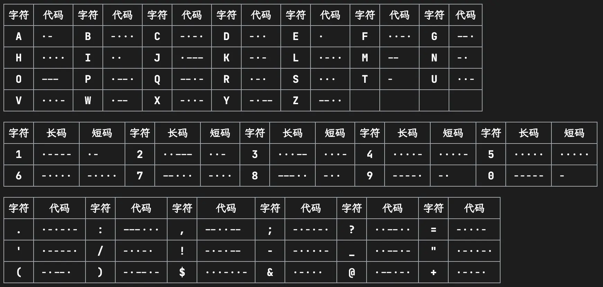
    </div>
  </div>
</div>

<!-- v -->

## Base系列

接下来是 01 串 <=> 01 串，但这里介绍的 `Base` 系列的结果都可以转为可见字符

- Base16：即 16 进制表示字节流，长度翻倍
- Base32：按照 5 bit 一组（每个 0-31），按照字符表（A-Z 2-7）映射
    - 结果长度必须是 5 的倍数，不足的用 = 不齐（明显特征）
- Base64：按照 6 bit 一组，按照字符表映射（最常用）
    - 标准字符表：A-Z a-z 0-9 +/
    - 另有多种常用字符表，如 URL 安全字符表：A-Za-z0-9-_
    - 结果长度必须是 4 的倍数，不足的用 = 不齐（1~2 个，明显特征）

<div style="text-align: center; margin-top: 30px;">
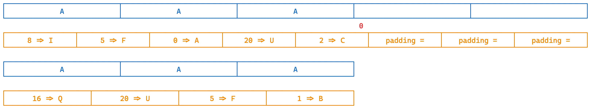
</div>

<!-- v -->

## Base 编码家族（续）

Base-n 系列的本质：字节流 -> 整数 -> n 进制 -> 系数查表

所以除去前面规则的 16/32/64 进制，还有一些其他的 Base 编码：

- 分组：
    - Base85：4 字节整数 -> 85 进制 -> 5 个系数
        - 常用字符表：0-9 A-Z a-z !#$%&()*+-;<=>?@^_`{|}~
        - 标准字符表：!-u（ASCII 编码中 0x21-0x75）
- 作为大整数转换进制：
    - Base62：0-9 A-Z a-z（比 Base64 少了 +/）
    - Base58：0-9 A-Z a-z 去除 0OIl
    - Base56：比 Base58 少了 1 和 o
    - Base36：0-9 A-Z（比 Base62 少了 a-z）


<!-- v -->

## ASCII85：一组字符如何还原？

字符表是连续的 `!` 到 `u`，所以一个字符就是一个 85 进制数位：

```text
digit(c) = ord(c) - ord('!')    # ! -> 0，" -> 1，…，u -> 84
```

每 5 个字符还原成一个 32 bit 大端整数，再写成 4 个字节：

```text
value = (((((d0) * 85 + d1) * 85 + d2) * 85 + d3) * 85 + d4)
bytes = value.to_bytes(4, "big")
```

例：`>"Vd^` → `[29, 1, 53, 67, 61]` → `0x5a4a5543` → `ZJUC`

<!-- v -->

## 把规则写成解码脚本

```python
def decode_ascii85(payload: str) -> bytes:
    out = bytearray()
    for i in range(0, len(payload), 5):
        value = 0
        for c in payload[i:i + 5]:
            value = value * 85 + ord(c) - ord('!')
        out += value.to_bytes(4, 'big')
    return bytes(out)
```

对 `transmission.log` 中的 `payload` 调用它，即可得到 flag。

> 这里刻意只处理完整的 5 字符分组；真实 ASCII85 还要处理尾块、`z` 和 `<~ ~>`。


<!-- v -->

## More?

- 其他常用编码
    - UUencode、XXencode
    - QR Code 二维码：[note.tonycrane.cc/ctf/misc/qrcode](https://note.tonycrane.cc/ctf/misc/qrcode/)
    - Bar Code 条形码
- 一些其他好玩的类编码
    - 北约音标字母 [Wikipedia](https://zh.wikipedia.org/zh/%E5%8C%97%E7%BA%A6%E9%9F%B3%E6%A0%87%E5%AD%97%E6%AF%8D)
    - 地点三词编码 What3Words：https://what3words.com/ 常用于osint
    - <del>[与熊论道](https://tieba.baidu.com/p/9600757754)——&hairsp;&hairsp;佛曰熊说编码加密&emsp;</del>
- 常用的工具
    - CyberChef：https://gchq.github.io/CyberChef/
    - Base 系列爆破：https://github.com/mufeedvh/basecrack/
    - DenCode：https://dencode.com/
    - Ciphey：https://github.com/Ciphey/Ciphey


<!-- s -->

<div class="middle center">
<div style="width: 100%">

# Part.4 流量取证

</div>
</div>


<!-- v -->

## 流量取证基础

- 网络流量（-> 回顾**就在前天的** web 基础）
    - 应用层（HTTP/FTP/...）-> 表示层 -> 会话层（SSL/TLS/...）
    - -> 传输层（TCP/UDP）-> 网络层（IP/ICMP/...）
    - -> 数据链路层 -> 物理层
- 最终传输的仍然是二进制数据
    - 捕获这些数据，就可以分析得到正在进行的通信内容
- 流量取证一般就是拿到这些数据包（cap、pcap、pcapng 格式）进行分析
    - 如有损坏的话修复数据包（少见，pcapfix 可以修复）
    - 分析、提取得到正在通信的内容（可能包含有效信息）
    - 分析一些特定的、不太常见的协议（比如一些自定义协议）
    - 分析、解密一些加密的协议（比如 VMess 等）

<!-- v -->

## 流量取证常用工具

- tcpdump 抓 TCP 包（Linux 命令行）
- 🌟 [Wireshark](https://www.wireshark.org/)：直接抓包，得到物理层的全部数据并解析（开源）
    - 自带命令行工具 tshark
- [termshark](https://github.com/gcla/termshark)：类似 Wireshark 的开源命令行工具
- [pyshark](https://github.com/KimiNewt/pyshark/)：tshark 的 Python 封装，可以用 Python 脚本分析
- [scapy](https://scapy.net/)：Python 库，也可以用来分析流量包


<!-- v -->

## Wireshark 基本用法

- 浏览主界面的所有数据包，大致了解都由什么协议组成
- 追踪流（追踪 TCP 流/追踪 HTTP 流）
    - 得到某次通信的全部数据包，并进行解析
    - 另存为，保存流数据
    - 可以转换不同的显示形式（ASCII、HEX、Raw）
- 文件 > 导出，提取某些数据包的流内容
- 统计部分
    - 协议层次：统计各层协议的数据包数量
    - 流量图：统计各个端口的流量，可视化显示
    - HTTP：分组计数、请求统计

<!-- v -->

## Wireshark 过滤器

- 过滤协议：直接输入 tcp/udp/http 等
- 过滤 ip：ip.addr == xx.xx.xx.xx 或 ip.src ip.dst
- 过滤端口：tcp.port == 80 或 tcp.srcport tcp.dstport
- 包长度过滤：frame.len ip.len tcp.len ...
- http 过滤
    - http.request.method == GET
    - http.request.uri == "/index.php"
    - http contains "flag"（相当于搜索功能）
- 直观感受一下
    - <a href="https://ctf.zjusec.net/games/7/challenges#358-%5BLec-1%5D-Baby-Wireshark">Welcome CTF 2025 - Baby Wireshark</a>

<!-- v -->

## HTTP 协议流量分析

- 分析统计信息
    - 查看所有的 HTTP 请求 URL
    - 分析 HTTP 往返的情况，流量整体信息
- 具体分析某些请求：利用过滤器
- 分析某一数据包具体内容
    - 跟踪流，跟踪 TCP 解析 TCP，跟踪 HTTP 可以自动解压 gzip 等
    - 分析请求头、响应头、请求体、响应体等
- 具体题目示例
    - <a href="https://ctf.zjusec.net/games/7/challenges#364-%5BLec-1%5D-Baby-Exfil">UofTCTF 2026 – Baby Exfil</a>


<!-- v -->

## UDP 协议流量分析

- UDP 协议是无连接的，不需要像 TCP 一样三次握手
- 和 TCP/HTTP 一样直接追踪分析就可以
- 常见的基于 UDP 的协议：DNS
- 仅演示：picoCTF 2021 - Wireshark twoo twoo two twoo...


<!-- v -->


## 其他协议

- ICMP 协议：ping
    - 某时也会带有一些信息，可以进行进一步分析
- OICQ 协议：QQ 使用，是加密的，但是可以看到双方 QQ 号等
- WIFI 协议（IEEE 802.11）
    - 可以使用 **Linux aircrack** 套件爆破密码
    - 有了密码后可以在 **Wireshark** 中设置并解密流量
- USB 协议
    - 安装了 USBcap 之后可以在 Wireshark 中捕获 USB 流量
    - 有工具可以解析流量，绘制鼠标轨迹，得到按键信息等
- 其他加密协议
    - VMess，需要读文档/源码，实现解密
    - 例题：[强网杯 2022 Quals 谍影重重](https://note.tonycrane.cc/writeups/qwb2022/)

<!-- s -->

<div class="middle center">
<div style="width: 100%">

# Part.5 misc 基础 Lab 简介


</div>
</div>

<!-- v -->


- 选做 Bonus，视完成程度加至多15分 Bonus 分数
- 该 Lab 的总分不会超过115分

- 编解码部分（40分）

    - Calculator — 20 分
    - Transcoded — 20 分
- 流量取证部分（60 分）

    - Slow Login — 20 分：SQL 注入相关流量取证
    - Live and Let Die — 20 分：综合流量取证
    - 怪しい名前解決 — 20 分：DNS 相关取证


<!-- v -->


- Bonus Challenge（最多获得15分）：Beat Dremig

    - 在本课程的所有作业截止提交的ddl之前，找到一道能难倒我的**misc**题
    - 这道题来源不限，可以是网络上的题目、魔改版的网络上的题目、或者你自己出的题目
    - 当然大部分题目难不倒我（至少难不倒我的 AI ），因此你也可以附带提交一个搜索报告（AI生成的也行），我会通过多个角度来打分（包括这道题我解出与否、花费的时间、你搜索所使用的trick与effort等）
    - 这道题必须可提交，或者你需要提交完整的解题步骤来证明这道题可解
    - 拒绝过于脑洞或者繁琐的题目😫
    - 如果你自己能够解出这道题但我不行的话，希望你能和我或者Lotus**聊聊**
    - 我可能使用的AI工具：

        - CodeX with GPT-5.6-sol max
        - or TraeX with opus-4.8
        - or grok-build with grok-4.5


<!-- s -->

## 一些学习的建议

+ 对于不懂的地方，采用以下策略来搞懂：
    - 优先查阅网上资料，并尝试与我所讲的内容进行拟合
    - 一些不那么直观的问题：询问大模型 —— GPT、Gemini、Claude、Grok 等
    - 循环重复以上过程，直到陷入瓶颈、困境
    - 大胆向我提问，不过拒绝聊天式的问问题，参考[提问的智慧](https://github.com/ryanhanwu/How-To-Ask-Questions-The-Smart-Way/blob/main/README-zh_CN.md)
    - 我也解决不了的问题，向我推荐的其他人提问
+ 对于"记录过程"(其实就是所谓的"写writeup")，我们推荐：
    + **是人写的**（这其实是要求）
    + 记录核心代码(如果有注释那最好，没有其实也没关系，但最好有对代码的解释)，if any
    + 记录关键步骤，比如哪条流量中找到了关键信息，同时记录二者，if any
    + 记录结果，以及提交 flag 成功的截图，if succeed
    + 在以上都尽量全面的前提下，尽量精简到让人一眼就看得到关键步骤


<!-- v -->

## 对 AI 的看法

+ AI 真的很强很强，能够将一个人的生产力提升至少 `5` 倍
+ 个人最常用的模型系列：GPT、Claude、GLM、Deepseek
+ 不管是任何系列，其sota模型都**完完全全**足够cover这节课，乃至这门课的任何内容（有时不那么sota的也足够，比如GPT 5.4、opus 4.6）

    + 所以用它做不出来，有可能是使用的方法存在一些问题
+ 一个选手要学会驾驭 AI，在结合 AI 完成这道题后，你必须也弄懂这道题

    + 不论是在网安，还是任何计算机领域，都应该是这样的


<!-- s -->

<br>
<br>
<br>

<center><h5 style="font-size: 55px; text-align: center;">Thank you for listening.</h5></center>

<br>

<strong><center><h5 style="font-size: 40px; text-align: center;">Questions?</h5></center></strong>

<br>

<center>
    <span>吴俊铭 @Dremig</span>
</center>

<br>

<strong><center>
    <span style="font-size: 25px;">What to contact with me?</span>
</center></strong>
<center>
    <span style="font-size: 22px;">QQ: 1466140007</span>
</center>

<center>
    <span style="font-size: 22px;">mail: dr3m19@icloud.com</span>
</center>
