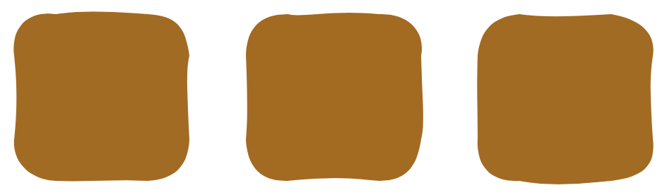
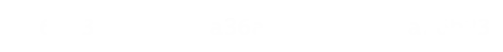
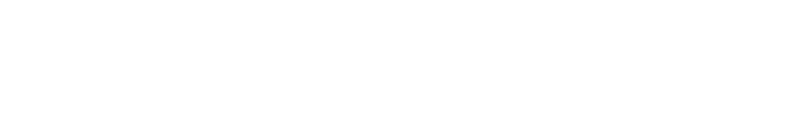
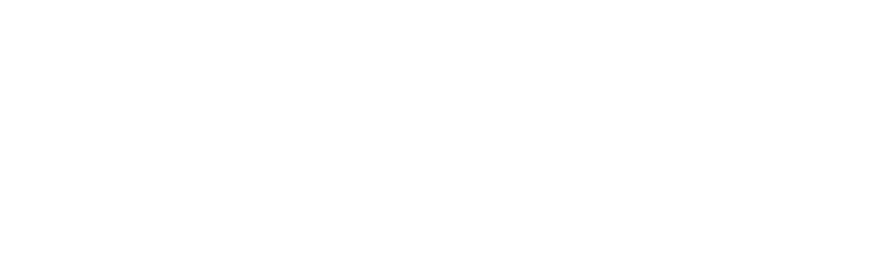
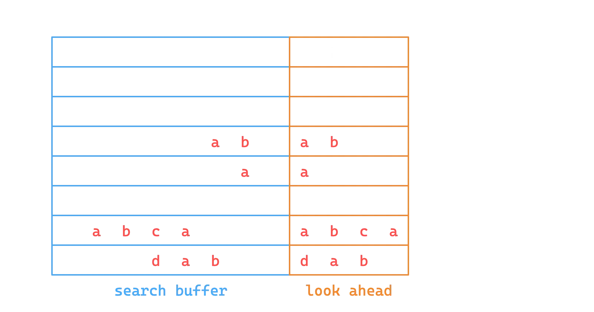
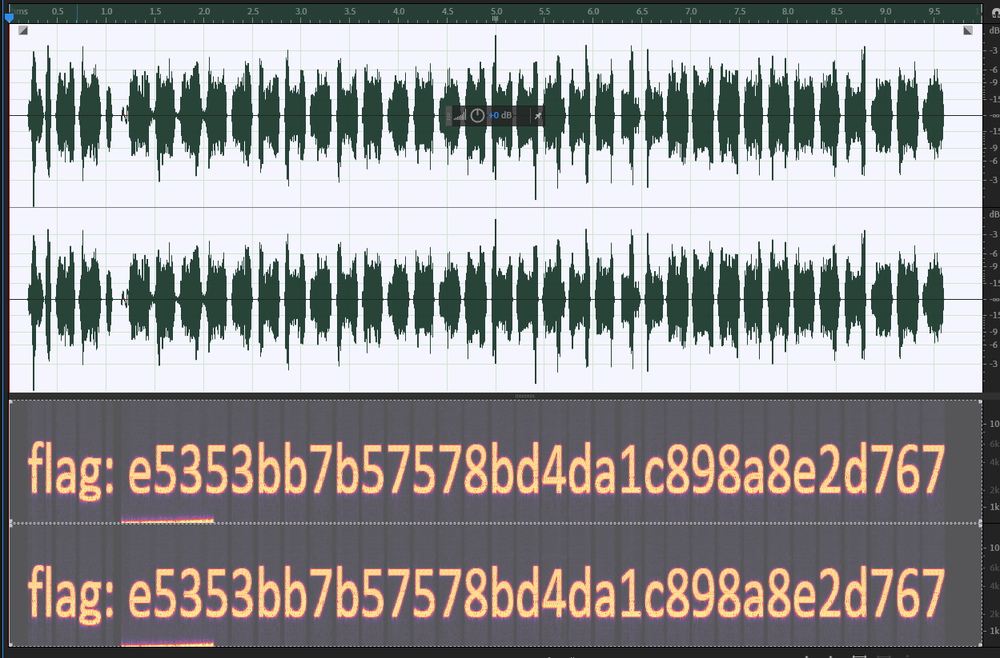
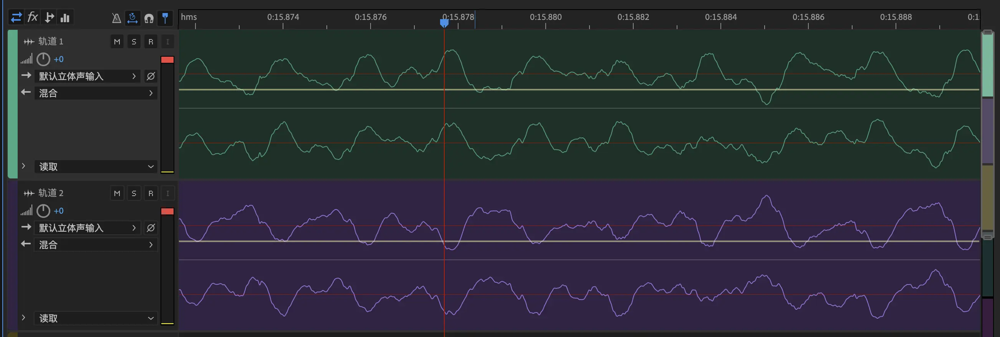

<!-- .slide: data-background="" -->

 
 
 

<h5 style="font-size: 55px; text-align: center;">misc 专题1：文件 / 图像隐写 / 一些其他</h5>

 
 

<h1 style="font-size: 30px; text-align: center;">2025.7.8</h1>

 

 

    <button class="button" onclick="toggleContent()" title = "Click to see more about me">
          
    </button>
    吴俊铭 @Dremig / Dr3m19

<!-- s -->

# Part.1 文件系统基础

<!-- v -->

## 文件是如何存储的

对于不同的文件系统，文件有不同的组织方式

+ **MS(Microsoft)** 派：FAT、NTFS、exFAT、ReFS
+ **Apple** 派：HFS、APFS
+ **Linux** 派：ext[234]、XFS、Btrfs、ZFS...

文件是一串**二进制数据**

+ 在 HDD 上是微小磁极的磁化方向
+ 在 SSD 上是电荷的存储状态

"文件名"由文件系统管理的，不是文件本身数据的一部分

+ 文件系统会记录文件名、文件大小、创建时间、修改时间等信息
+ 文件内容才是真正的数据

<!-- v -->

## 文件类型

如何判断文件的类型

+ 拓展名
    + .jpg .png .webp .txt .gif .docx ...
    + 其实也是文件名的一部分，允许随意的修改
    + 操作系统会根据文件扩展名，自动关联并调用一个预先设置好的应用程序来打开这个文件
+ 文件内容
    + Unix系统中的**file**命令
    + 不同文件类型有不同的<ruby>“魔数”<rp>（</rp><rt>magic number</rt><rp>）</rp></ruby>

<!-- v -->

## 文件类型检测与元信息

常见文件的 magic number：

| 文件类型 | 文件头 | 对应 ASCII |
| :---: | :--- | :--- |
| JPEG | FF D8 FF |  |
| PNG | 89 50 4E 47 0D 0A 1A 0A | .PNG.... |
| GIF | 47 49 46 38 39 61 | GIF89a |
| PDF | 25 50 44 46 | %PDF |
| ZIP | 50 4B 03 04 | PK.. |
| RAR | 52 61 72 21 | Rar! |
| 7zip | 37 7A BC AF 27 1C | 7z..'. |
| WAV | 52 49 46 46 | RIFF |

+ 可以使用 [exiftool](https://exiftool.org/) 读取部分类型文件的元信息

<!-- v -->

## 文件附加内容的识别与分离

+ 大部分文件类型都有一个标记文件内容结束的标志
    + 例如 .png 文件的 IEND 块、.jpeg 文件的 EOI 标志（FF D9）
+ 一般而言在文件末尾追加其他字节时，并不影响原文件本身的用途
    + 一些隐写是将数据隐藏到文件末尾得到的，最简单的：Lab0 misc challenge2
    + 也可以在文件后面再叠加一份文件
    + cat \<file you want to cover\> \<file you want to hide\> **\>** \<new file\>
+ 附加内容的识别
    + exiftool 一般可以识别图像文件后的附加数据
    + binwalk 可以检测叠加的文件
+ 附件文件的分离
    + binwalk 或 foremost 识别并分离
    + dd if=<src> of=<dst> bs=1 skip=<offset> 手动分离

<!-- s -->

# Part.2 图像隐写基础技术

<!-- v -->

## 文件内容基本隐写

+ 文件末尾添加数据
        + exiftool 识别短数据，或者十六进制编辑器直接观察
        + binwalk 识别叠加文件，foremost 提取
        + 图像末尾叠加一个压缩包，就是所谓的“图种”
            - 修改后缀名可能可以解压（部分解压软件会忽略前面的图像）
            - 其实不如直接分离
+ 直接利用元信息
        - exiftool 即可读取 

<!-- v -->

## 色彩空间、色彩模式

色彩空间（sRGB、Adobe RGB、Display P3 等）是一个相对非常复杂的概念，而且是针对显示的，我们不详细介绍

我们注重于表示颜色的数据上，一般称为色彩模式（color mode）：

- 二值图像（bitonal）：每个像素只有两种颜色，如黑白
- 灰度图像（grayscale）：每个像素有多种灰度，如 256 级灰度
- RGB(A)：3(+1) 通道，表示 RGB 三种颜色，A 表示透明度通道
- CMYK：青 cyan、品红 magenta、黄 yellow、黑 black 四种颜色混合
- HSV：色调 hue、饱和度 saturation、明度 value
- HSL：色调 hue、饱和度 saturation、亮度 lightness
- YCbCr：亮度 luminance、蓝色色度 blue chroma、红色色度 red chroma
- LAB：亮度 lightness、绿红色度 A、蓝黄色度 B
- ...

<!-- v -->

## LSB 隐写

- 人眼对于微小的颜色变化不敏感
    - 对于 8 bit 的颜色值，最低位的变化不会被察觉
    - 可以随意修改最低位，而不影响图像的显示效果
- LSB 隐写将颜色通道的最低位用来编码信息
    - 图像：stegsolve / CyberChef View Bit Plane
    - 数据：stegsolve / CyberChef Extract LSB / zsteg / PIL

<!-- v -->

## PIL 图像处理基础

PIL（Python Imaging Library）是 Python 中非常常用的图像处理库

- 安装：pip3 install pillow 或 apt install python3-pil
- 官方文档/教程：https://pillow.readthedocs.io/en/stable/
    - 除此之外想要灵活使用可能还需要一点 numpy 的基础
- 基本用法
    - from PIL import Image 导入和图像读写处理有关的 Image 类
    - img = Image.open(file_name) 打开图像
    - img.show() 显示图像；img.save(file_name) 保存图像
    - img.size 图像大小，img.mode 图像模式
    - img.convert(mode) 转换图像模式
    - img.getpixel((x, y)) 获取像素点颜色
    - img.putpixel((x, y), color) 设置像素点颜色
    - np.array(img) 将图像转换为 numpy 数组

<!-- v -->

## PIL 图像处理基础（续）

- 具体图像模式以及转换
    - '1'：黑白二值（0/255）；'L'：灰度（8 bit），'l'：32 bit 灰度
        - L = 0.299 R + 0.587 G + 0.114 B
    - 'P'：8bit 调色盘，获取的像素值是调色盘索引
    - 'RGB'、'RGBA'
    - 'CMYK'：转换时有色差，CMY = 255 - RGB，K = 0
    - 'YCbCr'、'LAB'、'HSV' 等，转换时有复杂公式（可能出现新的隐写）
- PIL 其他模块用途
    - ImageDraw 用于绘制图像、绘制图形
    - ImageChops 用于图像通道的逻辑运算
    - ImageOps 用于图像整体的运算一类
    - ImageFilter 用于图像的滤波处理

<!-- s -->

# Part.3 图像基本格式介绍

<!-- v -->

## 图像文件需要存储什么？

- 图像信息：宽高、色彩模式、色彩空间等
    - EXIF 信息：拍摄设备、拍摄时间、GPS 信息等
- 像素数据：每个像素的颜色信息；二值、灰度、RGB、CMYK、调色盘等
    - 对于标准 RGB 图像，每个像素需要 24 bits
    - 对于一张 1080p 图像，需要 6.22 MB，4K 则需要 24.88 MB
    - BMP 格式
- 图像格式的压缩算法？
    - PNG 无损，JPEG 有损
    - GIF 有损且只支持 256 色
    - 新兴格式如 HEIF、WebP、AVIF 等

<!-- v -->

## JPEG 文件格式

JPEG 使用分段的结构来进行存储，各段以 0xFF 开头，后接一个字节表示类型：

- FFD8（SOI）：文件开始
- FFE0（APP0）：应用程序数据段，包含文件格式信息（上图没有）
- FFE1（APP1）：应用程序数据段，包含 EXIF 信息（上图没有）
- FFDB（DQT）：量化表数据
- FFC0（SOF）：帧数据，包含图像宽高、色彩模式等信息
- FFC4（DHT）：huffman 表数据
- FFDA（SOS）：扫描数据，包含数据的扫描方式，huffman 表的使用方式等
- FFD9（EOI）：文件结束

<!-- v -->

## *JPEG 压缩原理

- JPEG 的压缩原理是 DCT（离散余弦变换）+ Huffman 编码
    - 由 RGB 转换到 YCbCr，然后减少 Cb、Cr 的采样率
    - 将图像分块，每个块 8x8，进行 DCT 变换
        - 将图像转换为频域，便于压缩高频部分
    - 量化，将 DCT 变换后的系数除以量化表中的系数
        - 再次减少高频部分的数据
        - 根据不同的量化表，可以调整压缩质量
    - 通过游程编码和 huffman 编码进行压缩

<!-- v -->

## PNG 文件格式

- 文件头 89 50 4E 47 0D 0A 1A 0A | .PNG....
- 采用分块的方式存储数据
    - 每块的结构都是 4 字节长度 + 4 字节类型 + 数据 + 4 字节 CRC 校验
    - 四个标准数据块：IHDR、PLTE、IDAT、IEND
    - 其他辅助数据块：eXIf、tEXt、zTXt、tIME、gAMA……
        - eXIf 元信息，tIME 修改时间，tEXt 文本，zTXt 压缩文本

<!-- v -->

## PNG 文件格式

四种标准数据块：

- IHDR：包含图像基本信息，必须位于开头
    - 4 字节宽度 + 4 字节高度
    - 1 字节位深度：1、2、4、8、16
    - 1 字节颜色类型：0 灰度，2 RGB，3 索引，4 灰度透明，6 RGB透明
    - 1 字节压缩方式，1 字节滤波方式，均固定为 0
    - 1 字节扫描方式：0 非隔行扫描，1 Adam7 隔行扫描
- PLTE：调色板，只对索引颜色类型有用
- IDAT：图像数据，可以有多个，每个数据块最大 231-1 字节
- IEND：文件结束标志，必须位于最后，内容固定
    - PNG 标准不允许 IEND 之后有数据块

<!-- v -->

## *PNG 压缩原理

- PNG 使用 Deflate 压缩算法
    - 是 LZ77 结合 huffman 编码的一种压缩算法
    - LZ77：利用滑动窗口，找到最长的重复字符串，用指针和长度表示

- 会进行滤波，减少数据的冗余性，提高压缩率
    - 五种滤波器：None、Sub、Up、Average、Paeth

<!-- v -->

## 参考阅读

- [前年的 misc 专题一讲义](https://slides.tonycrane.cc/CTF101-2023-misc/lec2/)
- JPEG
    - [The Unreasonable Effectiveness of JPEG: A Signal Processing Approach](https://youtu.be/0me3guauqOU)
        - Reducible 频道的视频，B 站搬运：[BV1iv4y1N7sq](https://b23.tv/BV1iv4y1N7sq)
    - [ISO/IEC 10918-1:1994](https://www.iso.org/standard/18902.html?browse=tc) official standard
    - [JPEG压缩原理与DCT离散余弦变换](https://blog.csdn.net/newchenxf/article/details/51719597)
    - [Understanding and Decoding a JPEG Image using Python](https://yasoob.me/posts/understanding-and-writing-jpeg-decoder-in-python/)
    - libjpeg 源码 [GitHub:thorfdbg/libjpeg](https://github.com/thorfdbg/libjpeg)
- PNG
    - [How PNG Works: Compromising Speed for Quality](https://youtu.be/EFUYNoFRHQI)
        - Reducible 频道的视频，B 站搬运：[BV1wY4y1P7o7](https://b23.tv/BV1wY4y1P7o7)
    - [PNG Specification (Third Edition)](https://www.w3.org/TR/png-3/)

<!-- s -->

# Part.4 图像隐写进阶

<!-- v -->

## 图像大小隐写

+ PNG 图像按行进行像素数据的压缩，以及存储 / 读取
+ 当解码时已经达到了 IHDR 中规定的大小就会结束
+ 因此题目可能会故意修改 IHDR 中的高度数据，使之显示不全
+ 恢复的话更改高度即可，同时注意 crc 校验码，否则可能报错
    + binascii.crc32(data)，data 为从 IHDR 开始的数据
    </img>

<!-- v -->

## 需要原图的图像隐写

有些情况下的图像隐写需要原图才能解密，这时第一步一般是 OSINT 搜索原图

- 使用识图工具进行搜索
- 一般需要搜原图的题题目描述会带有来源暗示之类的
- 多注意搜到的图像大小、质量，确保是真正的原图

接下来利用原图和隐写图像的差异进行分析

- 图像像素异或观察差异
    - PIL 手动处理/ ImageChops.difference
    - stegsolve image combiner
- 盲水印系列
    - 给了打水印的代码的话直接尝试根据代码逆推即可
    - 没有给代码的可能就是常见的现有盲水印工具
        - [guofei9987/blind_watermark](https://github.com/guofei9987/blind_watermark)

<!-- v -->

## 更多图像文件内容隐写手段

还有更多基于文件内容的隐写方式我们就不展开讲了，这里介绍一些可能的：

- 人为隐写
    - JPEG 中 DCT 系数可以进行 LSB 隐写
    - JPEG 中 DHT 定义的 huffman 表可能有冗余项，可以隐写
    - PNG 中附加多余 IDAT 数据块的隐写（显示时被忽略）
    - PNG 中使用调色盘时可以进行调色盘隐写（EZStego 隐写）
        - 本次 lab 中也有一道这样的题目，需要大家自行研究一下 EZStego
- 较成熟的工具隐写
    - steghide、stegoveritas、SilentEye 等
    - 一般找到了类似密码一类的大概率是工具题

<!-- s -->

# Part.5 音频隐写

<!-- v -->

## 音频文件格式简介

- mp3：有损压缩
    - 具体格式不多介绍，遇到了基本上也就是声音本身的隐写
- wav：无损无压缩（waveform）
    - 直接存储的是音频的波形数据，可操作性更高
    - 文件结构也是分 chunk 的，有 RIFF、fmt、data 等
    - 编码音频数据的 sample 也可以进行 LSB 隐写
- flac：无损压缩，如果出现可能考虑转换为 wav
- 使用 Python 的 soundfile / librosa 库进行音频处理

<!-- v -->

## 频谱隐写

接下来的一些隐写方式都不依赖于无损格式，只要能听就能尝试

一般使用 Adobe Audition 打开来进行进一步的分析

- 频谱隐写是观察音频的频谱图，可能会有部分信息经过了调整
    - 视图 > 显示频谱
    - 比如如下攻防世界的一道题目 Hear with your eyes

<!-- v -->

## 音频叠加

- 如果可以找到原音频，或提供了原音频，可以进行比较
- 方法是在 Audition 中创建多轨会话
    - 将两个音频拖入两个轨道
    - 效果 > 匹配响度，将两条音轨的响度匹配
    - 点进其中一条音轨，效果 > 反相，将波形上下颠倒
    - 两条音轨匹配上波形之后播放 / 混音，就能听到差异了

<!-- v -->

## 其他一些有关音频隐写的题目

+ Hackergame 2023: [虫](https://github.com/USTC-Hackergame/hackergame2023-writeups/blob/master/official/虫/README.md): SSTV
+ ZJUCTF 2022: [Intonation!!!](https://zjusec.com/challenges/159)
+ SJTUCTF 2025: <del>忘了哪题了</del>：总之是用频谱图恢复音频
+ ...
+ 近年来，各大赛中，其实音频隐写出现的相对较少(不论是单独出题还是作为某一关)
+ <del>但是技多不压身</del>

<!-- s -->

# Part.6 一些其他的 misc 类型题目

<!-- v -->

## zip伪加密

+ ZIP 也使用分段的方式存储数据
    + 本地文件记录 50 4B 03 04，可以有多个
    + 中央目录记录 50 4B 01 02，可以有多个
    + 中央目录结束 50 4B 05 06
+ 在中央目录记录中有一个字段记录加密方式
    + 如果不为 0 表示有加密
+ 其他字段，如最小版本
    + 可能修改为一个不合法的值，无法用解压软件解压

<!-- v -->

## 沙箱逃逸

+ 沙箱：做了某些限制的隔离环境
    + 例如 Docker，或一个沙箱程序，如 rbash
    + rbash逃逸演示
+ Python 解释器也可以作为一个沙箱
    + 通过限制模块、限制函数、代码审计等方式
    + Python 的 os 及 importlib 模块是常见的逃逸点
+ 沙箱逃逸就是在沙箱中执行代码，获取到沙箱外的权限

<!-- v -->
    
## 编程类(PPC)

不太常见

+ 限制代码长度 / 汇编指令，要求实现某个功能
    + ZJUCTF 2024: Master of C++
+ [Quine](https://zhuanlan.zhihu.com/p/719614247)
    + ZJUCTF 2022: Self SHA

<!-- s -->

# misc 专题一 Lab 简介

<!-- v -->

还在想555

<!-- s -->

 
 
 

<h5 style="font-size: 55px; text-align: center;">谢谢大家~ 辛苦啦!</h5>

 

<strong>
<h5 style="font-size: 40px; text-align: center;">Questions?</h5>
</strong>

 

    吴俊铭 @Dremig / Dr3m19

 

<strong>

    What to contact with me?

</strong>

    QQ: 1466140007

    mail: wjm1s@zju.edu.cn

