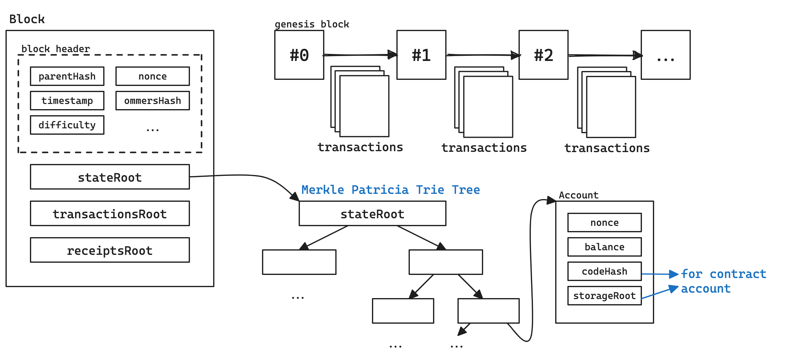
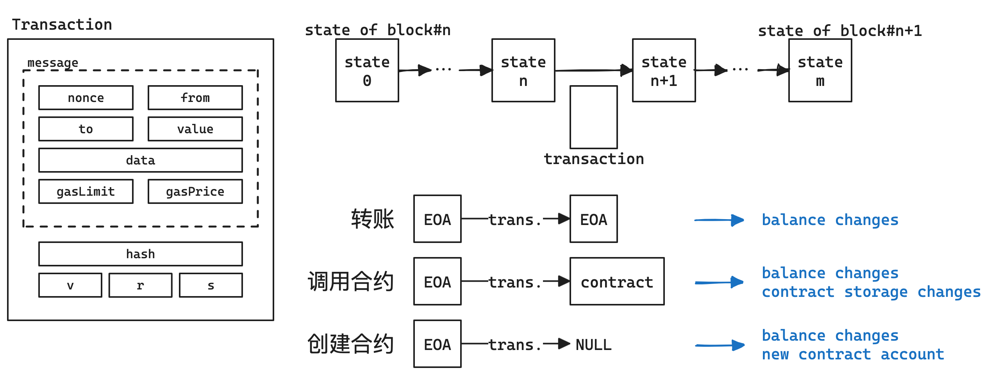

<!-- .slide: data-background="misc-lec3/cover.png" -->

<!--s-->
<!-- .slide: data-background="misc-lec3/background.png" -->

<div class="middle center">
<div style="width: 100%">

# Part.1 流量取证

</div>
</div>

<!--v-->
<!-- .slide: data-background="misc-lec3/background.png" -->

## 流量取证基础

- 网络流量（-> 回顾 web 专题一）
    - 应用层（HTTP/FTP/...）-> 表示层 -> 会话层（SSL/TLS/...）
    - -> 传输层（TCP/UDP）-> 网络层（IP/ICMP/...）
    - -> 数据链路层 -> 物理层
- 最终传输的仍然是我们一直在讲的二进制数据
    - 捕获这些数据，就可以分析得到正在进行的通信内容
- 流量取证一般就是拿到这些数据包（cap、pcap、pcapng 格式）进行分析
    - 如有损坏的话修复数据包（少见，pcapfix 可以修复）
    - 分析、提取得到正在通信的内容（可能包含有效信息）
    - 分析一些特定的、不太常见的协议（比如一些自定义协议）
    - 分析、解密一些加密的协议（比如 VMess 等）

<!--v-->
<!-- .slide: data-background="misc-lec3/background.png" -->

## 流量取证常用工具

- tcpdump 抓 TCP 包（Linux 命令行）
- 🌟 [Wireshark](https://www.wireshark.org/)：直接抓包，得到物理层的全部数据并解析（开源）
    - 自带命令行工具 tshark
- [termshark](https://github.com/gcla/termshark)：类似 Wireshark 的开源命令行工具
- [pyshark](https://github.com/KimiNewt/pyshark/)：tshark 的 Python 封装，可以用 Python 脚本分析
- [scapy](https://scapy.net/)：Python 库，也可以用来分析流量包


<!--v-->
<!-- .slide: data-background="misc-lec3/background.png" -->

## Wireshark 基本用法

- 浏览主界面的所有数据包，大致了解都由什么协议组成
- 追踪流（追踪 TCP 流/追踪 HTTP 流）
    - 得到某次通信的全部数据包，并进行解析
    - 另存为，保存流数据
    - 可以转换不同的显示形式（ASCII、HEX、Raw）
- 文件 > 导出，提取某些数据包的流内容
- 统计部分
    - 协议层次：统计各层协议的数据包数量
    - 流量图：统计各个端口的流量，可视化显示
    - HTTP：分组计数、请求统计

<!--v-->
<!-- .slide: data-background="misc-lec3/background.png" -->

## Wireshark 过滤器

- 过滤协议：直接输入 tcp/udp/http 等
- 过滤 ip：ip.addr == xx.xx.xx.xx 或 ip.src ip.dst
- 过滤端口：tcp.port == 80 或 tcp.srcport tcp.dstport
- 包长度过滤：frame.len ip.len tcp.len ……
- http 过滤
    - http.request.method == GET
    - http.request.uri == "/index.php"
    - http contains "flag"（相当于搜索功能）

<!--v-->
<!-- .slide: data-background="misc-lec3/background.png" -->

## HTTP 协议流量分析

- 分析统计信息
    - 查看所有的 HTTP 请求 URI
    - 分析 HTTP 往返的情况，流量整体信息
- 具体分析某些请求：利用过滤器
- 分析某一数据包具体内容
    - 跟踪流，跟踪 TCP 解析 TCP，跟踪 HTTP 可以自动解压 gzip 等
    - 分析请求头、响应头、请求体、响应体等
- 具体题目示例
    - 本次 lab 中的题目：SQL 盲注流量分析

<!--v-->
<!-- .slide: data-background="misc-lec3/background.png" -->

## UDP 协议

- UDP 协议是无连接的，不需要像 TCP 一样三次握手
- 和 TCP/HTTP 一样直接追踪分析就可以
- 常见的基于 UDP 的协议：DNS
- 具体题目示例
    - 本次 lab 中的题目：dnscap
    - MRCTF 2022：Bleach!
        - 基于 UDP 的 RTP 协议，需要手动选择进行解析
        - RTP 是一种音视频传输协议，可以得到音频流
        - wav 音频流中 LSB 包含隐写图片

<!--v-->
<!-- .slide: data-background="misc-lec3/background.png" -->

## 其他协议

- ICMP 协议：ping
    - 某时也会带有一些信息，可以进行进一步分析
- OICQ 协议：QQ 使用，是加密的，但是可以看到双方 QQ 号等
- WIFI 协议（IEEE 802.11）
    - 可以使用 Linux aircrack 套件爆破密码
    - 有了密码后可以在 Wireshark 中设置并解密流量
- USB 协议
    - 安装了 USBcap 之后可以在 Wireshark 中捕获 USB 流量
    - 有工具可以解析流量，绘制鼠标轨迹，得到按键信息等
- 其他加密协议
    - VMess，需要读文档/源码，实现解密
    - 例题：强网杯 2022 Quals 谍影重重

<!--s-->
<!-- .slide: data-background="misc-lec3/background.png" -->

<div class="middle center">
<div style="width: 100%">

# Part.2 以太坊区块链基础

</div>
</div>

<!--v-->
<!-- .slide: data-background="misc-lec3/background.png" -->

## 以太坊模型全览 - 区块与世界状态

<div style="text-align: center; margin-top: 15px;">

</div>

- 每个区块包含三颗 Merkle 树根节点
    - stateRoot 即世界状态树根节点，状态是一组用户状态的组合
- 区块由“矿工”或“验证者”将交易打包形成，后广播到网络中
    - 每条交易会引发世界状态的转变，消耗一定 gas

<!--v-->
<!-- .slide: data-background="misc-lec3/background.png" -->

## 以太坊模型全览 - 交易与世界状态转变

<div style="text-align: center; margin-top: 15px;">

</div>

- 每一条交易都会引起状态的改变
- 多个交易打包到一起，最终状态就是新区块存储的状态
- 交易信息中包含 hash/v/r/s 为交易签名，用于验证交易的合法性
- 合约在 EVM 上执行，执行过程中也有各种漏洞

<!--v-->
<!-- .slide: data-background="misc-lec3/background.png" -->

## 账户

- 外部账户（Externally Owned Account）
    - 有一对公私钥，用于签署交易
        - 私钥是随机生成的 256 位数（32 字节）
        - 公钥由私钥经过 ECDSA 算法计算而来，是一个 64 字节的数
        - 地址由公钥经过 Keccak-256 哈希后取前 20 字节得到
- 合约账户（Contract Account）
    - 由 EOA 通过交易创建的账户，其中包含合约代码
    - 合约可以存储、拥有以太币
    - 向合约账户发送交易 -> 调用合约中的函数
    - 合约本身不能主动发起交易，但可以在被调用时向外发送交易

<!--v-->
<!-- .slide: data-background="misc-lec3/background.png" -->

## 交易

- 一条交易包含以下内容：
    - from：交易发送者地址
    - to：交易接收者地址，如果为空则表示是在创建智能合约
    - value：交易金额，即发送方要给接收方转移的以太币数量（wei 为单位）
    - data：交易数据，如果是创建智能合约则是智能合约代码，如果是调用智能合约则是调用的函数名和参数
    - gasPrice：交易的 gas 价格，即每单位 gas 的价格（wei 为单位）
    - gasLimit：交易的 gas 上限，即交易允许执行的最大 gas 数量
    - nonce：交易的序号，即发送者已经发送的交易数量
- 除此之外发送的交易数据包还需要包含：
    - hash：交易的哈希值，由前面的内容和 chainId 计算得到
    - v、r、s：交易签名的三个部分，由发送者私钥对交易哈希值进行签名得到

以太币单位：https://converter.murkin.me/

<!--v-->
<!-- .slide: data-background="misc-lec3/background.png" -->

## 关于链与 faucet

- 公开链：真实的交易
    - 通过 https://etherscan.io/ 查看
    - 主网（mainnet）：真正的金钱交易，很少使用
    - 测试链：Sepolia / Holesky 链，可以通过 faucet 获取免费代币
        - https://sepolia-faucet.pk910.de/
        - Ethernaut 等大型公开合约 CTF 平台会使用
- 私链：自己搭建的链，模拟真实的链
    - 一般 CTF 题目都使用私链部署
    - 可以通过 geth 等工具部署私链

<!--v-->
<!-- .slide: data-background="misc-lec3/background.png" -->

## more

- https://note.tonycrane.cc/ctf/blockchain/eth/basic/
- https://slides.tonycrane.cc/data-sec-pre/
- https://ethereum.org/en/developers/docs/

<!--s-->
<!-- .slide: data-background="misc-lec3/background.png" -->

<div class="middle center">
<div style="width: 100%">

# Part.3 智能合约安全基础

</div>
</div>

<!--v-->
<!-- .slide: data-background="misc-lec3/background.png" -->

## 关于合约

- 合约的创建和调用都通过交易来进行
- 合约调用：
    - data 字段为编码后的函数名（selector）和参数，称为 calldata
    - selector 是函数签名 keccak256 的前四个字节
    - 不存在对应 selector 则会调用 fallback 函数，还不存在则 revert
- 合约存储：全公开存储，都在链上，可以 getStorageAt 查看
- revert：回滚，所有当前调用中的状态改变全都复原
- 合约编译后得到字节码在 EVM 上运行：
    - https://ethervm.io/

<!--v-->
<!-- .slide: data-background="misc-lec3/background.png" -->

## Solidity 语言

https://note.tonycrane.cc/ctf/blockchain/eth/solidity/

- 以太坊官方的编写智能合约的语言
- IDE：https://remix.ethereum.org/
- 通过 contract 关键字声明一个合约
- 通过 function 定义一个可以调用的函数
    - public、internal、external、private
    - 属性（状态）会自动创建 getter 函数
    - 通过 view、pure 关键字定义一个不改变状态的函数
- 通过 payable 关键字定义一个可以接收以太币的函数
- 特殊函数：constructor、fallback、receive

<!--v-->
<!-- .slide: data-background="misc-lec3/background.png" -->

## 常见漏洞示例 - 整型溢出

[Ethernaut](https://ethernaut.openzeppelin.com/) 题目 Token：

```javascript
mapping(address => uint256) balances;
function transfer(address _to, uint256 _value) public returns (bool) {
    require(balances[msg.sender] - _value >= 0);
    balances[msg.sender] -= _value;
    balances[_to] += _value;
    return true;
}
```

- balances 字典是 uint256，无符号减法有溢出风险
- 给任意地址转账，原余额 20 Token，转 21 个，则 balances 会变的巨大
- 通过事先检查或者使用 SafeMath 库可以避免
- 新版本 solidity 自动开启了溢出检查

<!--v-->
<!-- .slide: data-background="misc-lec3/background.png" -->

## 常见漏洞示例 - 重入攻击

[Ethernaut](https://ethernaut.openzeppelin.com/) 题目 Re-entrancy，很经典的智能合约漏洞，例如如下合约：

```javascript
contract Bank {
    mapping(address => uint256) balances;
    ...
    function withdraw(uint256 amount) public {
        require(balances[msg.sender] >= amount);
        msg.sender.call.value(amount)("");
        balances[msg.sender] -= amount;
    }
}
```

- withdraw 时先转钱再更新 balances
- 赚钱的时候会进入到目标合约的 fallback 函数，可以再次调用 withdraw
- 再次调用时 require 检查的仍然是老的 balances
- 这样可以把钱取空

<!--v-->
<!-- .slide: data-background="misc-lec3/background.png" -->

## 常见漏洞示例 - 伪随机数

- 区块链需要所有以太坊节点验证交易计算出相同结果达成共识
- 无法实现真随机数
- 伪随机可以破解：
    - 利用区块变量作为随机数：可以获取
    - 利用 blockhash 作为随机数：只保留最近 256 个区块
    - 回滚攻击：不断 revert 来猜随机数

[Ethernaut](https://ethernaut.openzeppelin.com/) 题目 Coin Flip，留作作业。

- 其他常见漏洞：https://note.tonycrane.cc/ctf/blockchain/eth/vuln/

<!--v-->
<!-- .slide: data-background="misc-lec3/background.png" -->

## CTF 比赛中的私链题目交互

- 一般会过滤掉大部分 geth rpc 接口
    - 防止其他队伍扒链蹭车/重放
    - 白名单示例可见 [chainflag/solidctf](https://github.com/chainflag/solidctf/blob/main/fogeth/proxy/eth-jsonrpc-access.js) 中的白名单，一般就是这些
    - geth 手动操作很复杂（只能发 raw），remix 无法连接
- 通过 [web3.py](https://pypi.org/project/web3/) 进行交互
    - 通过 eth.contract 和 abi 与 addr/bytecode 创建合约对象
    - 通过 contract.functions.f().build_transaction() 构建交易
    - 通过 eth.account.sign_transaction(txn, privateKey) 签名
    - 得到 rawTransaction 后 eth.send_raw_transaction(raw) 发送
    - 通过 eth.wait_for_transaction_receipt(hash) 等待交易完成
    - 无需交易的 view 函数可以直接 contract.functions.f().call()

https://note.tonycrane.cc/ctf/blockchain/eth/basic/#_15

<!--v-->
<!-- .slide: data-background="misc-lec3/background.png" -->

## more

Read more: [note.tonycrane.cc/ctf/blockchain/eth](https://note.tonycrane.cc/ctf/blockchain/eth/)

- 以太坊基础知识：账户、交易、合约、区块等，及其原理
- Solidity 语言：最常用的智能合约语言，以太坊官方语言
    - 了解其语法、类型，以及合约运行的整体逻辑
    - 了解一些 ERC 标准（目的是看懂题目的合约）
- 以太坊虚拟机（EVM）：执行合约字节码的栈结构虚拟机
    - 了解其运行原理，与账户、合约、交易的关系，反汇编、反编译的方法
- 交互、测试环境：geth、Remix、MetaMask、web3.js、web3.py 等
- 常见合约漏洞：整型溢出、重入、伪随机、薅羊毛、非预期的远程调用……
- 入门做题平台：
    - [ethernaut](https://ethernaut.openzeppelin.com/)、[Security Innovation](https://blockchain-ctf.securityinnovation.com/)
    - 校巴上的几道 Blockchain 题建议有一定基础了解之后再做


<!--s-->
<!-- .slide: data-background="misc-lec3/background.png" -->

## misc 专题二 Lab 简介

[courses.zjusec.com/topic/misc-lab3](https://courses.zjusec.com/topic/misc-lab3/)

- 必做部分（各 15 分，共 45 分）：
    - Challenge 1: SQL Inject Analysis
    - Challenge 2: dnscap
    - Challenge 3: crack_zju_wlan
- 选做部分，自由选择，最多计 70 分：
    - Challenge A<span class="heti-skip">: 内存取证</span>（20 分）
    - Challenge B: Ethernaut（15 分）
    - Challenge C: Re-entrancy（20 分）
    - Challenge D: hard gambler（35 分）
    - Challenge E: safe nft（35 分）

<!--s-->
<!-- .slide: data-background="misc-lec3/ending.png" -->