<style>
@import url('https://cdn.jsdelivr.net/npm/lxgw-wenkai-webfont@1.1.0/style.css');

html * {
    font-family: 'LXGW WenKai', sans-serif !important;
}
</style>

<!-- .slide: data-background="" -->

<br>
<br>
<br>

<center><h5 style="font-size: 50px; text-align: center;">Misc 专题二：文件 / 隐写 / OSINT</h5></center>

<br>
<br>

<center><h1 style="font-size: 30px; text-align: center;">2026</h1></center>

<br>

<div style="display: flex; align-items: center; justify-content: center; gap: 20px;">
  
  <span style="font-size: 26px;">@H2g</span>
</div>


<!-- s -->

<div class="middle center">
<div style="width: 100%">

# Part.1 文件

</div>
</div>
<!-- v -->

## 拿到一个文件时……

```text
polyglot.zip
```

看到 `.zip`，第一反应：这是个压缩包

它也确实可以正常解压

<div class="fragment">

但让它成为 ZIP 的，真是扩展名吗？

</div>

<!-- v -->

## 扩展名

扩展名只是文件名的一部分：

```text
polyglot.zip
          └── 扩展名
```

- 提示用户这可能是什么文件
- 让操作系统选择默认使用哪个程序打开它
- 可以随意修改，不会自动转换文件格式

<div class="fragment">

既然文件名不在文件内容里，它究竟存在哪里？

</div>

<!-- v -->

## 文件系统

在文件系统眼里，普通文件就是一串可以读写的字节

它不知道这是图片，还是压缩包

文件系统主要提供两个抽象：

- 文件：一串字节
- 目录：从文件名找到对应的 inode

<!-- v -->

## inode

在 UNIX 类文件系统中，每个文件都有对应的 inode

可以用 `ls -li` 查看 inode 号：

```shell
$ ls -li Polyglot.zip
1210 -rw-r--r-- 1 h2g h2g 373061 Jul 17 12:45 Polyglot.zip
```

从左到右：

inode 号 / 类型与权限 / 链接数 / 所有者 / 用户组<br>
文件大小 / 修改时间 / 文件名

`ls -li` 只显示 inode 的部分元信息

**文件名来自目录项，不在 inode 中**

<!-- v -->

## 目录项

目录本身也是一种特殊文件，它的数据块中存着一条条目录项

<div style="text-align: center; margin-top: -10px;">
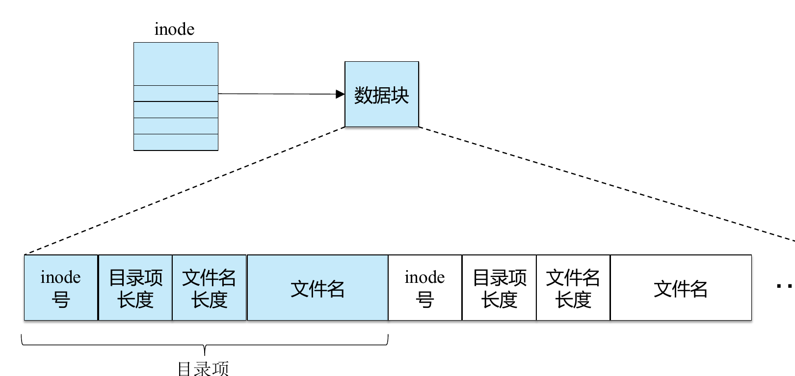
</div>

<!-- 配图来源：《File and Directory in Practice》第 29 页。 -->

文件系统通过目录项找到 inode，再通过 inode 找到文件内容：

```text
polyglot.zip  ──>  inode 42  ──>  文件内容
```

<!-- v -->

## 所以，到底怎样判断文件类型？

答案还在文件内容里：

- 不同格式有各自的文件结构
- 很多格式会在固定位置放置特征字节，也就是<ruby>“魔数”<rp>（</rp><rt>magic number</rt><rp>）</rp></ruby>

<!-- **演示**：`file` 命令 -->

常见二进制文件的第一条线索：文件头和内部结构

<!-- v -->

## Magic Number

常见文件的 magic number：

| 文件类型 | 文件头 | 对应 ASCII |
| :---: | :--- | :--- |
| JPEG | FF D8 FF |  |
| PNG | 89 50 4E 47 0D 0A 1A 0A | .PNG.... |
| GIF | 47 49 46 38 39 61 | GIF89a |
| PDF | 25 50 44 46 | %PDF |
| ZIP | 50 4B 03 04 | PK.. |
| RAR | 52 61 72 21 | Rar! |
| 7z | 37 7A BC AF 27 1C | 7z..'. |
| WAV | 52 49 46 46 | RIFF |

<!-- **演示：**用 010 Editor 打开 `polyglot.zip` -->

<!-- v -->

## 在文件末尾藏些东西

不少文件格式有明确的结束标志，例如：

- PNG 的 IEND 数据块
- JPEG 的 EOI 标志 `FF D9`

解析器读到结束标志后，往往就不再继续读取

所以在文件末尾追加内容，通常不影响原文件的正常显示

Polyglot.zip 就是这么来的：

```bash
cat cover.jpg secret.zip > Polyglot.zip
```

<!-- v -->

## 识别与分离附加内容

- 010 Editor：直接查看文件尾和数据偏移
- `binwalk`：扫描文件中嵌入的其他文件特征
- `foremost`：按文件特征提取内容

<!-- s -->

<div class="middle center">
<div style="width: 100%">

# Part.2 图片

</div>
</div>

<!-- v -->

## 再一次回到 Lab0 ...

<div style="display: flex; align-items: center; justify-content: space-around; text-align: center; margin-top: 45px;">
  <div style="width: 47%;">
    
    <div>原图</div>
  </div>
  <div style="width: 47%;">
    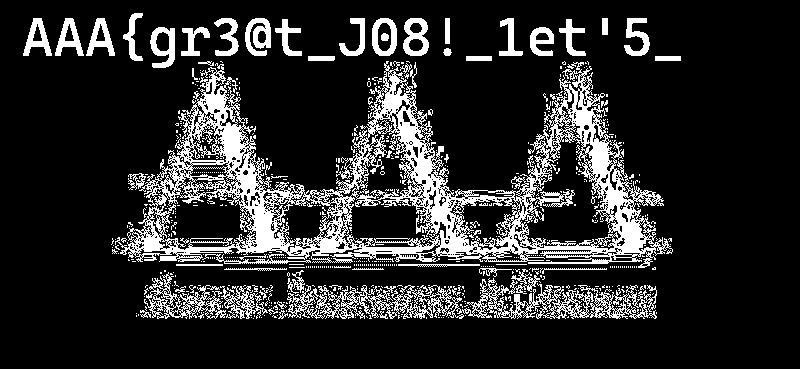
    <div>R 通道 bit 0</div>
  </div>
</div>

<!-- TODO 演示：演示文件：examples/lsb/misc_challenge2.png-->

bit plane（位平面）：把某一位的 0 / 1 映射为黑 / 白

<!-- v -->

## LSB 隐写

<div style="text-align: center;">
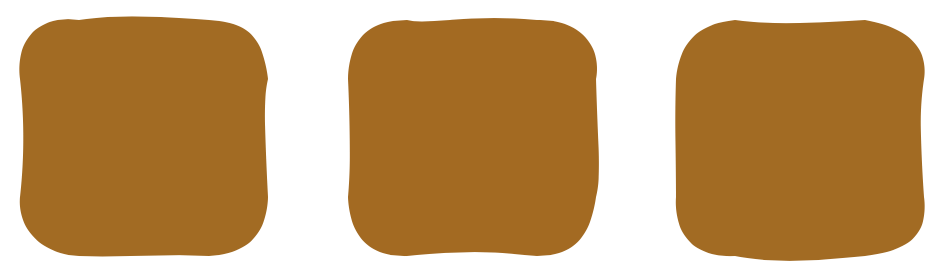
</div>

<div class="fragment">
<div style="text-align: center; margin-top: -20px;">

</div>

- 人眼很难察觉细微的颜色变化
- LSB 隐写把信息写进颜色通道的最低位

<div class="fragment">

那为什么 LSB 题里遇到的大多是 PNG？

</div>
</div>

<!-- v -->

## 同一张图，三种格式

三张 `16 × 16` 的色块图

<div style="display: flex; justify-content: space-around; text-align: center; margin-top: 20px;">
  <div>
    
    <div>BMP<br>未压缩<br><code>822 B</code></div>
  </div>
  <div>
    
    <div>PNG<br>无损压缩<br><code>102 B</code></div>
  </div>
  <div>
    
    <div>JPEG<br>有损压缩<br><code>689 B</code></div>
  </div>
</div>

<div class="fragment" style="text-align: center; margin-top: 25px;">

为什么 PNG 最小？JPEG 反而比它大？

</div>

<!-- 演示文件见 examples/image-formats/ -->

<!-- v -->

## BMP / PNG / JPEG

- BMP 基本不压缩，直接保存像素<br>
  `16 × 16 × 3 B + 54 B 文件头 = 822 B`

- PNG 会压缩重复的数据，解压后每个像素与原图完全一致
- JPEG 丢掉部分细节换取更小的文件，解码后的像素只是近似值

<div class="fragment">

这张图很小，而且有大片重复颜色，正适合 PNG

JPEG 还要保存编码表等固定结构，所以反而比 PNG 大

</div>

<!-- v -->

## 重新打开 JPEG 之后

<div style="display: flex; justify-content: space-around; text-align: center; margin-top: 25px;">
  <div>
    
    <div>PNG：4 种颜色</div>
  </div>
  <div>
    
    <div>JPEG：140 种颜色</div>
  </div>
</div>


JPEG 保存的不是每个像素的精确数值，颜色边界附近会出现大量新颜色

<!-- v -->

## 保存为 JPEG 后的 R bit 0

<div style="display: grid; grid-template-columns: 1fr 1fr; gap: 12px 24px; text-align: center; margin-top: 10px;">
  <div>
    
    <div>原 PNG</div>
  </div>
  <div>
    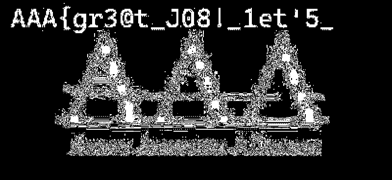
    <div>JPEG quality 100</div>
  </div>
  <div>
    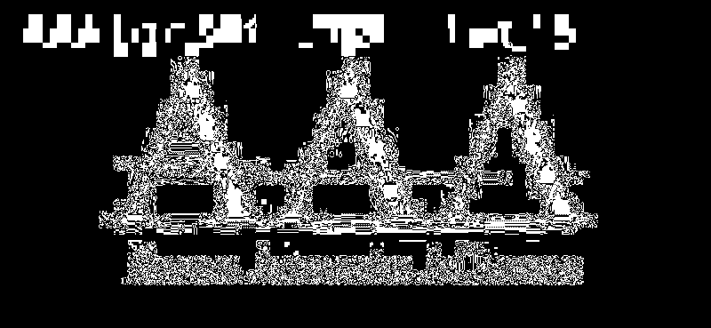
    <div>JPEG quality 90</div>
  </div>
  <div>
    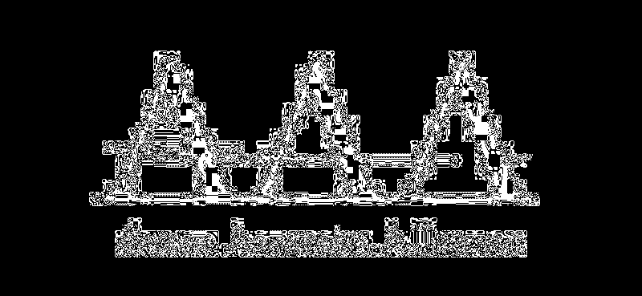
    <div>JPEG quality 50</div>
  </div>
</div>
<!-- 不同质量的 JPEG 原文件见 examples/lsb/jpeg-quality/ -->

<!-- v -->

## JPEG 文件格式

<div style="text-align: center; margin-top: 5px;">
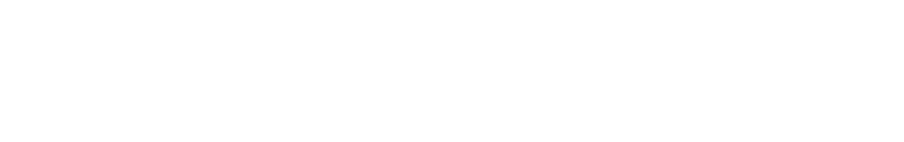
</div>


JPEG 使用分段的结构来进行存储，各段以 0xFF 开头，后接一个字节表示类型：

- FFD8（SOI）：文件开始
- FFE0（APP0）：应用程序数据段，包含文件格式信息（上图没有）
- FFE1（APP1）：应用程序数据段，包含 EXIF 信息（上图没有）
- FFDB（DQT）：量化表数据
- FFC0（SOF）：帧数据，包含图像宽高、色彩模式等信息
- FFC4（DHT）：huffman 表数据
- FFDA（SOS）：扫描数据，包含数据的扫描方式，huffman 表的使用方式等
- FFD9（EOI）：文件结束

<!-- v -->


## *JPEG 压缩原理

- JPEG 的压缩原理是 DCT（离散余弦变换）+ Huffman 编码
  - 由 RGB 转换到 YCbCr，然后减少 Cb、Cr 的采样率
  - 将图像分块，每个块 8x8，进行 DCT 变换
    - 将图像转换为频域，便于压缩高频部分
  - 量化，将 DCT 变换后的系数除以量化表中的系数
    - 再次减少高频部分的数据
    - 根据不同的量化表，可以调整压缩质量
  - 通过游程编码和 huffman 编码进行压缩

<!-- v -->


## PNG 文件格式

<div style="text-align: center; margin-top: -30px;">
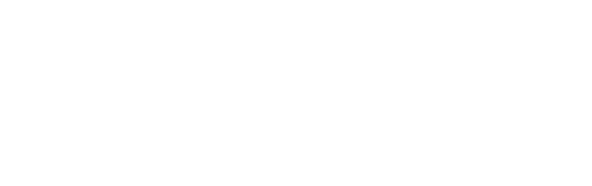
</div>


- 文件头 89 50 4E 47 0D 0A 1A 0A | .PNG....
- 采用分块的方式存储数据
  - 每块的结构都是 4 字节长度 + 4 字节类型 + 数据 + 4 字节 CRC 校验
  - 四个标准数据块：IHDR、PLTE、IDAT、IEND
  - 其他辅助数据块：eXIf、tEXt、zTXt、tIME、gAMA……
    - eXIf 元信息，tIME 修改时间，tEXt 文本，zTXt 压缩文本

<!-- v -->

## PNG 文件格式

四种标准数据块：

- IHDR：包含图像基本信息，必须位于开头
  - 4 字节宽度 + 4 字节高度
  - 1 字节位深度：1、2、4、8、16
  - 1 字节颜色类型：0 灰度，2 RGB，3 索引，4 灰度透明，6 RGB透明
  - 1 字节压缩方式，1 字节滤波方式，均固定为 0
  - 1 字节扫描方式：0 非隔行扫描，1 Adam7 隔行扫描
- PLTE：调色板，只对索引颜色类型有用
- IDAT：图像数据，可以有多个，每个数据块最大 2<sup>31</sup>-1 字节
- IEND：文件结束标志，必须位于最后，内容固定
  - PNG 标准不允许 IEND 之后有数据块

<!-- v -->

## *PNG 压缩原理

- PNG 使用 Deflate 压缩算法
  - 是 LZ77 结合 huffman 编码的一种压缩算法
  - LZ77：利用滑动窗口，找到最长的重复字符串，用指针和长度表示

<div style="text-align: center;">
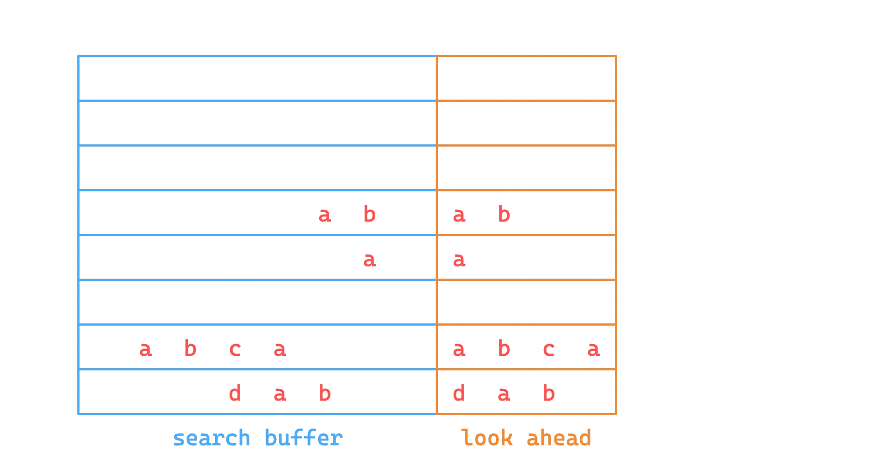
</div>


- 会进行滤波，减少数据的冗余性，提高压缩率
  - 五种滤波器：None、Sub、Up、Average、Paeth

<!-- v -->

## 参考阅读

- [2023 年的 misc 专题一讲义](https://slides.tonycrane.cc/CTF101-2023-misc/lec2/)
- JPEG
  - [The Unreasonable Effectiveness of JPEG: A Signal Processing Approach](https://youtu.be/0me3guauqOU)
    - Reducible 频道的视频，B 站搬运：[BV1iv4y1N7sq](https://b23.tv/BV1iv4y1N7sq)
  - [ISO/IEC 10918-1:1994](https://www.iso.org/standard/18902.html?browse=tc) official standard
  - [JPEG压缩原理与DCT离散余弦变换](https://blog.csdn.net/newchenxf/article/details/51719597)
  - [Understanding and Decoding a JPEG Image using Python](https://yasoob.me/posts/understanding-and-writing-jpeg-decoder-in-python/)
  - libjpeg 源码 [GitHub:thorfdbg/libjpeg](https://github.com/thorfdbg/libjpeg)
- PNG
  - [How PNG Works: Compromising Speed for Quality](https://youtu.be/EFUYNoFRHQI)
    - Reducible 频道的视频，B 站搬运：[BV1wY4y1P7o7](https://b23.tv/BV1wY4y1P7o7)
  - [PNG Specification (Third Edition)](https://www.w3.org/TR/png-3/)

<!-- v -->

## Pillow 图像处理基础

Pillow 是 Python 中处理图像的主要库

[官方文档与教程](https://pillow.readthedocs.io/en/stable/)

<div class="fragment">

例题：奇怪的数据

```text
(255, 255, 255); (255, 255, 255); (0, 0, 0); ...
```

文件共有 `410` 行，每行 `410` 组 RGB 数值

每一组都像是一个像素，但这些像素应该怎样排列？

<div class="fragment">

题目很贴心地保留了换行

图片尺寸已经写在文本的排布里

</div>
</div>

<!-- v -->

## PIL 脚本

先逐行提取 RGB 元组


```python
import re
from PIL import Image

# 按行读取，保留文本原本的二维排布
with open("flag.txt", encoding="utf-8") as f:
    lines = f.readlines()

rows = []
for line in lines:
    # 提取这一行中的所有 (R, G, B)
    colors = re.findall(
        r"\((\d+),\s*(\d+),\s*(\d+)\)", line
    )
    # 把字符串转成整数元组
    row = [tuple(map(int, color)) for color in colors]
    rows.append(row)
```

<!-- v -->

## PIL 脚本（续）

<div style="display: grid; grid-template-columns: 1.25fr 0.75fr; gap: 30px; align-items: center;">
<div style="font-size: 0.67em;">

```python
# 用原文的排布确定宽高
width = len(rows[0])
height = len(rows)
# 每一行应当等宽
assert all(len(row) == width for row in rows)
# putdata 需要一维序列
pixels = [
    pixel
    for row in rows
    for pixel in row
]

# 创建画布，填入像素并保存
image = Image.new("RGB", (width, height))
image.putdata(pixels)
image.save("restored_image.png")

print(f"saved {width} x {height} image")
```

</div>
<div class="fragment">

</div>
</div>

<!-- v -->

## 图片不只有像素

刚才的脚本里，我们亲手告诉了 Pillow：这是一张 `410 × 410` 的图片

<div style="display: grid; grid-template-columns: 1fr 1fr; gap: 28px; margin-top: 36px; text-align: center;">
  <div style="border: 2px solid #999; border-radius: 12px; padding: 24px;">
    <strong>怎样解释</strong><br><br>
    宽高、颜色模式、压缩方式……
  </div>
  <div style="border: 2px solid #999; border-radius: 12px; padding: 24px;">
    <strong>像素数据</strong><br><br>
    图片真正的内容
  </div>
</div>

<div class="fragment">


</div>

<!-- v -->


## 去哪里找宽高？

PNG 开头的 `IHDR` 数据块记录了基本信息

<div style="display: grid; grid-template-columns: 0.7fr 1.3fr; gap: 44px; align-items: center; margin-top: 30px;">
  <div style="font-family: monospace; font-size: 1.05em; line-height: 1.8; border: 2px solid #999; border-radius: 12px; padding: 20px; text-align: center; transform: translateX(70px);">
    PNG 文件头<br>
    ↓<br>
    <strong>IHDR</strong><br>
    ↓<br>
    图像数据
  </div>
  <div style="text-align: center;">
    <p><code>4 B</code>　宽度</p>
    <p><code>4 B</code>　高度</p>
    <p>其他基本信息</p>
    <p><code>4 B</code>　CRC 校验</p>
  </div>
</div>

<div style="text-align: center; margin-top: 28px;">

当前宽度是 `1080`，高度是 `190`

</div>

<!-- v -->

## 用 CRC 检查 IHDR

`IHDR` 末尾的 CRC 用来检查这一块数据

```text
文件中的 CRC    E0 7F 44 78
重新计算的 CRC  5F D4 28 0E
```

两者不同，说明 `IHDR` 被改过

枚举高度并重新计算 CRC，直到结果与文件中的 CRC 相同

<div class="fragment">

```text
高度  00 00 00 BE  →  190
改为  00 00 02 60  →  608  ✓
```

</div>

<div class="fragment" style="text-align: center; font-size: 0.72em; margin-top: 20px; color: #bbb;">

部分 macOS / Linux 图像查看器会拒绝 CRC 错误的图片<br>
Windows 自带查看器通常忽略 CRC，直接修改高度也能打开

</div>


<!-- s -->


<div class="middle center">
<div style="width: 100%">

# Part.3 OSINT

</div>
</div>

<!-- v -->

## <span style="font-family: Apple Emoji">⚠️</span> 声明 <span style="font-family: Apple Emoji">⚠️</span>

- 后续内容仅供 CTF 范围内学习交流，实操于现实世界时请注意法律法规
- 对于擅自在现实世界（非 CTF 题目构造的虚拟情形）中复现的行为，由此产生的一切后果由行为人自行承担，本课程、作者以及 AAA 团队概不负责

<!-- v -->

## 什么是 OSINT

- **O**pen **S**ource **INT**elligence：开源情报
- 从公开来源收集信息，再把零散线索拼起来
- Misc 题里常见两类形式
    - 围绕虚构身份搜索出题人留下的公开信息
    - 从图片和文档中推断地点、时间与环境

<!-- v -->

## 文件信息泄露

- 文档元信息可能包含作者、修改时间与软件版本
- 图片的 EXIF 可能包含设备、时间和 GPS，可用 `exiftool` 查看
- 工程目录经常留下额外线索
    - `.git`：修改历史、提交信息与提交者
    - `.vs`、`.vscode`、PDB：本地路径与开发环境
    - `.DS_Store`：macOS 目录布局
- Markdown 的本地图片路径和图床地址也可能暴露用户名

<!-- v -->

## 照片信息分析：图片搜索

先搜图：它是否已经在网上出现过？

常用的图片搜索工具：

- 百度识图：中文互联网图片
- Google Lens、Bing Visual Search：外文网页和海外地点
- Yandex Images：相似图片与风景
- TinEye：搜索完全相同的图片（找来源）

<!-- v -->

## 照片信息分析：地点线索

注意图片中的文字、牌匾、标志性建筑等，可用来作为关键词搜索

- 来自 2021、2022 Hackergame 的「旅行照片」

<div style="text-align: center; margin-top: 20px;">
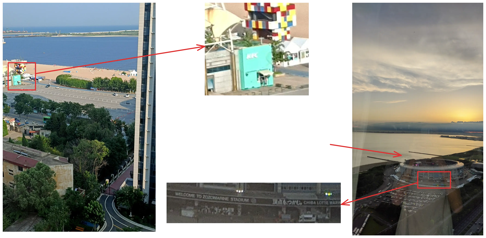
</div>

- 得到大致位置后，再用百度或 Google 街景核对周围环境

<!-- v -->

## 照片信息分析：地点线索

图片中的文字太少时，可以先尝试识图

- 2023 Hackergame 的「旅行照片」中的一张照片，使用 Google 识图搜索

<div style="text-align: center; margin-top: 20px;">
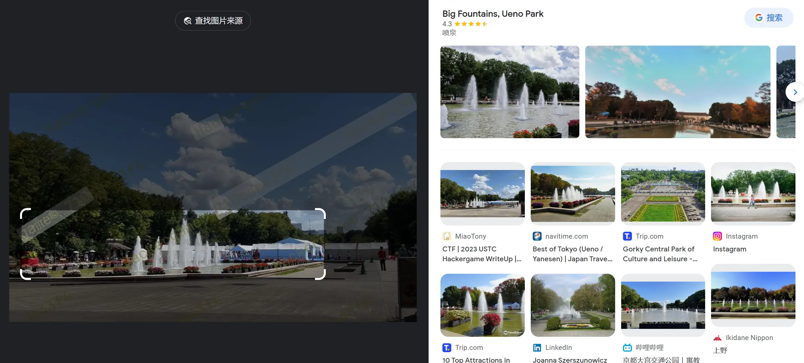
</div>

- 确认地名后，再搜索附近建筑与道路

<!-- v -->

## 照片信息分析：环境线索

例如：估计拍摄高度

- 例：SECCON 时在酒店里拍的照片

<div style="text-align: center; margin-top: 20px;">
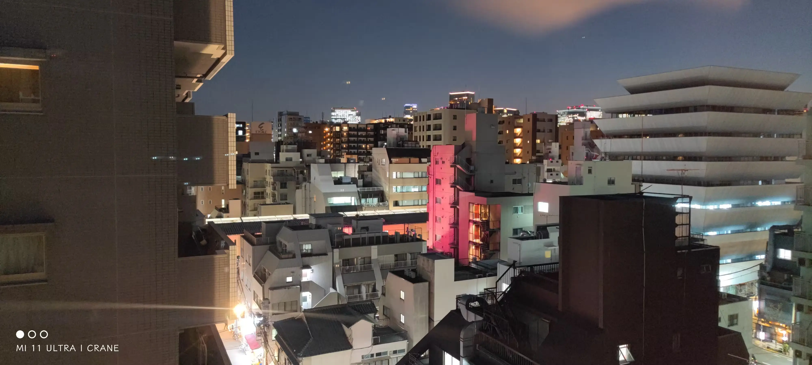
</div>

可以从透视关系入手

<!-- v -->

## 用透视估计拍摄高度

<div style="text-align: center; margin-top: 5px; margin-bottom: -160px;">
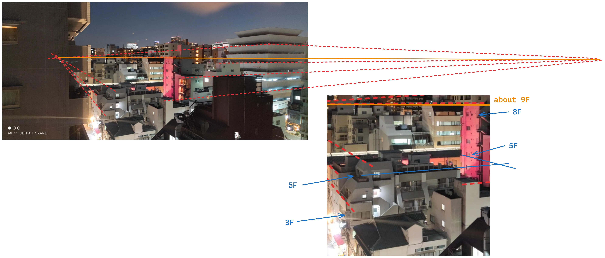
</div>

- 先校正画面倾斜，让建筑竖线恢复垂直
- 找到两组平行线各自的灭点
- 两个灭点的连线就是视平线
- 视平线经过的楼层近似拍摄高度

<!-- v -->

## 还可以利用哪些环境线索？

- 太阳角度与阴影长度
    - 时间 ↔ 位置
    - [suncalc.org](https://www.suncalc.org/)
    - [sunearthtools.com](https://www.sunearthtools.com/cn/index.php)
- 天气与云层记录
- 航班信息：辅助估计方向、位置和时间
    - [flightaware.com](https://flightaware.com/)
    - [flightradar24.com](https://www.flightradar24.com/)
    - [adsbexchange.com](https://www.adsbexchange.com/)
- 风景特征：尝试 Yandex 图片搜索

<!-- v -->

## 例题：去年的作业

这是 45gfg9 在韩国拍的一张照片，请回答以下两个问题：

1. 拍摄这张图片时所在位置
2. 图片中的绿色路牌被遮挡住的右半边的内容是？


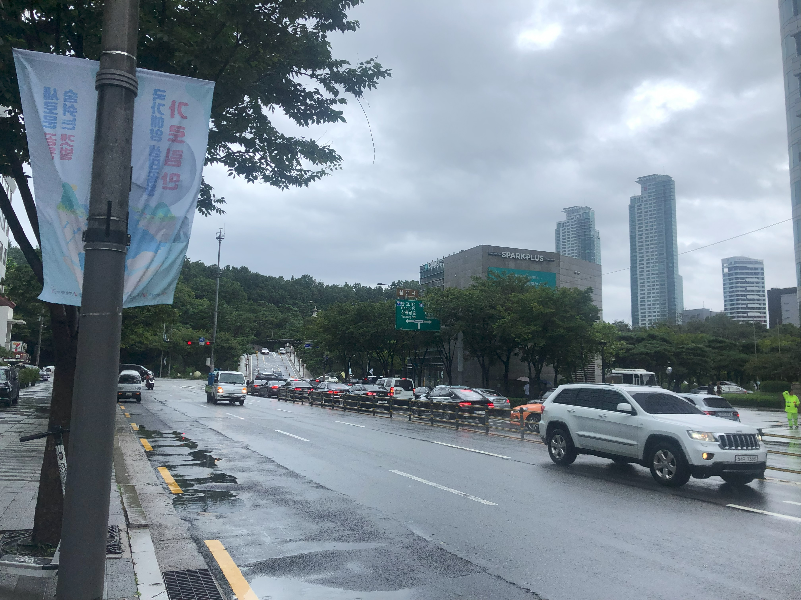
<!-- v -->

## 先把能读到的字记下来

<div style="display: grid; grid-template-columns: 1.2fr 0.8fr; gap: 30px; align-items: center;">
  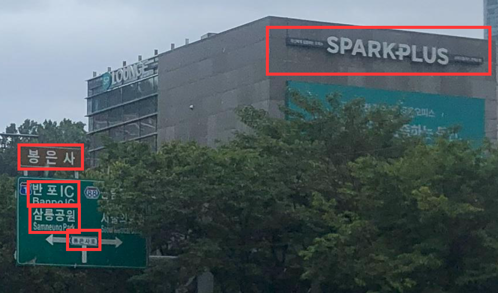
  <div>

先裁出右上角，用 OCR 或 AI 辅助识字，再回到原图核对

- `봉은사로` / Bongeunsa-ro
- `SPARKPLUS`
- 路牌画出了一个丁字路口

道路名比景点名更适合直接搜索

  </div>
</div>

<!-- v -->

## 只搜 SPARKPLUS 还不够

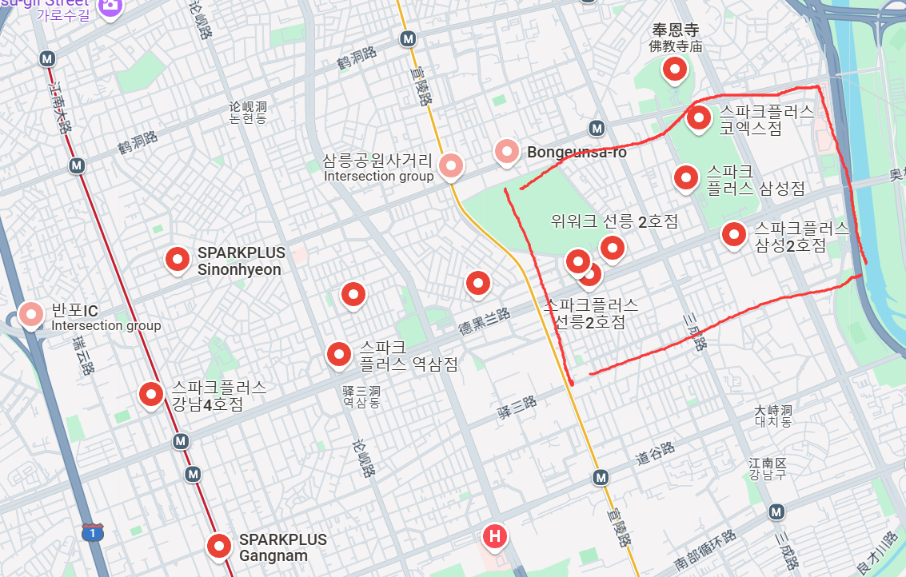

首尔有多个 SPARKPLUS 分店<br>
加入道路名 `Bongeunsa-ro`，把范围缩小到 COEX 附近

<!-- v -->

## 从候选地点里找丁字路口

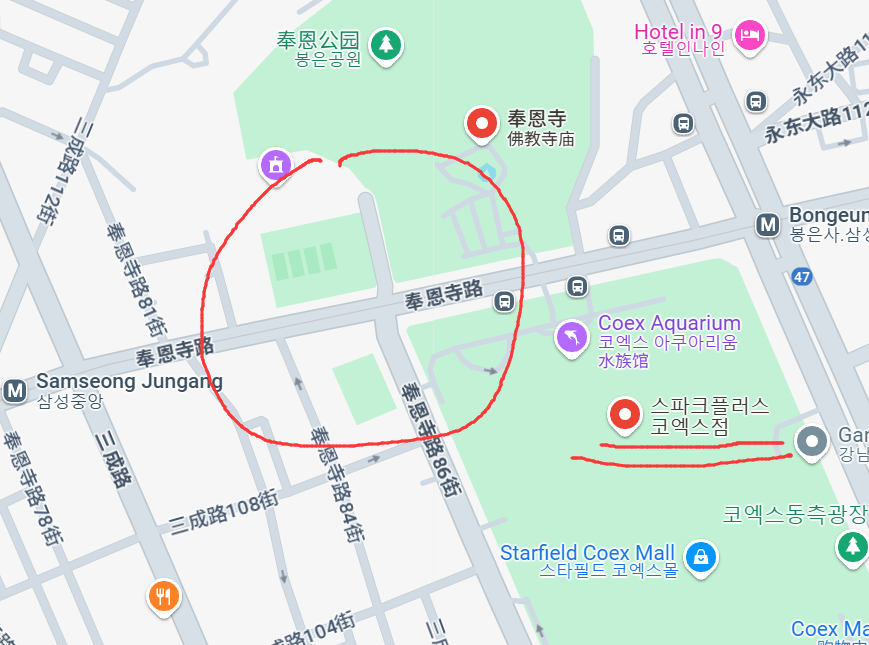

<!-- v -->

## 锁定拍摄点

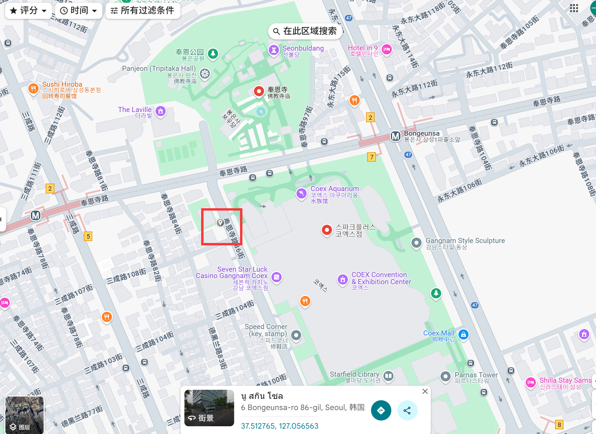

候选机位位于 `6 Bongeunsa-ro 86-gil, Seoul`<br>
接下来还需要用街景核对，地图上的一个点本身不是答案

<!-- v -->

## 用街景做最后确认

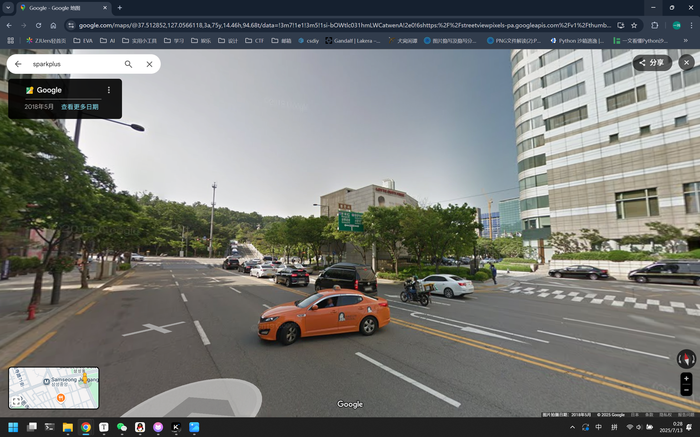

道路走向、建筑轮廓和路牌位置都能对应<br>
拍摄点约为 `37.512765, 127.056563`

<!-- v -->

## 补全被挡住的路牌

<div style="display: grid; grid-template-columns: 0.8fr 1.2fr; gap: 44px; align-items: center;">
  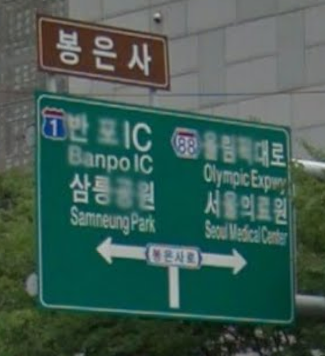
  <div style="text-align: left;">

```text
올림픽대로
Olympic Expwy

서울의료원
Seoul Medical Center
```

切换同一地点的历史街景<br>
在 `2015 年 7 月` 的画面中可以看到完整路牌

  </div>
</div>

<!-- s -->


<div class="middle center">
<div style="width: 100%">


# Part.4 Lab 3 简介

</div>
</div>

<!-- v -->

## 必做部分

共 50 分，课上讲解的内容

文件隐藏内容 / LSB 隐写 / “图寻”类 OSINT


<!-- v -->

## 选做部分

共 125 分（分数上限 65），拓展内容

EZStego / Python 脚本数据可视化 / ZIP 加密 / 信息搜索类 OSINT


<!-- s -->

<div class="middle center">
<div style="width: 100%; text-align: center;">

<h5 style="font-size: 55px; text-align: center;">谢谢大家，辛苦啦！</h5>

<strong><h5 style="font-size: 40px; text-align: center;">Questions?</h5></strong>

<div style="font-size: 24px; line-height: 1.9;">
  <div>H2g</div>
  <div><a href="mailto:3240101951@zju.edu.cn">3240101951@zju.edu.cn</a></div>
</div>

</div>
</div>
