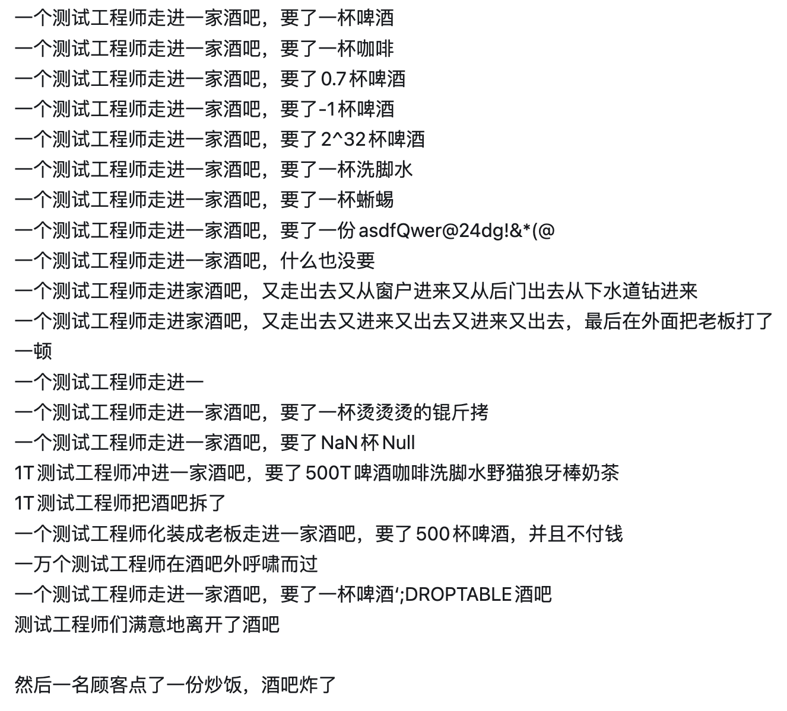
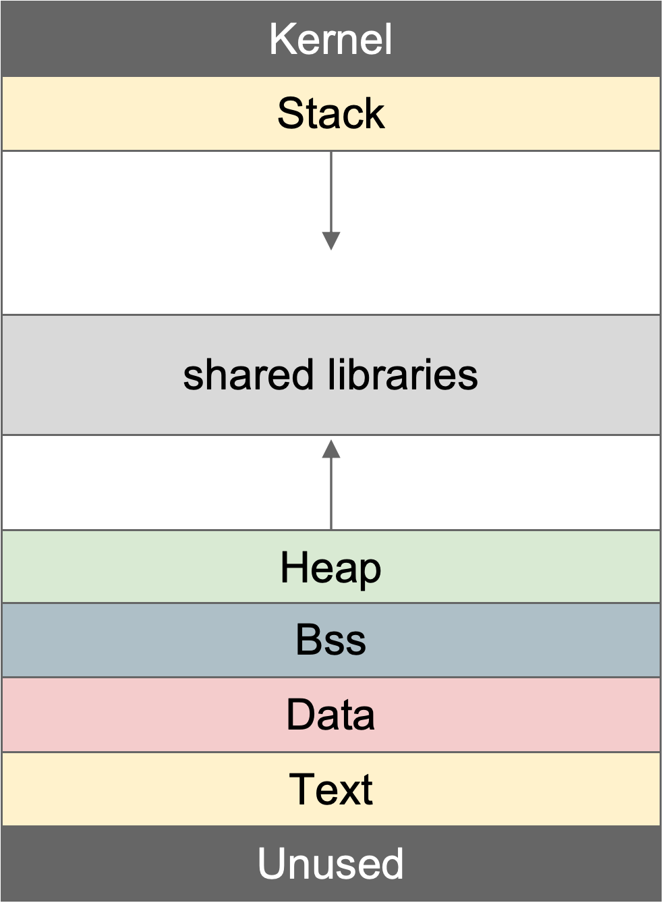
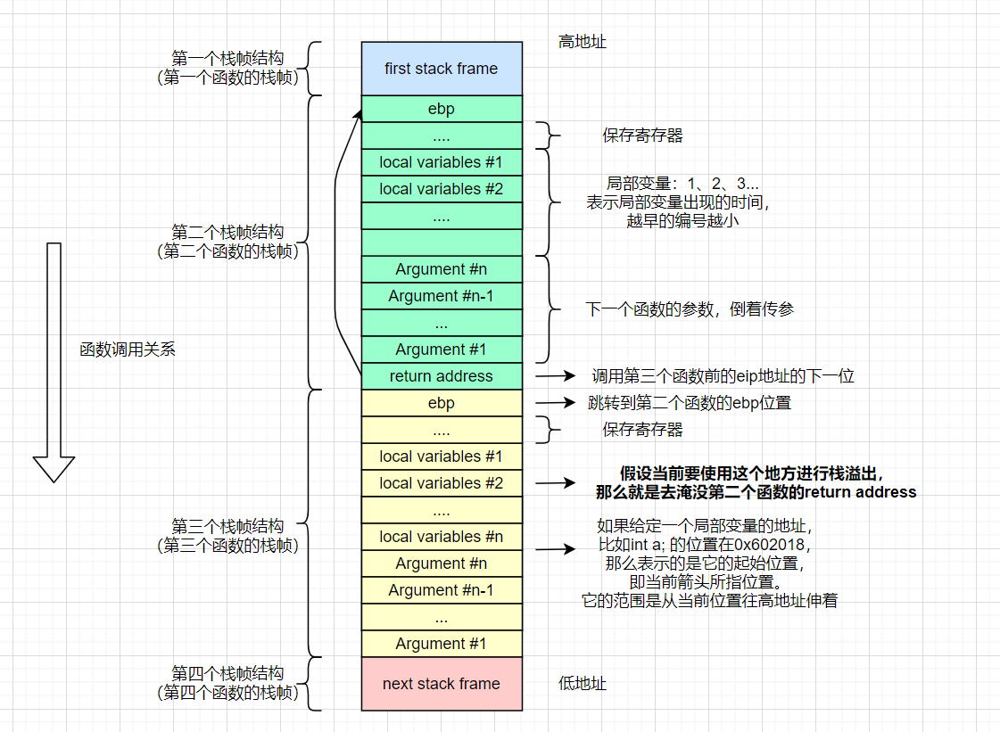
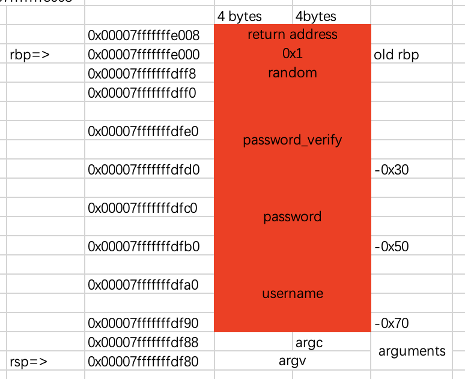
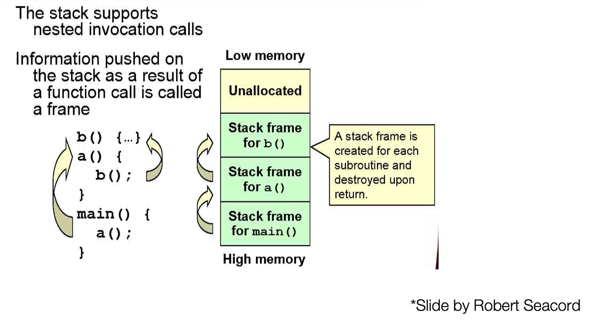
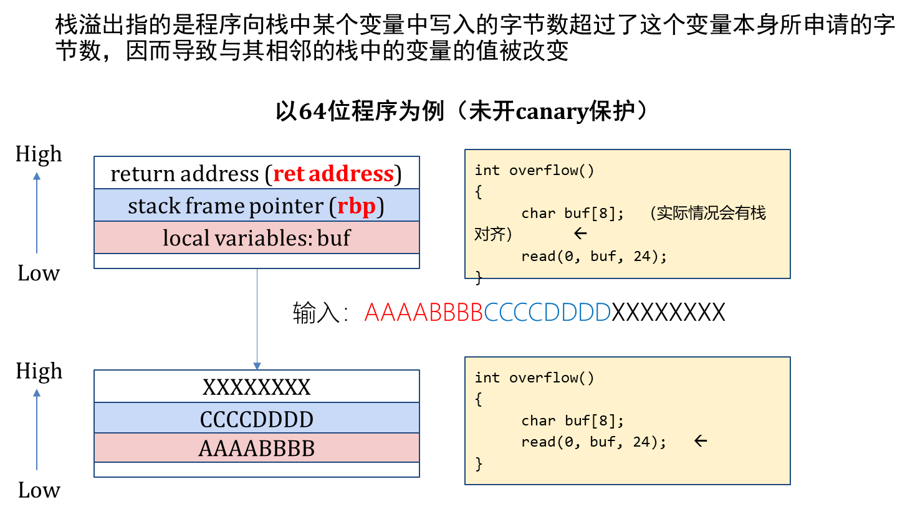

<!-- .slide: data-background="./pwn-lec2/background-pure.png" -->

<div class="middle center">
<div style="width: 100%">

# pwn basic

张书怀 @z3phyr 2025.7.9

</div>
</div>

<!-- s -->
<!-- .slide: data-background="./pwn-lec2/background-pure.png" -->

## Table of contents

- PWN 引言

- 代码注入漏洞

- Shellcode与沙箱

- 栈溢出基础


<!-- s -->
<!-- .slide: data-background="./pwn-lec2/background-pure.png" -->

<div class="middle center">
<div style="width: 100%">

# part 0 PWN 引言

</div>
</div>

<!-- v -->
<!-- .slide: data-background="./pwn-lec2/background-pure.png" -->

## PWN 是什么？

PWN = Find the Bugs + Exploit them

<div class="center">
  
</div>

<!-- v -->
<!-- .slide: data-background="./pwn-lec2/background-pure.png" -->

## CTF PWN Bugs

- Languages
    - C/C++: memory corruption bugs
    - other complex language(e.g. Rust): logic bugs

- Exploitation Aim
    - code execution
    - Using backdoor/system("/bin/sh")/execve/ORW/ ...

- Targets
    - Terminal program usually
    - other complex targets: IoT, Httpd, Kernel, brower, CPU/GPU ...

<!-- v -->
<!-- .slide: data-background="./pwn-lec2/background-pure.png" -->

## PWN 赛题结构

- 赛题文件
    - 一个/多个二进制程序，需要逆向
    - （可能的）漏洞描述(diff)

- 赛题本地环境
    - 运行时库：libc, ld, ...
    - Dockerfile （最小化本地和远程部署差异）
    - "good challenge should issue everything you needed to run and test it"

- 赛题远程环境
    - 重定向输入输出到连接，往往不需要反弹shell

<!-- v -->
<!-- .slide: data-background="./pwn-lec2/background-pure.png" -->

## 环境配置
基础工具
- IDA pro : 反汇编反编译工具
- Pwntools : python库，用于交互
- Pwndbg : GDB插件，更好的动态调试体验
- ROPgadget/Ropper : 自动寻找程序 gadget
- Seccomp-tools : 识别沙箱规则
- one_gadget : 识别“神之一手”
- Patchelf : patch二进制程序的动态库链接

Maybe在CTF101基础中不会用到，但后续会用到的
- QEMU : 多架构模拟器，比如在x86机器上模拟arm/RISCV程序等
- gdb-multiarch : 动态调试异构的调试器
- ...

<!-- v -->
<!-- .slide: data-background="./pwn-lec2/background-pure.png" -->

## pwntools 基础
务必自行阅读官方文档"https://docs.pwntools.com/en/latest/"

一些简单的例子：
```python
from pwn import *
context(os='linux',arch='amd64',log_level='debug',terminal=['tmux', 'split', '-h'])
p=process('./pwn') # 运行一个本地程序
p=remote('127.0.0.1', 8080) # 建立一个远程连接，通过管道传输数据
p.interactive() # 交互模式
p.send("hello")
p.sendline("hello") # with '\n'
p.sendafter("\n", "hello")
p.sendlineafter("\n", "hello")
p.recv(1024)
p.recvn(4)
p.recvline()
p.recvuntil(";")
packed = p64(0x41424344)
unpacked = u64(b'ABCD')
```

<!-- v -->
<!-- .slide: data-background="./pwn-lec2/background-pure.png" -->

## 利用lambda表达式简写
为了解题效率，可以使用python的lambda表达式简写函数/命令

供参考的用法：
```python
s   = lambda data           :p.send(data)
sa  = lambda delim,data     :p.sendafter(delim,data)
sl  = lambda data           :p.sendline(data)
sla = lambda delim,data     :p.sendlineafter(delim,data)
r   = lambda num            :p.recv(num)
ru  = lambda delims         :p.recvuntil(delims)
itr = lambda                :p.interactive()
leak= lambda name,addr      :log.success('{} = {:#x}'.format(name,addr))
l64 = lambda                :u64(p.recv(6).ljust(8,b"\x00))
l32 = lambda                :u32(p.recv(4).ljust(4,b"\x00))
```

<!-- v -->
<!-- .slide: data-background="./pwn-lec2/background-pure.png" -->
## Talk is less … example-nocrash

- 参见网站上的 "[lec1]pwn nocrash"
- 阅读源代码，找到程序漏洞
- 本地运行并触发该bug（学习使用pwntools）
- 与远端交互，触发bug并获取flag

<!-- v -->
<!-- .slide: data-background="./pwn-lec2/background-pure.png" -->
## 栈的概念

<div class="mul-cols">
<div class="col">

基础知识：汇编指令，堆，栈 ...
栈：从高地址往低地址生长
- 程序自己产生，自己销毁，用于存储函数调用内部和调用间信息

堆：从低地址往高地址生长
- 由用户主动调用内存分配接口产生和销毁，如malloc,brk...

</div>
<div class="col">

</div>
</div>

<!-- v -->
<!-- .slide: data-background="./pwn-lec2/background-pure.png" -->
## 栈的概念

<div class="mul-cols">
<div class="col">

x86_64程序的一个函数的栈帧(Stack Frame/Activation Record)一般从高地址到低地址记录了：
- 函数参数（被caller调用时传入的参数）
- 返回地址（执行call指令会把call的下一条指令压入栈内）
- 旧的帧指针，指向caller的栈帧的基地址，用于在函数返回时恢复到caller的栈帧。
- 局部变量，函数内部定义的所有变量都存储在栈内。函数执行完毕后自动释放。

</div>
<div class="col">

</div>
</div>

<!-- v -->
<!-- .slide: data-background="./pwn-lec2/background-pure.png" -->
## 函数调用规范
x86-32
- 所有参数都通过栈传递
- 程序在call之前，一般会通过push将参数入栈。

x86-64
- 先将前六个参数分别放入rdi,rsi,rdx,rcx,r8,r9，后面的参数通过栈传递
- 程序在call之前一般会有把参数传入目标穿参寄存器的操作

非x86/x86-64架构的函数调用规范均不完全一致，但是整体是相同的（异构pwn）

<!-- v -->
<!-- .slide: data-background="./pwn-lec2/background-pure.png" -->
## Talk is less...login_me
- 参见网站中的 "[lec1] pwn login_me"
- 尝试逆向找到bug
- 本地运行并利用该bug（需先Patchelf）
- 学会用pwndbg调试（查看并理解栈）
- 与远程交互、利用bug并获取flag

<!-- v -->
<!-- .slide: data-background="./pwn-lec2/background-pure.png" -->
## login_me 栈布局

<div class="center">
  
</div>

<!-- s -->
<!-- .slide: data-background="./pwn-lec2/background-pure.png" -->

<div class="middle center">
<div style="width: 100%">


# part 1 代码注入漏洞

</div>
</div>

<!-- v -->
<!-- .slide: data-background="./pwn-lec2/background-pure.png" -->

## Code Injection

> An attacker introduces (or "injects") code into the program and changes the course of its execution.

- 命令注入
    - 直接

- shellcode注入
    - 间接
    - 搭配控制流劫持的利用方式

<!-- v -->
<!-- .slide: data-background="./pwn-lec2/background-pure.png" -->

## Shellcode

- 由于当代计算机都是由冯诺依曼体系设计而来，指令和数据对于程序来说都是01字符串，本质并无差别，所以就产生了一个问题：数据可不可以被当作指令来执行？答案是当然可以，这就是 shellcode 的由来。
- 攻击者构造了一段有意义的，可以被执行的恶意数据，然后通过漏洞使程序执行这段恶意数据，从而达到一些目的/攻击效果。这段恶意数据被称为 Shellcode。
- Shellcode 并无某一个统一的目的，其效果可能为获取一个shell、可能为反弹shell、可能为弹出计算器、可能为打开浏览器、可能为访问一个网站等等，其可以执行任意代码，但获取shell是最常用也最简单的攻击效果，所以其才被称为"shell"code。

<!-- v -->
<!-- .slide: data-background="./pwn-lec2/background-pure.png" -->
## Talk is less...inject_me
- 参见网站上的 "[lec1] pwn inject_me"
- 尝试逆向找到bug
- 本地运行并触发该bug
- 与远程交互、触发bug并获取flag

<!-- s -->
<!-- .slide: data-background="./pwn-lec2/background-pure.png" -->

<div class="middle center">
<div style="width: 100%">


# part 2 Shellcode 与沙箱

</div>
</div>

<!-- v -->
<!-- .slide: data-background="./pwn-lec2/background-pure.png" -->

## 沙箱是什么

- 沙箱（Sandbox）：限制程序行为的安全机制
- Linux PWN 中最常见的是 **seccomp** 沙箱
    - seccomp = secure computing mode
    - 通过过滤 **系统调用（syscall）** 来限制程序能力

- seccomp 可以对 syscall 设置规则
    - 允许：正常执行
    - 拒绝：返回错误码
    - 杀死：直接终止进程

- 常用于禁止“一把梭”
    - 禁止 execve("/bin/sh")，不能直接 getshell
    - 逼迫选手构造更精确的 shellcode

<!-- v -->
<!-- .slide: data-background="./pwn-lec2/background-pure.png" -->

## 常见绕过方法

- 寻找等价系统调用
    - 如execveat代替execve、openat代替open
    - 系统调用号：https://www.chromium.org/chromium-os/developer-library/reference/linux-constants/syscalls/
- 使用orw(open+read+write)
    - 一般来说，会禁止 system/execve/fork 等，这个时候使用 open+read+write 输出 flag 即可
    - 或者使用 open+sendfile，指令会更短
- 切换指令模式
    - 使用 retf(return far) 指令实现架构切换
- 使用io_uring

<!-- v -->
<!-- .slide: data-background="./pwn-lec2/background-pure.png" -->
## Talk is less...bypass_me
- 参见 "[lec1] bypass_me"
- 尝试分析如何绕过沙箱，有几种方法？
- 本地编写shellcode以绕过沙箱
- 与远程交互并获取flag

<!-- s -->
<!-- .slide: data-background="./pwn-lec2/background-pure.png" -->

<div class="middle center">
<div style="width: 100%">


# part 3 栈溢出基础

</div>
</div>

<!-- v -->
<!-- .slide: data-background="./pwn-lec2/background-pure.png" -->

## CallStack and Backtrace

<div class="center">
  
</div>

<!-- v -->
<!-- .slide: data-background="./pwn-lec2/background-pure.png" -->

## Stack overflow是什么

<div class="center">
  
</div>

<!-- v -->
<!-- .slide: data-background="./pwn-lec2/background-pure.png" -->

## Stack overflow能做什么

<div class="mul-cols">
<div class="col">

- 溢出破坏局部变量 
    - 破坏数据流
- 溢出破坏存储的帧指针
    - 栈迁移
- 溢出破坏存储的返回地址
    - 控制流劫持

</div>
<div class="col">

</div>
</div>

<!-- v -->
<!-- .slide: data-background="./pwn-lec2/background-pure.png" -->
## Talk is less...sbof1
- 参见 "[lec1] sbof1"
- 尝试触发access granted
- 本地运行并触发bug
- 与远程交互并获取flag

<!-- v -->
<!-- .slide: data-background="./pwn-lec2/background-pure.png" -->
## Talk is less...sbof2
- 参见 "[lec1] sbof2"
- 尝试逆向并找到bug，如何劫持控制流到后门函数？
- 本地运行并触发bug
- 与远程交互并获取flag

<!-- v -->
<!-- .slide: data-background="./pwn-lec2/background-pure.png" -->

## Linux下基础保护机制
- ASLR(Address Space Layout Randomization) ：stack、run time library的随机化
- PIE(Position-Independent Executable)：程序装载地址随机化（用IDA观察sbof2，sbof3的区别）
- The NX bits(the No-eXecute bits)：堆和栈不可执行
- RELRO(RELocate Read-Only)
- Canary：一定程度上防止栈溢出

尝试用checksec查看程序开启的保护。

<!-- v -->
<!-- .slide: data-background="./pwn-lec2/background-pure.png" -->
## Talk is less...sbof3
- 参见 "[lec1] sbof3"
- 尝试逆向并找到bug，开启了程序基址随机化后如何破局？
- 本地运行并触发bug
- 与远程交互并获取flag


<!-- s -->
<!-- .slide: data-background="./pwn-lec2/background-pure.png" -->
## 作业

共4道练习题

1.**nocrash+loginme+injectme** 20pts

2.**Alpha** 20pts

3.**sbofsc** 30pts

4.**sbuf** 30pts


具体要求后续会发布在课程网站

<!-- s -->
<!-- .slide: data-background="./pwn-lec2/background-pure.png" -->

<div class="middle center">
<div style="width:100%">

# Good luck have fun🔨
</div>
</div>
