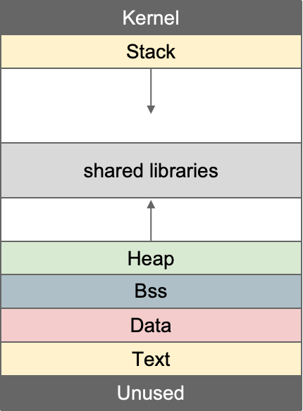
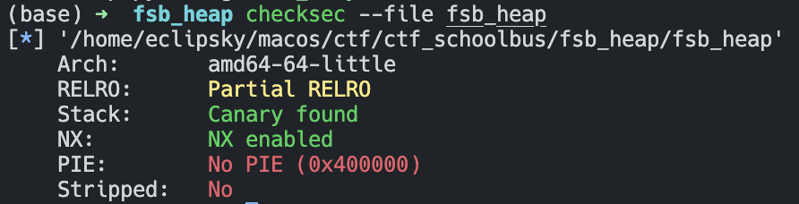
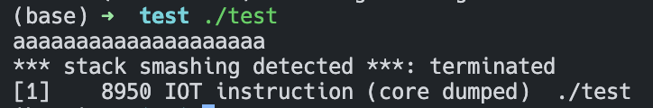
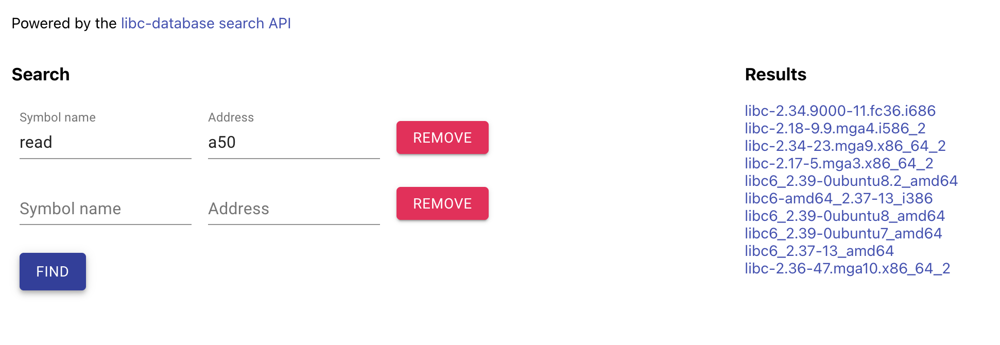
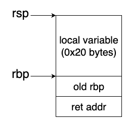
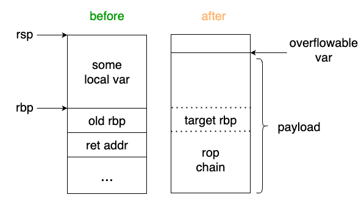
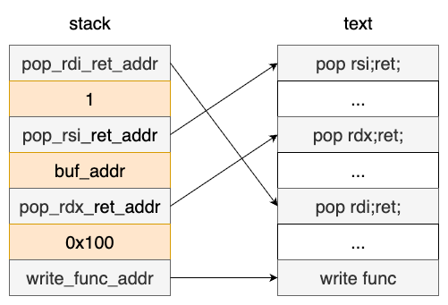
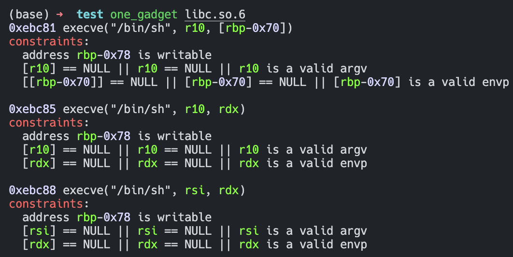
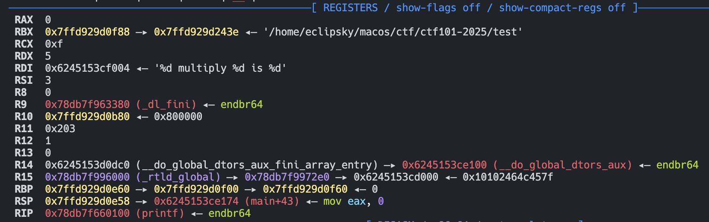

<!-- .slide: data-background="./pwn-lec2/background-overlay.png" -->

<div class="middle center">
<div style="width: 100%">

# pwn专题一 rop & fsb

徐易天 @Eclipsky 2025.7.10

</div>
</div>

<!-- s -->
<!-- .slide: data-background="./pwn-lec2/background-pure.png" -->

## Table of contents

- 二进制基础及工具使用

- ROP基础

- 格式化字符串漏洞基础(FSB)


<!-- s -->
<!-- .slide: data-background="./pwn-lec2/background-overlay.png" -->

<div class="middle center">
<div style="width: 100%">

# part 0 二进制基础及工具使用

</div>
</div>

<!-- v -->
<!-- .slide: data-background="./pwn-lec2/background-pure.png" -->

## Review:内存布局


<div class="mul-cols">
<div class="col">

stack:局部变量,rbp,返回地址...

heap:通过malloc分配的内存

bss,data:全局变量，字符串...

text:代码段

</div>
<div class="col">

</div>
</div>

<!-- v -->
<!-- .slide: data-background="./pwn-lec2/background-pure.png" -->

## x86-64汇编及函数调用约定

- 赋值：mov
- 运算：add, sub, mul, div, and, or, xor, shl, shr, sar
- 比较：cmp
- 栈操作：push, pop
- 跳转：jmp, j[e/ne/z/nz/l/le/g/ge/b/be/a/ae]
- 函数调用与返回：call, ret
- 系统调用：syscall
- 空指令：nop
- 函数传参顺序：rdi, rsi, rdx, rcx, r8, r9, 栈
- 函数返回值：rax

<!-- v -->
<!-- .slide: data-background="./pwn-lec2/background-pure.png" -->

## Review:常见保护措施

- RELRO
- Canary
- NX
- PIE

**如何检测?**

使用pwntools附带的妙妙小工具——checksec

<div class="center">
<div style="width: 100%">



</div>
</div>

<!-- v -->
<!-- .slide: data-background="./pwn-lec2/background-pure.png" -->

## ASLR (系统层)

**A**ddress **S**pace **L**ayout **R**andomization 技术

通过随机化进程的内存地址布局来防御攻击。

主要随机化区域
- 栈空间 (Stack)
- 堆空间 (Heap)
- 共享库映射区域 (共享库的加载地址)
- 可执行文件映射区域 (仅当PIE开启时)

linux中，可以通过向/proc/sys/kernel/randomize_va_space写入0来关闭ASLR

gdb中可以输入aslr off命令

<!-- v -->
<!-- .slide: data-background="./pwn-lec2/background-pure.png" -->

## RELRO

**REL**ocation **R**ead **O**nly

重定位表(GOT表)只读

Wait，what is **GOT表**

<!-- v -->
<!-- .slide: data-background="./pwn-lec2/background-pure.png" -->

## GOT表和PLT表——延迟绑定技术

What happended when we call a glibc function (for example,printf)?

由于ASLR的存在，每次程序运行动态链接库的加载地址不确定

1. 程序调用外部函数时，首先跳转到plt中的对应条目
2. plt条目会查找.got.plt中是否已有该函数的实际地址
3. 如果.got.plt中已有地址(已解析)，直接跳转到该地址
4. 如果尚未解析，plt会触发动态链接器查找并填充.got.plt

**what if we override .got.plt?** 😈

假如能把printf的got表覆写为system

printf("sh")  -->  system("sh")

<!-- v -->
<!-- .slide: data-background="./pwn-lec2/background-pure.png" -->

## RELRO

- Partial RELRO
    - 保护了，但没有完全保护
    - 大部分ELF数据段被标记为只读
    - got.plt部分仍然可写，允许延迟绑定->仍然可以通过.got.plt进行GOT覆写攻击
    - 编译时加入 -z lazy 参数
- Full RELRO
    - 在程序启动时完成所有动态链接（没有延迟绑定）
    - 编译时加入 -z now 参数

<!-- v -->
<!-- .slide: data-background="./pwn-lec2/background-pure.png" -->

## Canary

用于防御栈溢出攻击

函数开始时在栈底插入随机值，返回时检查是否被修改，如果被修改，则中止程序

默认开启，编译时加入-fno-stack-protector参数关闭canary保护

<div class="center">

</div>

<!-- v -->
<!-- .slide: data-background="./pwn-lec2/background-pure.png" -->

## Canary

64位环境下，canary长度为8个字节

canary第一个字节固定为\x00

一般需要通过其他手段泄露canary,然后再进行栈溢出

<div class="center">

</div>

> canary，作名词意为金丝雀，由于对有毒气体较为敏感，以前常被用于在煤矿中作为预警

<!-- v -->
<!-- .slide: data-background="./pwn-lec2/background-pure.png" -->

## NX

堆栈空间不可执行，防止return到堆栈上写入的shellcode

默认开启，编译时使用-zexecstack参数关闭

<!-- v -->
<!-- .slide: data-background="./pwn-lec2/background-pure.png" -->

## PIE

**P**osition **I**ndependent **E**xecutable

地址无关可执行文件

程序每次加载时基地址不确定

默认开启，编译时使用-no-pie参数关闭

⚠️注意到，大部分地址空间随机化手段(PIE,ASLR)都是以页为单位进行的，简单来说，随机化后的地址也必定以0x000结尾

<!-- v -->
<!-- .slide: data-background="./pwn-lec2/background-pure.png" -->

## 常用输入函数

<div class="three-line">

| 函数 | 读取方式 | 停止条件 | 是否保留换行符 |
|:----:|:--------:|:------------:|:---------:|
| **gets** | 从stdin读取 | 遇到换行符或EOF | 不保留 |
| **fgets** | 从指定流读取 | 遇到换行符、EOF或达到size-1 | 保留 |
| **scanf** | 从stdin读取 | 根据格式符决定 | 不保留 |
| **read** | 从文件描述符读取 | 读取count字节或EOF | 保留所有字符 |
</div>

<!-- v -->
<!-- .slide: data-background="./pwn-lec2/background-pure.png" -->

## Review:pwntools使用

交互

```python
p = remote("127.0.0.1",1234)
p = process("./pwn")

p.interactive()
p.send("hello")
p.sendline("hello")
p.sendafter("$ ", "hello")
p.sendlineafter("$ ", "hello")
p.recv(1024)
p.recvn(4)
p.recvline()
p.recvuntil(":")
```

<!-- v -->
<!-- .slide: data-background="./pwn-lec2/background-pure.png" -->

调试
```python
gdb.attach(p)
pause()
```

⭐ELF操作及查找
```python
prog = ELF("./pwn")
prog.sym['main']
prog.got['printf']
prog.plt['read']

libc = ELF("./libc.so.6")
libc.sym['gets']

libc.search(b'/bin/sh\x00')
```

<!-- v -->
<!-- .slide: data-background="./pwn-lec2/background-pure.png" -->

## glibc-all-in-one

- 项目地址：<https://github.com/matrix1001/glibc-all-in-one>
- 快速下载指定版本的glibc库文件和调试符号，包括libc、ld等等
- update_list：用于更新list和old_list
- download <id_in_list>：下载LTS版本系统上对应的libc
    (2.23, 2.27, 2.31, 2.35, 2.39...)
- download_old <id_in_old_list>：下载非LTS版本系统上对应的libc

⚠️大部分时候题目会给出使用的libc和ld，如果需要带有调试符号的版本才需要使用glibc-all-in-one下载

<!-- v -->
<!-- .slide: data-background="./pwn-lec2/background-pure.png" -->

有些题没有给出libc版本，怎么办？

<https://libc.rip/>

<div class="center">

</div>

<!-- s -->
<!-- .slide: data-background="./pwn-lec2/background-overlay.png" -->

<div class="middle center">
<div style="width: 100%">


# part 1 ROP基础

</div>
</div>

<!-- v -->
<!-- .slide: data-background="./pwn-lec2/background-pure.png" -->

## ROP

> 返回导向编程 (Return Oriented Programming)，其主要思想是在 栈缓冲区溢出的基础上，利用程序中已有的小片段 (gadgets) 来改变某些寄存器或者变量的值，从而控制程序的执行流程。
    <p align="right">——ctf wiki</p>

<!-- v -->
<!-- .slide: data-background="./pwn-lec2/background-pure.png" -->

## Review:函数调用

What happended when you call a function?

1. 设置调用参数到寄存器
2. 执行call指令到指定函数,**此时返回地址入栈**
3. 如果函数用到了局部变量，函数的开头会为局部变量分配空间

<div class="center">


</div>

<!-- v -->
<!-- .slide: data-background="./pwn-lec2/background-pure.png" -->

## 函数调用

What happended when you return from function?
1. 返回值被存入rax
2. 大部分情况下会执行下面的代码
```c
leave;
ret;
```
其中
```c
leave == mov rsp,rbp;pop rbp;
ret == pop rip;//当然，rip实际是不可作为操作数的
```
<!-- v -->
<!-- .slide: data-background="./pwn-lec2/background-pure.png" -->

## ROP chain

rop常常与栈溢出一起使用

溢出栈上的局部变量就可以控制rbp和ret addr，从而控制程序走向

<div class="center">

</div>

<!-- v -->
<!-- .slide: data-background="./pwn-lec2/background-pure.png" -->

## Hijack control flow

前面提到，在rop中使用的小片段称为gadget

合理组合gadget，就可以控制程序执行较为复杂的逻辑

看看下面这个例子

通过rop链执行write(1,buf,0x100),即输出buf中内容到标准输出流
<div class="center">

</div>

<!-- v -->
<!-- .slide: data-background="./pwn-lec2/background-pure.png" -->

## gadget来源

在用户态pwn题中gadget基本有两个来源
1. 目标程序代码段(.text .plt .init)
    - 低版本glibc中在.init的__libc_csu_init函数中有很多好用的gadget，比如pop rdi,ret;而在高版本中这个函数被移除了(详见[ret2csu](https://ctf-wiki.org/pwn/linux/user-mode/stackoverflow/x86/medium-rop/?h=csu#gadget))
2. 动态链接库(libc)代码段
    - 大部分gadget的主要来源

⚠️注意gadget本身可能不存在于原程序中

**why?**

<!-- v -->
<!-- .slide: data-background="./pwn-lec2/background-pure.png" -->

## gadget来源

x86架构中使用非等长指令，可以从指令中间开始执行，形成**非预期**的指令序列

考虑以下代码
```
0x400004: 48 89 D8   mov rax, rbx
0x400007: C3            ret
```
如果从0x400005开始执行，就会变成
```
0x400005: 89 D8   mov eax, ebx
0x400007: C3        ret
```

而新产生的代码并不是原先的程序主动生成的

<!-- v -->
<!-- .slide: data-background="./pwn-lec2/background-pure.png" -->

## gadget自动化搜索工具🛠 ROPgadget

- 安装
```
pip install ROPgadget
```

- 使用
```
查找程序中的gadgets
ROPgadget --binary <filename>

查找程序中的字符串
ROPgadget --binary <filename> --string <string>
```
一般搭配grep命令使用，筛选指定的gadget

```
e.g.找到pwn程序中包含rdi的gadget
ROPgadget --binary pwn | grep rdi
```

<!-- v -->
<!-- .slide: data-background="./pwn-lec2/background-pure.png" -->

## gadget自动化搜索工具🛠 one_gadget

- 安装
```
sudo apt install ruby
sudo gem install one_gadget
```

<div class="mul-cols">
<div class="col">

- 用于寻找libc中的一些magic gadget，这些gadget类似后门函数，跳转过去就可以getshell
- 不同的gadget和libc版本需要满足的条件不同，高版本libc的条件往往比较苛刻
</div>
<div class="col">

</div>
</div>

<!-- v -->
<!-- .slide: data-background="./pwn-lec2/background-pure.png" -->

## rop技巧

根据gadget来源的不同，产生了丰富的rop技巧

这里主要介绍这几种

- ret2text
- ret2plt
- ret2libc

<!-- v -->
<!-- .slide: data-background="./pwn-lec2/background-pure.png" -->

## ret2text

将程序的执行流重定向到程序本身的`.text`段中的代码。

- 关键是找到目标程序中的有用代码片段
- 受到PIE影响，在开启PIE时，由于随机化，需要先通过其他手段得到程序的基地址，再根据gadget和基地址的偏移计算出gadget在内存中的实际地址

<!-- v -->
<!-- .slide: data-background="./pwn-lec2/background-pure.png" -->

## ret2plt

**Review** GOT表和PLT表——延迟绑定技术

程序执行动态链接库中的函数时，是通过跳转到对应的plt表项实现的。将程序的执行流重定向到程序的PLT表中的函数，等同于直接执行该函数

- 只有原程序中存在的函数可以使用
- 同样受到PIE影响，需要知道程序的基地址
- 和之后讲到的ret2libc相比，不需要知道libc的基地址

<!-- v -->
<!-- .slide: data-background="./pwn-lec2/background-overlay.png" -->

## practice time

**ret2plt.c**
> pie ret2plt

<!-- v -->
<!-- .slide: data-background="./pwn-lec2/background-pure.png" -->


## ret2libc

现实总是非理想的，大部分时候，原程序中不会有你需要的gadget和危险函数(system等)，这时候我们可以将控制流转向libc中的gadget或函数

- libc中总是存在system和"/bin/sh"字符串
- 由于ASLR的存在，需要知道libc加载的基地址(类似PIE)


<!-- v -->
<!-- .slide: data-background="./pwn-lec2/background-overlay.png" -->

## practice time

**rop1.c**
> canary ret2libc

<!-- v -->
<!-- .slide: data-background="./pwn-lec2/background-pure.png" -->

## 进阶-stack pivoting

有时候，栈溢出漏洞造成的溢出字节数是有限的，这时候我们就没办法编写比较长的rop chain，如何应对？

我们可以使用stack pivoting技巧(栈迁移)

在控制了rbp的情况下，再执行一次leave;ret;即可控制rsp，实现栈迁移

可以提前在可控内存上布置rop链，然后将栈迁移过去，这样就不受溢出长度的影响

<!-- s -->
<!-- .slide: data-background="./pwn-lec2/background-overlay.png" -->

<div class="middle center">
<div style="width: 100%">

# part 2 FSB基础

</div>
</div>

<!-- v -->
<!-- .slide: data-background="./pwn-lec2/background-pure.png" -->

## printf

printf基本是我们编写c程序时最常用的输出函数，但你真的了解它吗

printf的函数声明
```c
int printf(const char *format, ...);
```
正常情况下，printf的参数由format string和对应数量的参数组成
```c
printf("%s",hello_fsb);
printf("there are %d students in the classroom",16);
printf("%d divided by %d is %f",3,5,(float)3/5);
```

<!-- v -->
<!-- .slide: data-background="./pwn-lec2/background-pure.png" -->

## printf 

printf的传参遵循规范

(📦old-fashioned)32位下使用栈传参，参数从右向左依次入栈

64位下使用寄存器传参，依次使用rdi, rsi, rdx, rcx, r8, r9, 栈

<div class="center">

</div>

<!-- v -->
<!-- .slide: data-background="./pwn-lec2/background-pure.png" -->

## 格式化参数

```
%[x$][flags][width][.precision][length modifier]conversion specifier
```

- length modifier

hh:一字节

h:两字节

null:四字节

l:八字节

<!-- v -->
<!-- .slide: data-background="./pwn-lec2/background-pure.png" -->

## 格式化参数

- conversion specifier

d, i：十进制

o, u, x, X：无符号八进制，无符号十进制，无符号十六进制

e：科学计数法

f, F：单精度浮点数

c：字符

s：字符串

p：指针

n:😈

<!-- v -->
<!-- .slide: data-background="./pwn-lec2/background-pure.png" -->

## 格式化参数

e.g.

**%08ld**

- %: 格式化字符串的开始标志
- 0: flags - 用0填充空白位置
- 8: width - 指定输出宽度为8个字符
- l: length modifier - 表示参数是long类型(8字节)
- d: conversion specifier - 十进制整数输出

假如给的参数为1234，输出结果为：**00001234**

<!-- v -->
<!-- .slide: data-background="./pwn-lec2/background-pure.png" -->

## 一些有趣的用法

- %xxc 输出时填充空格，输出一共xx个字节
- %x$p 将第x个位置的参数格式化输出(x=1代表除格式化字符串的第一个参数)

有时，我们会不经意写出一些错误的代码...
```c
printf(some_user_input);
```

这就造成了format string bug，它很危险⚠️

我们可以通过控制合适的输入进行任意读写内存

<!-- v -->
<!-- .slide: data-background="./pwn-lec2/background-pure.png" -->

## leak

利用fsb进行任意地址读的核心在于前面提到的用法%x$p

我们可以通过调整x来任意读取栈上内容，通常有rbp，返回地址(可能来自程序段或libc)，甚至堆地址

对于非栈上的内容，需要分情况讨论

- 如果用户控制的字符串在栈上，那么我们自然可以控制栈上的内容，伪造一个地址，通过%x$s泄露内容

- 如果字符串不在栈上，则比较复杂，这里留作思考题

<!-- v -->
<!-- .slide: data-background="./pwn-lec2/background-pure.png" -->

## write

利用fsb进行任意地址写的核心在于%n，它的作用是将printf已经输出的字符数量输出到参数指向的内存

designed to be used like:
```c
char *content = "something here";
int length;
printf("%s%n",content,&length);
```

和leak同理，我们可以通过控制参数以及输出的字符数量(通过%xxc来对齐)达到向任意地址写入任意值的效果

<!-- v -->
<!-- .slide: data-background="./pwn-lec2/background-pure.png" -->

## write

通过length modifier可以控制一次输出的长度，比如%ln就可以一次写入8个字节

```c
printf("%114514c%1$ln",target);
```

然而这样做有一个问题，printf需要先输出大量字符，这需要漫长的时间，由于大部分题目有时间限制以及网络的不稳定性，我们需要在短时间内完成改写的方法

- partial write 使用%n,%hn或%hhn,只改写部分地址
- 使用%n,%hn或%hhn，分多次覆盖

<!-- v -->
<!-- .slide: data-background="./pwn-lec2/background-pure.png" -->

## Hijack control flow

arbitary read + write = everything

- rop
- 覆写got表(非 full relro)
- 改写libc中的hook
- 改写__fini_array中的指针(no relro)
...

<!-- v -->
<!-- .slide: data-background="./pwn-lec2/background-pure.png" -->

## practice time

**easyfsb**

1.泄露offset

2.编写payload

<!-- s -->
<!-- .slide: data-background="./pwn-lec2/background-overlay.png" -->

## 作业

共4道练习题，以及一道思考题作为bonus

1.**easyrop** 20pts

2.**stackpivot** 30pts

3.**校巴题Format String Bug_easy** 20pts

4.**校巴题Format String Bug** 30pts

5.**思考题** 非栈上的格式化字符串 15pts

具体要求后续会发布在课程网站

<!-- s -->
<!-- .slide: data-background="./pwn-lec2/background-overlay.png" -->

<div class="middle center">
<div style="width:100%">

# Good luck have fun🔨
</div>
</div>