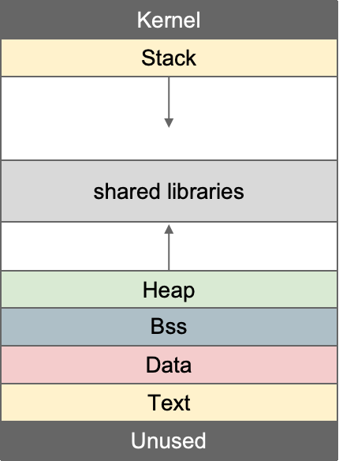
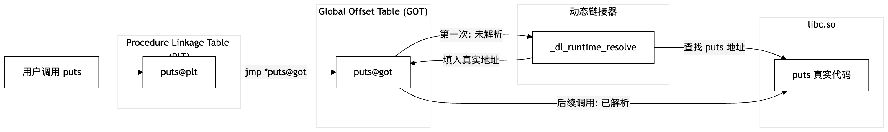
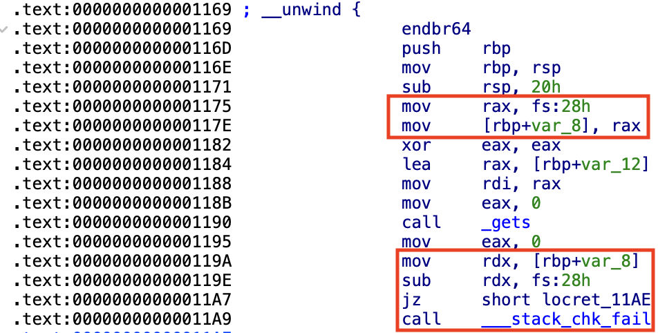

---
title:
separator: <!-- s -->
verticalSeparator: <!-- v -->
theme: simple
highlightTheme: monokai-sublime
css:
    - custom.css
revealOptions:
    transition: 'slide'
    transitionSpeed: fast
    center: false
    slideNumber: "c/t"
    width: 1000
---

<!-- .slide: data-background="./pwn-lec2/background-overlay.png" -->

<div class="middle center">
<div style="width: 100%">

# pwn专题二 ROP

徐易天 @Eclipsky 2026.7.14

</div>
</div>

<!-- s -->
<!-- .slide: data-background="./pwn-lec2/background-pure.png" -->

## Table of contents

- From stack overflow to ROP

- ROP Basics

- ret2plt & ret2libc

- ROP Tricks

<!-- s -->
<!-- .slide: data-background="./pwn-lec2/background-overlay.png" -->

<div class="middle center">
<div style="width: 100%">

# part 0 From stack overflow to ROP

</div>
</div>

<!-- v -->
<!-- .slide: data-background="./pwn-lec2/background-pure.png" -->

## Review: 内存布局

<div class="mul-cols">
<div class="col">

- stack:局部变量,rbp,返回地址...

- heap:通过malloc分配的内存

- bss,data:全局变量，字符串...

- text:代码段

</div>
<div class="col">

</div>
</div>

<!-- v -->
<!-- .slide: data-background="./pwn-lec2/background-pure.png" -->

## Review: 调用约定

64位 Linux 下，函数参数依次进入：

```text
rdi, rsi, rdx, rcx, r8, r9, stack
```

返回值在：

```text
rax
```

<!-- v -->
<!-- .slide: data-background="./pwn-lec2/background-pure.png" -->

## Review: linux基本保护

- ASLR (Address Space Layout Randomization)
- RELRO (Relocation Read-Only)
- Canary
- NX (No-eXecute)
- PIE (Position Independent Executable)

用checksec查看二进制保护情况

<!-- v -->
<!-- .slide: data-background="./pwn-lec2/background-pure.png" -->

## RELRO GOT表和PLT表——延迟绑定技术

What happended when we call a glibc function (for example,printf)?

由于ASLR的存在，每次程序运行动态链接库的加载地址不确定



<!-- v -->
<!-- .slide: data-background="./pwn-lec2/background-pure.png" -->

## RELRO

**what if we override .got.plt?** 😈

假如能把printf的got表覆写为system

printf("sh")  -->  system("sh")

- Full RELRO
    - 编译时加入 -z now 参数
    - 在程序启动时完成所有动态链接（没有延迟绑定）
    - got表不可写

<!-- v -->
<!-- .slide: data-background="./pwn-lec2/background-pure.png" -->

## Canary

函数开始时在栈底插入一个int64随机值，返回时检查是否被修改，如果被修改，则中止程序

默认开启，编译时加入-fno-stack-protector参数关闭canary保护

特性: canary值的最低字节为0

<div class="center">

</div>

<!-- v -->
<!-- .slide: data-background="./pwn-lec2/background-pure.png" -->

## Review: Stack overflow能做什么

<div class="mul-cols">
<div class="col">

- 溢出破坏局部变量
    - 破坏数据流
- 溢出破坏栈指针(rbp)
    - 栈迁移
- 溢出破坏返回地址
    - 破坏控制流

</div>
<div class="col">

</div>
</div>

<!-- v -->
<!-- .slide: data-background="./pwn-lec2/background-pure.png" -->

## From stack overflow to ROP

在上节课的例子，我们通过溢出破坏返回地址，跳到后门函数实现了getshell

What if
- 后门函数需要参数
- 后门函数不在程序中

...

<!-- s -->
<!-- .slide: data-background="./pwn-lec2/background-overlay.png" -->

<div class="middle center">
<div style="width: 100%">


# part 1 ROP Basics

</div>
</div>

<!-- v -->
<!-- .slide: data-background="./pwn-lec2/background-pure.png" -->

## ROP

> 返回导向编程 (Return Oriented Programming)，其主要思想是在 栈缓冲区溢出的基础上，利用程序中已有的小片段 (gadgets) 来改变某些寄存器或者变量的值，从而控制程序的执行流程。
    <p align="right">——ctf wiki</p>

<!-- v -->
<!-- .slide: data-background="./pwn-lec2/background-pure.png" -->

## gadget

gadget 通常是程序中以 `ret` 结尾的小指令片段。

常见 gadget：

```asm
pop rdi
ret

pop rsi
ret

syscall
ret
...
```

<!-- v -->
<!-- .slide: data-background="./pwn-lec2/background-pure.png" -->

## ROP chain

```text
padding
pop_rdi_ret <- previous ret addr
arg1
target_func
```

对应效果：

```c
target_func(arg1);
```

关键点：

- 栈上的数据同时充当数据和控制流
- 每个 gadget 消耗若干栈内容
- `ret` 将控制权交给下一个 gadget 或函数

合理组合gadget，就可以控制程序执行较为复杂的逻辑


<!-- v -->
<!-- .slide: data-background="./pwn-lec2/background-pure.png" -->

## ROPgadget

查找 gadget：

```bash
ROPgadget --binary ./pwn
```

筛选 `rdi`：

```bash
ROPgadget --binary ./pwn | grep "pop rdi"
```

也可以用 pwntools：

```python
elf = ELF("./pwn")
rop = ROP(elf)
pop_rdi = rop.find_gadget(["pop rdi", "ret"])[0]
```

<!-- v -->
<!-- .slide: data-background="./pwn-lec2/background-pure.png" -->

## Practice time - passkey

> basic rop(ret2text)

<!-- s -->
<!-- .slide: data-background="./pwn-lec2/background-overlay.png" -->

<div class="middle center">
<div style="width: 100%">

# part 2 ret2plt & ret2libc

</div>
</div>

<!-- v -->
<!-- .slide: data-background="./pwn-lec2/background-pure.png" -->

## ret2plt

前面提到过，调用外部函数是通过延迟绑定技术实现的

那么如果是程序中使用到的外部函数，即使不知道它的实际地址，也可以通过 plt 表调用它

<!-- v -->
<!-- .slide: data-background="./pwn-lec2/background-pure.png" -->

## ret2plt: call imported function

如果程序导入了 `system`，并且有 `"/bin/sh"` 字符串：

```text
padding
pop rdi; ret
binsh_addr
system@plt
```

等价于：

```c
system("/bin/sh");
```

限制：

- 只能调用程序已经导入的函数，真实程序里通常不会直接导入 `system`
- PIE 开启时需要知道程序基地址

<!-- v -->
<!-- .slide: data-background="./pwn-lec2/background-pure.png" -->

## ret2plt: leak address

如果没有 `system@plt`，`puts@plt` 仍然很有用。

```text
padding
pop rdi; ret
puts@got
puts@plt
main
```

等价于：

```c
puts(puts_got);
main();
```

这样可以泄露 `puts` 在 libc 中的真实地址。

<!-- v -->
<!-- .slide: data-background="./pwn-lec2/background-pure.png" -->

## practice time - ret2plt

> pie ret2plt

<!-- v -->
<!-- .slide: data-background="./pwn-lec2/background-pure.png" -->

## ret2libc

- 需要泄露 libc 地址
- 只要知道libc加载的基地址，就可以任意调用 libc 中的函数
- 大部分gadget(比如`pop rdi; ret`)都可以在libc中找到

```text
libc_base = leaked_puts - libc.sym["puts"]
system    = libc_base + libc.sym["system"]
binsh     = libc_base + next(libc.search(b"/bin/sh\x00"))
```
<!-- v -->
<!-- .slide: data-background="./pwn-lec2/background-pure.png" -->

## practice time - rop1

> canary ret2libc

<!-- s -->
<!-- .slide: data-background="./pwn-lec2/background-overlay.png" -->

<div class="middle center">
<div style="width: 100%">

# part 3 ROP Tricks

</div>
</div>

<!-- v -->
<!-- .slide: data-background="./pwn-lec2/background-pure.png" -->

## one_gadget

`one_gadget` 可以在 libc 中寻找一些能直接 getshell 的 gadget。

用法：

```bash
one_gadget ./libc.so.6
```

示例输出通常会带约束条件：

```text
0xe3afe execve("/bin/sh", r15, r12)
constraints:
  [r15] == NULL || r15 == NULL
  [r12] == NULL || r12 == NULL
```

<!-- v -->
<!-- .slide: data-background="./pwn-lec2/background-pure.png" -->

## ORW with ROP

如果远程环境禁止 `execve("/bin/sh")`，或者题目不希望直接 getshell，可以用 ROP 做 ORW。

ORW:

```text
open("flag", 0)
read(fd, buf, size)
write(1, buf, size)
```

它和 shellcode ORW 的目标一样，只是执行方式不同

<!-- v -->
<!-- .slide: data-background="./pwn-lec2/background-pure.png" -->

## stack pivoting

有些栈溢出题可以覆盖返回地址，但溢出长度很短。

例如只能控制：

```text
saved rbp
return address
```

这时放不下完整 ROP chain。

解决思路：

- 先把长 ROP chain 写到可控内存
- 做 stack pivoting，把栈迁移到可控内存

<!-- v -->
<!-- .slide: data-background="./pwn-lec2/background-pure.png" -->

## leave; ret

leave ret是函数结尾的常见指令：

```asm
leave
ret
```

等价于：

```asm
mov rsp, rbp
pop rbp
ret
```

控制 `rbp`，再执行 `leave; ret`，就能间接控制 `rsp`。

<!-- s -->
<!-- .slide: data-background="./pwn-lec2/background-pure.png" -->

## 作业
    
共3道练习题，以及bonus

具体要求后续会发布在课程网站

<!-- s -->
<!-- .slide: data-background="./pwn-lec2/background-overlay.png" -->

<div class="middle center">
<div style="width:100%">

# Good luck have fun🔨

</div>
</div>
