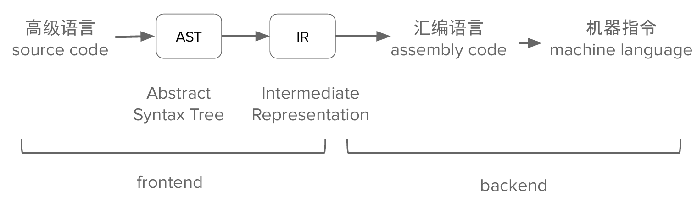
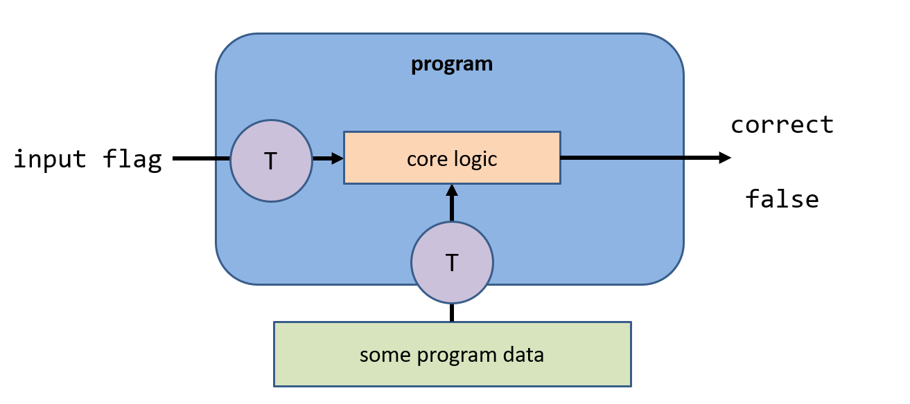
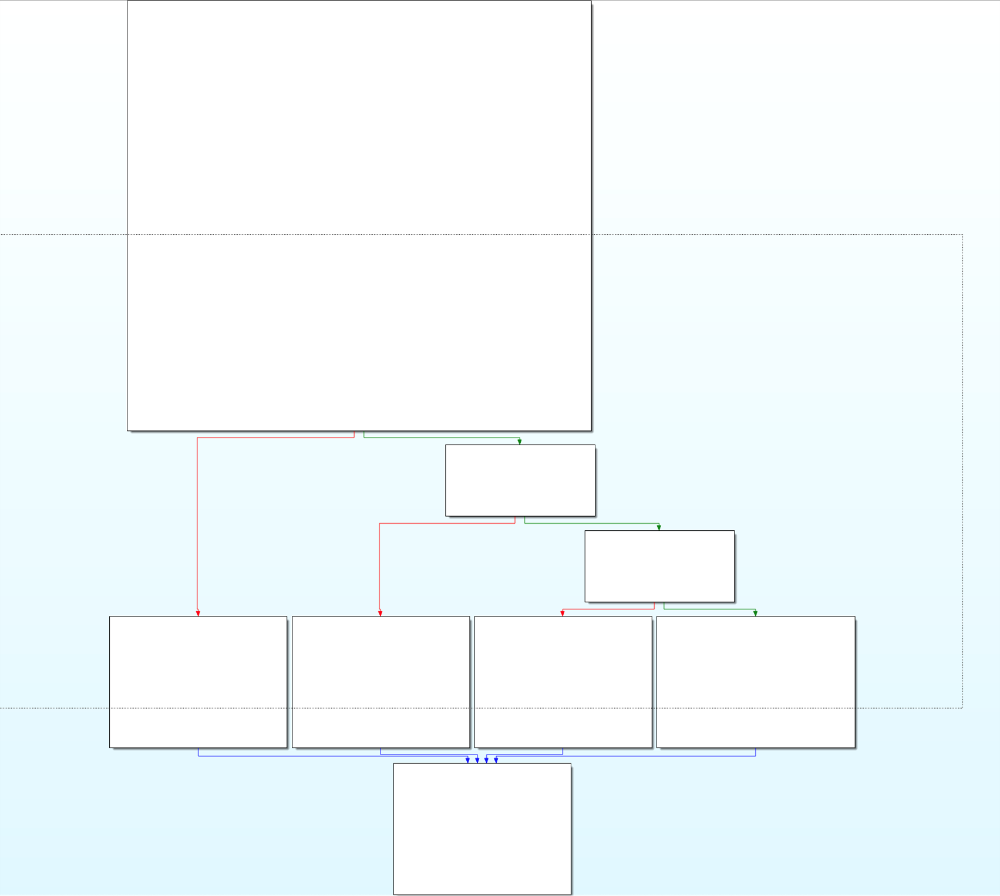
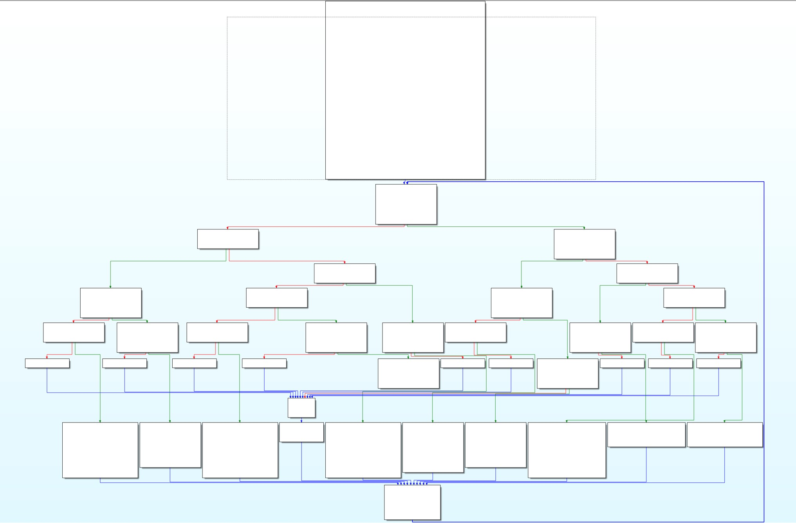
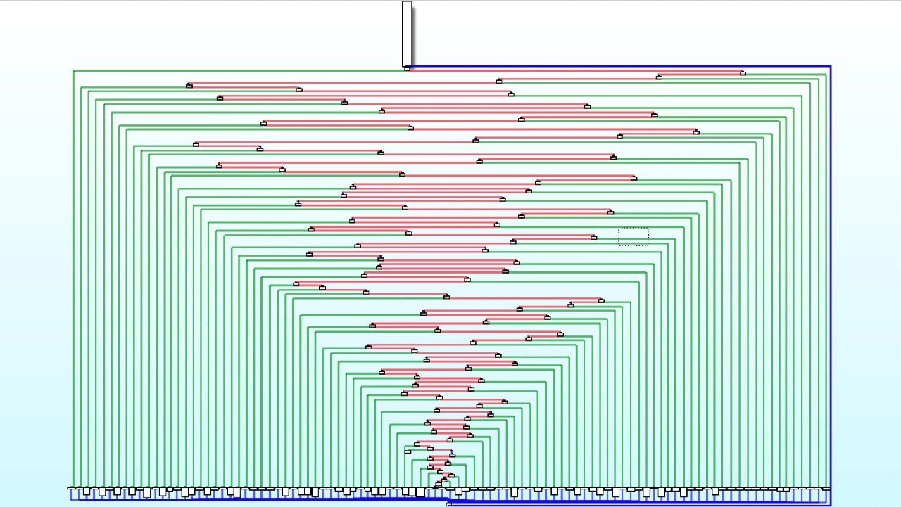
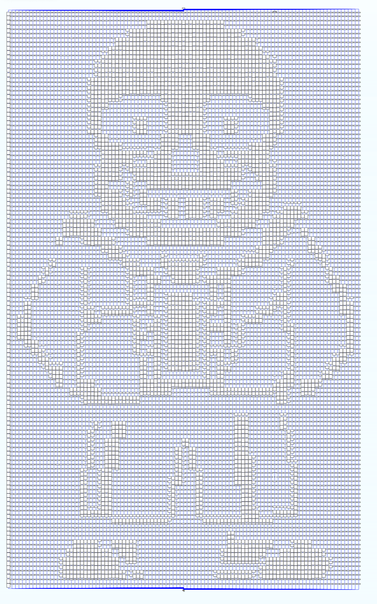

<style>
@import url('https://cdn.jsdelivr.net/npm/lxgw-wenkai-webfont@1.1.0/style.css');

  /* html * {
    font-family: 'LXGW WenKai', sans-serif !important;
} */
    .button-container {
    display: flex;
    align-items: center;
    justify-content: center;
    gap: 20px;
    position: relative;
    width: 100%; 
}


        .button {
            display: flex;
            align-items: center;
            justify-content: center;  
            text-decoration: none;
            border: 1px solid #ddd;
            padding: 0; 
            border-radius: 50%;  
            width: 85px; 
            height: 85px; 
            transition: transform 0.3s ease, border-color 0.3s ease;  
            cursor: pointer;
            overflow: hidden;
        }

        .button img {
            width: 100%;  
            height: 100%;  
            object-fit: cover;  
            border-radius: 50%;  
        }

        .button:hover {
            transform: scale(1.1);
            border-color: rgba(0, 123, 255, 0.2);
            box-shadow: 0 2px 10px rgba(0, 123, 255, 0.2); 
        }

        .button-container .button-text {
            position: absolute; 
            top: 50%;
            left: 100%;  
            transform: translateY(-50%); 
            opacity: 0;  
            visibility: hidden;  
            transition: opacity 0.3s ease, visibility 0.3s ease;
            white-space: nowrap; 
            font-size: 20px;
        }
</style>

<!-- .slide: data-background="rev-lec1/background.png" -->

<br>
<br>
<br>
<center><h5 style="font-size: 55px; text-align: center;">Reverse基础: 程序编译/工具使用</h5></center>
<br>
<br>
<center><h1 style="font-size: 30px; text-align: center;">2025.7.10</h1></center>
<br>
<center><div class="button-container" >
    <button class="button" onclick="toggleContent()" title = "Click to see more about me">
          
    </button>
    <span>张曹琛 @Das Schloss</span>
</div></center>


<!--s-->
<!-- .slide: data-background="rev-lec1/background.png" -->

<div class="middle center">
<div style="width: 100%">


# Part.0 准备工作

</div>
</div>

<!--v-->
<!-- .slide: data-background="rev-lec1/background.png" -->

## 准备工作

一些需要安装的工具

- linux / windows 环境
- IDA / ghidra
- gdb (pwndbg plugin)
- x64dbg / ollydbg


<!--v-->
<!-- .slide: data-background="rev-lec1/background.png" -->

## 什么是逆向

- 如何生成付费软件的注册码？

- 游戏外挂是怎么做出来的？

- 某些日常使用的 APP 偷偷做了什么？

<!--v-->
<!-- .slide: data-background="rev-lec1/background.png" -->

## 关于逆向赛题

- 一杯茶、一包薯片、一个逆向做一天😭
- 赛题加密部分涉及密码学、数学知识；学无止境
- 大量可用工具；学无止境 plus
- 逆向核心逻辑十分复杂枯燥；学无止境 plus++

- 与开发联系紧密 
    - 语言 C/C++ Python Java C# Javascript Go Rust 以及各种汇编语言
    - 平台 Linux Windows macOS 跨平台
    - 架构 x86 ARM RISC-V

<!--v-->
<!-- .slide: data-background="rev-lec1/background.png" -->

## 逆向参考资料

- 参考网站
    - 看雪论坛 https://www.kanxue.com/
    - 吾爱破解 https://www.52pojie.cn/
    - CTF Wiki https://ctf-wiki.org/
- 练习平台
    - ZJU 校巴 https://zjusec.com/
    - 看雪 KCTF（每年举办） https://ctf.kanxue.com/


<!--v-->
<!-- .slide: data-background="rev-lec1/background.png" -->

## 逆向课内容介绍

- 逆向基础 程序编译执行 逆向工具使用

- 逆向专题1 VM 逆向

- 逆向专题2 异架构逆向

<!--v-->
<!-- .slide: data-background="rev-lec1/background.png" -->

## 逆向基础课内容

- 预处理、编译、汇编、链接
- 静态分析工具 IDA ghidra 使用
- 动态分析工具
    - linux gdb
    - windows x32dbg/x64dbg
- 简单介绍
    - 常见算法
    - 代码混淆
    - 壳


<!--s-->
<!-- .slide: data-background="rev-lec1/background.png" -->

<div class="middle center">
<div style="width: 100%">


# Part.1 程序编译和执行流程

</div>
</div>

<!--v-->
<!-- .slide: data-background="rev-lec1/background.png" -->

## 编译 vs 汇编

- 编译(compile): 高级语言->汇编语言
- 汇编(assemble): 汇编语言->机器语言




- 反汇编: 汇编语言->机器语言 （查表 准确）
- 反编译: 高级语言<-汇编语言 （不准确）

<!--v-->
<!-- .slide: data-background="rev-lec1/background.png" -->

## 编译(汇编) vs 链接

- 编译(汇编): 从源代码->目标文件
- 链接: 目标文件->可执行文件

<!--v-->
<!-- .slide: data-background="rev-lec1/background.png" -->

## 例 0-1 使用 gcc 编译 hello.c

```sh
sudo apt install gcc
```

- file 查看文件的类型
- readelf 查看elf文件信息

```sh
# 仅预处理；不编译、汇编或链接
gcc -E hello.c -o hello.i

# 只编译；不汇编或链接
gcc -S hello.c # -o hello.s

# 编译和汇编，但不链接
gcc -c hello.c # -o hello.o

# 编译、汇编和链接
gcc hello.c -o hello
```

<!--v-->
<!-- .slide: data-background="rev-lec1/background.png" -->

## 例 0-2 使用 clang 编译 hello.c

```sh
sudo apt install clang
```

clang 是基于 llvm 的编译器，可以获取程序的中间表示形式 LLVM IR

```sh
# 文本形式的 LLVM IR
clang -S -emit-llvm hello.c # -o hello.ll

# Bitcode 形式的 LLVM IR
clang -c -emit-llvm hello.c # -o hello.bc

# LLVM BC -> LLVM IR
sudo apt install llvm
llvm-dis hello.bc -o hello.ll

# LLVM BC 分析工具
llvm-bcanalyzer -dump hello.bc
```

<!--v-->
<!-- .slide: data-background="rev-lec1/background.png" -->

## 俯瞰一下逆向的赛题


<!--s-->
<!-- .slide: data-background="rev-lec1/background.png" -->

<div class="middle center">
<div style="width: 100%">


# Part.2 工具使用和例题讲解

</div>
</div>

<!--v-->
<!-- .slide: data-background="rev-lec1/background.png" -->

## ghidra

开源逆向工具，依赖 JAVA 环境，多平台运行

linux: 

```sh
sudo apt install openjdk-21-jdk
./ghidraRun
```

windows:

```sh
ghidraRun.bat
```

具有反编译，字符串搜索等功能

<!--v-->
<!-- .slide: data-background="rev-lec1/background.png" -->

## gdb

- 原版的gdb使用非常折磨
- 推荐gef或pwndbg等插件
- 运行 r
- 打断点 b *0x400000 / b <func_name>
- 继续运行 c
- 步进(进入函数) s/si
- 步过(跳过函数) n/ni
- 查看内存和数据 tele / print / x
- 和 pwntools 的集成
    - gdb.debug(...)


<!--v-->
<!-- .slide: data-background="rev-lec1/background.png" -->

## x64dbg

- 常用的快捷键
    - 下断点 `F2`
    - 步进 `F7`
    - 步入 `F8`
    - 继续运行 `F9`
- 插件安装（比如：反-反调试）
    - 官方插件 ScyllaHide
    - Ollydbg 中有 StrongOD 等相似插件
  
<!--v-->
<!-- .slide: data-background="rev-lec1/background.png" -->

## IDA

- 常用的快捷键
    - 反编译 `F5`
    - 查看字符串 `Shift+F12`
    - 交叉引用 `x`
    - 地址跳转 `g`
- 动态调试
  
<!--v-->
<!-- .slide: data-background="rev-lec1/background.png" -->

## 休息一下吧

<!--s-->
<!-- .slide: data-background="rev-lec1/background.png" -->

<div class="middle center">
<div style="width: 100%">


# Part.3 常见算法，代码混淆和壳

</div>
</div>

<!--v-->
<!-- .slide: data-background="rev-lec1/background.png" -->

## 常见算法

- TEA / XTEA / XXTEA
- RC4
- AES / DES
- “魔改”

<!--v-->
<!-- .slide: data-background="rev-lec1/background.png" -->

## 代码混淆

- 混淆 -> 用于增加理解和反编译难度
- 花指令（junk code）是一种专门用来迷惑反编译器的指令片段，这些指令片段不会影响程序的原有功能，但会使得反汇编器的结果出现偏差，从而使破解者分析失败。如利用jmp 、call、ret 指令改变执行流
- 自修改代码（Self-Modified Code）是一类特殊的代码技术，即在运行时修改自身代码，从而使得程序实际行为与反汇编结果不符。
- 控制流平坦化 ollvm

<!--v-->
<!-- .slide: data-background="rev-lec1/background.png" -->

## ollvm

<div style="display: flex; justify-content: space-around;">
  
  
  
</div>

- 🤔----------ollvm---->😠💢------------->😭👊

<!--v-->
<!-- .slide: data-background="rev-lec1/background.png" -->

## Masterpiece

<div style="display: flex; justify-content: space-around;">
  
</div>


<!--v-->
<!-- .slide: data-background="rev-lec1/background.png" -->

## 壳

- 压缩壳: upx、PECompat 等
- 加密壳: VMProtect
- 查壳软件（如 DIE, PEiD）
- 自动化工具脱壳（如 upx, PEiD plugin）
- 手动脱壳 用动态调试工具（ESP 定律）

<!--s-->
<!-- .slide: data-background="rev-lec1/background.png" -->

<div class="middle center">
<div style="width: 100%">


# Part.4 其他

</div>
</div>


<!--v-->
<!-- .slide: data-background="rev-lec1/background.png" -->

## 展望

- LLM 时代，知识获取难度大幅降低，勤查资料，多问问题

- ida python 脚本

- 加壳和脱壳技术

- 混淆以及解混淆技术

- 更多编程语言、架构和平台的逆向

- LLM agent


<!--v-->
<!-- .slide: data-background="rev-lec1/background.png" -->

## 作业 reverse lab1

- Homework 1：使用 g++ 以及 clang++ 编译 rev_begin.cpp，复现预处理-编译-汇编-链接流程，并使用静态调试（IDA、ghidra 或者其他）以及动态调试（gdb、x64dbg 或者其他）工具进行简单分析
- Homework 2：逆向 linux 程序 rev_more
- Homework 3：逆向 windows 程序 rev_again


<!--s-->
<!-- .slide: data-background="rev-lec1/background.png" -->

<div class="middle center">
<div style="width: 100%">


# 谢谢大家

---

# questions?

</div>
</div>
