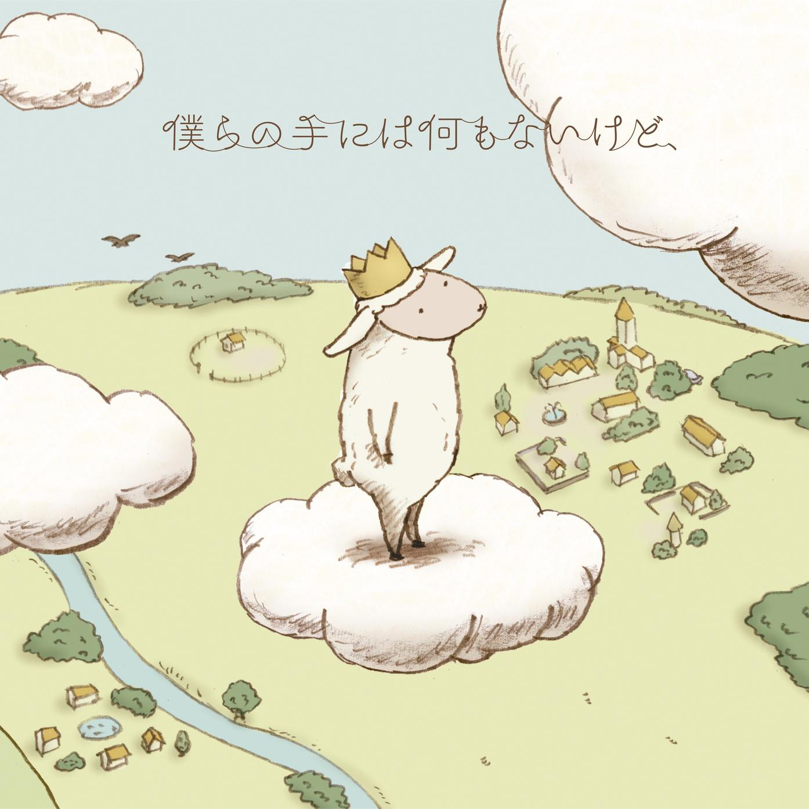

<!-- .slide: data-background="rev-lec2/background.png" -->

 
 
 

<h5 style="font-size: 55px; text-align: center;">Reverse专题一: 游戏/异架构逆向</h5>

 
 

<h1 style="font-size: 30px; text-align: center;">2025.7.9</h1>

 

    <button class="button" onclick="toggleContent()" title = "Click to see more about me">
          
    </button>
    黄一航 @huayi

<!--s-->
<!-- .slide: data-background="rev-lec2/background.png" -->

# Part.0 准备工作

<!--v-->
<!-- .slide: data-background="rev-lec2/background.png" -->

## 准备工作

一些需要安装的工具

- windows环境
- CE
- x64dbg/ollydbg

<!--v-->
<!-- .slide: data-background="rev-lec2/background.png" -->

## 逆向专题一内容

- 异架构以及不同语言的逆向——本质 各种架构介绍
- 游戏逆向——目的  示例游戏的编写语言 游戏引擎
- 6502汇编 NES （BeginCTF红白机）

- Windows下的游戏逆向（pvz CE）

- Python逆向（反编译pyc）

- 古早Java游戏（诺基亚贪吃蛇）

- Javascript逆向（网页小游戏+代码混淆）

- Unity游戏逆向（C# dnspy）

<!--s-->
<!-- .slide: data-background="rev-lec2/background.png" -->

# Part.1 红白机和GBA

<!--v-->
<!-- .slide: data-background="rev-lec2/background.png" -->

## 红白机（NES）和6502

<!--v-->
<!-- .slide: data-background="rev-lec2/background.png" -->

## GBA

<!--s-->
<!-- .slide: data-background="rev-lec2/background.png" -->

# Part.2 JAVA和诺基亚

<!--v-->
<!-- .slide: data-background="rev-lec2/background.png" -->

## Java

- 编译型语言，编译得到 Java 字节码
  - 通过解释字节码实现跨平台
- 反编译工具
  - JD-GUI / Jadx / Fernflower
- Android 逆向
  - 采用的是 Dalvik 字节码 / Smali
  - apktool / frida / Android Studio
- 综合性较强的题目
  - 涉及到 Java 反射 / 字节码操作 / 本地方法

<!--s-->
<!-- .slide: data-background="rev-lec2/background.png" -->

# Part.3 Windows游戏逆向示例-PvZ

<!--s-->
<!-- .slide: data-background="rev-lec2/background.png" -->

# Part.4 其他语言的逆向

<!--v-->
<!-- .slide: data-background="rev-lec2/background.png" -->

## Python
- Python 在 import 时会生成 .pyc 文件
  - 可以通过 uncompyle6 反编译

<!--v-->
<!-- .slide: data-background="rev-lec2/background.png" -->

## Javascript

<!--s-->
<!-- .slide: data-background="rev-lec2/background.png" -->

# 谢谢大家
---
# questions?

