<!-- .slide: class="cover-slide" -->

<span class="kicker">Reverse 专题</span>

# VM 逆向：造一台机器，拆一台机器

<p style="font-size: 0.55em; opacity: 0.9; margin-top: 6px;">初探虚拟机保护的设计思路与逆向</p>

<div class="meta-corner">
<p>l1ttl3f41ry</p>
<p>2026年7月</p>
</div>

<!--v-->

## Outline

- 开胃菜：simple vm 现场演示
- VM 是什么？为什么要做 VM？
- **正向**：如何造一个 VM
- **逆向**：如何理解一个 VM 在干什么
    - 例题：NoRegVM / easyvm
    - trace 技巧、CTF 题目 trick

<!--s-->

<div class="middle center">
<div style="width: 100%">

# Part.1 开胃菜

</div>
</div>

<!--v-->

## 开胃菜：simple vm

- 一个超级简单的 VM，用 opcode 去查表找到对应的指令操作
- 先建立直觉：VM 题的核心动作就是「看 opcode → 找对应操作 → 执行」
- 后面所有内容，都是这个直觉的展开和复杂化

<!--s-->

<div class="middle center">
<div style="width: 100%">

# Part.2 VM 是什么

</div>
</div>

<!--v-->

## VM 是什么？

VM 的本质：在真实机器之上，再定义一台**「软件里的机器」**

- 你可以自己规定它的指令、内存、寄存器、权限……
- 它不是必须和物理机长得一样——指令集、内存模型都可以是自定义的
- 之后我们看到的所有"自定义 VM"CTF 题，都是这句话的具体实现

<!--v-->

## 为什么要做 VM？

<div class="notch-box" style="margin-top: 10px;">
<div class="tab">VM 的四种目标</div>

| 类型 | 目标 | 例子 |
| --- | --- | --- |
| 系统级 VM | 虚拟一整台机器 | VMware, VirtualBox, KVM, QEMU |
| 语言/运行时 VM | 虚拟一套程序执行环境 | JVM, CLR, Python VM, Lua VM, Dalvik/ART |
| 安全/沙箱 VM | 限制不可信代码 | WebAssembly, eBPF, EVM, 浏览器 sandbox |
| 保护/混淆 VM | 隐藏程序真实语义 | VMProtect, Themida, CTF custom VM |

</div>

<aside class="notes">
四种类型，覆盖了大家能想到的几乎所有"虚拟机"概念。本节课重点讲最后一类。
</aside>

<!--v-->

## 跑异构的程序

在一台物理机上，用多种虚拟的操作系统

- 大家脑子里最先跳出来的"虚拟机"：VMware、QEMU，还有游戏机模拟器
- 这是最直觉的一种 VM，但不是今天的重点

<!--v-->

## 抽象硬件 / 隔离与沙箱

- **抽象硬件**：一次编写，到处运行
    - 程序不直接面向 x86 / ARM / RISC-V，而是面向一个中间机器
    - 只要不同平台上都实现了这个 VM，程序就能跑
- **隔离与沙箱**：把程序关在笼子里跑
    - VM/宿主拦截所有"越界动作"（系统调用、内存访问、外部资源），逐条翻译或过滤后才放行，不可信代码的破坏半径就被关在这层边界里
    - 例如 Android：每个 App 跑在自己的 Dalvik/ART VM 实例里，独立 UID，访问相机、联系人、存储都要经权限系统在这层边界上过一遍——App 之间、App 和系统之间天然隔开


<div class="cards" style="grid-template-columns: repeat(4, 1fr); margin-top: 20px;">
<div class="notch-box">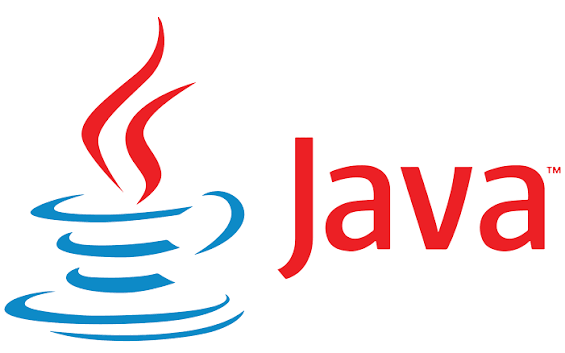</div>
<div class="notch-box"></div>
<div class="notch-box"></div>
<div class="notch-box">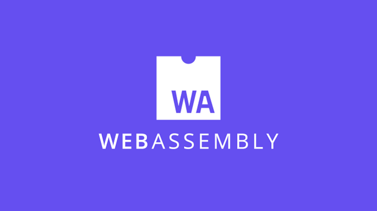</div>
</div>

<aside class="notes">
例子：Java VM，Python VM，Android Dalvik/ART，WebAssembly……
</aside>

<!--v-->

## 保护知识产权：混淆、加壳、反逆向

**（本节课重点）**

- 原来逆向者面对的是"读一段机器码"
- VM 保护后，逆向者面对的是**「先考古出一台机器，再读跑在这台机器上的程序」**
- IDA、Ghidra 等现成的自动化分析工具也会变得没那么有效
    - 因为它们不懂各种自定义、魔改的机器规则，自然无从自动解析

<!--v-->

## \*为啥讲 VM？

<p class="lead" style="font-size: 0.68em; line-height: 1.6;">
VM 保护效果好，很大程度上就是因为解析起来要投入的精力比较多、流程繁琐。<br>
但 AI 的能力恰恰适合解析这些繁琐的流程。<br>
人类则可以专注于思维和指挥，不用再迷失于重复劳动、烦人的基础操作。
</p>

<!--v-->

## 作业预告：出题与解题

<div class="cols" style="grid-template-columns: 1fr 1fr; align-items: stretch; margin-top: 16px; font-size: 0.72em;">
<div class="notch-box" style="margin-right: 8px;">
<div class="tab">出题　50% + bonus 5%</div>
<p style="margin: 12px 0 16px 0;">出一个基于 VM 的 CTF 逆向题目</p>
<ul style="line-height: 2; padding-left: 22px; margin: 0;">
<li>题目附件压缩包（程序 + README/description）<strong style="color: var(--accent);">10%</strong></li>
<li>出题 report<strong style="color: var(--accent);">40%</strong></li>
</ul>
</div>
<div class="notch-box" style="margin-left: 8px;">
<div class="tab">解题　50%+ bonus 10%</div>
<p style="margin: 12px 0 16px 0;">解一道 VM 题（自解or互解）</p>
<ul style="line-height: 2; padding-left: 22px; margin: 0;">
<li>题目附件<strong style="color: var(--accent);">&lt;1%</strong>（但得交）</li>
<li>writeup<strong style="color: var(--accent);">50%</strong></li>
</ul>
</div>

</div>

<p style="font-size: 0.6em; margin-top: 24px; color: var(--ink-faint);">
可以理解为rev1专题考虑bonus后，满分 115 分。
</p>


<!--v-->

## 出题：难度不是唯一标准

<div class="notch-box" style="margin-top: 10px;">
<div class="tab">基础分</div>
<p style="font-size: 0.65em; line-height: 1.7; margin: 10px 0;">
不以代码规模、混淆强度或"能不能不被 AI 一把梭"作为唯一评价标准。<br>
只要 <strong>VM 架构自洽</strong>、<strong>核心校验逻辑确实运行在 VM 中</strong>、<strong>题目可稳定复现</strong>，并且 report 讲清楚设计思路，就能拿到较高的基础分。
</p>
</div>

<div class="notch-box" style="margin-top: 16px;">
<div class="tab">bonus</div>
<p style="font-size: 0.65em; line-height: 1.7; margin: 10px 0;">
有意识的设计：指令集设计、bytecode 编码、dispatcher 隐藏、控制流/数据流复杂化、反侧信道考虑、自动化分析难点、有意识的反 AI 设计……
</p>
<p style="font-size: 0.6em; line-height: 1.7; margin: 10px 0; color: var(--ink-faint);">
加分点不是简单地"把别人/AI 难住"——而是能清楚说明：采取了哪些保护措施，这些措施具体增加了哪些分析成本，以及你如何保证题目仍然可解。
</p>
</div>

<p style="font-size: 0.62em; margin-top: 16px;">
我们鼓励<strong>有设计意图</strong>的 VM 题，而不是不可解、不可复现、或单纯堆工作量的题。
</p>

<!--v-->

## Bonus tips：想让 VM 保护效果好？

<div class="cards" style="grid-template-columns: repeat(2, 1fr); margin-top: 10px;">
<div class="notch-box"><div class="tab">1. 反侧信道</div><p style="font-size: 0.58em; line-height: 1.6; margin: 8px 0;">flag 核心校验逻辑如何防止侧信道等绕过 VM 保护的手段？</p></div>
<div class="notch-box"><div class="tab">2. 控制流复杂化</div><p style="font-size: 0.58em; line-height: 1.6; margin: 8px 0;">如何让控制流更加复杂，增加静态分析成本？</p></div>
<div class="notch-box"><div class="tab">3. 藏特征</div><p style="font-size: 0.58em; line-height: 1.6; margin: 8px 0;">如何藏起明显特征，让人更难找到 dispatcher、state 等？</p></div>
<div class="notch-box"><div class="tab">4. 又臭又长</div><p style="font-size: 0.58em; line-height: 1.6; margin: 8px 0;">如何让执行流又臭又长，加大 trace 分析的工作量？</p></div>
</div>

<p style="font-size: 0.55em; margin-top: 16px; color: var(--ink-faint);">
（仅供参考，不是必须全都做到——挑一两个方向做深，比全都浅尝更有说服力）
</p>

<!--v-->

## 解题：writeup 要求

<div class="notch-box" style="margin-top: 10px;">
<div class="tab">自包含 · 从解题者角度写</div>
<ul style="font-size: 0.72em; line-height: 2; padding-left: 22px; margin: 14px 0;">
<li>写清楚对应的题目、出题人信息</li>
<li>完全从题目给出的信息逆向出来（这也要求出题人不能出不可解的题，例如不可逆加密）</li>
<li><strong>自包含</strong>：没看过题目、没做过研究的人也能看懂——需要解释现象和思考过程，不能只贴结论</li>
</ul>
</div>

<div class="notch-box" style="margin-top: 16px;">
<div class="tab">展示试错过程</div>
<p style="font-size: 0.68em; line-height: 1.8; margin: 12px 0;">
解题很少一帆风顺，踩过的坑、遇到的难关，值得分享。<br>
<span style="color: var(--ink-faint);">一路到底、隐去所有探索分支的 writeup 适合比赛提交，但不适合经验交流——尤其是 AI 一键生成的 WP，看多了会审美疲劳。</span>
</p>
</div>

<p style="font-size: 0.65em; margin-top: 16px;">
可以找同学解对方出的题（比较有趣），也可以自己出自己解——<strong>但题解同样要从解题者角度写</strong>。
</p>

<!--v-->


## 评分细则：出题 50% + bonus 5%

<div style="font-size: 0.6em; margin-top: 10px;">
<table style="width: 100%;">
<colgroup><col style="width: 60%;"><col style="width: 40%;"></colgroup>
<thead><tr><th>评分项</th><th>占比</th></tr></thead>
<tbody>
<tr><td>附件能在指定环境稳定运行（推荐 x86_64 Linux/Windows）</td><td>10%</td></tr>
<tr><td>自定义 bytecode 格式</td><td>10%</td></tr>
<tr><td>一个解释器，能执行若干条虚拟指令</td><td>10%</td></tr>
<tr><td>flag / 输入校验的核心逻辑必须主要发生在 VM bytecode 中</td><td>10%</td></tr>
<tr><td>题目具备可解性（由题解交叉验证）</td><td>10%</td></tr>
<tr><td>report bonus：内容有人味/巧思；技术上如控制流复杂化、编码花活、反 trace/反符号执行、反侧信道</td><td>bonus 5%</td></tr>
</tbody>
</table>
</div>

<!--v-->

## 评分细则：解题 50% + bonus 10%

<div style="font-size: 0.6em; margin-top: 10px;">
<table style="width: 100%;">
<colgroup><col style="width: 60%;"><col style="width: 40%;"></colgroup>
<thead><tr><th>评分项</th><th>占比</th></tr></thead>
<tbody>
<tr><td>正确识别程序中的VM特征，定位到相应部分</td><td>10%</td></tr>
<tr><td>VM 架构恢复（bytecode 格式、opcode 语义、状态存储方式：栈/寄存器/其他巧思）</td><td>30%</td></tr>
<tr><td>程序语义恢复并逆向求解出正确 flag</td><td>10%</td></tr>
<tr><td>WP bonus 内容：有人味、展示试错过程</td><td>bonus 5%</td></tr>
<tr><td>WP bonus 技术：自动化反汇编脚本、VM 模拟器、trace 分析等</td><td>bonus 5%</td></tr>
</tbody>
</table>
</div>

<!--v-->

## 关于 AI 使用：怎么写才不算 slop

<div class="notch-box" style="margin-top: 10px;">
<div class="tab">底线</div>
<p style="font-size: 0.62em; line-height: 1.7; margin: 10px 0;">
不禁止 AI 辅助写 report/writeup，但<strong>浓重的 AI 味会酌情扣分</strong>，有小巧思会酌情加分。交付前请自己通读、审查一遍——如果连自己都不想读下去，大概不会有高分。
</p>
</div>

<div class="cards" style="grid-template-columns: repeat(2, 1fr); margin-top: 16px;">
<div class="notch-box"><div class="tab">总-分结构</div><p style="font-size: 0.56em; line-height: 1.6; margin: 8px 0;">先讲清楚思路，再展开细节——不要一开始就淹没在细节里</p></div>
<div class="notch-box"><div class="tab">讲动机</div><p style="font-size: 0.56em; line-height: 1.6; margin: 8px 0;">不只讲"怎么做"，也讲"为什么这么做"，读起来会舒服很多</p></div>
<div class="notch-box"><div class="tab">详略得当</div><p style="font-size: 0.56em; line-height: 1.6; margin: 8px 0;">不影响思路的无趣细节可以略过，避免又臭又长</p></div>
<div class="notch-box"><div class="tab">言之有物</div><p style="font-size: 0.56em; line-height: 1.6; margin: 8px 0;">内容丰富度适中：不故意堆砌复杂度，也不能没东西可讲</p></div>
</div>

<!--v-->

## FAQ & 范例

<div class="notch-box" style="margin-top: 10px;">
<div class="tab">Q：交的题解是自己题目的，还是别人题目的？</div>
<p style="font-size: 0.62em; line-height: 1.6; margin: 10px 0;">
交你写的题解，可以是解同班别人出的题——请写清楚出题人信息并附上题目附件。
</p>
</div>

<div class="notch-box" style="margin-top: 16px;">
<div class="tab">优质题解范例</div>
<p style="font-size: 0.6em; line-height: 1.7; margin: 10px 0;">
<a href="https://scuffed.online/b01lers-2026/#a-cool-antidecompilation-trick" style="color: var(--accent);">scuffed.online/b01lers-2026 — A Cool Antidecompilation Trick</a>
</p>
<p style="font-size: 0.55em; color: var(--ink-faint); margin: 6px 0 0 0;">题解语言不限，找一个出题质量高、难度适合自己的题目去解，比啥都重要。</p>
</div>

<!--s-->

<div class="middle center">
<div style="width: 100%">

# Part.3 正向：如何造一个 VM？

</div>
</div>

<!--v-->

## Virtualization-based Obfuscation

<div class="cols" style="grid-template-columns: 1.2fr 0.8fr; align-items: stretch;">
<div>
<div class="notch-box">
<div class="tab">常见组成</div>
<ul>
<li>自定义指令集</li>
<li>bytecode interpreter</li>
<li>virtual registers / stack / memory</li>
<li>...</li>
</ul>
</div>
<ul style="margin-top: 20px; list-style: none; padding-left: 0;">
<li style="font-size: 0.62em; line-height: 1.7; padding-left: 18px; position: relative; margin: 10px 0;"><span style="position:absolute;left:0;top:0.6em;width:6px;height:6px;border-radius:50%;background:var(--accent);"></span>整个流程比较像设计一个 mini ISA：设计汇编助记符、字节码，用简单操作实现一台能跑程序的机器</li>
<li style="font-size: 0.62em; line-height: 1.7; padding-left: 18px; position: relative; margin: 10px 0;"><span style="position:absolute;left:0;top:0.6em;width:6px;height:6px;border-radius:50%;background:var(--accent);"></span>它也可能只是能够执行 flag 的解密校验而已</li>
<li style="font-size: 0.62em; line-height: 1.7; padding-left: 18px; position: relative; margin: 10px 0;"><span style="position:absolute;left:0;top:0.6em;width:6px;height:6px;border-radius:50%;background:var(--accent);"></span>在 CTF 中，这个 VM 甚至<strong>不需要图灵完备</strong></li>
</ul>
</div>
<div style="display: flex; align-items: stretch; justify-content: center;">
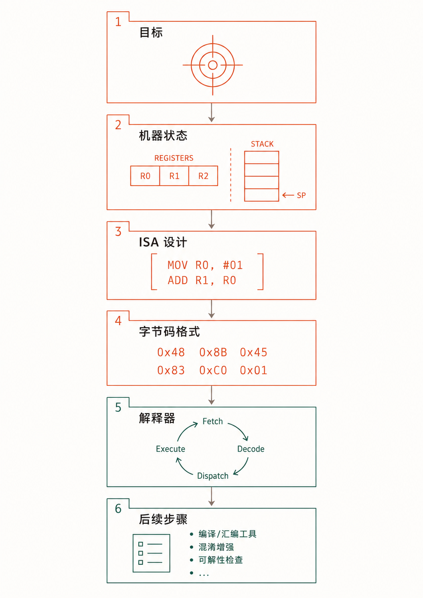
</div>
</div>

<!--v-->

## Step 1：目标是什么？

<div class="cols" style="grid-template-columns: 0.85fr 1.15fr; align-items: stretch;">
<div>
<ul style="list-style: none; padding-left: 0;">
<li style="font-size: 0.6em; line-height: 1.7; padding-left: 18px; position: relative; margin: 10px 0;"><span style="position:absolute;left:0;top:0.6em;width:6px;height:6px;border-radius:50%;background:var(--accent);"></span>这个 VM 是为了做什么？</li>
<li style="font-size: 0.6em; line-height: 1.7; padding-left: 18px; position: relative; margin: 10px 0;"><span style="position:absolute;left:0;top:0.6em;width:6px;height:6px;border-radius:50%;background:var(--accent);"></span>CTF 里通常是：<strong>保护程序（混淆）</strong>，让别人难以逆向</li>
<li style="font-size: 0.58em; line-height: 1.7; padding-left: 34px; position: relative; margin: 6px 0;">例如保护 flag 的加解密过程</li>
</ul>
</div>
<div style="display: flex; align-items: stretch; justify-content: center;">
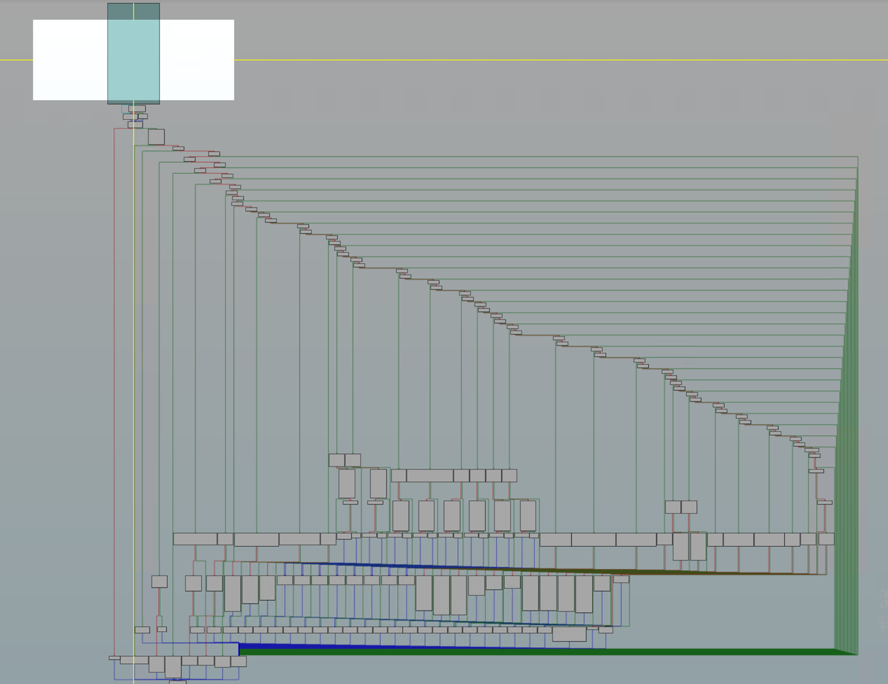
</div>
</div>

<!--v-->

## 实例：我们要造一台什么机器？

<div class="notch-box" style="margin-top: 10px;">
<div class="tab">一台 16 字节 flag checker</div>

<p style="font-size: 0.6em; line-height: 1.6; margin: 12px 0;">
以 <code style="font-size: 0.9em;">my_vm_example</code> 为例，我们要保护的算法是：
</p>

```python
for i = 0..15:
    v = input[i] ^ key[i]
    v = rotate_left(v, 3)
    v = v + i
    fail_acc |= (v ^ target[i])    # 不等时 diff 非 0

result = (fail_acc == 0)
```

<ul style="font-size: 0.68em; line-height: 1.6; margin-top: 16px; list-style: none; padding-left: 0;">
<li style="padding-left: 18px; position: relative; margin: 8px 0;"><span style="position:absolute;left:0;top:0.6em;width:6px;height:6px;border-radius:50%;background:var(--accent);"></span>循环跑满 16 轮，<strong>不提前退出</strong> → 防止侧信道时间攻击</li>
<li style="padding-left: 18px; position: relative; margin: 8px 0;"><span style="position:absolute;left:0;top:0.6em;width:6px;height:6px;border-radius:50%;background:var(--accent);"></span>整个校验逻辑被翻译成 bytecode，由 VM 执行</li>
</ul>
</div>

<aside class="notes">
这就是 Step 1 的具体目标。不用图灵完备，只要这台机器能表达这个算法就够了。
</aside>

<!--v-->

## Step 2-4：机器状态 / Operand / 指令集

<div class="cols" style="grid-template-columns: 0.6fr 1.4fr; align-items: stretch; margin-top: 6px;">
<div>
<ul style="list-style: none; padding-left: 12px; margin: 0;">
<li style="font-size: 0.56em; line-height: 1.55; padding-left: 18px; position: relative; margin: 8px 0;"><span style="position:absolute;left:0;top:0.55em;width:6px;height:6px;border-radius:50%;background:var(--accent);"></span><strong>机器状态</strong>：PC/IP、registers、stack、data memory、inst memory……</li>
<li style="font-size: 0.56em; line-height: 1.55; padding-left: 18px; position: relative; margin: 8px 0;"><span style="position:absolute;left:0;top:0.55em;width:6px;height:6px;border-radius:50%;background:var(--accent);"></span><strong>operand 来自哪里</strong>：很多 VM 指令集也是 stack / accumulator 等风格的</li>
<li style="font-size: 0.56em; line-height: 1.55; padding-left: 18px; position: relative; margin: 8px 0;"><span style="position:absolute;left:0;top:0.55em;width:6px;height:6px;border-radius:50%;background:var(--accent);"></span><strong>设计指令集</strong>：需要哪些指令能完成目标？<br><span style="font-family: 'SF Mono', Menlo, monospace; font-size: 0.92em; color: var(--ink-faint);">ADD, XOR, SLL, SRL, LD, SD, Branch ...</span></li>
</ul>
</div>
<div style="display: flex; flex-direction: column; align-items: center; gap: 2px;">
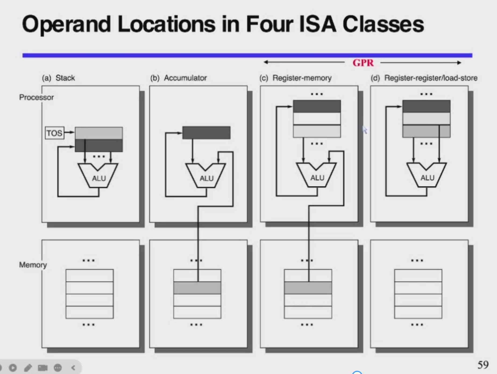
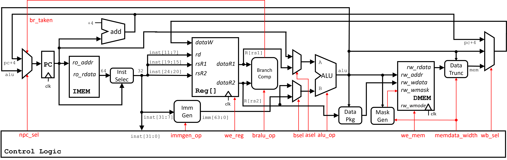
<p class="caption" style="font-size: 0.32em; margin-top: 0;">!?计算机系统I?!</p>
</div>
</div>

<!--v-->

## 实例：机器状态与指令集

<div class="cols" style="grid-template-columns: 1fr 1fr; align-items: stretch; margin-top: 10px; height: 560px; font-size: 0.85em;">
<div class="notch-box" style="margin-right: 8px; display: flex; flex-direction: column;">
<div class="tab">机器状态</div>
<ul style="line-height: 1.5; padding-left: 22px; margin: 0; display: flex; flex-direction: column; justify-content: space-evenly; flex: 1;">
<li><strong>PC</strong>：指令序号（不是字节地址）</li>
<li><strong>r0-r7</strong>：8 个通用寄存器，有效 8 位</li>
<li><strong>ZF</strong>：零标志位</li>
<li><strong>指令内存</strong>：512 × 16bit bytecode</li>
<li><strong>数据内存</strong>：256 字节，分三段
    <ul style="padding-left: 22px; line-height: 1.5; margin-top: 6px;">
    <li>input[0..15]</li>
    <li>key[16..31]</li>
    <li>target[32..47]</li>
    </ul>
</li>
</ul>
</div>
<div class="notch-box" style="margin-left: 8px; display: flex; flex-direction: column;">
<div class="tab">指令集（14 条）</div>
<ul style="line-height: 1.5; padding-left: 22px; margin: 0; display: flex; flex-direction: column; justify-content: space-evenly; flex: 1;">
<li><strong>R-type</strong>：load, store, xor, or, add, cmp</li>
<li><strong>I-type</strong>：movi, addi, roli, cmpi</li>
<li><strong>J-type</strong>：jmp, jz, jnz</li>
<li><strong>特殊</strong>：halt</li>
<li>没有栈、没有函数调用，只用跳转实现循环</li>
</ul>
</div>
</div>

<!--v-->

## 实例：寄存器怎么分配？

<div style="font-size: 0.58em; margin-top: 10px;">
<table style="width: 100%;">
<colgroup><col style="width: 15%;"><col style="width: 35%;"><col style="width: 50%;"></colgroup>
<thead><tr><th>寄存器</th><th>用途</th><th>说明</th></tr></thead>
<tbody>
<tr><td>r0</td><td>in_ptr</td><td>input 当前字节地址</td></tr>
<tr><td>r1</td><td>key_ptr</td><td>key 当前字节地址</td></tr>
<tr><td>r2</td><td>target_ptr</td><td>target 当前字节地址</td></tr>
<tr><td>r3</td><td>i</td><td>循环计数器 / 要加的偏移</td></tr>
<tr><td>r4</td><td>value</td><td>当前正在变换的字节</td></tr>
<tr><td>r5</td><td>tmp</td><td>临时装 key[i] / target[i]</td></tr>
<tr><td>r6</td><td>fail_acc</td><td>错误累积标志（全 0 才通过）</td></tr>
<tr><td>r7</td><td>备用</td><td>本程序未使用</td></tr>
</tbody>
</table>
</div>

<p style="font-size: 0.55em; margin-top: 16px;">
寄存器分配不是硬件强制，而是写汇编程序时的<strong>约定</strong>。跟真实 ISA 一样，参数传递、调用约定也是靠约定。
</p>

<!--v-->

## Step 5：设计 bytecode 编码格式

<div style="text-align: center; margin-top: 10px;">
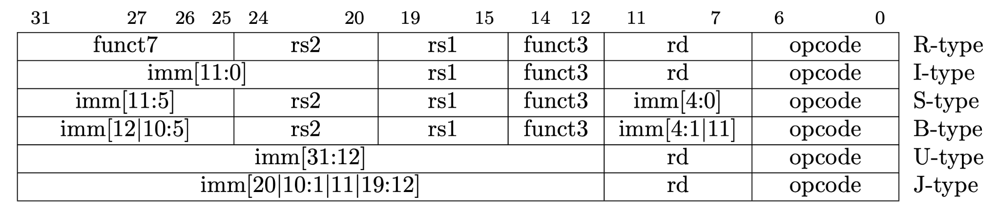
<p class="caption">以 RISC-V 为例的指令编码格式（R/I/S/B/U/J-type）</p>
</div>

<!--v-->

## 实例：2 字节定长编码

<div style="margin-top: 10px; font-size: 0.55em;">
<table style="width: 100%; table-layout: fixed; border-collapse: collapse; text-align: center;">
<colgroup>
<col style="width: 11%;">
<col style="width: 6.8%;"><col style="width: 6.8%;"><col style="width: 6.8%;"><col style="width: 6.8%;">
<col style="width: 6.8%;"><col style="width: 6.8%;"><col style="width: 6.8%;">
<col style="width: 3.4%;"><col style="width: 3.4%;"><col style="width: 3.4%;"><col style="width: 3.4%;">
<col style="width: 3.4%;"><col style="width: 3.4%;"><col style="width: 6.8%;"><col style="width: 6.8%;"><col style="width: 6.8%;">
</colgroup>
<thead>
<tr style="font-family: 'SF Mono', Menlo, monospace; color: var(--ink-faint); font-size: 0.7em;">
<td></td><td>15</td><td>14</td><td>13</td><td>12</td><td>11</td><td>10</td><td>9</td><td>8</td><td>7</td><td>6</td><td>5</td><td>4</td><td>3</td><td>2</td><td>1</td><td>0</td>
</tr>
</thead>
<tbody style="font-family: 'SF Mono', Menlo, monospace; font-weight: 700; font-size: 0.85em;">
<tr>
<td style="color: var(--ink-faint); font-weight: 400; white-space: nowrap;">R-type</td>
<td colspan="4" style="background: var(--accent-soft); color: var(--accent); border: 1px solid var(--ink-faint); padding: 6px 0;">opcode</td>
<td colspan="3" style="background: var(--accent-2-soft); color: var(--accent-2); border: 1px solid var(--ink-faint); padding: 6px 0;">RA</td>
<td colspan="6" style="color: var(--ink-faint); border: 1px solid var(--ink-faint); padding: 6px 0; font-size: 0.85em;">unused</td>
<td colspan="3" style="background: var(--accent-2-soft); color: var(--accent-2); border: 1px solid var(--ink-faint); padding: 6px 0;">RB</td>
</tr>
<tr>
<td style="color: var(--ink-faint); font-weight: 400; white-space: nowrap;">I-type</td>
<td colspan="4" style="background: var(--accent-soft); color: var(--accent); border: 1px solid var(--ink-faint); padding: 6px 0;">opcode</td>
<td colspan="3" style="background: var(--accent-2-soft); color: var(--accent-2); border: 1px solid var(--ink-faint); padding: 6px 0;">RA</td>
<td colspan="9" style="border: 1px solid var(--ink-faint); padding: 6px 0;">imm</td>
</tr>
<tr>
<td style="color: var(--ink-faint); font-weight: 400; white-space: nowrap;">J-type</td>
<td colspan="4" style="background: var(--accent-soft); color: var(--accent); border: 1px solid var(--ink-faint); padding: 6px 0;">opcode</td>
<td colspan="3" style="color: var(--ink-faint); border: 1px solid var(--ink-faint); padding: 6px 0; font-size: 0.85em;">RA=0</td>
<td colspan="9" style="border: 1px solid var(--ink-faint); padding: 6px 0;">addr</td>
</tr>
<tr>
<td style="color: var(--ink-faint); font-weight: 400; white-space: nowrap;">HALT</td>
<td colspan="4" style="background: var(--accent-soft); color: var(--accent); border: 1px solid var(--ink-faint); padding: 6px 0;">opcode</td>
<td colspan="3" style="color: var(--ink-faint); border: 1px solid var(--ink-faint); padding: 6px 0; font-size: 0.85em;">RA=0</td>
<td colspan="9" style="border: 1px solid var(--ink-faint); padding: 6px 0;">ret code</td>
</tr>
</tbody>
</table>
</div>

<div class="cols" style="grid-template-columns: 1fr 1fr; font-size: 0.5em; margin-top: 20px;">
<div class="notch-box">
<p style="margin: 0 0 8px 0;"><code>load r4, r0</code>　opcode=2　RA=4　RB=0</p>
<table style="font-family: 'SF Mono', Menlo, monospace; text-align: center; border-collapse: collapse; width: 100%; table-layout: fixed;">
<colgroup><col style="width: 14%;"><col span="16" style="width: 5.375%;"></colgroup>
<tr style="color: var(--ink-faint); font-size: 0.75em;">
<td></td><td colspan="4">opcode</td><td colspan="3">RA</td><td colspan="6">unused</td><td colspan="3">RB</td>
</tr>
<tr>
<td style="color: var(--ink-faint);">bit</td>
<td>0</td><td>0</td><td>1</td><td>0</td><td>1</td><td>0</td><td>0</td><td>0</td><td>0</td><td>0</td><td>0</td><td>0</td><td>0</td><td>0</td><td>0</td><td>0</td>
</tr>
<tr style="color: var(--accent); font-weight: 700;">
<td>hex</td>
<td colspan="4" style="border-top: 1px solid var(--ink-faint);">0x2</td>
<td colspan="4" style="border-top: 1px solid var(--ink-faint);">0x8</td>
<td colspan="4" style="border-top: 1px solid var(--ink-faint);">0x0</td>
<td colspan="4" style="border-top: 1px solid var(--ink-faint);">0x0</td>
</tr>
</table>
<p style="margin: 10px 0 0 0; color: var(--ink-faint);">→ word = <strong style="color: var(--accent);">0x2800</strong></p>
</div>
<div class="notch-box">
<p style="margin: 0 0 8px 0;"><code>roli r4, 3</code>　opcode=8　RA=4　imm=3</p>
<table style="font-family: 'SF Mono', Menlo, monospace; text-align: center; border-collapse: collapse; width: 100%; table-layout: fixed;">
<colgroup><col style="width: 14%;"><col span="16" style="width: 5.375%;"></colgroup>
<tr style="color: var(--ink-faint); font-size: 0.75em;">
<td></td><td colspan="4">opcode</td><td colspan="3">RA</td><td colspan="9">imm</td>
</tr>
<tr>
<td style="color: var(--ink-faint);">bit</td>
<td>1</td><td>0</td><td>0</td><td>0</td><td>1</td><td>0</td><td>0</td><td>0</td><td>0</td><td>0</td><td>0</td><td>0</td><td>0</td><td>0</td><td>1</td><td>1</td>
</tr>
<tr style="color: var(--accent); font-weight: 700;">
<td>hex</td>
<td colspan="4" style="border-top: 1px solid var(--ink-faint);">0x8</td>
<td colspan="4" style="border-top: 1px solid var(--ink-faint);">0x8</td>
<td colspan="4" style="border-top: 1px solid var(--ink-faint);">0x0</td>
<td colspan="4" style="border-top: 1px solid var(--ink-faint);">0x3</td>
</tr>
</table>
<p style="margin: 10px 0 0 0; color: var(--ink-faint);">→ word = <strong style="color: var(--accent);">0x8803</strong></p>
</div>
</div>

<p style="font-size: 0.55em; margin-top: 16px;">
opcode 0 保留为非法指令，halt 放在 15——这样全 0 不会被误解释成合法操作。
</p>

<!--v-->

## \*\*\*opcode 加密！VMProtect 的花活

<div class="split">
<div class="notch-box band-a">
<div class="tab">基础版</div>
<ul style="font-size: 0.62em; margin: 0; padding-left: 18px;">
<li>opcode 明文</li>
<li>operand 明文</li>
<li>指令长度固定</li>
</ul>
</div>
<div class="arrow">→</div>
<div class="notch-box band-b">
<div class="tab">加固版（VMProtect 思路）</div>
<ul style="font-size: 0.62em; margin: 0; padding-left: 18px;">
<li>opcode / operand 加密，滚动 key</li>
<li>handler table 间接跳转</li>
<li>指令长度不固定，立即数经编码</li>
<li>控制流 target 不是明文地址</li>
</ul>
</div>
</div>

<!--v-->

## 实例：汇编程序 check.asm

<div style="font-size: 0.48em; margin-top: 4px;">

```nasm
movi r0, 0        # in_ptr = 0
movi r1, 16       # key_ptr = 16
movi r2, 32       # target_ptr = 32
movi r3, 0        # i = 0
movi r6, 0        # fail_acc = 0

loop:
load  r4, r0      # value = mem[in_ptr]
load  r5, r1      # tmp = mem[key_ptr]
xor   r4, r5      # value ^= tmp
roli  r4, 3       # value = rol(value, 3)
add   r4, r3      # value += i
load  r5, r2      # tmp = mem[target_ptr]
xor   r4, r5      # diff = value ^ target[i]
or    r6, r4      # fail_acc |= diff

addi  r0, 1
addi  r1, 1
addi  r2, 1
addi  r3, 1
cmpi  r3, 16
jnz   loop        # 跑满 16 轮，不提前退出

cmpi  r6, 0
jz    ok
halt  0
ok:
halt  1
```

</div>

<p style="font-size: 0.58em; margin-top: 8px;">
注意 <code>or r6, r4</code> 之后没有跳转判断，错误只被累积——这是常量时间比较的关键。
</p>

<!--v-->

## 写解释器

<p style="font-size: 0.5em; color: var(--ink-faint); margin-top: -8px; margin-bottom: 0;">Fetch → Decode → Dispatch → Execute</p>

<div class="cols" style="grid-template-columns: 0.55fr 1.45fr; align-items: stretch; margin-top: 10px;">
<div>
<p style="font-size: 0.58em; line-height: 1.6; margin: 0 0 12px 0;">从 bytecode 到可执行程序，最常见的写法是 <strong>switch-case dispatch</strong>（右图）</p>
<div class="notch-box">
<div class="tab">其他 dispatch 方式</div>
<ul style="list-style: none; padding-left: 0; margin-top: 6px;">
<li style="font-size: 0.46em; line-height: 1.6; padding-left: 16px; position: relative; margin: 6px 0; color: var(--ink-soft);"><span style="position:absolute;left:0;top:0.6em;width:5px;height:5px;border-radius:50%;background:var(--accent);"></span>函数指针：handler 数组 + 指针跳转</li>
<li style="font-size: 0.46em; line-height: 1.6; padding-left: 16px; position: relative; margin: 6px 0; color: var(--ink-soft);"><span style="position:absolute;left:0;top:0.6em;width:5px;height:5px;border-radius:50%;background:var(--accent);"></span>jump table：编译器生成跳转表</li>
<li style="font-size: 0.46em; line-height: 1.6; padding-left: 16px; position: relative; margin: 6px 0; color: var(--ink-soft);"><span style="position:absolute;left:0;top:0.6em;width:5px;height:5px;border-radius:50%;background:var(--accent);"></span>computed goto：直接算出跳转地址</li>
<li style="font-size: 0.46em; line-height: 1.6; padding-left: 16px; position: relative; margin: 6px 0; color: var(--ink-soft);"><span style="position:absolute;left:0;top:0.6em;width:5px;height:5px;border-radius:50%;background:var(--accent);"></span>push handler; ret：用 ret 伪装调用返回</li>
<li style="font-size: 0.46em; line-height: 1.6; padding-left: 16px; position: relative; margin: 6px 0; color: var(--ink-soft);"><span style="position:absolute;left:0;top:0.6em;width:5px;height:5px;border-radius:50%;background:var(--accent);"></span>异常处理 / 线程回调 / loader-linker dispatch</li>
</ul>
</div>
</div>
<div class="mermaid-container" style="display: flex; align-items: center; justify-content: center;">

</div>
</div>

<aside class="notes">
呈现形式可能有很多种，但核心逻辑一般都是一样的：取指令、解码、找到对应处理函数、执行。
</aside>

<!--v-->

## 实例：解释器核心

<div style="font-size: 0.68em; margin-top: 10px;">

```c
uint8_t  opcode = (inst >> 12) & 0x0F;
uint8_t  ra     = (inst >>  9) & 0x07;
uint16_t imm9   =  inst         & 0x1FF;
uint8_t  rb     =  inst         & 0x07;

switch (opcode) {
    case 0x1: /* movi */  vm->registers[ra] = imm9 & 0xFF; break;
    case 0x2: /* load */  vm->registers[ra] = mem[vm->registers[rb]]; break;
    case 0x4: /* xor  */  vm->registers[ra] = (vm->registers[ra] ^ vm->registers[rb]) & 0xFF; break;
    case 0x6: /* add  */  vm->registers[ra] = (vm->registers[ra] + vm->registers[rb]) & 0xFF; break;
    case 0x8: /* roli */  vm->registers[ra] = rol8(vm->registers[ra], imm9); break;
    case 0xC: /* jz   */  if (vm->zf) vm->pc = imm9; break;
    case 0xF: /* halt */  vm->halted = 1; vm->ret_code = imm9; break;
    ...
}
```

</div>

<p style="font-size: 0.58em; margin-top: 8px;">
Fetch → Decode（拆字段）→ Dispatch（switch）→ Execute（改状态）。
</p>

<!--v-->

## 从 anything 到 bytecode

- **assembler**：把汇编文本编译成 bytecode
- **protector**（如 VMProtect）：把现成二进制翻译进 VM
- **interpreter**（如 Python VM）：边解析边执行

<!--v-->

## 拓展

也有自定义编程语言（自己写个汇编器）、esolang（如 Brainfuck、Ook）这类形式

<!--v-->

## 实例：跑起来

<div style="font-size: 0.52em; margin-top: 10px;">
<pre style="line-height: 1.45;">$ make clean && make all && make test
python3 asm.py check.asm
Wrote check.h (23 instructions)
Wrote check.lst
gcc ... -o vm_check challenge.c
Testing correct flag...
./vm_check "flag{w3lc0me_VM}"
Correct
Testing wrong flag...
./vm_check "flag{w3lc0me_VN}"
Wrong</pre>
</div>

<div class="notch-box" style="margin-top: 16px;">
<div class="tab">完整链路</div>
<p style="font-size: 0.55em; line-height: 1.6; margin: 6px 0;">
<code>check.asm</code> → <code>asm.py</code> → <code>check.h</code> → 编译进 <code>vm_check</code> → 运行时解释执行
</p>
</div>

<!--v-->

## Part.3 小结：Step 1-5 对应产物

<div style="font-size: 0.52em; margin-top: 10px;">
<table style="width: 100%;">
<colgroup><col style="width: 16%;"><col style="width: 44%;"><col style="width: 40%;"></colgroup>
<thead><tr><th>步骤</th><th>设计问题</th><th>my_vm_example 产物</th></tr></thead>
<tbody>
<tr><td>Step 1</td><td>这台 VM 要做什么？</td><td><code>check.asm</code> 里的 flag checker</td></tr>
<tr><td>Step 2</td><td>机器状态是什么？</td><td>8 寄存器 + PC + ZF + 双内存</td></tr>
<tr><td>Step 3</td><td>operand 从哪来？</td><td>register-based（R-type / I-type）</td></tr>
<tr><td>Step 4</td><td>需要哪些指令？</td><td>14 条 load/store/xor/add/roli/jmp/halt ...</td></tr>
<tr><td>Step 5</td><td>怎么编码 bytecode？</td><td>2 字节定长：opcode|RA|operand</td></tr>
</tbody>
</table>
</div>

<p style="font-size: 0.55em; margin-top: 16px;">
<strong>下一步</strong>：Part.4 把这些产物当成黑盒，从外部观察怎么识别、怎么拆解这台 VM。
</p>

<!--s-->

<div class="middle center">
<div style="width: 100%">

# Part.4 逆向：如何理解一个 VM 在干什么？

</div>
</div>

<!--v-->

## 识别 VM

- 有取指令的行为（程序自己的 data 段、甚至外部文件输入）
- 存在 **dispatcher**：负责解码 opcode，分发到对应的处理函数

<div style="text-align: center; margin-top: 6px;">

<p class="caption">easyvm 题目的 dispatcher 部分控制流图</p>
</div>

<aside class="notes">
高阶的对抗也可以去特征，例如 VMProtect 高版本。
</aside>

<!--v-->

## 理解 VM：壳 / 机 / 码 / 义

<div class="notch-box" style="margin-top: 10px;">
<div class="tab"></div>

<table style="font-size: 22px; table-layout: fixed; width: 100%;">
<colgroup><col style="width: 18%;"><col style="width: 47%;"><col style="width: 35%;"></colgroup>
<thead><tr><th>层级</th><th>要回答的问题</th><th>逆向产物</th></tr></thead>
<tbody>
<tr><td style="white-space: nowrap;">壳：VM 边界</td><td>哪些函数/代码块进入 VM？入口出口在哪里？</td><td>VM entry、VM exit、bytecode 地址</td></tr>
<tr><td style="white-space: nowrap;">机：VM 架构</td><td>VPC/VSP/VREG/flags/handler table 在哪？</td><td>VM state map</td></tr>
<tr><td style="white-space: nowrap;">码：指令编码</td><td>opcode/operand/长度/解密方式是什么？</td><td>bytecode disassembler</td></tr>
<tr><td style="white-space: nowrap;">义：程序语义</td><td>每条虚拟指令做什么？整个 bytecode 算法是什么？</td><td>emulator、lifter、伪代码、solver</td></tr>
</tbody>
</table>

</div>

<!--v-->

## 壳：VM 边界

- 有时并非全程 VM，而是会套层壳——多数逻辑正常，关键逻辑进 VM
- 类似异常处理：保存当前现场状态（寄存器、stack 等），跳转到 VM 初始化代码
    - VM exit 则恢复现场

<div class="split" style="margin-top: 10px;">
<div class="notch-box band-a">
<div class="tab">VM Entry（保存现场）</div>
<pre>push eax
push ebx
push ecx
push edx
push esi
push edi
push ebp
<span class="cm">; ... 保存更多寄存器/flags</span>
jmp  vm_init      <span class="cm">; 进入 VM</span></pre>
</div>
<div class="arrow">→</div>
<div class="notch-box band-b">
<div class="tab">VM Exit（恢复现场）</div>
<pre>pop  ebp
pop  edi
pop  esi
pop  edx
pop  ecx
pop  ebx
pop  eax
<span class="cm">; ... 与 push 顺序相反</span>
ret              <span class="cm">; 恢复原程序流</span></pre>
</div>
</div>

<aside class="notes">
关键在于识别 vm entry 和 vm exit。这里是概念性的 x86 示例：entry 侧 push 保存全部寄存器再 jmp 进 VM 初始化；exit 侧以相反顺序 pop 恢复现场再返回。
</aside>

<!--v-->

## 码 / 机 / 义

- **码**：opcode / operand / 长度 / 解密方式是什么？
- **机**：VM 的状态是什么？register？stack？memory？
- **义**：最终这段虚拟程序想达成什么意图？我们怎么获得 flag？

<p class="lead" style="font-size: 0.6em; margin-top: 16px;">
本质是不断提升抽象层次：从机器码 → 汇编指令的意义 → 整段程序的算法。<br>
是不是有种重走 IDA 开发老路的感觉？如今的先进工具，就是帮我们把前面繁琐的事情做好了。
</p>

<!--s-->

<div class="middle center">
<div style="width: 100%">

# Part.5 例题一：NoRegVM

</div>
</div>

<!--v-->

## NoRegVM（m0leCTF Teaser 2023）

<https://github.com/sajjadium/ctf-archives/tree/main/ctfs/m0leCon/2023/Quals/rev/NoRegVM_flag_checker>

- 这题的 VM 有很多明显的漏洞，因为它同时还是一个 pwn 题
- 是 memory based 的：add、sub 等指令的两个操作数都是从内存中取的

<!--v-->

## 解题路径

<div style="display: flex; flex-direction: column; justify-content: center; min-height: 560px;">
<div class="cards" style="grid-template-columns: repeat(3, 1fr); margin-top: 0;">
<div class="notch-box"><div class="tab">Step 1</div><ul><li>hexed.it + notepad 手动过一点点：解析 opcode（详），读内存，恢复题目逻辑</li></ul></div>
<div class="notch-box"><div class="tab">Step 2</div><ul><li>转向自动脚本解析，批量还原逻辑</li></ul></div>
<div class="notch-box"><div class="tab">Step 3</div><ul><li>还原出线性方程组后用 SymPy 求解（也可以用 z3，AI 已经秒了）</li></ul></div>
</div>
</div>

<!--s-->

<div class="middle center">
<div style="width: 100%">

# Part.6 例题二：easyvm（见识一下难题有多难）

</div>
</div>

<!--v-->

## easyvm（L3HCTF 2025）

<https://astralprisma.github.io/2025/07/14/l3h_25/>

- 一个 C++ 写的 VM
- 先看 `main`：输入被当作 8 个 int，放进 VM 的一个 dict 字典
- 最终判断：拿 dict 的 8 个 int 跟 8 个固定常数对比
- 目标：搞清楚 VM program 怎么把 8 个输入 int 一步步变换成 answer

<aside class="notes">
看输入存储的方式，还能大概猜测到 VM 的内存就是由这个 dict 字典代表的。
</aside>

<!--v-->

## 拆 VM 程序结构

字节码内嵌在程序中，按 C++ 的 vector 初始化：`build_global_vm_program`

<div style="text-align: center; margin-top: 10px;">
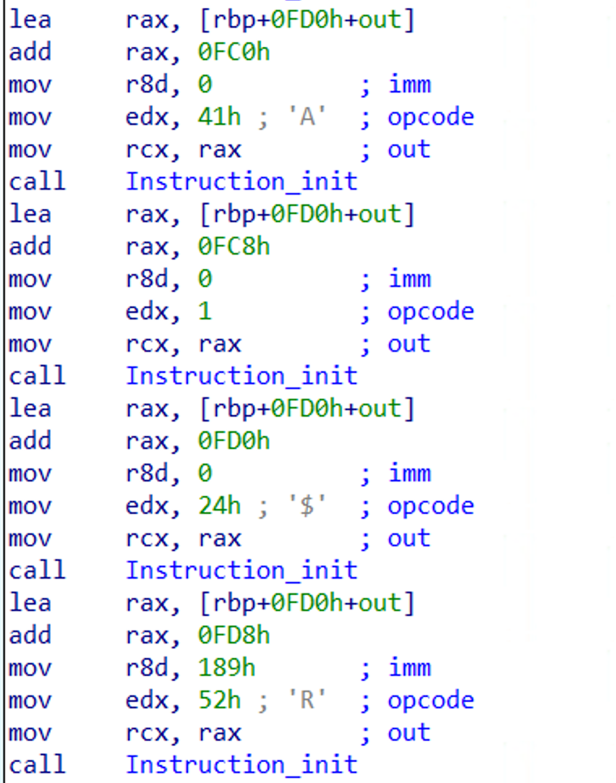
<p class="caption">Instruction_init：输入 opcode 和 imm，写入 out 对象对应字段</p>
</div>

<p class="lead" style="font-size: 0.55em;">这个对象类型可以认为是 instruction：每条 instruction 由 opcode + imm 构成</p>

<aside class="notes">
tips：IDA 可以创建结构体，分析出结构体之后，反编译会好看很多。
</aside>

<!--v-->

## 写脚本提取 bytecode

汇编里参数通过寄存器传递，比较规整，只要看对应寄存器的值即可解析

<div style="text-align: center; margin-top: 10px;">
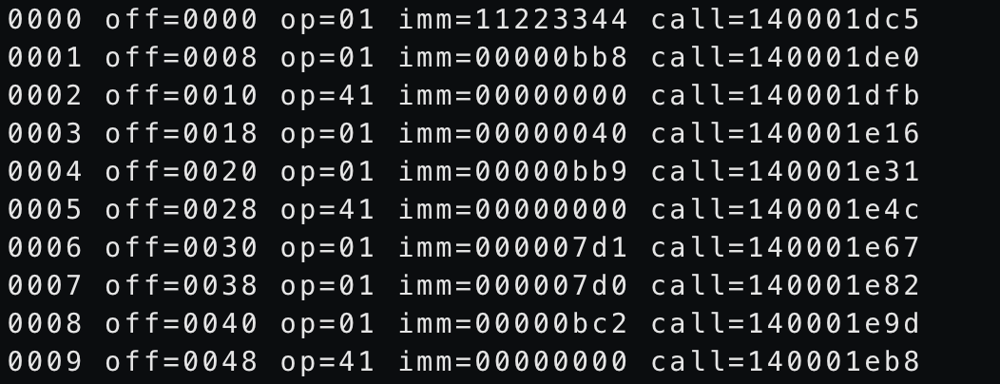
<p class="caption">提取出来的原始字节码（op / imm / call 地址）</p>
</div>

<!--v-->

## 解析 Dispatcher

- 不需要把所有 opcode 从头到尾解析
- 先看好这个 VM program 用到了哪些 opcode，再对着 program 逐个解析没见过的
    - 这是最复杂且最重复的体力活……
- 以 `push`、`store`、`op=64 load` 为例逐个啃

<!--v-->

## 翻译成伪汇编，还原语义

<div style="text-align: center; margin-top: 10px;">
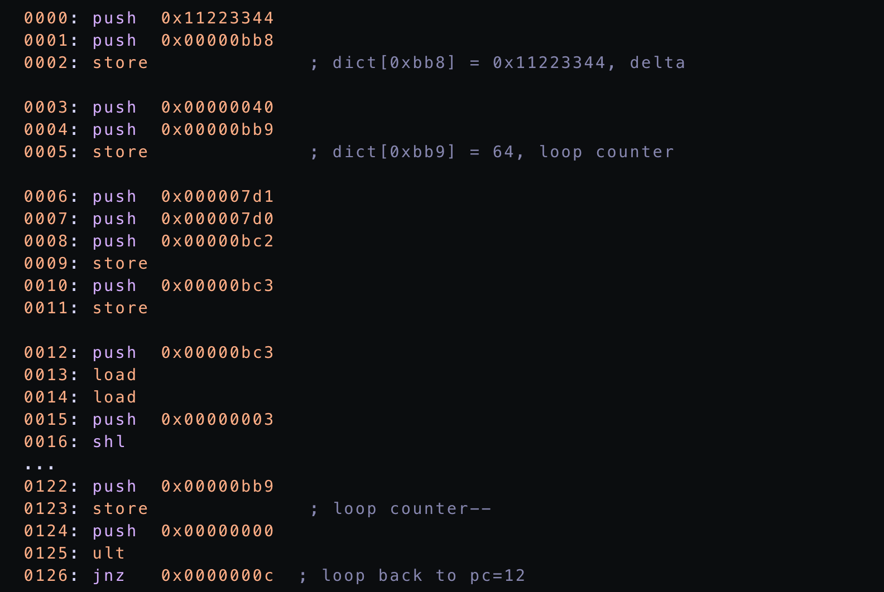
<p class="caption">图一：字节码翻译成伪汇编指令的示例</p>
</div>

<!--v-->

## 最终还原出的算法

<div style="text-align: center; margin-top: 10px;">
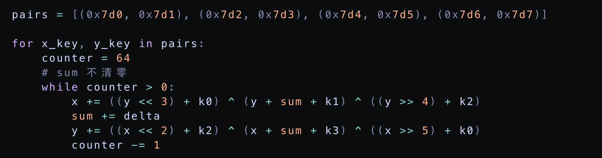
<p class="caption">图二：整段伪汇编理解完之后，程序真正在做的事情（like TEA，但魔改了不少地方）</p>
</div>

<!--s-->

<div class="middle center">
<div style="width: 100%">

# Part.7 trace 技巧与 CTF trick

</div>
</div>

<!--v-->

## trace 技巧

**（高级，限于篇幅略讲，欢迎结合 AI 学习探索）**

- 想要自己弄清楚实战中会遇到的 VM，trace 基本必不可少
    - 上百万上千万行的 trace 是常有的事——解析 VM 是工作量很大的活儿
- trace 已经被广泛运用于解析商业虚拟机保护
- **trace 是什么**：把程序运行过程中每一条经过的汇编指令，以及当时相关的 context（如寄存器）都记录下来

<aside class="notes">
可以利用 x64dbg、gdb 的脚本功能，或者 Intel Pin Tools：
https://www.intel.com/content/www/us/en/developer/articles/tool/pin-a-dynamic-binary-instrumentation-tool.html
</aside>

<!--v-->

## 尾声：CTF 题目 trick

<div style="display: flex; flex-direction: column; justify-content: center; min-height: 560px;">
<div class="cards" style="grid-template-columns: repeat(3, 1fr); margin-top: 0;">
<div class="notch-box"><div class="tab">踩巨人肩膀</div><ul><li>识别常见库（如 unicorn）；出题人若用了现成方案会留下痕迹（字符串、.vmp 段等）</li><li>可搜论坛/公众号找现成解析文章（52pojie / 看雪论坛）</li></ul></div>
<div class="notch-box"><div class="tab">带点猜</div><ul><li>读翻译出的字节码逻辑时，做着做着可能会感觉像矩阵乘法、向量计算——大胆假设</li></ul></div>
<div class="notch-box"><div class="tab">侧信道</div><ul><li>不一定要完全理解虚拟机，例如可以走侧信道攻击</li><li>参考：<a href="https://gynvael.coldwind.pl/?id=763&lang=en" style="color: var(--accent);">gynvael.coldwind.pl</a></li></ul></div>
</div>
</div>

<!--s-->

<div class="middle center">
<div style="width: 100%">

# 谢谢大家，欢迎带着 AI 一起拆 VM ！

---

# Questions?

</div>
</div>
