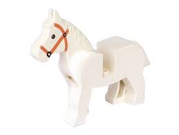

<!-- .slide: data-background="rev-lec3/background.png" -->

 
 
 

<h5 style="font-size: 55px; text-align: center;">Reverse专题二: 符号执行</h5>

 

<h1 style="font-size: 30px; text-align: center;">2025.7.11</h1>

 

    <button class="button" onclick="toggleContent()" title = "Click to see more about me">
        
    </button>
    By 马麟 @f0rm2l1n

<!--s-->
<!-- .slide: data-background="rev-lec3/background.png" -->

## Outline

课程包括四部分内容 *(18:30 - ?)*

---

- **程序分析及符号执行基础**
- **符号执行逆向分析实战**
- **符号执行的不足**
- **其他\*自动化\*逆向技巧的探讨**

<!--s-->
<!-- .slide: data-background="rev-lec2/background.png" -->

# That's All
---
Ooops, you found me, but I'm just a placeholder. :)

